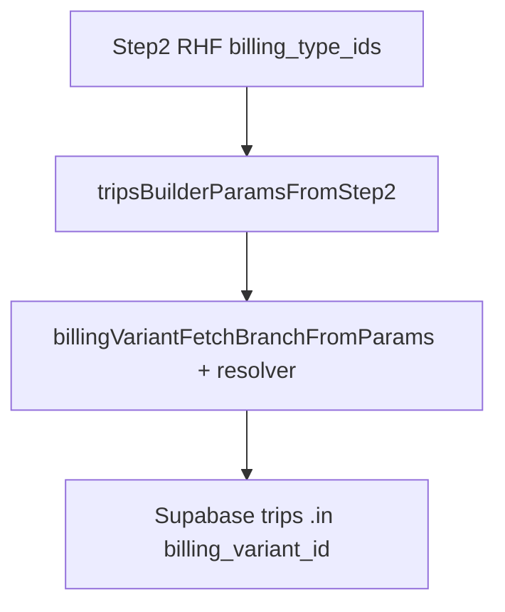

# Monthly invoice Step 2 — multi-select Abrechnungsarten (`billing_type_ids`)

## Preconditions (read-only)

Align implementation with [docs/plans/monthly-multi-billing-type-audit.md](docs/plans/monthly-multi-billing-type-audit.md) and existing variant-subset wiring in [invoice-line-items.api.ts](src/features/invoices/api/invoice-line-items.api.ts), [step-2-params.tsx](src/features/invoices/components/invoice-builder/step-2-params.tsx), and [use-invoice-builder.ts](src/features/invoices/hooks/use-invoice-builder.ts).

## Architecture (fetch + precedence)

Trips are filtered only via `billing_variant_id` (`.eq` / `.in`) after [resolveBillingVariantFilters](src/features/invoices/api/invoice-line-items.api.ts). Multi–billing-type scope = **union of `billing_variants.id`** for selected `billing_type_id` values — **no** new `trips.billing_type_id` filter.

**Resolver precedence** (single function; keep live + cancelled on one path):

1. **`billing_variant_ids` non-empty** only if there is **exactly one** family in scope: `billing_type_ids?.length === 1` **or** legacy **`billing_type_id`** (per_client). Otherwise treat as invalid at hook boundary → clear `billing_variant_ids` before fetch (same spirit as subset-without-type).
2. **`billing_variant_id` non-empty** (per_client single Unterart) → existing **single** branch.
3. **`billing_type_ids?.length > 1`** → query `billing_variants` with `.in('billing_type_id', sortedIds)`; `variantIdsForType` = union; `abortEmpty` if zero rows.
4. **`billing_type_ids?.length === 1`** → same as today **allVariantsOfType** for that id (then variant subset branch can still narrow if step 1 applied).
5. **`billing_type_id` set** (per_client) and no multi-type array → **allVariantsOfType** / subset as today.
6. Else → **noVariantFilter** (all types for payer, subject to payer + period + client).

Refactor [billingVariantFetchBranchFromParams](src/features/invoices/api/invoice-line-items.api.ts) to accept `billing_type_ids` and implement the above; extend [resolveBillingVariantFilters](src/features/invoices/api/invoice-line-items.api.ts) with a branch that runs the multi-type **union** query (one Supabase round-trip). Add `// why` comments at expansion and precedence points.

## Step 1 — Schema and types

**File:** [invoice.types.ts](src/features/invoices/types/invoice.types.ts)

- Add `billing_type_ids: z.array(z.string().uuid()).nullable()` to `invoiceBuilderSchema` with a short `// why` (single UUID cannot represent a subset of families).
- Keep **`billing_type_id`** for `per_client` / legacy; monthly should submit **`billing_type_id: null`** and use **`billing_type_ids`** only.

**Snapshot:** [build-draft-invoice-detail-for-pdf.ts](src/features/invoices/components/invoice-pdf/build-draft-invoice-detail-for-pdf.ts) — add `billing_type_ids: string[] | null` to `InvoiceBuilderStep2Snapshot`. Keep `billing_type_id` on snapshot for per_client / draft row copy-through.

**Hook Pick:** [use-invoice-builder.ts](src/features/invoices/hooks/use-invoice-builder.ts) — add `billing_type_ids` to `Step2Values` `Pick`.

## Step 2 — Step 2 UI (monthly / standard only)

**File:** [step-2-params.tsx](src/features/invoices/components/invoice-builder/step-2-params.tsx)

- **Local schema:** add `billing_type_ids: z.array(z.string().uuid()).nullable()`; keep `billing_type_id` for per_client-driven writes.
- **Remove** the monthly single **`Select`** for `billing_type_id` (`Alle Abrechnungsarten` + one type).
- **Add** a multi-select control (reuse **`MonthlyVariantSubsetPicker` pattern** — extract a generic `MultiIdPicker` or duplicate shell with options = payer `billing_types`, labels = `name`, deterministic trigger: `Alle Abrechnungsarten` / one name / `N Abrechnungsarten gewählt`).
- **Monthly hard rule:** control writes **only** `billing_type_ids`; never sets `billing_type_id` from selection count.
- **Payer `onValueChange`:** clear `billing_type_ids`, `billing_type_id`, `billing_variant_id`, `billing_variant_ids` (`// why` payer-scoped families).
- **When `billing_type_ids` changes:** if `length !== 1`, `setValue('billing_variant_ids', null)` and `setValue('billing_variant_id', null)` for monthly (`// why` see Hard rules — Unterarten subset only meaningful relative to one Abrechnungsart).
- **Unterarten picker (hard invariant):**
  - **`billing_variant_ids` is only valid when exactly one billing type is in scope** (`billing_type_ids.length === 1` in monthly).
  - If **`billing_type_ids.length !== 1`**: **hide** the Unterarten picker; **clear** `billing_variant_ids` and **`billing_variant_id`** (monthly).
  - When eligible, keep [MonthlyVariantSubsetPicker](src/features/invoices/components/invoice-builder/step-2-params.tsx); derive `billingTypeIdNorm` from **`billing_type_ids[0]`** (not from `billing_type_id` in monthly).
- **per_client:** unchanged path; continue setting `billing_type_id` from combination; force `billing_type_ids: null` on submit for `per_client` (mirror `billing_variant_ids` handling).
- **Rechnungsempfänger preview** (`step2RecipientPreview`) — **exact rule:** if **exactly one** billing type is selected **and** that type row has a **non-null** distinct `rechnungsempfaenger_id`, pass that id into `resolveRechnungsempfaenger` as the billing-type tier; **otherwise** use the payer-only preview (same as today when no type-specific recipient applies).

**onNext payload:** include `billing_type_ids`; monthly `billing_type_id` remains null from form.

## Step 3 — Hook normalization

**File:** [use-invoice-builder.ts](src/features/invoices/hooks/use-invoice-builder.ts)

- Extend [tripsBuilderParamsFromStep2](src/features/invoices/hooks/use-invoice-builder.ts): pass `billing_type_ids` normalized via new helper **`normalizeTripsForBuilderTypeIdsForQueryKey`** (or shared name) — sort, `null` if empty.
- **Boundary (hard):** for **`mode !== 'per_client'`**, if **`billing_type_ids.length !== 1`**, force **`billing_variant_ids: null`** and **`billing_variant_id: null`** on the fetch param object before query key + API (`// why` Unterarten subset only valid with exactly one Abrechnungsart in scope; invalid monthly state must not reach the resolver).
- Keep passing **`billing_type_id`** for per_client from `step2.billing_type_id`.
- **createInvoice** `fullValues` spread already includes new keys; ensure monthly **never** sends a fabricated **`billing_type_id`** (see Step 5).

## Step 4 — Query keys

**File:** [invoices.ts](src/query/keys/invoices.ts)

- Add `billing_type_ids?: string[] | null` to `tripsForBuilder` params object; normalize in factory (sorted, empty → `null`) with `// why` (order-stable cache), mirroring [normalizeTripsForBuilderVariantIdsForQueryKey](src/query/keys/invoices.ts).
- Export normalizer from [keys/index.ts](src/query/keys/index.ts) if tests import from `@/query/keys`.

## Step 5 — Invoice header insert

**File:** [invoices.api.ts](src/features/invoices/api/invoices.api.ts)

- **Do not** add `billing_type_ids` to `.insert` (no column).
- **Explicit monthly rule:** whenever **`mode !== 'per_client'`** and Step 2 scope is driven by **`billing_type_ids`** (the active monthly field), **`billing_type_id` persisted on `invoices` MUST be `null`** — **including when exactly one** billing type is selected in the multi-select. **per_client:** unchanged; continue inserting **`billing_type_id`** from `formValues.billing_type_id`.
- **`// why` (inline in code):** avoids dual semantics between header UUID and array; keeps monthly scope honest; prevents future regressions that “optimize” a single selected type back into **`billing_type_id`**.
- Add `// why` near insert mapping tying this to line-item / trip-set truth for mixed or single-family monthly runs.

## Step 6 — Builder snapshot / PDF

**Files:** [index.tsx](src/features/invoices/components/invoice-builder/index.tsx) (`step2Snapshot`), [build-draft-invoice-detail-for-pdf.ts](src/features/invoices/components/invoice-pdf/build-draft-invoice-detail-for-pdf.ts) (pass `billing_type_ids` on snapshot; for **`mode !== 'per_client'`**, **draft `base.billing_type_id` MUST stay `null`** — same rule as insert, including exactly-one type selected — align preview header with persistence).

**File:** [use-invoice-builder-pdf-preview.tsx](src/features/invoices/components/invoice-builder/use-invoice-builder-pdf-preview.tsx) — only if a local duplicate of Step2 shape exists (likely none beyond imported snapshot type).

## Step 7 — Tests

**File:** extend or add beside [billing-variant-fetch-branch.test.ts](src/features/invoices/api/__tests__/billing-variant-fetch-branch.test.ts):

- Pure branch tests for `billing_type_ids` precedence vs `billing_type_id` / `billing_variant_id`.
- Query key: same IDs different order → equal normalized key; empty → null.
- **Required — invalid monthly normalization:** assert that when simulating monthly Step 2 state with **non-empty `billing_variant_ids`** and **`billing_type_ids.length !== 1`**, **`tripsBuilderParamsFromStep2`** (or the extracted pure normalizer it calls) **clears `billing_variant_ids`** before fetch params / cache key material is built (`// why` boundary must eliminate invalid subset state).
- Optional: export pure `billingVariantFetchBranchFromParams` input shape tests only; async union query covered by integration later or thin mock if already pattern in repo.

Run **`bun run build`** and **`bun test`**.

## Step 8 — Documentation

- [docs/invoices-module.md](docs/invoices-module.md): Step 2 — monthly multi–Abrechnungsart, `billing_type_ids`, **header `billing_type_id` always null for monthly** (including one selected type), fetch expansion, Unterarten only when one family, Rechnungsempfänger preview rule (one type with type-level recipient → use it; else payer).
- [docs/plans/monthly-multi-billing-type-audit.md](docs/plans/monthly-multi-billing-type-audit.md): short **Implementation status** line (complete / superseded by this plan).

## Step 9 — Fix PDF Abrechnungsart names (Standart → real names)

**Read these files completely first:**

- [InvoicePdfDocument.tsx](src/features/invoices/components/invoice-pdf/InvoicePdfDocument.tsx)
- [build-invoice-pdf-summary.ts](src/features/invoices/components/invoice-pdf/lib/build-invoice-pdf-summary.ts)
- [pdf-column-catalog.ts](src/features/invoices/lib/pdf-column-catalog.ts)
- [invoice-line-items.api.ts](src/features/invoices/api/invoice-line-items.api.ts) (line item snapshot mapping)
- [invoice.types.ts](src/features/invoices/types/invoice.types.ts) (line item shapes)

**Root cause investigation (read-only first):**

1. Find where PDF line items get their `billing_type_name` or equivalent field.
2. Trace why it shows "Standart" instead of "Abreise"/"Anreise".
3. Check if the data flow is:
   - missing from the line item snapshot
   - wrong fallback value
   - stale reference data
   - catalog field pointing to wrong `dataField`

**Fix implementation:**

1. **Ensure line items carry correct `billing_type_name`** in the builder snapshot mapping.
2. **Ensure PDF catalog** has the correct `dataField` for the billing type name column.
3. **Ensure summary/grouping** uses the correct field name.
4. **Add inline `// why` comments** explaining the fix and why the fallback was wrong.

**Hard rules:**

- Do not change the PDF layout or column structure.
- Fix the data flow, not the display logic.
- Preserve single-select behavior unchanged.
- Make multi-select billing types show correct names per line item.
- Tests must verify the fix covers both single and multi-type invoices.

**Output from this step:**

- Updated PDF code with correct billing type name flow.
- New test cases verifying "Abreise", "Anreise" display correctly.
- Updated docs if the PDF catalog or line item shape changes.

**Invariant:** Existing invoice PDFs with correct data still render identically.

> 🔴 FINAL BUILD GATE: `bun run build` + `bun test` must both pass clean before marking complete (plan todo `pdf-billing-type-names`).

## Hard rules

1. **Monthly header:** For **`mode !== 'per_client'`**, **`invoices.billing_type_id` insert value MUST be `null`** whenever **`billing_type_ids`** is the active Step 2 scope field — **including exactly one** type selected. No “mirror single selection into header UUID.”
2. **Unterarten (hard invariant):** **`billing_variant_ids` is only valid when exactly one billing type is in scope.** If **`billing_type_ids.length !== 1`** (monthly): **hide** Unterarten UI; **hook/boundary MUST clear `billing_variant_ids` and `billing_variant_id`** before fetch. **`// why`:** Unterarten subset is only meaningful relative to one Abrechnungsart.
3. Monthly multi-select writes **`billing_type_ids` only**; never **`billing_type_id`** as the monthly source of truth.
4. Query keys: sorted **`billing_type_ids`**, empty → `null`; same for variant ids where applicable.
5. Trip fetch remains **`billing_variant_id`**-scoped after type expansion; cancelled trips stay lockstep with live trips.

## Deferred (explicit)

- PDF layout / header copy redesign; `per_client` changes; DB migration for multi-family header; direct `trips.billing_type_id` filtering.

## Complexity

**Medium** — mirrors recent `billing_variant_ids` work plus resolver branch and Step 2 UX swap; highest care at precedence + Unterarten gating + header honesty.
