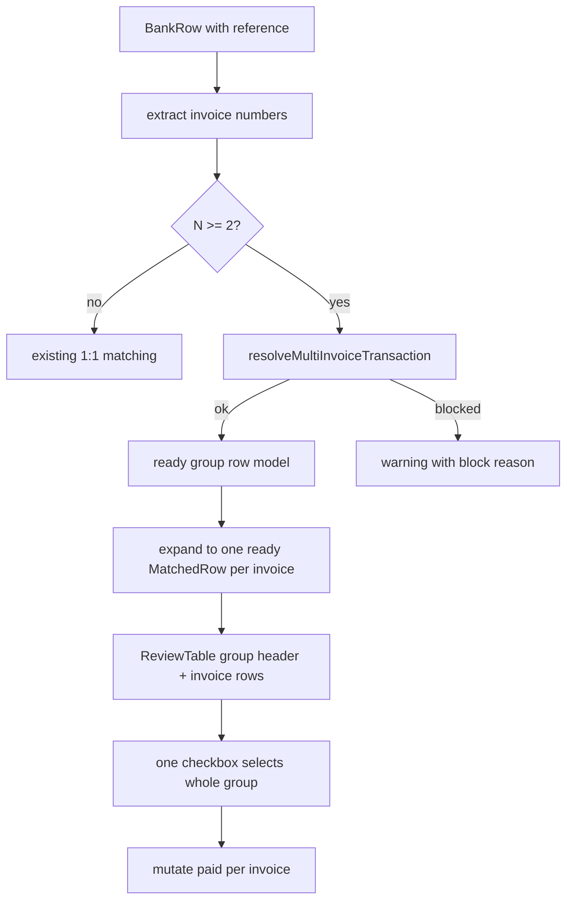

# Multi-Invoice Payment Matching Plan

## Current Constraints Confirmed

- `src/features/bank-reconciliation/lib/resolve-multi-invoice-transaction.ts` does not exist yet.
- `src/features/bank-reconciliation/lib/match-invoices.ts` currently hard-blocks `extractedNumbers.length > 2` and only resolves exactly two invoices.
- `ReviewTable` currently assumes each `readyRows` item is one invoice and one checkbox.
- `markRowsPaid()` already marks one `matchedInvoice` per selected ready row; after expanding resolved groups to individual rows, it can stay simple with small selection-key changes.

## Proposed Flow

## Implementation Details

Execution rule for this implementation: do **not** batch steps. Complete one step, run `bun run build`, and only proceed to the next step if the build passes. If `bun run build` fails, stop and report the failure before making further implementation changes.

1. Extend shared reconciliation types in `src/features/bank-reconciliation/types/reconciliation.types.ts`.

Add `MultiInvoiceResolution`, add `payerId` to `MatchedInvoice`, and add optional group metadata to `MatchedRow`: `groupKey`, `groupPosition`, `groupSize`. Keep existing fields so warning dialog and single-invoice rows remain compatible.

2. Update invoice lookup in `src/features/invoices/api/invoices.api.ts`.

Change `getInvoicesByNumbers()` from `payer:payers(name)` to `payer:payers(id, name)`, map `payerId`, and keep `payerName` for display only. This lets the new helper compare payer IDs rather than names.

3. Create `src/features/bank-reconciliation/lib/resolve-multi-invoice-transaction.ts`.

Implement a pure helper that receives `bankRow`, `extractedNumbers`, `invoiceLookup`, and `sentByNumber`, then validates:

- all invoice numbers exist,
- every invoice is present in `sentByNumber` as the authoritative currently-open invoice set,
- all invoices share the same `payerId`,
- `sum(invoices.total)` equals `Math.abs(bankRow.betrag)` within `AMOUNT_TOLERANCE`.

Return `ok: true` with all invoices when valid; otherwise return `ok: false` with `blockReason` and any partial `invoices` for UI context.

4. Refactor `src/features/bank-reconciliation/lib/match-invoices.ts`.

Before deleting any helper from `match-invoices.ts`, run a grep/search inside the file and remove only functions proven to be exclusively used by the old `resolveMultiInvoiceRow()` path. Specifically: delete `resolveMultiInvoiceRow()` and its private helpers only if they have no remaining call sites; do not remove `formatEurDe()` unless the search confirms it is no longer used by any remaining 1:1 amount-mismatch or block-reason logic.

For `extractedNumbers.length > 1`, call the new helper with both `invoiceLookup` and `sentByNumber`. Resolved groups should return a ready match carrying `matchedInvoices`, `multiInvoiceResolved: true`, and a stable `groupKey` based on the CSV row index. Blocked groups remain `bucket: 'warning'` with `warningReasons: ['multi_invoice']` and `multiInvoiceBlockReason`.

5. Expand ready groups in `src/features/bank-reconciliation/hooks/use-zahlungsabgleich.ts`.

After matching, convert a resolved multi-invoice ready row into N ready rows, one per invoice:

- each row gets `matchedInvoice` set to the individual invoice,
- each row keeps `matchedInvoices` for group context,
- each row shares `groupKey`, `bankRow`, and `extractedNumbers`,
- each row gets `groupPosition` and `groupSize`,
- each row gets a unique `rowKey` such as `${groupKey}:${invoice.id}`.

Selection should use a derived selection key: `groupKey` for grouped rows, otherwise `rowKey`. This preserves one checkbox per group header while still marking each invoice once. `selectedReadyCount` must count selected invoice rows, not selected checkbox keys.

Example: selecting one group of 4 invoices plus 2 single-invoice rows should display and confirm **6 invoices**, not 3 selected checkboxes.

6. Render grouped ready rows in `src/features/bank-reconciliation/components/review-table.tsx`.

Group consecutive `readyRows` by `groupKey`. For grouped rows, render:

- a header `TableRow` with one checkbox, booking date, beneficiary, full bank amount, invoice count, and sum,
- one child row per invoice with invoice number, invoice amount, and `groupPosition/groupSize` (for example `1/4`),
- subtle styling via existing `cn()` and table primitives.

Single-invoice ready rows should keep the current layout and checkbox behavior.

7. Generalize warning copy in `src/features/bank-reconciliation/components/warning-rows-dialog.tsx`.

Even though resolved groups move to ready, keep the warning dialog robust for unresolved multi-invoice rows: replace “beide Rechnungen” with “alle N Rechnungen” where `matchedInvoices.length` is available, and keep showing `multiInvoiceBlockReason` for blocked groups.

8. Keep `src/features/bank-reconciliation/components/zahlungsabgleich-dialog.tsx` mostly structural.

Adjust selected-count calculation to use the same selection-key/group-aware helper from the hook or table props. The confirm button must display the number of invoices that will be marked paid, not the number of checked controls; for example, one selected 4-invoice group plus two selected single invoices should read as 6 invoices to confirm.

9. Add unit tests in `src/features/bank-reconciliation/lib/__tests__/resolve-multi-invoice-transaction.test.ts`.

Cover:

- 2 invoices sum exactly,
- 4 invoices sum exactly,
- missing invoice,
- non-`sent` invoice,
- mixed payer IDs,
- amount mismatch outside `AMOUNT_TOLERANCE`,
- duplicate invoice number extraction is already deduped by parser but helper should behave predictably if duplicates arrive.

Update the `test` script in `package.json` to include `src/features/bank-reconciliation/lib/__tests__` so the new tests run with `bun test`.

10. Update `docs/bank-reconciliation-module.md`.

Document N-invoice Sammelzahlung behavior, ready-bucket promotion, group-header review UI, payer ID guard, and deferred items: schema audit trail, legacy invoice format, partial payments/credit notes, and atomic RPC.

## Verification

- After every implementation step, run `bun run build` before proceeding. Do not batch steps. Stop and report immediately if the build fails.
- Run the new focused test file with `bun test src/features/bank-reconciliation/lib/__tests__` after the helper test step.
- Run the repo test script after adding the test path: `bun test`.
- Run lints for touched TS/TSX files with `ReadLints` after each substantive edit; if needed, run the project lint command.
- Manually inspect the review-flow logic for single invoice, resolved group, unresolved group, ignored, already paid, and amount mismatch cases.