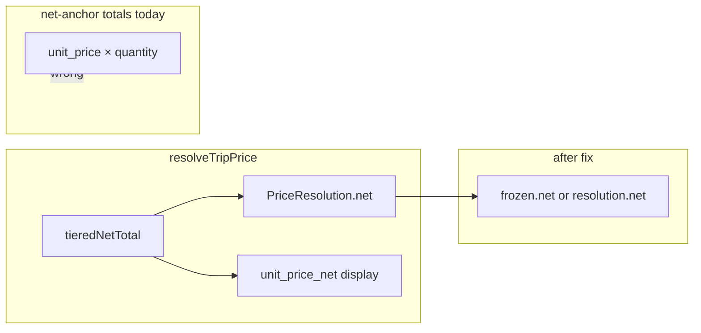

# Net-anchor transport net precision fix

## Context

[`resolveTripPrice`](src/features/invoices/lib/resolve-trip-price.ts) already stores the correct tiered transport net in [`PriceResolution.net`](src/features/invoices/types/pricing.types.ts) (`net` is transport-only; `approach_fee_net` is additive). [`unit_price_net`](src/features/invoices/lib/resolve-trip-price.ts) is a **display** per-km rate with `roundMoneyOnce(totalNet / dist)`, so **`unit_price × quantity` can differ from `net`**. Today, persistence and totals multiply the display fields, which drifts after VAT.

**Out of scope (per request):** [`price-calculator.ts`](src/features/invoices/lib/price-calculator.ts) logic (TODO only), backfill of historical `invoice_line_items.total_price`, [`invoice-pdf-line-amounts.ts`](src/features/invoices/components/invoice-pdf/lib/invoice-pdf-line-amounts.ts), any change to [`resolve-trip-price.ts`](src/features/invoices/lib/resolve-trip-price.ts).

---

## Step 1 — [`insertLineItems`](src/features/invoices/api/invoice-line-items.api.ts)

- **Variable:** `frozen` is already `frozenPriceResolutionForInsert(item)` (line 719).
- **Change:** In the **net-anchor** branch only (else of `isGrossAnchorClientPriceTag(frozen)`), replace `(item.unit_price ?? 0) * item.quantity` with:
  - `transportNet = frozen.net != null ? frozen.net : (item.unit_price ?? 0) * item.quantity`
  - `total_price = (transportNet + (item.approach_fee_net ?? 0)) * (1 + item.tax_rate)`
- **Do not** alter the gross-anchor branch (lines 732–734).
- **Rounding:** Keep current behavior: net-anchor `total_price` today is **unrounded** float product; gross-anchor unchanged. Do **not** add `Math.round` here unless you deliberately want parity with the draft PDF (which rounds) — recommend **leave as-is** for this PR to minimize behavior change outside the tier drift fix.
- **Comments:** Update the block comment (lines 726–728) that still says `unit_price × quantity`; add a `// why:` for `frozen.net` (tier boundary / per-km display rounding).
- **Rounding parity vs Step 3 (mandatory `// note:`):** Persisted `total_price` in `insertLineItems` stays **unrounded**; draft preview in `build-draft-invoice-detail-for-pdf.ts` keeps **`Math.round(..., 100)`** on gross. That one-cent (or sub-cent display) gap **predates** this PR and is **acceptable** for now. Add a short **`// note:`** next to the net-anchor `total_price` assignment in **both** files stating that draft and persisted line gross may differ slightly due to rounding policy, so a future engineer does not treat it as a regression from the `frozen.net` fix.

**Gate:** `bun run build`

---

## Step 2 — [`calculateInvoiceTotals`](src/features/invoices/api/invoice-line-items.api.ts)

- **Location:** Net-anchor `else` branch (lines 661–663).
- **Change:** Replace `baseNet = item.unit_price * item.quantity` with the same **net-first** fallback as Step 1, using transport net from **`item.price_resolution.net`** when non-null (as in your spec), **or** prefer **`frozenPriceResolutionForInsert(item).net`** for **strict parity** with `insertLineItems` if `unit_price` and `price_resolution` could ever diverge before save. Recommended: **`const frozen = frozenPriceResolutionForInsert(item)`** only inside the net-anchor branch (or once per iteration after the `manualGrossTotal` early-continue) and `baseNet` from `frozen.net ?? fallback` — avoids an extra frozen call on gross-anchor lines if you structure the loop carefully.
- **Do not** change `manualGrossTotal` handling or `isGrossAnchorClientPriceTag` branch.
- **JSDoc:** Extend the `calculateInvoiceTotals` docblock to state that net-anchor line net uses authoritative `PriceResolution.net` (frozen at insert time conceptually), not `unit × qty`.

**Gate:** `bun run build`

---

## Step 3 — [`build-draft-invoice-detail-for-pdf.ts`](src/features/invoices/components/invoice-pdf/build-draft-invoice-detail-for-pdf.ts)

- **Function:** `builderItemToDraftLineItem` — `frozen` already exists (line 51).
- **Change:** Net-anchor branch (line 57): replace `u * q` with `transportNet = frozen.net != null ? frozen.net : u * q`, then `Math.round((transportNet + approach) * (1 + item.tax_rate) * 100) / 100` (keep existing outer round).
- **Same `// note:` as Step 1:** Mirror the insert-vs-draft rounding disclaimer here (see Step 1) so both call sites stay cross-referenced.

**Gate:** `bun run build`

---

## Step 4 — [`line-item-net-display.ts`](src/features/invoices/lib/line-item-net-display.ts)

- **Function:** `lineItemGrossTotalForDisplay`
- **Change:** After `manualGrossTotal` / `unit_price` null checks, set `transportNet` from `item.price_resolution.net` when non-null, else `item.unit_price * q`; then gross = `Math.round((transportNet + approach) * (1 + tax) * 100) / 100`.
- **Optional parity:** Import [`frozenPriceResolutionForInsert`](src/features/invoices/api/invoice-line-items.api.ts) and use `frozen.net` (no circular import: API does not import this file). If you keep `price_resolution.net` only, document that builder paths must keep resolution in sync with unit edits (today they do via `applyManualUnitNetToResolution` / repricing).

**Gate:** `bun run build`

---

## Step 5 — `_totalPrice` in [`buildLineItemsFromTrips`](src/features/invoices/api/invoice-line-items.api.ts)

- Implement per your spec: prefer `priceResolution.net + approach` rounded to cents for the helper when `net` is set; else fall back to `unit * qty` (transport-only, as today).
- **Semantic change (mandatory `// why:`):** When `priceResolution.net` is present, `_totalPrice` becomes **line net including approach** (transport + `approach_fee_net`), rounded to cents — **not** transport-only. The old helper was effectively transport-only (`unit × qty`). The name `_totalPrice` already suggests a full line amount; the comment must spell this out so readers do not assume transport-only or chase a bogus “missing approach” bug. The field is **discarded** before `validateLineItems` (parity with insert is nice-to-have, not product-critical).
- **Required comment shape:** A multi-line or single `// why:` that explicitly states: (1) `net` path = line net incl. approach, rounded; (2) fallback path = legacy transport-only from `unit × qty`; (3) discarded field.

**Gate:** `bun run build`

---

## Step 6 — [`price-calculator.ts`](src/features/invoices/lib/price-calculator.ts)

- Add only the TODO comment (no logic).

**Gate:** `bun run build`

---

## Step 7 — Docs

1. **Module doc:** Update [`docs/pricing-engine.md`](docs/pricing-engine.md) (primary “price engine” doc) **and/or** [`docs/invoices-module.md`](docs/invoices-module.md) § pricing: state that for **net-anchored** lines, **transport net for money** comes from `PriceResolution.net` (frozen snapshot at insert); `unit_price` and `quantity` remain **display** (per-km unit and km count) and must not be multiplied for persisted totals / header totals when `net` is present.
2. **Plan audit:** In [`docs/plans/price-engine-unit-price-precision-audit.md`](docs/plans/price-engine-unit-price-precision-audit.md), add a short **Status: implemented** subsection with date and pointer to this change set.
3. Verify every touched branch has an accurate `// why:` (Steps 1–5) and the insert + draft PDF pair has the **`// note:`** on rounding parity (Step 1 / Step 3).

---

## Tests

- Update [`calculate-invoice-totals.test.ts`](src/features/invoices/api/__tests__/calculate-invoice-totals.test.ts): helper `singleLineBruttoViaNetAnchorPath` (lines 12–19) still mirrors **old** math — either update it to use `price_resolution.net` or add a **new** test with a **tiered_km**-style line where `unit_price * quantity !== net` and assert `calculateInvoiceTotals` / display helper match `(net + approach) * (1 + rate)` logic.
- Extend [`line-item-net-display.test.ts`](src/features/invoices/lib/__tests__/line-item-net-display.test.ts) if needed for gross column using `net` when `quantity > 1`.

---

## Regression checklist (manual / assertions)

| Case | Expectation |
|------|-------------|
| `kts_override` | `net === 0`, fallback or zero transport — unchanged |
| `client_price_tag` + `gross` | Gross-anchor path untouched |
| P0 `manual_gross_price` | `approach_fee_net === 0`, `net` is full meter net; transport net from `net` equals `unit × qty` for qty 1 |
| `no_price` / null `net` | Fallback to `unit × qty` |
| Manual unit edit | `applyManualUnitNetToResolution` sets `net` = `round(unit × qty)` — totals stay consistent |
