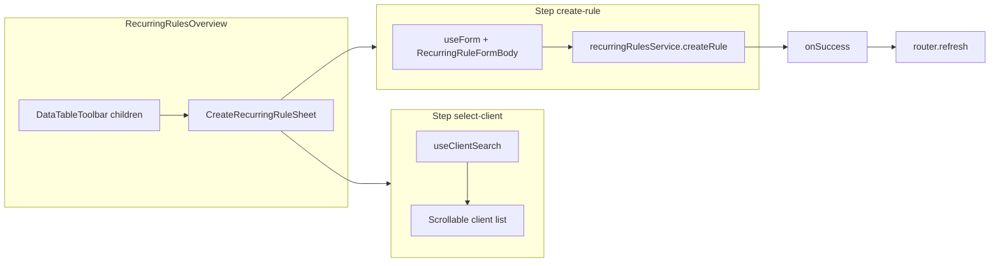

# Neue Regelfahrt create flow (Regelfahrten overview)

## Preconditions

- Read in full before coding: [docs/features/recurring-rules-overview.md](docs/features/recurring-rules-overview.md), [docs/panel-layout-system.md](docs/panel-layout-system.md) (Miller vs Sheet rationale), [src/features/clients/components/recurring-rule-sheet.tsx](src/features/clients/components/recurring-rule-sheet.tsx), [src/features/clients/components/recurring-rule-form-body.tsx](src/features/clients/components/recurring-rule-form-body.tsx), [src/features/trips/hooks/use-trip-form-data.ts](src/features/trips/hooks/use-trip-form-data.ts), [src/components/ui/table/data-table-toolbar.tsx](src/components/ui/table/data-table-toolbar.tsx), [src/components/ui/command.tsx](src/components/ui/command.tsx) (optional reference).
- **[docs/plans/recurring-rules-create-from-overview-audit.md](docs/plans/recurring-rules-create-from-overview-audit.md) is not in the repo today.** At Step 4, **create** that file (or update if it appears) with the required top line: `Status: IMPLEMENTED — see docs/features/recurring-rules-overview.md`.

## Architecture

## Step 1 — `use-client-search.ts`

**New file:** [src/features/recurring-rules/hooks/use-client-search.ts](src/features/recurring-rules/hooks/use-client-search.ts) (`'use client'`).

**Constants (top of file):**

- `CLIENT_SEARCH_DEBOUNCE_MS = 300` (per spec).
- Add a named limit for empty-query browse, e.g. `CLIENT_BROWSE_PAGE_SIZE = 100` (or similar—no magic numbers).
- Add a named limit for search results, e.g. `CLIENT_SEARCH_MAX_RESULTS = 50` (broader than `searchClients`’s 8 so the combobox is usable; document why in JSDoc).

**Search strategy (document in JSDoc):**

- **Do not** call `useTripFormData()` only to get `searchClients`: it would run payers/drivers/billing queries unrelated to client pick, and `searchClients` returns `[]` for empty or `length < 2` queries, which fails the “empty query shows top-N” requirement.
- **Do** use `createClient` from `@/lib/supabase/client` inside the hook:
  - **Empty / whitespace query:** `select('id, first_name, last_name').order('last_name', { ascending: true }).limit(CLIENT_BROWSE_PAGE_SIZE)` — stable initial list, no error.
  - **Non-empty (after debounce):** mirror the `searchClients` filter shape from [use-trip-form-data.ts](src/features/trips/hooks/use-trip-form-data.ts) (`first_name`, `last_name`, `company_name`, `email` `ilike`) with `limit(CLIENT_SEARCH_MAX_RESULTS)`.
- Return `{ clients: { id, first_name, last_name }[], isLoading: boolean }`. Map rows to the slim shape; treat Supabase errors as empty list + optional console, or follow existing toast patterns only if already standard (keep hook lean).

**Stale in-flight responses:** Use a **boolean `cancelled` flag** in the debounced `useEffect`, not `AbortController`. Pattern: `let cancelled = false` at effect start; in the `finally` (or after each `await`), `if (!cancelled) setClients(...)` / `setIsLoading(false)`; return cleanup `() => { cancelled = true; clearTimeout(...) }`. **Do not** rely on `AbortSignal` for Supabase queries here—the JS client does not reliably honour cancellation on all query types, which can cause subtle bugs when the user types quickly.

**Gate:** `bun run build`.

## Step 2 — `create-recurring-rule-sheet.tsx`

**New file:** [src/features/recurring-rules/components/create-recurring-rule-sheet.tsx](src/features/recurring-rules/components/create-recurring-rule-sheet.tsx) (`'use client'`).

**JSDoc (file or component):** Explain **RecurringRuleFormBody vs RecurringRulePanel** — same reasoning as [docs/panel-layout-system.md](docs/panel-layout-system.md): Panel is Miller-column layout (`PanelHeader`/`PanelBody`/`PanelFooter`); Sheet needs the same shell as [recurring-rule-sheet.tsx](src/features/clients/components/recurring-rule-sheet.tsx) (fixed header/footer, scrollable middle).

**Props:** `CreateRecurringRuleSheetProps` exactly as specified (`isOpen`, `onOpenChange`, `onSuccess`).

**State:**

- `SheetStep = 'select-client' | 'create-rule'`.
- `step`, `selectedClient` as specified.
- **Reset when `isOpen` becomes `true`:** `useEffect` sets `step` to `'select-client'`, `selectedClient` to `null`, and clears step-1 local search input if stored separately.

**Hooks at component top (rules-of-hooks):**

- `useForm` + `zodResolver(ruleFormSchema)` + `defaultValues: getRuleFormDefaults(null)` — same as [recurring-rule-sheet.tsx](src/features/clients/components/recurring-rule-sheet.tsx).
- `payerWatch = form.watch('payer_id')`.
- `{ payers, billingTypes } = useTripFormData(payerWatch)`.
- **Form reset (mandatory pattern):** Call `form.reset(getRuleFormDefaults(null))` only inside a **`useEffect` that depends on `step` (and `isOpen` / `selectedClient` as needed)**—i.e. when `step === 'create-rule'` and `selectedClient` is non-null, after React has committed the step transition. **Do not** call `form.reset` inside the **Weiter** button `onClick`; that handler should **only** `setStep('create-rule')`. Resetting in the effect avoids calling `form.reset` before render and matches the safe timing used elsewhere. Also reset when `isOpen` becomes `true` (mirror [recurring-rule-sheet.tsx](src/features/clients/components/recurring-rule-sheet.tsx) open + `initialData` effect) so each open starts clean.

**Step 1 UI:**

- `Sheet` / `SheetContent` with `className` matching `RecurringRuleSheet`: `flex w-full flex-col p-0 sm:max-w-md`.
- Header: title `Neue Regelfahrt`, description `Wählen Sie zuerst einen Fahrgast aus.`
- Scrollable middle: `Input` (placeholder `Fahrgast suchen…`), `useClientSearch(query)`; render **scrollable list** of `Button` rows `variant="ghost"` / `className` for selected state; label `"{last_name}, {first_name}"` (handle nulls like overview guest label).
- **Do not** advance step on row click—only set `selectedClient`; highlight selection (checkmark or `bg-muted`).
- Footer: `Abbrechen` → `onOpenChange(false)`; `Weiter` → disabled if `!selectedClient`; `onClick` **only** `setStep('create-rule')` (form reset is handled by the effect above, not here).

**Step 2 UI:**

- Header: title `Neue Regelfahrt`; description `Fahrgast: {last_name}, {first_name}` (match ordering used in list).
- Middle: `<form id="create-recurring-rule-from-overview-form" onSubmit={form.handleSubmit(handleSubmit)}>` wrapping `<RecurringRuleFormBody form={form} showIsActive={false} />` only (same as sheet; footer stays outside scroll area per sheet structure).
- Footer: `Zurück` → `setStep('select-client')` (does not close); `Hinzufügen` → `type="submit"` `form="create-recurring-rule-from-overview-form"`; `Loader2` + `isSubmitting` like sheet.

**Submit handler:** Copy logic from `RecurringRuleSheet` create branch only: `buildRecurringRulePayload(values, { clientId: selectedClient.id, payers, billingTypes })`, `recurringRulesService.createRule(ruleData)`, `toast.success('Regel erfolgreich erstellt')`, `onSuccess()`, `onOpenChange(false)`, error toast with `error.message`.

**Invariants:** No `@/lib/supabase/server`; no import from `recurring-rules.server.ts`.

**Gate:** `bun run build`.

## Step 3 — Wire overview

**Modify only:** [src/features/recurring-rules/components/recurring-rules-overview.tsx](src/features/recurring-rules/components/recurring-rules-overview.tsx).

- `import * as React from 'react'` if not present; `useRouter` from `next/navigation`.
- State: `isCreateSheetOpen`.
- Toolbar: [DataTableToolbar](src/components/ui/table/data-table-toolbar.tsx) renders **filter column inputs on the left** and **`children` + view options on the right** (`flex items-center gap-2`). Pass **`children`** with a primary `Button` (`size="sm"`, `PlusCircle` from `lucide-react`) labeled `Neue Regelfahrt`, `onClick={() => setIsCreateSheetOpen(true)}` — this matches the established pattern of placing actions in the toolbar’s right slot (see structure in `data-table-toolbar.tsx`; trips use page header for some actions, but toolbar `children` is the correct hook for table-adjacent primary actions).
- Below `DataTable`, mount `CreateRecurringRuleSheet` with `onSuccess={() => router.refresh()}`.
- **Refresh rationale:** Regelfahrten data is loaded in the RSC page via `getAllRules()`; there is no shared TanStack key for this table. **`router.refresh()`** re-runs the server component tree and is the same pattern as [client-form.tsx](src/features/clients/components/client-form.tsx) and [driver-form.tsx](src/features/driver-management/components/driver-form.tsx). Document inline next to the callback.

**Do not** add imports from `recurring-rules.server.ts` beyond the existing type import on this file.

**Gate:** `bun run build && bun test`.

## Step 4 — Docs and comments

**Inline comments** (required): short “why” on debounce, direct Supabase vs `useTripFormData` search, **`cancelled` flag vs AbortController** in the search hook, Panel vs FormBody, open reset, **form reset in `useEffect` on `step` (not in Weiter `onClick`)**, toolbar button placement, `router.refresh()`.

**Update** [docs/features/recurring-rules-overview.md](docs/features/recurring-rules-overview.md):

- Remove or adjust the “read-only / deferred inline create” wording in the intro; add a **Create flow** section: toolbar button → two-step Sheet → `router.refresh()` after create; list deferred items (edit from overview, active filter, RLS) per spec.

**Create or update** [docs/plans/recurring-rules-create-from-overview-audit.md](docs/plans/recurring-rules-create-from-overview-audit.md):

- First line: `Status: IMPLEMENTED — see docs/features/recurring-rules-overview.md` (if file is new, add minimal stub body or paste prior audit content if the user supplies it later).

## Hard rules checklist

| Rule | Action |
|------|--------|
| No edits to `RecurringRuleFormBody`, `RecurringRuleSheet`, `RecurringRulePanel`, `recurring-rules.service.ts`, `regelfahrten/page.tsx` | Enforced |
| No server Supabase in new client files | Enforced |
| Named constants for debounce and limits | Enforced |
| Deferred features | Do not implement |
