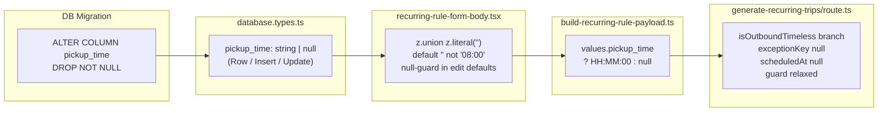

# Nullable `pickup_time` — Phase 1: Daily-Agreement Mode

## Architecture



---

## Step 1 — DB migration

**New file:** `supabase/migrations/20260417000000_nullable-pickup-time.sql`

```sql
ALTER TABLE recurring_rules
  ALTER COLUMN pickup_time DROP NOT NULL;

COMMENT ON COLUMN recurring_rules.pickup_time IS
  'NULL means daily-agreement (time confirmed day before).
   Non-null means fixed HH:MM:SS schedule.';
```

Apply: `supabase db push` (or `supabase migration up` locally). No data changed; existing rows keep their values.

**BUILD GATE: `bun run build` must pass before Step 2.**

---

## Step 2 — `src/types/database.types.ts`

Three changes — only `recurring_rules`, only `pickup_time`:

- `Row.pickup_time: string` → `string | null`
- `Insert.pickup_time: string` → `string | null`
- `Update.pickup_time?: string` → `string | null`

`InsertRecurringRule` in `recurring-rules.service.ts` is a direct alias of `Insert`, so it inherits this automatically.

**BUILD GATE: `bun run build` must pass before Step 3.**

---

## Step 3 — `src/features/clients/components/recurring-rule-form-body.tsx`

**3a. Schema** — replace the `pickup_time` field in `ruleFormSchema`:

```ts
// z.union with z.literal('') mirrors departure_time in create-trip/schema.ts;
// '' represents daily-agreement mode (pickup_time = null in DB).
pickup_time: z.union([
  z.literal(''),
  z.string().regex(
    /^([0-1]?[0-9]|2[0-3]):[0-5][0-9]$/,
    'Bitte ein gültiges Zeitformat verwenden (HH:MM)'
  )
]),
```

No `superRefine` change needed for `pickup_time` (empty is always valid — daily agreement).

**3b. New-rule default** in `getRuleFormDefaults` (`initialData` absent):
- `pickup_time: '08:00'` → `pickup_time: ''`

**3c. Edit-rule default** in `getRuleFormDefaults` (`initialData` present):
- `pickup_time: initialData.pickup_time.substring(0, 5)` → `pickup_time: initialData.pickup_time ? initialData.pickup_time.substring(0, 5) : ''`

**3d. JSX** — add `<FormDescription>` below the `pickup_time` `<Input>`:

```tsx
<FormDescription>
  Leer lassen für tägliche Zeitabsprache
</FormDescription>
```

No structural change to the `<Input type="time">` element itself.

**BUILD GATE: `bun run build` must pass before Step 4.**

---

## Step 4 — `src/features/clients/lib/build-recurring-rule-payload.ts`

Single line change:

```ts
// Before
pickup_time: `${values.pickup_time}:00`,

// After — null is emitted for daily-agreement rules so the DB column stores NULL
// rather than the invalid ':00' that an empty form value would produce.
pickup_time: values.pickup_time
  ? `${values.pickup_time}:00`
  : null,
```

**BUILD GATE: `bun run build` must pass before Step 5.**

---

## Step 5 — `src/app/api/cron/generate-recurring-trips/route.ts`

### 5a. `buildTripPayload` param type

Change `exceptionTimeKey: string` → `exceptionTimeKey: string | null` in the inline params interface. The existing `exceptions?.find(...)` comparison (`e.original_pickup_time === exceptionTimeKey`) works correctly with null (returns `undefined`; no exception match for timeless rules in Phase 1 — exception handling is deferred).

### 5b. Outbound occurrence loop (around line 417)

Replace both current lines (preserving exception-override lookup for fixed-time rules):

```ts
// Before
const outboundExceptionKey = clockToHhMmSs(rule.pickup_time);
const outboundScheduledIso = toScheduledIso(
  dateStr,
  exceptions?.find(...)?.modified_pickup_time || rule.pickup_time
);

// After — branch before clockToHhMmSs / toScheduledIso so they are never
// called with null; timeless rules generate outbound with scheduled_at = null.
const isOutboundTimeless = !rule.pickup_time;

const outboundExceptionKey = isOutboundTimeless
  ? null
  : clockToHhMmSs(rule.pickup_time!);

const outboundScheduledIso = isOutboundTimeless
  ? null
  : toScheduledIso(
      dateStr,
      exceptions?.find(
        (e) =>
          e.rule_id === rule.id &&
          e.exception_date === dateStr &&
          e.original_pickup_time === outboundExceptionKey
      )?.modified_pickup_time || rule.pickup_time!
    );
```

### 5c. `buildTripPayload` outbound guard (around line 169)

> **MANDATORY PRE-CHECK — read before touching this block:**
> Before editing line 169, read the full `buildTripPayload` function signature in the file.
> Confirm that the parameter carrying the pre-computed ISO timestamp is named `scheduledAtIso`.
> If the name differs, use the actual parameter name — do not assume.
> The relaxed guard `if (!pt && scheduledAtIso !== null)` is only correct when that variable
> is the same one passed in from the occurrence loop in 5b.

```ts
// Before
if (!isReturnTrip) {
  const pt = exception?.modified_pickup_time || rule.pickup_time;
  if (!pt) return null;
}

// After — daily-agreement rules have pickup_time = null intentionally;
// scheduledAtIso is also null for them (computed in 5b), so the guard
// only blocks the leg when there is no time and no exception override.
if (!isReturnTrip) {
  const pt = exception?.modified_pickup_time || rule.pickup_time;
  if (!pt && scheduledAtIso !== null) return null;
}
```

### 5d. Verify (no change needed)

- `findExistingRecurringLegId` already handles `scheduled_at === null` via `.is('scheduled_at', null)` — wired with `outboundScheduledIso` which is now null for timeless rules. ✓
- `buildTripPayload` returns `scheduled_at: scheduledAtIso`; when null → DB insert of null. ✓

**BUILD GATE: `bun run build && bun test` must pass before Step 6.**

---

## Step 6 — Docs

**6a.** Add a section "Timeless outbound rules (daily-agreement mode)" to [`docs/features/recurring-rules-overview.md`](docs/features/recurring-rules-overview.md) covering: what `pickup_time = null` means, how the cron handles it (scheduled_at = null, requested_date set), how the form represents it (empty `<input type="time">`, `''` form value), and that Phase 2 will surface these trips in the timeless-rule widget.

**6b.** Add status line at top of [`docs/plans/timeless-recurring-rules-audit.md`](docs/plans/timeless-recurring-rules-audit.md) and [`docs/plans/pickup-time-mode-feasibility-audit.md`](docs/plans/pickup-time-mode-feasibility-audit.md):

```
**Phase 1: COMPLETE — 2026-04-17**
```

**6c.** Inline "why" comments at every changed code path (already embedded above in the plan).

---

## Hard-rule checklist

- No field other than `pickup_time` changed across all files
- No `return_mode`, `return_time`, or return leg logic touched
- No `pending-tours-widget` or `use-unplanned-trips` touched
- No `pickup_time_mode` column introduced anywhere
- Build gates enforced between every step
- Fixed-time rules: exception-override lookup for `outboundScheduledIso` preserved exactly as before
