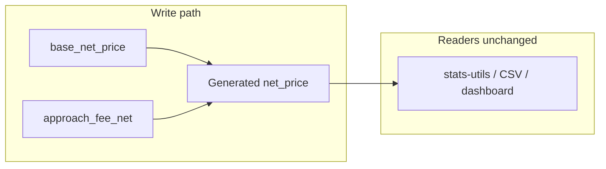

# Option A Phase 2: `net_price` generated + P4 fix + write strip

**Order (strict):** Step 1 (app) → Step 2 (app + scripts) → Step 3 (migration) → Step 4 (types) → Step 5 (docs + comments). **Do not run Step 3** until Step 2 build + tests are green.

**Path correction:** The table listed `src/features/trips/components/resolve-clients-step.tsx` — the actual file is [`src/features/trips/components/bulk-upload/resolve-clients-step.tsx`](src/features/trips/components/bulk-upload/resolve-clients-step.tsx).

---

## Prerequisite not in the original table (must ship with Step 1)

[`computeTripPrice`](src/features/trips/lib/trip-price-engine.ts) builds `tripInput` for `resolveTripPrice` (lines ~231–241) with only `net_price`, not `base_net_price`. [`resolveTripForPricing`](src/features/trips/lib/trip-price-engine.ts) selects/merges the current row (lines ~348–381) and must **include `base_net_price` in the `select` and in the returned `ComputeTripPriceInput`**.

- **Extend `ComputeTripPriceInput`** with `base_net_price: number | null` and pass it into the object passed to `resolveTripPrice` (parallel to existing `net_price` until Step 4 cleans names).
- **`duplicate-trips` [`toComputeInput`](src/features/trips/lib/duplicate-trips.ts):** set `base_net_price: null` (like `net_price: null` today) so types align.
- **[`price-calculator.ts`](src/features/invoices/lib/price-calculator.ts):** extend `Pick<TripForInvoice, …>` with `base_net_price`, pass to `resolveTripPricePure`.
- **[`TripForInvoice`](src/features/invoices/types/invoice.types.ts):** add `base_net_price` (and `approach_fee_net` if any caller needs it for consistency).

[`scripts/backfill-trip-price-split.ts`](scripts/backfill-trip-price-split.ts) builds a resolver input from a DB row: ensure `base_net_price` is selected (if not already) and passed on `TripPriceInput` after Step 1.

---

## Step 1 — P4 + `TripPriceInput` + fetch (atomic)

**1a. [`resolve-trip-price.ts`](src/features/invoices/lib/resolve-trip-price.ts)**  
- Add `base_net_price: number | null` to `TripPriceInput` (file uses `export interface` — keep that style; user wrote `type` — use `interface` for consistency).  
- Keep `net_price` for now (Step 4 may narrow/removal).  
- **P4** (~467–481): use `const storedNet = trip.base_net_price` (not `trip.net_price`) as the `net:` passed into `withApproachFeeFromRule`.  
- **Review `executeStrategy`:** [`client_price_tag`](src/features/invoices/lib/resolve-trip-price.ts) (~248–256) and [`manual_trip_price`](src/features/invoices/lib/resolve-trip-price.ts) (~264–275) also read `trip.net_price` as stored fallback — switch to `trip.base_net_price` for the same double-counting reason, unless a branch is strictly display-only (document in a one-line comment if left unchanged).  
- Add a short “why” comment on the P4 block (double-counting + Phase 2).

**1b. [`invoice-line-items.api.ts`](src/features/invoices/api/invoice-line-items.api.ts)**  
- In `fetchTripsForBuilder` `select` (~139–163), add **`base_net_price`** (and **`approach_fee_net`** for parity/audit) next to `net_price`.  
- In `buildLineItemsFromTrips`, pass `base_net_price: trip.base_net_price ?? null` (and `approach_fee_net` if required by `TripPriceInput`) into `resolveTripPricePure` alongside existing fields.

**1c. Wire `ComputeTripPriceInput` + `resolveTripForPricing`** (see prerequisite above).

**Gate:** `bun run build` + `bun test` before Step 2. Add/extend a **resolve-trip-price** test for P4 using `base_net_price` (not combined `net_price`) if missing.

---

## Step 2 — Strip all `net_price` writes

**2a. [`trip-price-engine.ts`](src/features/trips/lib/trip-price-engine.ts)**  
- `TripPriceFields`: remove `net_price`; `nullFields` and success return must not include it.  
- **Comments:** `TripPriceFields` and removal of `totalNet` as a *written* field — reference Phase 2 migration name once added.  
- Fix docstring that says `tax_rate` null when `net_price` null → describe `base_net_price` / `approach_fee_net` / gross instead.

**2b. [`use-invoice-builder.ts`](src/features/invoices/hooks/use-invoice-builder.ts)**  
- Remove `net_price: netPriceCombined` from `updateTrip` (~283). **Comment** why (DB generated).

**2c. Remove explicit `net_price: null` from `computeTripPrice` **input** objects** where it only seeds before spread (Postgres will reject *any* `net_price` key on insert after Step 3):  
- [`create-trip-form.tsx`](src/features/trips/components/create-trip/create-trip-form.tsx) (four sites)  
- [`bulk-upload-dialog.tsx`](src/features/trips/components/bulk-upload-dialog.tsx) (two `computeTripPrice` calls)  
- [`generate-recurring-trips/route.ts`](src/app/api/cron/generate-recurring-trips/route.ts) (two)  
- [`duplicate-trips.ts`](src/features/trips/lib/duplicate-trips.ts) — [`copyRouteAndPassengerFields`](src/features/trips/lib/duplicate-trips.ts) `net_price: null` (~304–306) and any other insert partials.  
- **Optional:** if `computeTripPrice` still requires `net_price` on `ComputeTripPriceInput` as `null`, pass **`net_price: null` only in the *argument to `computeTripPrice`*** (in-memory, not the insert object). Prefer structuring so the **insert row** is `{ ...computeTripResult, ... }` without a duplicate `net_price` key — i.e. build `tripInput` vs `rowPayload` separately if needed.

**2d. Maintenance scripts — checklist (do **A and B together** per file; they are independent changes but must ship in the same edit)**

**COALESCE decision (Step 3, unchanged):** Keep  
`COALESCE(base_net_price, 0) + COALESCE(approach_fee_net, 0)`  
in the generated expression. This preserves current behaviour: **display and stats treat unpriced trips as 0, not NULL.** Do not switch to NULL propagation for the sum.

**Consequence after migration:** `trips.net_price` is **never NULL** — for trips where the engine never stored a resolution, the generated value is **0** (not NULL). Any script that still uses **`.is('net_price', null)`** will match **zero rows** and is **broken** after deploy.

---

*(A) Remove `net_price` from every `.update({ … })` that still sets it*  

- [`backfill-null-trip-net-prices.ts`](scripts/backfill-null-trip-net-prices.ts) (~99)  
- [`backfill-driving-distance.ts`](scripts/backfill-driving-distance.ts) (three update blocks ~123, ~506, ~626)  
- One-line **Phase 2** comment on each removal (generated column; write base columns only).

---

*(B) Replace “unpriced” **row selection** filters*

**[`backfill-null-trip-net-prices.ts`](scripts/backfill-null-trip-net-prices.ts)** — replace the query filter that selects candidates for pricing:

```ts
// BEFORE (broken after Phase 2 migration):
.is('net_price', null)

// AFTER — target trips with no price resolution stored on the row:
.is('base_net_price', null)
.is('approach_fee_net', null)
```

**[`backfill-driving-distance.ts`](scripts/backfill-driving-distance.ts)** — search the file for every filter that references `net_price.is.null`, `.is('net_price', null)`, or `net_price` inside a PostgREST `.or(...)` “missing price” string. Replace with predicates that use **`base_net_price` (and, where the clause meant “completely unpriced”, also `approach_fee_net`)** so behaviour stays aligned with `backfill-null`. **“Unpriced trip”** going forward: **`base_net_price IS NULL`** is the primary definition; use **both** `base_net_price` and `approach_fee_net` null where the old logic was equivalent to “no split stored” (same as the dual `.is` above for simple queries).

*Semantics (add a short comment in each script and/or Step 3 migration note):*  

- **`base_net_price IS NULL`** (and typically **`approach_fee_net IS NULL`**) means the engine has **never** successfully stored a price split for that trip — **equivalent to old `net_price IS NULL`** for “needs pricing / backfill”.  
- **`base_net_price = 0` and `approach_fee_net = 0`** is a **deliberately zero** priced trip (e.g. KTS / no charge in business rules), **not** the same as “unpriced” — the new filters must **not** conflate the two.

**2e.** Verify `Object.assign` / spread sites ([`trips.service.ts`](src/features/trips/api/trips.service.ts) ~87, [`reschedule.actions.ts`](src/features/trips/trip-reschedule/api/reschedule.actions.ts) ~103/148, [`unassigned-trips.service.ts`](src/features/unassigned-trips/api/unassigned-trips.service.ts) ~139, [`resolve-clients-step`](src/features/trips/components/bulk-upload/resolve-clients-step.tsx) ~190, duplicate `Object.assign` sites) no longer pass `net_price` in the update payload.

**2f. Final sweep:** repo search for `net_price` in **insert/update** contexts — **zero** write paths left.

**Tests:** Update [`trip-price-engine.test.ts`](src/features/trips/lib/__tests__/trip-price-engine.test.ts) and any test asserting `result.net_price` to assert **`base_net_price` + `approach_fee_net`** (and derived combined if needed in memory only).

**Gate:** `bun run build` + `bun test` — all green before Step 3.

---

## Step 3 — Migration

New file: `supabase/migrations/<timestamp>_net_price_generated.sql`  

- `DROP COLUMN net_price` on `public.trips` (cannot in-place to `GENERATED` in one alter in a portable way).  
- `ADD COLUMN net_price numeric(10,4) GENERATED ALWAYS AS (COALESCE(base_net_price,0) + COALESCE(approach_fee_net,0)) STORED` (confirm precision vs existing column).  
- **Comment** the migration: **why** `0` in `COALESCE` — unpriced trips surface as **0** for display/stats (existing behaviour; do **not** change to NULL propagation).  
- Post-deploy verification query as in your spec (tolerance 0.001); note **after COALESCE** “no NULL `net_price`” is expected.

**Gate:** apply migration in staging, then `bun run build` (Step 4 types may be needed first in CI — see Step 4).

---

## Step 4 — `database.types.ts`

- **`Row`:** keep `net_price`; add comment: generated, read-only, expression.  
- **`Insert` / `Update`:** **remove** `net_price` so TS blocks writes.

Regenerate from Supabase if the project does, or hand-edit to match. **Gate:** `bun run build` + `bun test`.

---

## Step 5 — Docs and inline “why” comments

Per your list: **P4**, **`TripPriceFields`**, **writeback**, **scripts**; then [`option-a-phase2-audit.md`](docs/plans/option-a-phase2-audit.md) “Phase 2 implemented”, [`option-a-schema-split-audit.md`](docs/plans/option-a-schema-split-audit.md), [`option-a-backfill-feasibility-audit.md`](docs/plans/option-a-backfill-feasibility-audit.md), [`kts-architecture.md`](docs/kts-architecture.md); grep `docs/` for “manual” `net_price` wording; **Last updated** on every touched doc.

**Deferred (do not do):** removing `net_price` from `TripPriceInput` entirely, dropping generated column, UI split — as in your spec.


