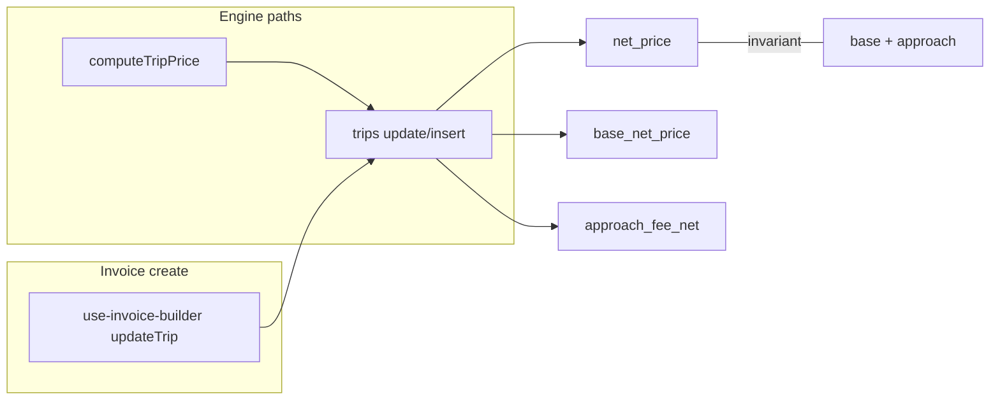

# Option A Phase 1: `trips` base / approach split

## Preconditions (read before coding)

As requested, implementation should align with: [src/features/trips/lib/trip-price-engine.ts](src/features/trips/lib/trip-price-engine.ts), [src/features/invoices/hooks/use-invoice-builder.ts](src/features/invoices/hooks/use-invoice-builder.ts), [docs/plans/option-a-schema-split-audit.md](docs/plans/option-a-schema-split-audit.md), [docs/plans/option-a-backfill-feasibility-audit.md](docs/plans/option-a-backfill-feasibility-audit.md). **`src/features/billing-rules/`** does not exist in the repo; pricing uses `billing_pricing_rules` via `loadPricingContext` / `resolvePricingRule` (see feasibility audit).

---

## Critical: invoice `net_price` vs invariant

**Current code** at [use-invoice-builder.ts](src/features/invoices/hooks/use-invoice-builder.ts) line 275 sets:

```ts
net_price: item.price_resolution.net
```

That is **transport base only**; it does **not** include `approach_fee_net` (see [option-a-schema-split-audit.md](docs/plans/option-a-schema-split-audit.md) executive finding).

**Your hard rule** requires, for rows where split columns are set:

- `net_price === base_net_price + approach_fee_net` (and taxameter: approach `0`).

**Resolution for Phase 1:** when extending writeback, set:

- `base_net_price` = `item.price_resolution.net` (or `null` if unresolved; match existing `net_price` nullability contract),
- `approach_fee_net` = `item.approach_fee_net ?? 0` (builder line already carries the fee from resolution — [invoice-line-items.api.ts](src/features/invoices/api/invoice-line-items.api.ts) ~322–325),
- **`net_price`** = **`(item.price_resolution.net ?? 0) + (item.approach_fee_net ?? 0)`** (use the same cent rounding as elsewhere if needed, e.g. one `roundMoneyOnce` from [resolve-trip-price.ts](src/features/invoices/lib/resolve-trip-price.ts) or a small local helper; avoid magic unexplained `+`).

This **changes stored `net_price` on the invoice writeback path** to the **combined** total, matching the engine and your invariant. **No reader code** changes, but **new invoices** will write a different `net_price` than pre–Phase-1 writeback (fixing the documented semantic skew). Document this in release notes and in `use-invoice-builder` / audit docs as an intentional alignment.

If product forbids changing `net_price` on writeback, the invariant cannot hold for that path; the spec as written **requires** the change above.

---

## Step 1 — Migration

- Add new file: `supabase/migrations/<timestamp>_add_trip_price_split.sql` with `ADD COLUMN` + `COMMENT` exactly as in your spec (`numeric(10,4)` for both).
- **No** RLS, trigger, or generated column; additive only.
- **Build:** `bun run build` (and regenerate types — Step 2 — or hand-edit until types match; teams often run `supabase gen types` if available).

---

## Step 2 — `database.types.ts`

- In [src/types/database.types.ts](src/types/database.types.ts), add `base_net_price` and `approach_fee_net` to `public.trips` `Row`, `Insert`, and `Update` next to `net_price` / `gross_price` / `tax_rate`, with the comment block you specified.

---

## Step 3 — Engine: [trip-price-engine.ts](src/features/trips/lib/trip-price-engine.ts)

- Extend `TripPriceFields` to include `base_net_price` and `approach_fee_net` (keep `export interface` unless you have a project-wide reason to switch to `type`).
- In `computeTripPrice`:
  - **Extend `nullFields`** (lines 212–216 today) to set **all five** price fields to `null` when early-returning (payer null or `resolution.net === null`).
  - In the success branch, set `baseNetPrice = resolution.net`, `approachFeeNet = resolution.approach_fee_net ?? 0`, `totalNet` as today, and return the two new fields. **Do not** change `gross_price` / `net_price` formulas beyond what’s required for consistency.
- Add concise **why** comments (Phase 1 / invariant, Phase 2 deferred).

**Call sites:** `Object.assign(..., computeTripPrice(...))` will automatically pass new fields into inserts/updates; no per-file spread changes required beyond tests.

**Tests:** Update [src/features/trips/lib/__tests__/trip-price-engine.test.ts](src/features/trips/lib/__tests__/trip-price-engine.test.ts) to assert `base_net_price` / `approach_fee_net` on key cases (e.g. tiered+approach test at ~187–215 expects base 10.93, approach 3.8, total 14.73). Extend `nullFields` tests for five nulls.

**Other price writers (same release):**

- [scripts/backfill-null-trip-net-prices.ts](scripts/backfill-null-trip-net-prices.ts) — add `base_net_price` and `approach_fee_net` to the `.update({ ... })` from `computeTripPrice` result (mirrors engine).
- [scripts/backfill-driving-distance.ts](scripts/backfill-driving-distance.ts) — same anywhere `computeTripPrice` output is persisted to `trips`.

---

## Step 4 — Invoice writeback — [use-invoice-builder.ts](src/features/invoices/hooks/use-invoice-builder.ts)

- In the `updateTrip` block (~274–281), add `base_net_price` and `approach_fee_net` and **align `net_price`** to `base + approach` per the “Critical” section above.
- Keep `gross_price` and `manual_gross_price` logic unchanged unless you find a pre-existing bug.
- **Why** comment: invoice vs engine write paths must both satisfy the same invariant.

---

## Step 5 — Backfill script — `scripts/backfill-trip-price-split.ts`

**Structure:** Model on [backfill-null-trip-net-prices.ts](scripts/backfill-null-trip-net-prices.ts) (env, service client, `BATCH = 100`, `--dry-run`, idempotent `WHERE base_net_price IS NULL`).

**Per-row logic (recommended implementation detail vs raw pseudocode):**

1. **Case 0 / skip:** if `net_price` is null — skip (`skipped_null_net_price`).

2. **Case 1 — Taxameter:** `manual_gross_price IS NOT NULL` — `base_net_price = net_price`, `approach_fee_net = 0`, label `taxameter_p0` (name constant e.g. `TAXAMETER_P0_APPROACH_NET = 0` with P0 comment).

3. **Case 2 — Invoiced:** query `invoice_line_items` for `trip_id` with a deterministic order — **`created_at DESC`** is valid (column exists: [20260331130000_create_invoice_line_items.sql](supabase/migrations/20260331130000_create_invoice_line_items.sql) line 110). Take first row. Use `coalesce(approach_fee_net, 0)` for subtraction. `base_net_price = net_price - approach_snapshot` (if negative → `skipped_anomaly`).

4. **Case 3 — Uninvoiced — recommended:** Do **not** only read `rule.config.approach_fee_net`; that **misaligns** KTS, client price tag, and P0 paths (see [option-a-backfill-feasibility-audit.md](docs/plans/option-a-backfill-feasibility-audit.md)). Instead mirror **`loadPricingContext` + `resolvePricingRule` + `resolveTripPrice`** (same inputs as [computeTripPrice](src/features/trips/lib/trip-price-engine.ts) / backfill-null script): set `base_net_price = resolution.net`, `approach_fee_net = resolution.approach_fee_net ?? 0`, and **verify** `|net_price - (base + approach)| < small epsilon` (float noise); on mismatch, log `skipped_anomaly` or a dedicated `skipped_resolution_mismatch` label. Label `rule_reresolution` or `resolver_replay`.

5. **Idempotency:** only update rows with `base_net_price IS NULL`.

6. **Summary** output: exact lines you specified.

**Imports:** Reuse `loadPricingContext`, `resolveTripPrice` / `resolvePricingRule` from existing modules; avoid duplicating `parseConfigForStrategy` unless you extract a shared helper in a follow-up.

---

## Step 6 — Docs (mandatory)

- [docs/plans/option-a-schema-split-audit.md](docs/plans/option-a-schema-split-audit.md) — add “Phase 1 status” (columns added, engine + writeback, backfill script name, readers unchanged, invoice `net_price` alignment on writeback).
- [docs/plans/option-a-backfill-feasibility-audit.md](docs/plans/option-a-backfill-feasibility-audit.md) — add “Phase 1 implementation” (script, Case 2 snapshot, Case 3 resolver replay).
- Grep [docs/](docs/) for `net_price` / “combined” and update [docs/kts-architecture.md](docs/kts-architecture.md) if you add a trips schema blurb (currently light on `net_price` — a short note may suffice).
- Set **Last updated** on every touched doc.

**Deferred (do not do):** reader cutover, deprecating `net_price`, P4 / `withApproachFeeFromRule` fix, invoice builder UI — per your spec.

---

## Build gates (per your spec)

- After each major step: `bun run build`; after engine + writeback: `bun test` (at minimum `trip-price-engine` and any tests touching invoice builder if present).
- Backfill: dry-run first, then live.

---

## Mermaid: write paths after Phase 1


