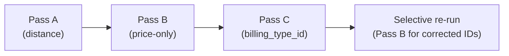

# Plan: Pass C — `billing_type_id` Backfill + Selective Price Re-run

**Single file changed:** [`scripts/backfill-driving-distance.ts`](scripts/backfill-driving-distance.ts)  
**Docs updated:** [`docs/plans/billing-type-backfill-audit.md`](docs/plans/billing-type-backfill-audit.md)

---

## Execution order (full run, no flags)



Pass C runs **after** Pass B because Pass B may have priced corrected trips using the STEP 3 payer-wide fallback (the only rule reachable when `billing_type_id` is null). The selective re-run overwrites those prices with the correct STEP 2 type-level rule. If Pass C ran before Pass B, a subset of these trips would still need re-pricing. Running it after means one selective re-run corrects everything in one shot.

---

## Known gap — bulk-upload creation path

> **Known gap: bulk-upload creation path**
>
> The bulk-upload dialog resolves `billing_type_id` via a
> separate type-name lookup during CSV parsing. This lookup
> can return null when the type name does not match exactly,
> producing new trips with `billing_type_id = null` after
> the backfill is complete.
>
> The correct fix is to derive `billing_type_id` from the
> already-resolved `billing_variant_id` via a JOIN —
> identical to the logic used in Pass C — instead of the
> separate lookup. This makes the creation path consistent
> with the backfill and closes the gap permanently.
>
> This fix is out of scope for Pass C and must be
> implemented in a separate plan targeting
> `bulk-upload-dialog.tsx` only.

---

## 1. CLI flags

Update the three flag constants so `--pass-c` excludes A and B, symmetrically with the existing pattern:

```typescript
const RUN_PASS_A = !process.argv.includes('--pass-b') && !process.argv.includes('--pass-c');
const RUN_PASS_B = !process.argv.includes('--pass-a') && !process.argv.includes('--pass-c');
const RUN_PASS_C = !process.argv.includes('--pass-a') && !process.argv.includes('--pass-b');
```

Default (no flag): all three run in sequence.  
Update the error-exit usage string and the mode banner to include `Pass C`.

---

## 2. New counters (top of `main()`)

```typescript
let totalTypeCorrected  = 0; // trips where billing_type_id was written
let totalTypeCErrors    = 0; // Pass C write errors
let totalCRerunWritten  = 0; // prices written in selective re-run
let totalCRerunUnresolved = 0;
let totalCRerunErrors   = 0;
```

---

## 3. New helper: `runPriceForTripIds`

Extract a self-contained async function (placed before `main()`) that runs price recalculation for an explicit list of trip IDs. This is the selective re-run engine — it also avoids duplicating the full Pass B loop body.

```typescript
async function runPriceForTripIds(
  tripIds: string[],
  supabase: SupabaseClient<Database>,
  emptyCtx: PricingContext
): Promise<{ written: number; unresolved: number; errors: number }> { ... }
```

Internally it processes `tripIds` in slices of `BATCH_SIZE`, fetching each slice with:

```typescript
supabase
  .from('trips')
  .select('id, company_id, payer_id, client_id, billing_type_id, billing_variant_id, driving_distance_km, scheduled_at, kts_document_applies')
  .in('id', batchSlice)
```

For each trip: same `loadPricingContext` + `computeTripPrice` pattern as Pass B main. In dry-run mode, logs the computed values without writing. Always overwrites `net_price / gross_price / tax_rate` (no null-price guard — this is a correction pass).

**Why selective rather than a full re-run:** re-running Pass B in full would re-evaluate all trips that still have null prices company-wide, most of which are already priced correctly. Selective ensures only the `billing_type_id`-corrected trips are touched.

---

## 4. Pass C loop (`if (RUN_PASS_C)` block, placed after existing Pass B block)

**Two-query pattern per batch** (avoids PostgREST join type-inference issues seen previously with `GenericStringError`):

```typescript
// Query 1 — trip IDs with a variant but no type
const { data: tripRows } = await supabase
  .from('trips')
  .select('id, billing_variant_id')
  .not('billing_variant_id', 'is', null)
  .is('billing_type_id', null)
  .not('company_id', 'is', null)
  .eq('company_id', COMPANY_ID)
  .not('id', 'in', `(${processedIdsC.join(',')})`)  // when non-empty
  .order('created_at', { ascending: true })
  .limit(BATCH_SIZE);

// Query 2 — resolve billing_type_id for those variants (single batch)
const variantIds = [...new Set(tripRows.map(r => r.billing_variant_id))];
const { data: variantRows } = await supabase
  .from('billing_variants')
  .select('id, billing_type_id')
  .in('id', variantIds);

// Build lookup map
const variantTypeMap = new Map(variantRows.map(r => [r.id, r.billing_type_id]));
```

**Why `billing_type_id` can be derived unambiguously:** `billing_variants.billing_type_id` is NOT NULL in the DB schema — every variant belongs to exactly one type. No null-check or fallback is needed on the map lookup.

For each trip in the batch:
- `processedIdsC.push(trip.id)` (termination guard)
- Resolve `billingTypeId = variantTypeMap.get(trip.billing_variant_id)`
- Dry-run: log `[dry-run] Would set trip <id> billing_type_id=<value>`, push to `correctedTripIds`, increment `totalTypeCorrected`
- Live: `UPDATE trips SET billing_type_id = ? WHERE id = ?`, push to `correctedTripIds`, increment counters

After the loop terminates (empty result), if `correctedTripIds.length > 0`, call:

```typescript
const rerun = await runPriceForTripIds(correctedTripIds, supabase, emptyCtx);
totalCRerunWritten    += rerun.written;
totalCRerunUnresolved += rerun.unresolved;
totalCRerunErrors     += rerun.errors;
```

---

## 5. Summary block

Extend the existing summary (Pass A and Pass B blocks unchanged):

```
Pass C — billing_type_id backfill
  Trips corrected  : X
  Errors           : X
Pass C → Pass B re-run — price recalculation for corrected trips
  Prices written   : X
  Unresolved       : X
  Errors           : X
```

---

## 6. Docs

- [`docs/plans/billing-type-backfill-audit.md`](docs/plans/billing-type-backfill-audit.md): update status line to "Implemented — Pass C added 2026-04-19".
- Add a "Pass C" row to the backfill section of whichever doc currently describes Pass A/B (audit references `docs/price-calculation-engine.md`).

---

## Build gates

- After each logical step: `bun run build` must exit 0.
- No frontend files touched.
- `RUN_PASS_B` with no `tripIds` argument must behave identically to today — no regression.

---

## Deferred items

| Item | Reason deferred | Owner |
|---|---|---|
| `bulk-upload-dialog.tsx` — derive `billing_type_id` from `billing_variant_id` JOIN instead of separate type-name lookup | Out of scope for backfill script; requires separate audit of bulk-upload CSV parsing flow | Next sprint |
