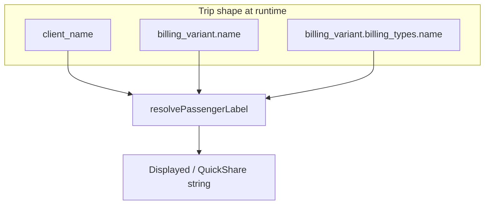

# Passenger name fallback: shared `resolvePassengerLabel`

## Current state (verified)

- [`src/features/trips/lib/share-utils.ts`](src/features/trips/lib/share-utils.ts): `passenger = trip.client_name || 'Anonym'` in `formatTripForSharing`; `copyTripToClipboard` only calls that helper internally.
- [`src/features/overview/components/trip-row.tsx`](src/features/overview/components/trip-row.tsx): `{trip.client_name || 'Unbekannter Kunde'}` (line ~147); calls `copyTripToClipboard(trip)` with `trip: any` (enriched at runtime per audit).
- [`src/features/trips/components/kanban/kanban-trip-card.tsx`](src/features/trips/components/kanban/kanban-trip-card.tsx): exported **`TripCard`** — `{trip.client_name || 'Unbekannter Fahrgast'}` (line ~282); [`KanbanTrip`](src/features/trips/lib/kanban-types.ts) already types `billing_variant` + nested `billing_types`.

**`formatTripForSharing` callers:** only defined/used inside `share-utils.ts`. Real entry points are **`copyTripToClipboard`** in:

- `trip-row.tsx`
- [`src/features/trips/trip-detail-sheet/trip-detail-sheet.tsx`](src/features/trips/trip-detail-sheet/trip-detail-sheet.tsx) (`trip as Trip` — sheet is fed from trip query path that joins billing)
- [`src/features/trips/components/trips-tables/cell-action.tsx`](src/features/trips/components/trips-tables/cell-action.tsx) (`data: Trip` — table rows use `billing_variant` in [`columns.tsx`](src/features/trips/components/trips-tables/columns.tsx); runtime object is enriched)

**Join coverage (no migration/query changes in this task):** [`getUpcomingTrips`](src/features/trips/api/trips.service.ts) already selects `billing_variant` with nested `billing_types(name, color)`, matching the shape your utility needs for names.

**Note:** [`src/features/trips/lib/resolve-passenger-label.ts`](src/features/trips/lib/resolve-passenger-label.ts) is **not** present in the repo today (your git status may have been local-only); implement as **create**.

[`kanban-drag-preview.tsx`](src/features/trips/components/kanban/kanban-drag-preview.tsx): two `trip.client_name || 'Unbekannter Fahrgast'` sites (group slice + single trip).

[`trip-detail-sheet.tsx`](src/features/trips/trip-detail-sheet/trip-detail-sheet.tsx): `SheetTitle` uses `clientDisplayNameFromParts(drafts) || trip.client_name || 'Unbekannter Kunde'` — drafts must stay first (see Fix 2 below).

---

## Files changed

| File | Change |
|------|--------|
| [`src/features/trips/lib/resolve-passenger-label.ts`](src/features/trips/lib/resolve-passenger-label.ts) | **CREATE** — shared resolver |
| [`src/features/trips/lib/share-utils.ts`](src/features/trips/lib/share-utils.ts) | Use `resolvePassengerLabel`; remove `'Anonym'` |
| [`src/features/overview/components/trip-row.tsx`](src/features/overview/components/trip-row.tsx) | Use resolver; remove `'Unbekannter Kunde'` |
| [`src/features/trips/components/kanban/kanban-trip-card.tsx`](src/features/trips/components/kanban/kanban-trip-card.tsx) | Use resolver; remove inline `'Unbekannter Fahrgast'` |
| [`src/features/trips/components/kanban/kanban-drag-preview.tsx`](src/features/trips/components/kanban/kanban-drag-preview.tsx) | Replace **2×** inline fallbacks with `resolvePassengerLabel(trip)` |
| [`src/features/trips/trip-detail-sheet/trip-detail-sheet.tsx`](src/features/trips/trip-detail-sheet/trip-detail-sheet.tsx) | Replace title tail with resolver (see Fix 2) |
| [`docs/plans/passenger-fallback-audit.md`](docs/plans/passenger-fallback-audit.md) | Post-build: status, Resolution, Follow-up, module reference |

**Deferred (out of scope):** [`print-trip-groups-list.tsx`](src/features/trips/components/print-trip-groups-list.tsx) — no edits; listed only under Follow-up in the audit doc.

---

## Implementation

### 1) Add [`src/features/trips/lib/resolve-passenger-label.ts`](src/features/trips/lib/resolve-passenger-label.ts)

- Define and **export** `TripWithBillingContext` (same shape you specified).
- Export pure `resolvePassengerLabel(trip: TripWithBillingContext): string` using `?.trim()` chain and final `'Unbekannter Fahrgast'`.
- **Imports:** none beyond TypeScript (no React/Supabase).
- Add **short “why” comments** only (per your Step 6): authoritative `client_name`; Unterart when passenger not required; Abrechnungsfamilie when Unterart missing; final string for non-empty, consistent German label.

### 2) [`share-utils.ts`](src/features/trips/lib/share-utils.ts)

- `import { resolvePassengerLabel, type TripWithBillingContext } from './resolve-passenger-label'`.
- Replace the passenger line with `resolvePassengerLabel(trip)`.
- Tighten types without touching queries:
  - e.g. `type TripForShare = Trip & TripWithBillingContext` (or equivalent) for `formatTripForSharing` and `copyTripToClipboard`.
  - With nested fields optional on `TripWithBillingContext`, plain `Trip`-typed call sites remain assignable while documenting the enriched shape you expect at runtime.
- **Invariant:** no `'Anonym'` left in this file.

### 3) [`trip-row.tsx`](src/features/overview/components/trip-row.tsx)

- `import { resolvePassengerLabel } from '@/features/trips/lib/resolve-passenger-label'`.
- Replace passenger line with `{resolvePassengerLabel(trip)}`.
- **Invariant:** no `'Unbekannter Kunde'` in this file for that label.

### 4) [`kanban-trip-card.tsx`](src/features/trips/components/kanban/kanban-trip-card.tsx)

- Same import and `{resolvePassengerLabel(trip)}` for the name chip.
- **Invariant:** no inline `'Unbekannter Fahrgast'` there; only in the utility.

### 5) [`kanban-drag-preview.tsx`](src/features/trips/components/kanban/kanban-drag-preview.tsx)

- `import { resolvePassengerLabel } from '@/features/trips/lib/resolve-passenger-label'`.
- Replace **both** `trip.client_name || 'Unbekannter Fahrgast'` with `{resolvePassengerLabel(trip)}`.
- **Invariant:** no inline `'Unbekannter Fahrgast'` in this file.

### 6) [`trip-detail-sheet.tsx`](src/features/trips/trip-detail-sheet/trip-detail-sheet.tsx)

- `import { resolvePassengerLabel } from '@/features/trips/lib/resolve-passenger-label'`.
- **Sheet title:** keep **draft-first** display. Change only the tail of the `SheetTitle` expression:

```tsx
clientDisplayNameFromParts(clientFirstDraft, clientLastDraft) ||
  resolvePassengerLabel(trip)
```

Do **not** replace the whole title with only `resolvePassengerLabel(trip)` — that would drop live draft names before save (behaviour change).

- **Invariant:** no `'Unbekannter Kunde'` in this file.
- Trip payload from the sheet query path already includes `billing_variant` / `billing_types` (no query edits).

### 7) Build gate

Run `bun run build` after code + comments; run again after [`docs/plans/passenger-fallback-audit.md`](docs/plans/passenger-fallback-audit.md) updates.

### 8) Global sanity check (grep)

Search for `'Anonym'`, `'Unbekannter Kunde'`, and `'Unbekannter Fahrgast'` as **passenger-style** fallbacks. Expect **no** hits in wired files; **`resolve-passenger-label.ts`** holds the final `'Unbekannter Fahrgast'` string; [`print-trip-groups-list.tsx`](src/features/trips/components/print-trip-groups-list.tsx) may still contain `'Anonym'` — document under **Follow-up** only (do not edit).

### 9) Docs — `passenger-fallback-audit.md` (after green build)

Hard rule: **only one new code file** — `resolve-passenger-label.ts`.

- Set **implementation status** to done; mark plan **todos** in the audit doc as implemented.
- **Resolution** section must list: resolver path; fallback order (`client_name` → Unterart → Abrechnungsfamilie → `'Unbekannter Fahrgast'`); and every consumer: `share-utils.ts`, `trip-row.tsx`, `kanban-trip-card.tsx`, `kanban-drag-preview.tsx`, `trip-detail-sheet.tsx` (title: drafts `||` resolver).
- **Follow-up:** `print-trip-groups-list.tsx` only (remaining `'Anonym'` / greeting behaviour — deferred).
- **Module reference** (`TripWithBillingContext`, purpose): same audit doc — **no** new standalone `docs/` file for `trips/lib` (keeps “one new file” = the `.ts` utility only).

---

## Hard rules (execution)

1. Do not modify any Supabase query or join.
2. Do not change layout, styling, or non-title rendering logic beyond the string resolution / title OR-chain above.
3. `resolve-passenger-label.ts` is the only **new** file created.
4. `print-trip-groups-list.tsx` stays out of scope.

---

## Out of scope (unchanged)

- [`print-trip-groups-list.tsx`](src/features/trips/components/print-trip-groups-list.tsx) — document only under Follow-up.
- `requirePassenger` behaviour.
- [`payer.types.ts`](src/features/payers/types/payer.types.ts) / [`trips.service.ts`](src/features/trips/api/trips.service.ts) — read-only context; no edits for this resolver.


