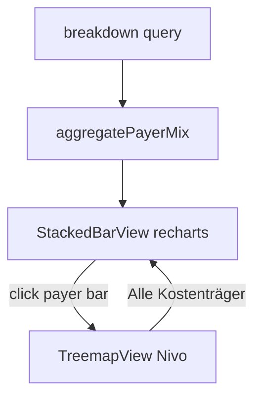

# PayerMixChart — Stacked Bar + Nivo Treemap

## Context

- [`ControllingBreakdownRow`](src/features/controlling/types/controlling.types.ts) already has `payer_id`, `payer_name`, `billing_type_id`, `billing_type_name`, `revenue_net`, `trip_count` (plus variant/driver slice fields).
- Each RPC row is **driver × payer × billing_type × billing_variant** — `aggregatePayerMix` must sum across variant/driver slices when rolling up to billing_type within a payer.
- [`aggregatePayers`](src/features/controlling/lib/controlling-utils.ts) is a flat payer total only; new util is separate (not a tree like [`buildPayerTree`](src/features/controlling/components/PayerBreakdown.tsx)).
- **No `@nivo` packages** in [`package.json`](package.json) today — install required.
- Page order today: `PayerComparisonChart` → `PayerBreakdown`. New chart goes **between** them ([`page.tsx`](src/app/dashboard/controlling/page.tsx) lines 93–97).



---

## Step 1 — Install Nivo (core + treemap only)

```bash
bun add @nivo/core @nivo/treemap
```

Verify only these two appear under `dependencies`. No other `@nivo/*`.

**Build gate:** `bun run build`

---

## Step 2 — Types + `aggregatePayerMix`

### Add to [`controlling.types.ts`](src/features/controlling/types/controlling.types.ts)

Place after `ControllingPayerSummary`:

```ts
export interface ControllingPayerMixItem {
  payer_id: string;
  payer_name: string;
  billing_types: {
    billing_type_id: string;
    billing_type_name: string;
    revenue_net: number;
    trip_count: number;
  }[];
  total_revenue_net: number;
}
```

### Add to [`controlling-utils.ts`](src/features/controlling/lib/controlling-utils.ts)

```ts
export function aggregatePayerMix(
  rows: ControllingBreakdownRow[]
): ControllingPayerMixItem[]
```

**Algorithm:**

1. Outer map keyed by `payer_id ?? '__unknown__'` (name `'Unbekannt'` on first insert).
2. Inner map per payer keyed by `billing_type_id ?? '__untyped__'` (name `'Ohne Typ'` on first insert).
3. For each breakdown row, add `row.revenue_net` and `row.trip_count` to the inner bucket (sums all driver/variant slices).
4. After iteration, for each payer:
   - `billing_types` = inner values **filtered** `revenue_net !== 0`
   - `total_revenue_net` = sum of kept billing type revenues
5. Return payers sorted desc by `total_revenue_net`.

**Why-comment:** null `billing_type_id` → `'Ohne Typ'` so unconfigured billing types remain visible in the mix.

Import `ControllingPayerMixItem` in utils alongside existing breakdown types.

**Build gate:** `bun run build`

---

## Step 3 — `PayerMixChart` component

**New file:** [`src/features/controlling/components/PayerMixChart.tsx`](src/features/controlling/components/PayerMixChart.tsx)

### Props + state

```ts
export interface PayerMixChartProps {
  breakdown: UseQueryResult<ControllingBreakdownRow[]>;
}

const [selectedPayer, setSelectedPayer] =
  useState<ControllingPayerMixItem | null>(null);
```

Optional robustness (not in spec, low risk): reset `selectedPayer` to `null` when `breakdown.data` changes so drill-down does not show stale payer after period switch.

### Data memos

- `payerMix` from `aggregatePayerMix(breakdown.data ?? [])`
- `allBillingTypes` — unique `{ id, name }` across all payers (Map by id)
- `stackedData` — one row per payer: `{ name, payerId, [billingTypeId]: revenue_net }`
- `chartConfig` — dynamic `ChartConfig` from `allBillingTypes`, colors `var(--chart-${(i % 5) + 1})`, keys = billing type ids (matches `ChartContainer` `--color-{key}` CSS vars)
- `treemapData` — when `selectedPayer` set: `{ name, children: [{ name, value, trips }] }`

### View A — Stacked bar (overview, recharts)

Mirror [`PayerComparisonChart`](src/features/controlling/components/PayerComparisonChart.tsx) axis/tooltip patterns:

- `ChartContainer` height **280px**
- `BarChart` + `CartesianGrid` (optional, match payer chart)
- `XAxis dataKey="name"`, `tick={{ fontSize: 12 }}`
- `YAxis tickFormatter={formatEuro}`, `tick={{ className: 'tabular-nums' }}`, `width={80}`
- One `<Bar stackId="mix">` per billing type id:
  - `fill={`var(--color-${id})`}`
  - `radius={[4, 4, 0, 0]}` **only** when `i === allBillingTypes.length - 1` (top stack segment); others `radius={0}`
  - `style={{ cursor: 'pointer' }}`
  - `onClick`: resolve payer via **`payload.payerId`** (not `payer_name` — avoids duplicate-name ambiguity):
    ```ts
    onClick={(_data, _index, e) => {
      const payload = (e as unknown as { payload?: { payerId?: string } })
        ?.payload ?? _data?.payload;
      const payer = payerMix.find((p) => p.payer_id === payload?.payerId);
      if (payer) setSelectedPayer(payer);
    }}
    ```
    (Use Recharts' actual `BarRectangleItem.payload` — verify at implementation time.)
- `ChartTooltip` + `ChartTooltipContent` (default stacked tooltip)
- Inline legend: colored dot + billing type name per `allBillingTypes`
- Helper text: *"Klicken Sie auf einen Balken um die Abrechnungsarten zu sehen."*

### View B — Nivo treemap (drill-down)

```tsx
import { ResponsiveTreeMap } from '@nivo/treemap';
```

- Wrapper: `<div style={{ height: 320 }}>` — **explicit px height** (required by Nivo)
- Props per spec: `identity="name"`, `value="value"`, `valueFormat`, `labelSkipSize={30}`, `orientLabel={false}`, `colors={{ scheme: 'nivo' }}`, borders
- Custom tooltip (RadialBreakdownChart pattern):
  - Payer/billing name, `formatEuro(node.value)` with `tabular-nums`, `{node.data.trips} Fahrten`
- Type `node.data.trips` via narrow cast or treemap child type if TS complains

### Card shell

- Header title/description switch on `selectedPayer`
- Back button when drilled: `ChevronLeft` + "Alle Kostenträger" → `setSelectedPayer(null)`
- Body: `{selectedPayer ? <TreemapView /> : <StackedBarView />}`

### Loading / empty

- Loading: `breakdown.isLoading` → skeleton `h-[320px]`
- Empty: `payerMix.length === 0` → "Keine Kostenträgerdaten im gewählten Zeitraum"

### Top-of-file why-comments (Step 5)

- recharts for stacked bar — dashboard consistency
- Nivo only for treemap — better hierarchy layout / drill UX vs recharts Treemap
- billing variant level deferred — too granular for overview

**Build gate:** `bun run build`

---

## Step 4 — Page wiring

[`page.tsx`](src/app/dashboard/controlling/page.tsx):

```tsx
<PayerComparisonChart breakdown={breakdown} breakdownPrevious={breakdownPrevious} />
<PayerMixChart breakdown={breakdown} />
<PayerBreakdown breakdown={breakdown} />
```

Add import for `PayerMixChart`.

**Build gate:** `bun run build`

---

## Out of scope (hard rules)

- Do **not** modify `PayerComparisonChart`, `DriverRevenueChart`, `PayerBreakdown`, RPCs, migrations, hooks
- Only `@nivo/core` + `@nivo/treemap`
- No `dynamic()` import — component is `'use client'`
- Nivo container: fixed pixel height, not `%` / `h-full`
- `tabular-nums` on formatted euro values in tooltips

## Implementation notes

| Topic | Detail |
|---|---|
| Stacked bar colors | ChartConfig keys must match `Bar dataKey` (billing type ids); fills use `var(--color-{id})` |
| Click handler | Prefer `payerId` from stacked row payload over name lookup |
| Treemap label | If `node.id` shows path, use `node.data.name` or `String(node.id).split('.').pop()` |
| More than 5 billing types | Color wraps `(i % 5) + 1` per spec — legend still lists all types |

## Verification

- [ ] `bun run build` after each step
- [ ] Overview shows stacked bars per payer with legend
- [ ] Click payer bar → treemap for that payer's billing types
- [ ] "Alle Kostenträger" returns to overview
- [ ] Existing controlling sections unchanged
