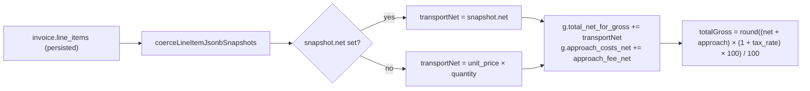

# PDF grouped BRUTTO rounding alignment

## Goal

Make `InvoicePdfSummaryRow.total_costs_gross` (the BRUTTO column on the cover for `grouped`, `single_row`, and `grouped_by_billing_type` layouts) agree with the invoice header total from `calculateInvoiceTotals`. Today the aggregator sums **already-grossed** per-line `total_price` values (each rounded to cents), producing a 6-cent gap on the Bienert 13-trip example (630.76 vs 630.82). The fix sums **net** per group, then taxes once.

## Critical correction vs spec

`frozenPriceResolutionForInsert(item)` cannot be called inside the aggregator — its parameter is `BuilderLineItem`, but `build-invoice-pdf-summary.ts` receives persisted `InvoiceLineItemRow`. The persisted equivalent is the JSONB snapshot field. Use **`price_resolution_snapshot.net`** (parsed via `coerceLineItemJsonbSnapshots`, since PostgREST may deliver it as a string) as the same authoritative tier-aware transport net. Mental model unchanged from the spec ("frozen.net"); only access path differs.



This matches `calculateInvoiceTotals` net-anchor branch (round once per rate bucket) and produces 630.82 € for Bienert.

---

## Step 1 — Route grouping in [`build-invoice-pdf-summary.ts`](src/features/invoices/components/invoice-pdf/lib/build-invoice-pdf-summary.ts)

### 1a. Add `total_net_for_gross` to `RouteGroupAgg`

Insert a new field on the interface (lines 99–117) and initialise to `0` in the `routeGroups[routeKey] = {…}` block (lines 215–227).

### 1b. New per-line transport-net resolver (file-local)

Add a private helper that reads `snapshot.net` defensively (handles PostgREST string), with the documented fallback:

```ts
import { coerceLineItemJsonbSnapshots } from '@/features/invoices/components/invoice-pdf/pdf-column-layout';

function transportNetEurForPdfLineItem(item: InvoiceLineItemRow): number {
  if (item.kts_override) return 0;
  const coerced = coerceLineItemJsonbSnapshots(item);
  const snap = coerced.price_resolution_snapshot as
    | { net?: number | string | null }
    | null
    | undefined;
  const rawNet = snap?.net;
  const snapNet =
    typeof rawNet === 'number'
      ? rawNet
      : typeof rawNet === 'string' && rawNet.trim() !== ''
        ? Number(rawNet)
        : null;
  if (snapNet !== null && Number.isFinite(snapNet)) return snapNet;
  // why: legacy / unresolved rows lack snapshot.net; fall back to columnar transport net
  // (unit_price × quantity). This branch keeps existing behavior for rows that never
  // had a snapshot — it does not regress new rows where snapshot.net is authoritative.
  return (item.unit_price ?? 0) * item.quantity;
}
```

This deliberately does **not** include approach (caller adds it once at the group level). Keep it file-local; don't export.

### 1c. Update accumulation loop (lines ~200–241)

Replace the existing `group.total_gross += lineGrossEurForPdfLineItem(item);` with:

```ts
group.total_net_for_gross += transportNetEurForPdfLineItem(item);
// why: net-first accumulation; tax once at group level matches calculateInvoiceTotals.
```

**Mandatory grep before removing `total_gross`:** Run a workspace-wide search for `total_gross` (and the structurally adjacent `RouteGroupAgg`) under `src/` to confirm no external reader. Specifically:

- `rg "total_gross" src/` → expect hits **only** inside `build-invoice-pdf-summary.ts` and its own tests.
- `rg "RouteGroupAgg" src/` → expect hits **only** inside the same file (it is not exported).

If any external reader exists, **keep `total_gross` on the interface** and compute it from the new net-first formula at the call sites that produce a `RouteGroupAgg`-like object:

```ts
total_gross: Math.round(
  (g.total_net_for_gross + g.approach_costs_net) * (1 + g.tax_rate) * 100
) / 100;
```

Otherwise remove `total_gross: number` from `RouteGroupAgg` and the `group.total_gross += …` line.

### 1d. Rewrite `summaryRowFromAgg` (lines 151–182)

Replace the gross-anchor back-derivation with the net-first formula. **Critical:** the gross multiplication uses the **unrounded** accumulators `g.total_net_for_gross` and `g.approach_costs_net` directly — not the rounded `transportNet` / `approachNet` display values. Same rule as Step 2.

```ts
function summaryRowFromAgg(...) {
  // Display fields — rounded to cents for column rendering.
  const transportNet = Math.round(g.total_net_for_gross * 100) / 100;
  const approachNet = Math.round(g.approach_costs_net * 100) / 100;
  const totalNet = Math.round((transportNet + approachNet) * 100) / 100;
  // Gross — uses RAW (unrounded) accumulators to avoid reintroducing per-line drift.
  const totalGross = Math.round(
    (g.total_net_for_gross + g.approach_costs_net) * (1 + g.tax_rate) * 100
  ) / 100;
  // why: tax-once on group net total mirrors calculateInvoiceTotals; eliminates
  // per-line round-before-sum drift (e.g. 13 × round(48.5245) = 630.76 vs 630.82).
  // why (unrounded inputs): rounding transportNet / approachNet first then taxing
  // would re-introduce a smaller version of the same drift; the displayed rounded
  // values are for the net column only.
  ...
  return {
    ...
    total_price: totalNet,
    quantity: g.count,
    ...
    transport_costs_net: transportNet,
    approach_costs_net: approachNet,
    total_costs_gross: totalGross
  };
}
```

Field name and type for `total_costs_gross` are unchanged — only the value math changes. Drop the obsolete JSDoc block above `summaryRowFromAgg` ("Derive net from gross anchor — do not use g.total_price …") and replace it with a short rationale referencing `calculateInvoiceTotals`.

### 1e. Update file-level JSDoc (lines 1–33)

Replace the "Gross-anchor net display contract" section with a "Net-first contract" paragraph: line transport net comes from `snapshot.net` (with `unit × qty` fallback), approach is summed separately, tax applied once. Keep the route consolidation / trip count / brutto column descriptions; they remain accurate.

---

## Step 2 — `buildInvoicePdfSingleRow` (lines 282–356)

The function has its own accumulation loop (does not delegate to `summaryRowFromAgg`). Replicate Step 1's pattern:

```ts
let totalNetForGross = 0;
let approachNet = 0;
...
for (const item of lineItems) {
  count += 1;
  totalNetForGross += transportNetEurForPdfLineItem(item);
  approachNet += item.approach_fee_net ?? 0;
  ...
}
const transportNet = Math.round(totalNetForGross * 100) / 100;
const approachNetRounded = Math.round(approachNet * 100) / 100;
const totalNet = Math.round((transportNet + approachNetRounded) * 100) / 100;
const totalGross = Math.round(
  (totalNetForGross + approachNet /* unrounded */) * (1 + tax_rate) * 100
) / 100;
```

Use the **unrounded** `totalNetForGross + approachNet` accumulators in the gross multiplication so we don't reintroduce the same per-line drift at the group level. Round only when populating the displayed `transportNet` / `approachNetRounded` / `totalNet` fields and `totalGross`.

Drop the existing `totalGrossAccum += lineGrossEurForPdfLineItem(item)` line and its `totalGross / (1 + tax_rate)` back-derivation.

Update the empty-line-items branch (lines 297–314) only if any field types changed; in this design the same zero-row shape is fine.

---

## Step 3 — `buildInvoicePdfGroupedByBillingType` (lines 389–469)

Same pattern as Step 1 (including the **rounded display vs unrounded gross** rule):

- Add `total_net_for_gross: number` to `BillingTypeAgg` (line 392 interface).
- In the per-line loop, replace `g.total_gross += lineGrossEurForPdfLineItem(item)` with `g.total_net_for_gross += transportNetEurForPdfLineItem(item)`.
- In the `.map((g, i) => …)` block (lines 446–467): compute display fields by rounding `g.total_net_for_gross` / `g.approach_costs_net`; compute `totalGross` from the **unrounded** sums. Drop the gross-anchor back-derivation.
- Apply the same `BillingTypeAgg.total_gross` removal subject to the same mandatory grep guard from Step 1c.

Keep `tax_rate` keying intact (the composite key already prevents mixed-rate buckets, so `× (1 + tax_rate)` once per group is unambiguous).

---

## Step 4 — Tests

### 4a. Existing test parity

Run [`build-invoice-pdf-summary-billing-label.test.ts`](src/features/invoices/components/invoice-pdf/lib/__tests__/build-invoice-pdf-summary-billing-label.test.ts) — assertions on labels / sort order should pass unchanged. If any assertion checks `total_costs_gross` numerically, update fixtures to set `price_resolution_snapshot.net` so the new code path is exercised; otherwise the legacy `unit_price × quantity` fallback is fine and totals stay exact when `unit_price × quantity = net` (qty=1 lines).

### 4b. New test — `tiered_km` parity with header

Add a test (in `build-invoice-pdf-summary.test.ts` or new file) that builds 13 line items with `unit_price = 2.07`, `quantity = 20.1`, `approach_fee_net = 3.80`, `tax_rate = 0.07`, and **`price_resolution_snapshot: { net: 41.55, … }`**. Assert:

- `buildInvoicePdfSummary(invoice).summaryItems[0].total_costs_gross === 630.82`
- `buildInvoicePdfSingleRow(items, 'label').total_costs_gross === 630.82`
- `buildInvoicePdfGroupedByBillingType(items)[0].total_costs_gross === 630.82`
- All three equal `calculateInvoiceTotals(builderItems).total` for the same data — header-PDF parity.
- KTS row (`kts_override: true`) yields `0` everywhere.

### 4c. Legacy fallback test

One row with `price_resolution_snapshot: null`, `unit_price = 50`, `quantity = 1`, `approach_fee_net = 0`, `tax_rate = 0.19` → fallback path → `total_costs_gross === 59.50` and `total_price === 50`.

---

## Step 5 — Docs

1. Update [`docs/plans/pdf-aggregated-line-brutto-audit.md`](docs/plans/pdf-aggregated-line-brutto-audit.md) — add **Status: implemented (2026-05-07)** subsection pointing to this change set; clarify that pre-fix legacy rows without `snapshot.net` keep `unit × qty` fallback.
2. Update [`docs/invoices-module.md`](docs/invoices-module.md) (the paragraph touching `lineNetEurForPdfLineItem` and grouped totals) and [`docs/pricing-engine.md`](docs/pricing-engine.md) net-anchor section: grouped PDF BRUTTO is now net-first (sum line nets, tax once) and equals `calculateInvoiceTotals.total`.
3. Update the file-level JSDoc on [`build-invoice-pdf-summary.ts`](src/features/invoices/components/invoice-pdf/lib/build-invoice-pdf-summary.ts) (Step 1e) and the JSDoc on `lineNetEurForPdfLineItem` in [`invoice-pdf-line-amounts.ts`](src/features/invoices/components/invoice-pdf/lib/invoice-pdf-line-amounts.ts) — note that grouped/single/billing-type aggregation no longer relies on it for the gross anchor (it stays available for legacy callers).

---

## Build gate

After each step: `bun run build` and the relevant `bun test` files. After Step 4 add the new tests and re-run.

---

## Hard rules (carry-over)

- `insertLineItems`, persisted `total_price`, `unit_price`, `quantity` — unchanged.
- `lineNetEurForPdfLineItem` and `lineGrossEurForPdfLineItem` — unchanged (still used by callers outside the cover summaries).
- `calculateInvoiceTotals` — unchanged; serves as reference numerics in tests.
- Gross-anchor `client_price_tag` lines: `snapshot.net` is the all-in tag-as-net (`tagGross / (1 + tax)`); transport net path computes `snap.net + 0` per line, `× (1 + tax_rate)` once → identical numeric result to the per-line `frozen.gross × qty` path because there is no approach for tag rows. No special-case needed unless tests reveal a delta.
- KTS rows: `kts_override === true` ⇒ `transportNetEurForPdfLineItem` returns `0` and `approach_fee_net` is null; group contribution is `0` net + `0` approach ⇒ `0` gross. Verified.
