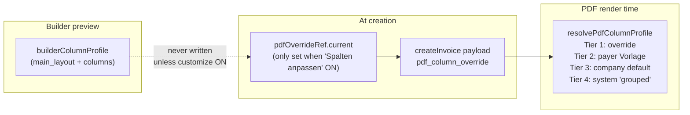

# Fix — Persist Selected Preview Layout to Invoice

## Root Cause Recap




When "Spalten anpassen" is OFF, `pdfOverrideRef.current` is `null`. At render time, `resolvePdfColumnProfile` skips Tier 1 and resolves layout from the payer's Vorlage (or falls back to `'grouped'`). The dispatcher's layout selection is silently discarded.

## Proposed Fix: Full Profile Snapshot (1 file change)

Rather than the 3-change minimal approach (schema relaxation + resolver update + call site), the simpler path is to **always write the complete resolved profile** (`main_columns` + `appendix_columns` + `main_layout`) to `pdf_column_override`. This:

- Satisfies the existing `pdfColumnOverrideSchema` (no schema change needed)
- Requires no change to `resolvePdfColumnProfile` (Tier 1 logic already handles full payloads)
- Additionally freezes the column set at creation time, consistent with the §14 UStG snapshot principle

**Trade-off:** New invoices always have `pdf_column_override` populated. If the payer's Vorlage columns are later updated, existing invoices will not reflect those column changes. This is the correct behavior (invoice is a snapshot), and is consistent with how other frozen fields work (`rechnungsempfaenger_snapshot` etc.).

## Change 1 — `index.tsx`

File: `[src/features/invoices/components/invoice-builder/index.tsx](src/features/invoices/components/invoice-builder/index.tsx)`

Current (line ~726):

```typescript
onConfirm={(step4Values) =>
  createInvoice(step4Values, pdfOverrideRef.current)
}
```

Replace with:

```typescript
onConfirm={(step4Values) => {
  // Always snapshot the full resolved profile (columns + layout) so the invoice
  // renders exactly as the dispatcher saw in the preview (§14 UStG snapshot).
  // When 'Spalten anpassen' is ON, use the user's custom columns;
  // otherwise fall back to the preview's resolved columns from builderColumnProfile.
  const snapshotOverride: PdfColumnOverridePayload = {
    main_columns:
      pdfOverrideRef.current?.main_columns ?? builderColumnProfile.main_columns,
    appendix_columns:
      pdfOverrideRef.current?.appendix_columns ??
      builderColumnProfile.appendix_columns,
    main_layout: builderColumnProfile.main_layout
  };
  createInvoice(step4Values, snapshotOverride);
}}
```

`PdfColumnOverridePayload` is already imported at line 38. No new imports needed.

## What does NOT need to change

- `**pdfColumnOverrideSchema**` — `snapshotOverride` always includes non-empty `main_columns` and `appendix_columns` (sourced from `builderColumnProfile` which is always valid), so the existing schema validates it without modification.
- `**resolvePdfColumnProfile**` — Tier 1 logic (`if (override?.main_columns?.length && override.appendix_columns?.length)`) already correctly picks up `main_layout` from the override when columns are present.
- `**enrich-invoice-detail-column-profile.ts**` — no change needed.
- **DB migration** — `pdf_column_override` is an existing `jsonb` column; writing `main_layout` inside it is already valid.

