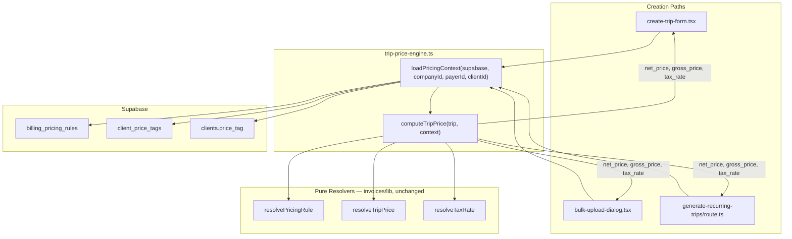

# Phase 1 — Price Calculation Engine: Core Loader & Creation Wiring

## Architecture



## Key constraints

- Pure resolvers in `src/features/invoices/lib/` are **not modified**.
- `listPricingRulesForPayer` and `listClientPriceTagsForClientIds` **cannot be reused** — both call `getSessionCompanyId()` and construct their own browser Supabase client internally. The cron route uses a service-role admin client with no session. `loadPricingContext` must write direct queries against the passed `supabase` parameter.
- `mapBillingPricingRuleRowsToLike` is session-free and exported from [`src/features/invoices/api/invoice-line-items.api.ts`](src/features/invoices/api/invoice-line-items.api.ts) line 198 — import and reuse it.
- `create-trip-form.tsx` has no `values.client_id`. Client IDs live in the `passengers` state array (per-passenger). Step 4 uses the same `(payerId, clientId)` deduplication pattern as Step 5.
- A failed `loadPricingContext` must never block a trip save — always wrap in try/catch with null fallback.

---

## Step 1 — `src/features/trips/lib/trip-price-engine.ts` (new file)

### `loadPricingContext`

Accepts `supabase: SupabaseClient<Database>` so the same function works in browser, server actions, and cron contexts.

Internal query structure (all direct Supabase calls on the passed client):

**Rules** (equivalent logic to `listPricingRulesForPayer`, 3-query chain):
```typescript
// 1a. billing_types for payer
const { data: typeRows } = await supabase
  .from('billing_types').select('id').eq('payer_id', payerId);
const typeIds = (typeRows ?? []).map(r => r.id);

// 1b. billing_variants for those types (skip if typeIds empty)
let variantIds: string[] = [];
if (typeIds.length > 0) {
  const { data: varRows } = await supabase
    .from('billing_variants').select('id').in('billing_type_id', typeIds);
  variantIds = (varRows ?? []).map(r => r.id);
}

// 1c. all rules for company, filter in-memory to payer's catalog
const { data: allRules } = await supabase
  .from('billing_pricing_rules').select('*').eq('company_id', companyId);
const filtered = (allRules ?? []).filter(r =>
  r.payer_id === payerId ||
  (r.billing_type_id && typeIds.includes(r.billing_type_id)) ||
  (r.billing_variant_id && variantIds.includes(r.billing_variant_id))
);
const rules = mapBillingPricingRuleRowsToLike(filtered); // imported from invoice-line-items.api.ts
```

**Client price tags** (run in parallel with rule chain when both payerId and clientId are set):
```typescript
const { data: tagRows } = await supabase
  .from('client_price_tags').select('*')
  .eq('client_id', clientId).eq('is_active', true);
// Apply toNumberGross coercion inline (same logic as mapClientPriceTagRowToLike)
```

**Legacy `clients.price_tag`** (run in parallel with tags):
```typescript
const { data: clientRow } = await supabase
  .from('clients').select('price_tag').eq('id', clientId).maybeSingle();
clientPriceTag = clientRow?.price_tag ?? null;
```

Early returns: `payerId null` → empty rules; `clientId null` → empty tags + null price_tag.

All three fetches run with `Promise.all` where conditions allow (rules chain is sequential internally, but runs in parallel with the two client fetches).

### `computeTripPrice`

Pure synchronous function. No I/O.

```typescript
export function computeTripPrice(
  trip: {
    payer_id: string | null;
    billing_type_id: string | null;
    billing_variant_id: string | null;
    client_id: string | null;
    driving_distance_km: number | null;
    scheduled_at: string | null;
    kts_document_applies: boolean;
    net_price: number | null;
  },
  context: PricingContext
): TripPriceFields
```

Sequence:
1. `payer_id === null` → return `{ net_price: null, gross_price: null, tax_rate: null }` immediately.
2. `resolveTaxRate(trip.driving_distance_km)` → `taxRate`.
3. Build `TripPriceInput` — maps `context.clientPriceTag` into `client: { price_tag }`.
4. `resolvePricingRule({ rules, payerId, billingTypeId, billingVariantId, clientId, clientPriceTags })` → `rule`.
5. `resolveTripPrice(tripInput, taxRate, rule)` → `resolution`.
6. Return `{ net_price: resolution.net, gross_price: resolution.gross, tax_rate: resolution.net !== null ? taxRate : null }`.

Tax rate is stored as null when net price is null (a rate without a price is meaningless).

---

## Step 2 — Unit tests: `src/features/trips/lib/__tests__/trip-price-engine.test.ts`

Tests for `computeTripPrice` only (I/O-free; same fixture patterns as existing `resolve-trip-price.test.ts`):

- No payer → all three null
- KTS override → net=0, gross=0, tax_rate set
- `tiered_km` 15 km → net=11.00, gross=11.77, tax_rate=0.07
- `tiered_km` with null distance → all three null
- Client price tag beats tiered rule (P1 priority)
- `no_price` strategy → all three null
- tax_rate is null whenever net_price is null

---

## Step 3 — Wire `create-trip-form.tsx`

**No `values.client_id` exists.** Use the same `(payerId, clientId)` deduplication pattern as bulk upload.

Location: inside `handleSubmit`, after driving metrics are resolved and before any `tripsService.createTrip` call.

```typescript
// Collect unique (payerId, clientId) pairs across all legs about to be created
const pricingContextMap = new Map<string, PricingContext>();
if (companyId && values.payer_id) {
  // For anonymous mode: clientId = null. For passenger mode: per-passenger clientId.
  const pairs = requirePassenger
    ? [...new Set(passengers.map(p => p.client_id ?? 'null'))]
        .map(cid => ({ clientId: cid === 'null' ? null : cid }))
    : [{ clientId: null }];

  await Promise.all(pairs.map(async ({ clientId }) => {
    const key = `${values.payer_id}:${clientId ?? 'null'}`;
    try {
      const ctx = await loadPricingContext({ supabase, companyId, payerId: values.payer_id, clientId });
      pricingContextMap.set(key, ctx);
    } catch (e) {
      console.error('[trip-price-engine] loadPricingContext failed', e);
    }
  }));
}

const emptyCtx: PricingContext = { rules: [], clientPriceTags: [], clientPriceTag: null };

function getCtx(clientId: string | null): PricingContext {
  return pricingContextMap.get(`${values.payer_id}:${clientId ?? 'null'}`) ?? emptyCtx;
}
```

Then for each trip insert, spread the result:
```typescript
const priceFields = computeTripPrice({ ...outboundBaseTrip, net_price: null }, getCtx(clientId));
const outbound = { ...outboundBaseTrip, ...priceFields };
```

---

## Step 4 — Wire `bulk-upload-dialog.tsx`

Inside `runBulkInsert`, after Pass 0 (geocoding) and before Pass 1 (insert):

```typescript
// Collect unique (payerId, clientId) pairs
const contextKeys = new Map<string, { payerId: string | null; clientId: string | null }>();
for (const row of outboundTrips) {
  const key = `${row.payer_id ?? 'null'}:${row.client_id ?? 'null'}`;
  if (!contextKeys.has(key))
    contextKeys.set(key, { payerId: row.payer_id ?? null, clientId: row.client_id ?? null });
}

// Load all unique contexts in parallel
const contextMap = new Map<string, PricingContext>();
await Promise.all(Array.from(contextKeys.entries()).map(async ([key, params]) => {
  if (!companyId) return;
  try {
    const ctx = await loadPricingContext({ supabase, companyId, ...params });
    contextMap.set(key, ctx);
  } catch (e) { console.error('[trip-price-engine] loadPricingContext failed', key, e); }
}));

const emptyCtx = { rules: [], clientPriceTags: [], clientPriceTag: null };

const pricedOutbound = outboundTrips.map(trip => {
  const key = `${trip.payer_id ?? 'null'}:${trip.client_id ?? 'null'}`;
  const ctx = contextMap.get(key) ?? emptyCtx;
  return { ...trip, ...computeTripPrice(trip, ctx) };
});
```

Return trips use the corresponding outbound's payer/client key (no extra context load needed).

---

## Step 5 — Wire `generate-recurring-trips/route.ts`

`company_id` is NOT available at the top of the route — the cron operates across all tenants. It only becomes known via `client.company_id` after the client row is fetched at line 356. Do NOT attempt to pre-load contexts before the rule loop.

Load context **inside the existing rule loop**, after the client fetch and after both guards, using a `contextMap` for deduplication:

```typescript
// Declared before the rule loop:
const cronContextMap = new Map<string, PricingContext>();
const emptyCtx: PricingContext = { rules: [], clientPriceTags: [], clientPriceTag: null };

// Inside the rule loop, after line 362 (clientError guard) and after line 369 (payer_id guard):
let pricingCtx: PricingContext = emptyCtx;
if (rule.payer_id && client.company_id) {
  const ctxKey = `${client.company_id}:${rule.payer_id}:${client.id}`;
  if (cronContextMap.has(ctxKey)) {
    pricingCtx = cronContextMap.get(ctxKey)!;
  } else {
    try {
      pricingCtx = await loadPricingContext({
        supabase,
        companyId: client.company_id,
        payerId: rule.payer_id,
        clientId: client.id,
      });
      cronContextMap.set(ctxKey, pricingCtx);
    } catch (e) {
      console.error('[trip-price-engine] loadPricingContext failed', ctxKey, e);
    }
  }
}
```

Then inside `buildTripPayload`, spread `computeTripPrice(payload, pricingCtx)` into the returned object. `buildTripPayload` already returns the full `TripInsert` — append the three price fields at the call site:

```typescript
const outboundPayload = await buildTripPayload({ ... });
if (!outboundPayload) continue;
const outboundWithPrice = { ...outboundPayload, ...computeTripPrice(outboundPayload, pricingCtx) };
// pass outboundWithPrice to insertIfAbsent instead of outboundPayload
```

Same pattern for `returnPayload`. No additional DB round-trips per occurrence date.

---

## Step 6 — Docs

- `docs/plans/price-calculation-audit.md`: Mark Phase 1 applied.
- `docs/driving-metrics-api.md`: Note that `net_price`, `gross_price`, `tax_rate` are now set at creation time via `trip-price-engine.ts`.
- Create `docs/price-calculation-engine.md` (does not exist): purpose, `loadPricingContext` contract, `computeTripPrice` contract, P0–P3 waterfall, VAT rules, wired paths, deferred paths.

---

## Files changed

| File | Change |
|---|---|
| [`src/features/trips/lib/trip-price-engine.ts`](src/features/trips/lib/trip-price-engine.ts) | NEW |
| [`src/features/trips/lib/__tests__/trip-price-engine.test.ts`](src/features/trips/lib/__tests__/trip-price-engine.test.ts) | NEW |
| [`src/features/trips/components/create-trip/create-trip-form.tsx`](src/features/trips/components/create-trip/create-trip-form.tsx) | Wire Step 3 |
| [`src/features/trips/components/bulk-upload-dialog.tsx`](src/features/trips/components/bulk-upload-dialog.tsx) | Wire Step 4 |
| [`src/app/api/cron/generate-recurring-trips/route.ts`](src/app/api/cron/generate-recurring-trips/route.ts) | Wire Step 5 |
| [`docs/plans/price-calculation-audit.md`](docs/plans/price-calculation-audit.md) | Phase 1 applied note |
| [`docs/driving-metrics-api.md`](docs/driving-metrics-api.md) | Price fields note |
| `docs/price-calculation-engine.md` | NEW |
