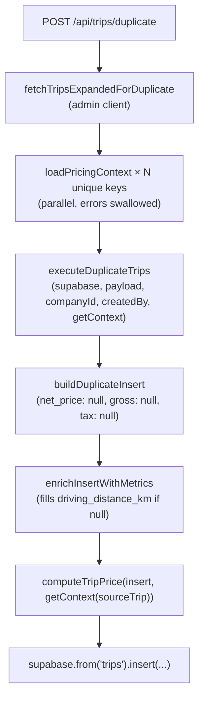

# Phase 2 — Price Recalculation on Trip Duplication

## Architecture



**Key sequencing invariant:** `computeTripPrice` must run *after* `enrichInsertWithMetrics` so `driving_distance_km` is final before tiered-km rules evaluate. This is a deliberate deviation from the spec's suggestion to compute inside `copyRouteAndPassengerFields`.

---

## File Changes

### 1. [`src/features/trips/lib/duplicate-trips.ts`](src/features/trips/lib/duplicate-trips.ts)

**Imports to add:**
```typescript
import { computeTripPrice, type PricingContext } from '@/features/trips/lib/trip-price-engine';
```

**`copyRouteAndPassengerFields`** — null out all three price fields (no signature change needed):
```typescript
// net_price is intentionally null — the source's value is a historical snapshot
// and must not bleed into the P3 fallback of the new trip.
net_price:   null,
gross_price: null,
tax_rate:    null,
```

**`executeDuplicateTrips` signature** — add `getContext` parameter:
```typescript
export async function executeDuplicateTrips(
  supabase: SupabaseClient<Database>,
  payload: DuplicateTripsPayload,
  companyId: string,
  createdBy: string | null,
  getContext: (trip: Trip) => PricingContext,   // NEW
): Promise<DuplicateTripsResult>
```

**After each `enrichInsertWithMetrics` call** (3 sites: single, outbound, return) — add:
```typescript
// Price is recalculated rather than copied: this is a new trip on a new date
// and billing rules may have changed since the source was created.
const priceFields = computeTripPrice(insert, getContext(unit.trip /* or unit.outbound / unit.ret */));
Object.assign(insert, priceFields);
```
(`Object.assign` is valid because `insert` is already a mutable plain object mutated by `enrichInsertWithMetrics`.)

---

### 2. [`src/app/api/trips/duplicate/route.ts`](src/app/api/trips/duplicate/route.ts)

**Imports to add:**
```typescript
import { fetchTripsExpandedForDuplicate } from '@/features/trips/lib/duplicate-trips';
import { loadPricingContext, type PricingContext } from '@/features/trips/lib/trip-price-engine';
```

**After `admin` is created, before `executeDuplicateTrips`:**
```typescript
// Contexts are loaded here at the route boundary (where the admin client lives)
// rather than inside executeDuplicateTrips, keeping I/O at the boundary and
// pure-ish computation inside the lib function.
const includeLinkedLeg = payload.includeLinkedLeg !== false;
const sourceTrips = await fetchTripsExpandedForDuplicate(
  admin, payload.ids, companyId, includeLinkedLeg
);

const contextKeys = new Map<string, { companyId: string; payerId: string | null; clientId: string | null }>();
for (const trip of sourceTrips) {
  const key = `${trip.company_id}:${trip.payer_id ?? 'null'}:${trip.client_id ?? 'null'}`;
  if (!contextKeys.has(key)) {
    contextKeys.set(key, { companyId: trip.company_id!, payerId: trip.payer_id ?? null, clientId: trip.client_id ?? null });
  }
}

const contextMap = new Map<string, PricingContext>();
const emptyCtx: PricingContext = { rules: [], clientPriceTags: [], clientPriceTag: null };
await Promise.all(
  Array.from(contextKeys.entries()).map(async ([key, params]) => {
    try {
      const ctx = await loadPricingContext({ supabase: admin, ...params });
      contextMap.set(key, ctx);
    } catch (e) {
      console.error('[trip-price-engine] loadPricingContext failed in duplicate route', key, e);
    }
  })
);

const getCtx = (trip: { company_id: string | null; payer_id: string | null; client_id: string | null }): PricingContext => {
  const key = `${trip.company_id}:${trip.payer_id ?? 'null'}:${trip.client_id ?? 'null'}`;
  return contextMap.get(key) ?? emptyCtx;
};
```

**`executeDuplicateTrips` call** — pass `getCtx`:
```typescript
const result = await executeDuplicateTrips(admin, payload, companyId, auth.userId, getCtx);
```

Note: `fetchTripsExpandedForDuplicate` is called a second time inside `executeDuplicateTrips`. This is a double-fetch of the same rows. It is acceptable given this is a user-triggered action, not a hot path, and avoids restructuring the entire `executeDuplicateTrips` internals.

---

### 3. [`src/features/trips/lib/__tests__/duplicate-trips.test.ts`](src/features/trips/lib/__tests__/duplicate-trips.test.ts) (create)

Tests do not call `executeDuplicateTrips` (which requires Supabase mocking). They verify the core invariant directly: `computeTripPrice` with `net_price: null` (as the duplication path always provides) behaves correctly.

- **Test 1 — price recalculated, not inherited:** `ComputeTripPriceInput` with `net_price: null` and a tiered_km rule → result is rule-derived price (e.g. 11.00), not the source's 99.99.
- **Test 2 — P3 not polluted by source value:** `net_price: null`, empty context → result is all-null. Passing `net_price: 99.99` with same empty context → result is also all-null (P3 only fires on the value given in input, not on a copied snapshot). This proves nulling the source before computation is the correct isolation.
- **Test 3 — null prices on empty context are acceptable (non-blocking):** `net_price: null`, no payer_id → all-null, no throw.

---

### 4. Docs

- [`docs/plans/price-calculation-audit.md`](docs/plans/price-calculation-audit.md) — add "Phase 2 applied — 2026-04-19" note
- [`docs/price-calculation-engine.md`](docs/price-calculation-engine.md) — move duplicate path from "deferred" to "wired paths"

---

## Build Gates

1. After `duplicate-trips.ts` changes → `bun run build` passes
2. After `route.ts` changes → `bun run build` passes
3. After test file → `bun test` passes (all tests green)