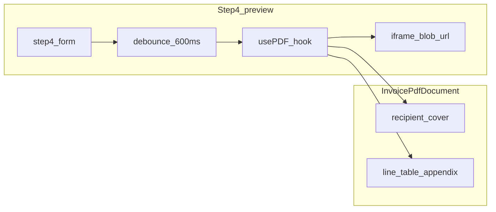

# Phase 5 — PDF enhancement + live preview

Source of truth: [implementation-suggestions/phase5-prompt.md](implementation-suggestions/phase5-prompt.md). Out of scope per prompt: configurable columns (Phase 6), per-payer column UI. **Exception (approved):** add nullable `trip_meta_snapshot` JSONB on `invoice_line_items` — no backfill for legacy rows.

**Company profile for live preview:** Today [new/page.tsx](src/app/dashboard/invoices/new/page.tsx) only loads `default_payment_days, legal_name, tax_id` for the guard. The full `company_profiles` row needed by `InvoicePdfDocument` is **not** in builder state. **Approach:** extend the server page `select` to match [getInvoiceDetail](src/features/invoices/api/invoices.api.ts) profile fields and pass `companyProfile` into [InvoiceBuilder](src/features/invoices/components/invoice-builder/index.tsx) → Step 4 → `buildDraftInvoiceDetailForPdf` — **no extra TanStack query**.

---

## Preconditions (before coding)

- Run `bun run build` and keep it green after each milestone.
- Read [docs/rechnungsempfaenger.md](docs/rechnungsempfaenger.md) § **PDF layout** (dual-block `per_client` vs snapshot-only `monthly` / `single_trip`, legacy payer fallback).
- Read [InvoicePdfDocument.tsx](src/features/invoices/components/invoice-pdf/InvoicePdfDocument.tsx) and [invoice-pdf-cover-header.tsx](src/features/invoices/components/invoice-pdf/invoice-pdf-cover-header.tsx) in full (prompt requirement).
- `**usePDF`**: Confirmed available in `@react-pdf/renderer` **^4.3.2** (`[index.d.ts](node_modules/@react-pdf/renderer/index.d.ts)` exports `usePDF`). Primary approach: debounced `updateDocument(<InvoicePdfDocument … />)`, render `loading` state + `<iframe title=… src={url} />` when `url` is set. Fallback if runtime issues: manual “Vorschau aktualisieren” driving `PDFDownloadLink` or `pdf().toBlob()` (document in completion notes).

---

## Step 1 — PDF recipient block (complete + document)

**Current state:** [InvoicePdfDocument.tsx](src/features/invoices/components/invoice-pdf/InvoicePdfDocument.tsx) already sets `coverRecipient` to client (per_client), else `snapshotWindowRecipient ?? payerWindowRecipient`; [secondaryLegalFromSnapshot](src/features/invoices/components/invoice-pdf/lib/rechnungsempfaenger-pdf.ts) already uses label **„Rechnungsempfänger / Zahlungspflichtiger“**.

**Work:**

- Add the exact inline comment (prompt) at the **two** layout branches where the legal window recipient is chosen (`per_client` vs non–`per_client`), in `InvoicePdfDocument.tsx` and (if recipient composition is clearer there) `invoice-pdf-cover-header.tsx` — text: `// §14 UStG: use frozen snapshot — never read live payer/client data for legal addressee`.
- For `**monthly` / `single_trip`** when `rechnungsempfaenger_snapshot` is null: keep **payer address** fallback ([docs/rechnungsempfaenger.md](docs/rechnungsempfaenger.md)); add `**console.warn`** once per render or once per document build when snapshot is missing (legacy invoice), as specified.
- Re-read snapshot only through existing helpers; add §14 comments at any **new** snapshot read sites if you touch parsing.

---

## Step 2 — PDF line item table (fixed columns)

**Scope:** The fixed column set applies to the **per-trip appendix table** ([invoice-pdf-appendix.tsx](src/features/invoices/components/invoice-pdf/invoice-pdf-appendix.tsx)), not the grouped “Route / Menge” cover table in [invoice-pdf-cover-body.tsx](src/features/invoices/components/invoice-pdf/invoice-pdf-cover-body.tsx) (unless you later choose to align totals wording only).

| Column     | Implementation notes                                                                                                                                                                                                           |
| ---------- | ------------------------------------------------------------------------------------------------------------------------------------------------------------------------------------------------------------------------------ |
| Datum      | `line_date` → `format(..., 'dd.MM.yyyy', { locale: de })` from **date-fns** (prompt: not `toLocaleDateString`).                                                                                                                |
| Fahrgast   | `client_name` (snapshot).                                                                                                                                                                                                      |
| Von / Nach | `pickup_address` / `dropoff_address`, truncate **35** chars (shared small util next to [invoice-pdf-format.ts](src/features/invoices/components/invoice-pdf/lib/invoice-pdf-format.ts)).                                       |
| Strecke    | `distance_km` → `{n} km` only if non-null.                                                                                                                                                                                     |
| Netto      | **Line net**: prefer `price_resolution_snapshot.net` when present, else `unit_price * quantity` (same idea as [priceResolutionFromLineItem](src/features/invoices/components/invoice-pdf/InvoicePdfDocument.tsx) / tiered km). |
| MwSt.      | `formatTaxRate` or `Intl` **7 % / 19 %** per prompt.                                                                                                                                                                           |
| Brutto     | `net * (1 + tax_rate)` with cent rounding; KTS lines **€0,00**.                                                                                                                                                                |
| KTS        | `kts_override` → `✓` / empty; styled note **„Abgerechnet über KTS“** (gray).                                                                                                                                                   |
| Fahrer     | See **Data gap** below.                                                                                                                                                                                                        |
| Hin/Rück   | Map `trips.direction` snapshot to **Hin** / **Rück** / empty.                                                                                                                                                                  |

**KTS styling:** Subtle gray text for money cells + row/note as prompt specifies.

**Layout:** Extend [pdf-styles](src/features/invoices/components/invoice-pdf/pdf-styles.ts) with `StyleSheet.create()` column widths targeting **~535pt** usable width on A4; give Von/Nach more width; KTS / MwSt minimal. Test **10+** rows and page breaks (fixed header already in appendix).

**Trip meta (approved):** Add nullable `**trip_meta_snapshot` JSONB** on `invoice_line_items`, frozen at insert (§14). Shape e.g. `{ driver_name?, direction?: 'hin'|'rueck'|null }` — PDF maps to Fahrer / Hin|Rück. Wire: extend `fetchTripsForBuilder` (`link_type`, `linked_trip_id`, `driver:accounts!trips_driver_id_fkey(name)`), `buildLineItemsFromTrips` → `BuilderLineItem.trip_meta` → `insertLineItems`. **Do not** put trip meta inside `price_resolution_snapshot`.

---

## Step 3 — Live debounced PDF preview in Step 4

**New UI:** In [step-4-confirm.tsx](src/features/invoices/components/invoice-builder/step-4-confirm.tsx) (or a child `InvoiceBuilderPdfPreviewPanel.tsx`):

- **Desktop:** Two columns — existing form | preview (`iframe`/`embed` with blob URL from `usePDF`).
- **Mobile:** Collapse preview behind **„Vorschau anzeigen“** → `Sheet` / `Dialog` with same iframe.
- **Debounce 600ms** on changes: recipient override, payment days, intro/outro template selection, and any prop that affects PDF (line items come from parent state).
- Loading: show **„Vorschau wird aktualisiert…“** while `usePDF` `loading` is true between debounced updates.

**Draft model:** Add a pure builder → `InvoicePdfDocument` adapter (e.g. `buildDraftInvoiceDetailForPdf` in `src/features/invoices/components/invoice-pdf/` or `lib/`):

- Map `BuilderLineItem[]` to `InvoiceLineItemRow`-compatible rows (including `price_resolution_snapshot` for net/KTS/driver/direction).
- Synthetic header: invoice number `**RE-{year}-{month}-XXXX`**, `created_at` = now (or period end), `period_from` / `period_to` from step 2, `mode`, `payment_due_days`, notes from form.
- **Recipient for preview:** When user overrides recipient in Step 4, pass a **synthetic** `rechnungsempfaenger_snapshot` built from the selected catalog row (live), while keeping §14 comments honest: this is **preview-only**; issued PDF uses DB snapshot after create.
- Payer/client: from step 2 + server-passed payers/clients (extend server selects for PDF address fields). **Company profile:** passed from [new/page.tsx](src/app/dashboard/invoices/new/page.tsx) as `companyProfile` (full row for PDF) — see overview.

**QR / logo:** Match existing preview behavior where practical (optional async logo resolve); do not block first paint — preview can omit QR initially if needed.

---

## Step 4 — `buildInvoicePdfSummary` + route keys

- After appendix column changes, re-run mental/manual tests: grouped cover totals must still match sum of line nets.
- **Bug to fix:** [invoice-pdf-appendix.tsx](src/features/invoices/components/invoice-pdf/invoice-pdf-appendix.tsx) builds `routeKey` with **tax_rate** (`… [${item.tax_rate}]`), but [build-invoice-pdf-summary.ts](src/features/invoices/components/invoice-pdf/lib/build-invoice-pdf-summary.ts) uses **address-only** keys. Align appendix lookup with the same keying strategy as `routeDirectionLabels` (and update [build-invoice-pdf-summary.ts](src/features/invoices/components/invoice-pdf/lib/build-invoice-pdf-summary.ts) only if net aggregation must use `price_resolution_snapshot.net` for edge cases — **do not break** legacy invoices).

---

## Standards checklist (from prompt)

- Dates: **date-fns** `dd.MM.yyyy`.
- Money: `**Intl.NumberFormat('de-DE', { style: 'currency', currency: 'EUR' })`** (already centralized in [invoice-pdf-format.ts](src/features/invoices/components/invoice-pdf/lib/invoice-pdf-format.ts) — reuse).
- Styles: **StyleSheet.create** only in PDF components.
- Legacy: null-safe snapshot reads everywhere; missing snapshot + monthly/single_trip → payer fallback + warn.

---

## Database migration (required for full Phase 5)

Apply `[supabase/migrations/20260407120000_invoice_line_items_trip_meta_snapshot.sql](supabase/migrations/20260407120000_invoice_line_items_trip_meta_snapshot.sql)` on every environment:

- Local: `supabase migration up` / `supabase db push` (with project linked as per your setup).
- Verify: `supabase migration list` (or your hosting provider’s migration UI).

**Without the migration:** `insertLineItems` still sends `trip_meta_snapshot` — **creating** new invoices can fail until the column exists.

**Invoice detail / PDF read path:** `[getInvoiceDetail](src/features/invoices/api/invoices.api.ts)` uses `line_items:invoice_line_items(*)` so **viewing existing invoices** does not depend on the new column being present (driver/Hin·Rück PDF cells stay empty until migrated).

---

## Completion deliverable (for the implementing pass)

1. Files created / modified list.
2. Note `usePDF` used (v4.3.2) or fallback.
3. Short description of Step 4 desktop layout + mobile toggle.
4. Confirm legacy null snapshot does not crash.
5. `bun run build` passed.

