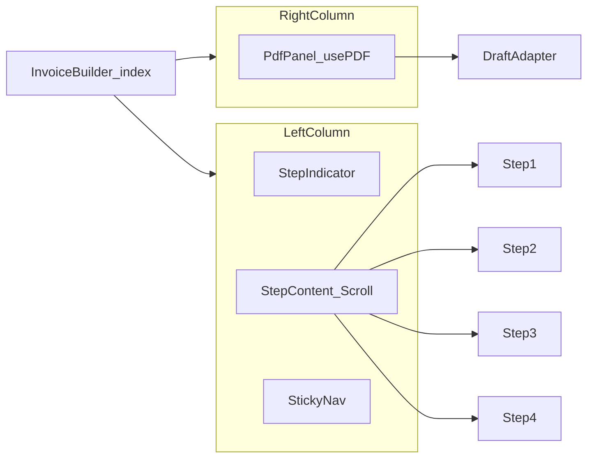

# Phase 5b — Invoice builder shell (layout)

## Documentation (done in this pass)

- [docs/invoices-module.md](docs/invoices-module.md): new **Phase 5 (current)** subsection under the wizard (recipient/appendix/trip meta, `getInvoiceDetail` `invoice_line_items(*)`, builder preview, migration note); PDF table row updated; data-fetching bullet aligned with wildcard select; footer note points at Phase 5b prompt.
- [src/features/invoices/lib/README.md](src/features/invoices/lib/README.md): short **Builder UI & PDF** pointer to shell, preview files, migration, and module doc.

## Goal (from [implementation-suggestions/phase5b-prompt.md](implementation-suggestions/phase5b-prompt.md))

- **Left column (~55%):** vertical step indicator + scrollable step content; **sticky bottom nav** (Zurück / Weiter or Rechnung erstellen on step 4).
- **Right column (~45%, `min-w-[420px]`):** persistent PDF panel. **Steps 1–2:** placeholder only. **From step 3 onward:** when `lineItems.length > 0`, run `buildDraftInvoiceDetailForPdf` and show the same **live** debounced `usePDF` + `InvoicePdfDocument` preview as today on step 4; if step 3 has no line items yet, keep a short placeholder (e.g. “Vorschau nach Auswahl der Fahrten”). **Step 4:** identical live preview (no regression).
- **Out of scope:** No changes to pricing engine, `resolve-trip-price`, DB types, or invoice creation API—**layout and wiring only**.

## Architecture

## New files

| File                                                                                                                                                                       | Role                                                                                                                                                                                                                                                                                                                                                                                                                                                                                                             |
| -------------------------------------------------------------------------------------------------------------------------------------------------------------------------- | ---------------------------------------------------------------------------------------------------------------------------------------------------------------------------------------------------------------------------------------------------------------------------------------------------------------------------------------------------------------------------------------------------------------------------------------------------------------------------------------------------------------- |
| [src/features/invoices/components/invoice-builder/invoice-builder-step-indicator.tsx](src/features/invoices/components/invoice-builder/invoice-builder-step-indicator.tsx) | Vertical list: step number circle, DE label, optional connector; highlight `currentStep`; `steps` config array (reuse labels from current horizontal indicator in [index.tsx](src/features/invoices/components/invoice-builder/index.tsx)).                                                                                                                                                                                                                                                                      |
| [src/features/invoices/components/invoice-builder/invoice-builder-pdf-panel.tsx](src/features/invoices/components/invoice-builder/invoice-builder-pdf-panel.tsx)           | Props: `currentStep`, `hasLineItems` (or derive from `lineItems.length`), `companyProfile`, `pdfDocument` / `pdfUrl` / `pdfLoading` / `pdfError` (mirror [invoice-builder-step4-pdf-preview.tsx](src/features/invoices/components/invoice-builder/invoice-builder-step4-pdf-preview.tsx)). **Steps 1–2:** placeholder. **Step 3+ with `lineItems.length > 0`:** live iframe preview. **Step 3 with empty lines:** placeholder until trips/lines exist. **Step 4:** same live preview as step 3 when lines exist. |

## Refactor [index.tsx](src/features/invoices/components/invoice-builder/index.tsx)

- Replace single-column `max-w-4xl` layout with responsive **flex row** (`flex-col` on small screens if needed): left `flex-1 min-w-0 flex flex-col h-[calc(100vh-…)]` (use same top offset as current dashboard content—match existing page padding), right `w-[45%] min-w-[420px] border-l bg-muted/30`.
- **State lift:** Move `usePDF` + 600 ms debounce + `buildDraftInvoiceDetailForPdf` + `pdfSummary` memo from Step 4 into `index.tsx` (or `useInvoiceBuilderPdfPreview`). **Activation:** pass draft-relevant builder state (same inputs Step 4 uses today) whenever `currentStep >= 3` **and** `lineItems.length > 0`; for steps 1–2 or empty step 3, skip building the PDF document (or pass a no-op) so the panel shows the placeholder only.
- **Sticky nav:** Bottom bar in left column with `sticky bottom-0` / `border-t bg-background` calling existing `goBack` / `goNext` / step-4 submit. Step 4 submit must still run **react-hook-form** `handleSubmit` from [step-4-confirm.tsx](src/features/invoices/components/invoice-builder/step-4-confirm.tsx)—use the `form` attribute on a shell `<Button type="submit" form="invoice-step4-form">` or `useImperativeHandle` / callback ref from Step4 (prefer `form` + `id` on `<form>` in Step4 to avoid imperative API).
- Remove **horizontal** step indicator block from index; replace with `InvoiceBuilderStepIndicator` in the left rail.
- Pass `hideInlineNavigation` (or equivalent) into steps 1–4 so footer buttons are **not duplicated** (prompt’s sticky shell nav requires this; minimal prop + conditional render only).

## Refactor [step-4-confirm.tsx](src/features/invoices/components/invoice-builder/step-4-confirm.tsx)

- Remove the **desktop grid** right column and **mobile Sheet** that embed [invoice-builder-step4-pdf-preview.tsx](src/features/invoices/components/invoice-builder/invoice-builder-step4-pdf-preview.tsx); keep form, tables, and summaries in a single scrollable column.
- Add `id="invoice-step4-form"` (or agreed id) on `<form>` for shell submit button wiring.
- Accept `hideInlineNavigation` and omit bottom button row when true (shell provides Zurück + Rechnung erstellen).

## Steps 1–3 (minimal)

- [step-1-billing-model.tsx](src/features/invoices/components/invoice-builder/step-1-billing-model.tsx), [step-2-recipient.tsx](src/features/invoices/components/invoice-builder/step-2-recipient.tsx), [step-3-line-items.tsx](src/features/invoices/components/invoice-builder/step-3-line-items.tsx): add optional `hideInlineNavigation`; when true, do not render the bottom Zurück/Weiter row (handlers unchanged, still passed from index for shell).

## Optional cleanup

- If [invoice-builder-step4-pdf-preview.tsx](src/features/invoices/components/invoice-builder/invoice-builder-step4-pdf-preview.tsx) is fully superseded by `invoice-builder-pdf-panel.tsx`, **delete** it and import from the new panel only (or keep as thin re-export for one release—prefer delete to avoid drift).

## QA

- `bun run build`
- Manual: steps 1–2 placeholder only; step 3 with selected trips/lines shows live preview (debounced), empty step 3 shows placeholder; step 4 same live preview as step 3 when lines exist; vertical rail + sticky nav; mobile: stack columns or “Vorschau” entry point if current Step 4 mobile pattern must be preserved (match or improve on existing Sheet behaviour).

