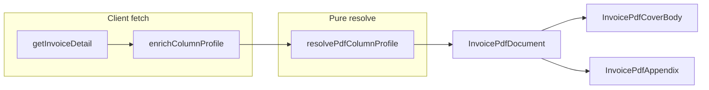

# Phase 6e — Dynamic PDF renderer

## Preconditions from codebase review

- `[invoice-pdf-cover-body.tsx](src/features/invoices/components/invoice-pdf/invoice-pdf-cover-body.tsx)` today uses a **fixed 5-column** grouped table (`#`, Route/Leistung, Menge, MwSt, Betrag) backed by `[InvoicePdfSummaryRow](src/features/invoices/components/invoice-pdf/lib/build-invoice-pdf-summary.ts)` (`descriptionPrimary` / `descriptionSecondary`, `quantity`, `tax_rate`, `total_price`).
- **Decision (backward compatibility):** set `[SYSTEM_DEFAULT_MAIN_COLUMNS](src/features/invoices/lib/pdf-column-catalog.ts)` to exactly `**['position', 'route_leistung', 'quantity', 'tax_rate', 'gross_price']`** so the system fallback matches the **legacy 5-column** grouped cover (`#`, Route/Leistung, Menge, MwSt, Betrag). This requires the new catalog key `route_leistung` + grouped `valueSource` (see §2).
- `[getInvoiceDetail](src/features/invoices/api/invoices.api.ts)` **does not** set `detail.column_profile` today (your note assumed it; we will **not** change this file per constraints). Enrichment should happen **outside** `invoices.api.ts` (recommended: extend `[useInvoiceDetail](src/features/invoices/hooks/use-invoice.ts)` `queryFn` to attach `column_profile` after `getInvoiceDetail`).
- `[build-draft-invoice-detail-for-pdf.ts](src/features/invoices/components/invoice-pdf/build-draft-invoice-detail-for-pdf.ts)` already sets `column_profile` from builder state; **no second positional parameter** is needed—keep the existing params object.
- `[resolve-pdf-column-profile.ts](src/features/invoices/lib/resolve-pdf-column-profile.ts)` must gain `**main_layout`** on the returned `[PdfColumnProfile](src/features/invoices/types/pdf-vorlage.types.ts)` (currently missing). This file is **not** listed as immutable for 6e.

## 1. Types and resolver

- `**[pdf-vorlage.types.ts](src/features/invoices/types/pdf-vorlage.types.ts)**`  
  - Add `main_layout: 'grouped' | 'flat'` to `PdfColumnProfile`.  
  - Extend `**PdfVorlageUpdatePayload**` with optional `main_layout?: 'grouped' | 'flat'` so the settings editor can persist layout.  
  - Optionally extend `pdfColumnOverrideSchema` with **optional** `main_layout` (JSONB tolerates extra keys; no DB migration). If omitted, resolver falls back to `'grouped'`.
- `**[resolve-pdf-column-profile.ts](src/features/invoices/lib/resolve-pdf-column-profile.ts)`**  
  - When building the profile, set `main_layout` from the **winning Vorlage row** (`payerVorlage` / `companyDefaultVorlage`) when those tiers supply columns; if only `invoice_override` wins, use `override.main_layout ?? 'grouped'`; else `'grouped'`.
- `**[pdf-vorlagen.api.ts](src/features/invoices/api/pdf-vorlagen.api.ts)` — allowed minimal change:** in `**updatePdfVorlage`**, include `**main_layout`** in the Supabase `patch` when `payload.main_layout !== undefined` so the Vorlage editor’s grouped/flat toggle **persists to the DB**. This is explicitly in scope (one-line-style addition to the patch object, plus payload typing above).

## 2. Catalog: flags, helpers, legacy parity

- `**[pdf-column-catalog.ts](src/features/invoices/lib/pdf-column-catalog.ts)`** (only the deltas you specified, plus what parity requires)  
  - Add `groupedOnly?: boolean` and `flatOnly?: boolean` to `PdfColumnDef`.  
  - Apply flags per your table (`quantity` → `groupedOnly`; `trip_date`, `driver_name`, `pickup_address`, `dropoff_address`, `distance_km` → `flatOnly`).  
  - **Reconcile `appendixOnly` vs `flatOnly`:** today `pickup_address` / `dropoff_address` are `appendixOnly: true`, which would **exclude** them from `MAIN_FLAT_COLUMNS` under your filter `!appendixOnly && !groupedOnly`. Plan: **remove `appendixOnly` from those two** and rely on `flatOnly` so they appear in appendix pickers (full catalog / appendix list) and in **flat main** pickers, but not grouped main.  
  - Export `MAIN_GROUPED_COLUMNS` and `MAIN_FLAT_COLUMNS` as specified.  
  - **Legacy grouped table:** add **one** new `PdfColumnValueSource` (e.g. `grouped_route_leistung`) **and** catalog key `**route_leistung`** with `format: 'text'`, resolved only via `valueSource` (no `switch(col.key)` in renderers). Implement extraction in `pdf-column-layout.ts` for grouped rows.  
  - Set `**SYSTEM_DEFAULT_MAIN_COLUMNS`** to `**['position', 'route_leistung', 'quantity', 'tax_rate', 'gross_price']`** (intentional; labels/widths from catalog).
- **UI pickers** (`[vorlage-editor-panel.tsx](src/features/invoices/components/pdf-vorlagen/vorlage-editor-panel.tsx)`, `[step-4-vorlage.tsx](src/features/invoices/components/invoice-builder/step-4-vorlage.tsx)`): drive main-page column lists from `MAIN_GROUPED_COLUMNS` vs `MAIN_FLAT_COLUMNS` based on the Vorlage / editor `main_layout` (and builder’s selected layout context). Appendix picker should continue to allow all appendix-relevant keys (likely still `APPENDIX_COLUMNS` / full catalog minus `groupedOnly` if needed).

## 3. New module `[pdf-column-layout.ts](src/features/invoices/components/invoice-pdf/pdf-column-layout.ts)`

Pure functions (no React), importing `**PDF_COLUMN_MAP` / types only from the catalog** (and line-item types from existing invoice types).

- `**getNestedValue(obj, dotPath)`** — one-level nesting as specified.  
- `**renderCellValue(item, col)`** — dispatch **only** on `col.format` and `**col.valueSource`** (for `line_net_eur`, `line_gross_eur`, `trip_direction_pdf`, and the new grouped source). Use existing helpers where allowed without editing forbidden files: e.g. `[formatInvoicePdfEur](src/features/invoices/components/invoice-pdf/lib/invoice-pdf-format.ts)`, `**formatTaxRate`** from `[tax-calculator.ts](src/features/invoices/lib/tax-calculator.ts)` (import only), date-fns `de` for dates. **No `switch(col.key)`.**  
- `**renderGroupedCellValue(summaryRow, col)`** (name as you prefer) — maps `[InvoicePdfSummaryRow](src/features/invoices/components/invoice-pdf/lib/build-invoice-pdf-summary.ts)` + `col.valueSource` / `format` to strings; unknown `dataField` on grouped shape → `"—"`.  
- `**calcColumnWidths(keys, isLandscape)`** — algorithm you specified; constants **515** / **770** usable width; clamp to `minWidthPt`; return `Record<string, number>`.

`**direction` format** already exists in the catalog; handle it inside the format/valueSource dispatch like today’s appendix.

## 4. `[invoice-pdf-cover-body.tsx](src/features/invoices/components/invoice-pdf/invoice-pdf-cover-body.tsx)`

- Add props: `invoice` (or `lineItems` + existing totals inputs), `**columnProfile: PdfColumnProfile`**, and keep letter/totals/payment blocks **unchanged in behavior** (only refactor table region).  
- `**main_layout === 'grouped'`:** keep `**buildInvoicePdfSummary(invoice)`** unchanged; replace hardcoded header/body with loops over `columnProfile.main_columns` + `calcColumnWidths(..., false)` + grouped cell rendering. **Route / Leistung column:** when `col.valueSource` is the grouped route source, the **cell UI must match today’s layout** — **two lines**: primary (`descriptionPrimary` / `routePrimary` styling) and optional secondary (`descriptionSecondary` / `routeSecondary` styling), same visual hierarchy as the current hardcoded route column. Detection is via `valueSource` (or a tiny helper keyed off `valueSource`), **not** `switch(col.key)`.  
- `**main_layout === 'flat'`:** skip `buildInvoicePdfSummary` for the table; one row per `invoice.line_items` with `renderCellValue`.  
- Replace fixed `styles.col*` widths for the **table header/rows** with **inline `width: colWidths[key]`** (pt). Keep non-table styles.

## 5. `[InvoicePdfDocument.tsx](src/features/invoices/components/invoice-pdf/InvoicePdfDocument.tsx)`

- Compute `effectiveProfile = columnProfileProp ?? invoice.column_profile ?? resolvePdfColumnProfile(null, null, null)` once.  
- Pass `columnProfile={effectiveProfile}` into `**InvoicePdfCoverBody**` and `**InvoicePdfAppendix**`.  
- **Second page:** set `Page` `size` to A4 landscape dimensions when `effectiveProfile.appendix_is_landscape` (use `styles.page` vs a landscape page style—may add `pageLandscape` in `[pdf-styles.ts](src/features/invoices/components/invoice-pdf/pdf-styles.ts)` mirroring `page` padding).  
- Remove reliance on static appendix page size where it conflicts with landscape.

## 6. `[invoice-pdf-appendix.tsx](src/features/invoices/components/invoice-pdf/invoice-pdf-appendix.tsx)`

- Props: add `columnProfile: PdfColumnProfile`.  
- Dynamic headers/cells over `columnProfile.appendix_columns`; `calcColumnWidths(appendix_columns, appendix_is_landscape)`; `renderCellValue` only.  
- Drop hardcoded appendix columns and *remove unused `appendixCol` width styles** from `[pdf-styles.ts](src/features/invoices/components/invoice-pdf/pdf-styles.ts)` (keep other styles). Adjust fixed header container if needed for dynamic widths.

## 7. Column profile on fetched invoices (without touching `invoices.api.ts`)

- Add a small helper (e.g. `enrichInvoiceDetailWithColumnProfile(detail: InvoiceDetail): Promise<InvoiceDetail>`) that:  
  - Parses `pdf_column_override` safely (Zod partial / same schema as resolver input).  
  - `Promise.all([ payer pdf_vorlage_id ? getPdfVorlage : null, getDefaultVorlageForCompany(detail.company_id) ])`.  
  - Calls `resolvePdfColumnProfile` and assigns `detail.column_profile`.
- Wire into `[use-invoice.ts](src/features/invoices/hooks/use-invoice.ts)` `useInvoiceDetail` **queryFn** after `getInvoiceDetail`.

## 8. `[storno.ts](src/features/invoices/lib/storno.ts)`

- On storno invoice insert, set `pdf_column_override: originalInvoice.pdf_column_override ?? null` (and ensure `InvoiceRow` typing includes this field—already present on types).

## 9. PDF call sites

- `[use-invoice-builder-pdf-preview.tsx](src/features/invoices/components/invoice-builder/use-invoice-builder-pdf-preview.tsx)` — already passes `columnProfile`; switch to `columnProfile={effective}` if document computes fallback internally, or keep passing explicit profile.  
- `[invoice-detail/index.tsx](src/features/invoices/components/invoice-detail/index.tsx)` / `[invoice-pdf-preview.tsx](src/features/invoices/components/invoice-pdf/invoice-pdf-preview.tsx)` — after hook enrichment, pass `columnProfile={pdfInvoice.column_profile ?? resolvePdfColumnProfile(null,null,null)}` or rely on document fallback only (pick one pattern, avoid duplication).

## 10. Verification

- Manual checklist from your spec + `**bun run build`**.  
- Visual regression focus: **grouped + system default** vs current PDF; appendix portrait (≤7 cols) vs landscape (>7).

## Constraint notes

- **Do not modify** files frozen for 6e: `invoice-line-items.api.ts`, `invoice-validators.ts`, pricing/tax resolver modules, `tax-calculator.ts` (imports only), migrations, `**invoices.api.ts`**.  
- `**pdf-vorlagen.api.ts`:** **Allowed** — add `main_layout` to the `**updatePdfVorlage`** update payload (and `PdfVorlageUpdatePayload`) so the settings Vorlage editor persists grouped/flat. Not a broad refactor; scope is limited to that patch field.

