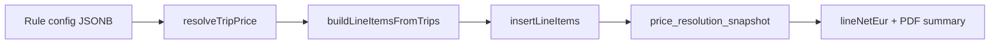

# Phase 8 (6x) — Anfahrtspreis + extended summary + `single_row` layout

## Documentation comments (all steps)

For **every function modified** in this phase, add or update the **JSDoc / inline comment block** to document new behavior. Minimum targets:

- `**resolveTripPrice`** — document the **three-path rule** for `approach_fee_net`: KTS → 0/omit; `client_price_tag` (negotiated tag wins) → undefined; all other strategies → from rule config if present. Include the inline comment block:

```typescript
// client_price_tag is an all-in negotiated gross — approach fee does NOT apply.
// KTS lines are legally €0 — approach fee must be omitted.
// All other strategies: attach approach_fee_net from rule config if present.
```

- `**insertLineItems**` — `// total_price = (unit_price × quantity + approach_fee_net) × (1 + tax_rate)` (or equivalent spelling ×).
- `**lineNetEurForPdfLineItem**` — `// Returns total line net including approach fee. Use column value, not snapshot.net.`
- `**buildInvoicePdfSummary**` — comment **each new accumulator field** (`total_km`, `has_null_km`, `approach_costs_net`, etc.) with its semantics.
- `**buildInvoicePdfSingleRow`** — full **JSDoc**: purpose, parameters, when to use vs grouped.
- `**calculateInvoiceTotals`** — `// Includes approach_fee_net per line — must match insertLineItems formula.`
- `**applyManualUnitNetToResolution**` — `// Manual edit affects base net only. approach_fee_net is preserved as-is from the original resolution.`

## Scope (from prompt)

1. **Anfahrtspreis**: optional net flat fee from billing rule `config`, stored on line items and in `price_resolution_snapshot`, included in `total_price` gross.
2. **Extended `InvoicePdfSummaryRow`**: trip count semantics preserved, add `total_km`, `approach_costs_net`, `transport_costs_net`, `total_costs_gross` (with clear net vs gross rules).
3. `**single_row` `main_layout**`: one aggregated main-table row per invoice using the same summary-row shape as grouped mode.

## Corrections vs prompt text

- **New migration filenames**: use a timestamp **after** `[supabase/migrations/20260408120001_pdf_vorlagen.sql](supabase/migrations/20260408120001_pdf_vorlagen.sql)` (e.g. `20260409120000_...`), not `20260406120000_...`, so Supabase applies migrations in order.
- **Vorlage editor path**: `[src/features/invoices/components/pdf-vorlagen/vorlage-editor-panel.tsx](src/features/invoices/components/pdf-vorlagen/vorlage-editor-panel.tsx)` (prompt’s `src/components/layout/...` is wrong).
- **Column catalog path**: `[src/features/invoices/lib/pdf-column-catalog.ts](src/features/invoices/lib/pdf-column-catalog.ts)` (not under `components/invoice-pdf/`).
- `**InvoiceDetail` has no `subject`**: for `buildInvoicePdfSingleRow` label, derive a string from existing data (e.g. payer name + period from `InvoiceDetail`, or reuse the same subject line builder used on the PDF cover if one exists). Do not reference `invoice.subject`.
- **DB constraint**: extend `pdf_vorlagen.main_layout` `CHECK` to allow `'single_row'` via a **new** migration (alter/drop+add check or equivalent).

## Architecture (data flow)




**Semantic contract (per prompt):**

- `PriceResolution.net` / `gross` = **base transport only** (unchanged from today’s meaning: line net before approach).
- `PriceResolution.approach_fee_net` = optional additive net; **not** included in `net`/`gross`.
- Line **total net** = `(unit_price * quantity) + (approach_fee_net ?? 0)` with `unit_price`/`quantity` representing base transport as today.
- `**total_price` (DB)** = `(base_net_total + approach_fee_net) * (1 + tax_rate)` — update `[insertLineItems](src/features/invoices/api/invoice-line-items.api.ts)` accordingly.

**Design decision — `approach_fee_net` attachment (locked):**

- `**kts_override`**: `approach_fee_net` = **0 / omit** — line must stay €0.
- `**client_price_tag`** (negotiated tag wins — early return in resolver): `approach_fee_net` = **undefined** — the tag is **all-in**; adding Anfahrt would break the agreed flat gross per trip.
- **All other paths** (`tiered_km`, `fixed_below_threshold_then_km`, `time_based`, `manual_trip_price`, `no_price`, `trip_price_fallback`, etc., except the two above): merge `**approach_fee_net` from active rule config** when present (parse safely; no rule → omit/null).

## Implementation steps

### 1. Database — `invoice_line_items.approach_fee_net`

- New migration: `ADD COLUMN approach_fee_net numeric(10,2) DEFAULT NULL` + column comment (as in prompt).
- RLS migration for line items likely unchanged (column inherits table policies).

### 2. Zod + TS config types — shared optional mixin

- `[src/features/invoices/lib/pricing-rule-config.schema.ts](src/features/invoices/lib/pricing-rule-config.schema.ts)`: add `approachFeeSchema`, `.merge()` into `tieredKmConfigSchema`, `fixedBelowThresholdThenKmConfigSchema`, `timeBasedConfigSchema`, and `emptyConfigSchema`; keep `billingPricingRuleUpsertSchema` branches in sync.
- `[src/features/invoices/types/pricing.types.ts](src/features/invoices/types/pricing.types.ts)`: extend `TieredKmConfig`, `FixedBelowThresholdThenKmConfig`, `TimeBasedConfig`, and empty config type with optional `approach_fee_net`; export `ApproachFeeConfig` helper type if useful.

### 3. `PriceResolution`

- `[src/features/invoices/types/pricing.types.ts](src/features/invoices/types/pricing.types.ts)`: add optional `approach_fee_net?: number | null` with the semantics from the prompt (document in JSDoc).

### 4. `resolveTripPrice`

- `[src/features/invoices/lib/resolve-trip-price.ts](src/features/invoices/lib/resolve-trip-price.ts)`: implement the **locked three-path rule** (see **Design decision** above). Use a helper (e.g. `withApproachFee(resolution, rule, context)`) or refactor so **KTS** and `**client_price_tag`** returns never attach a rule approach fee; all other resolutions may attach from parsed `rule.config` when `rule` is active.
- Add the **inline comment block** specified under [Documentation comments (all steps)](#documentation-comments-all-steps).
- `**no_price` / unresolved with fee in config**: still attach `approach_fee_net` from rule per “all other paths”; builder validation handles missing base net.

**After Step 4 is implemented — run tests before Step 5:** see [Step 13 — Verification](#13-verification).

### 5. Builder line + frozen snapshot + totals

- `[src/features/invoices/types/invoice.types.ts](src/features/invoices/types/invoice.types.ts)`: `BuilderLineItem.approach_fee_net`, `InvoiceLineItemRow.approach_fee_net`.
- `[src/features/invoices/api/invoice-line-items.api.ts](src/features/invoices/api/invoice-line-items.api.ts)`:
  - `buildLineItemsFromTrips`: map `approach_fee_net` from `priceResolution`.
  - `insertLineItems`: persist column; update `total_price` formula (prompt).
  - `**calculateInvoiceTotals`**: today sums `unit_price * quantity` only — extend to `**+ (approach_fee_net ?? 0)` per line** so invoice header matches DB line gross logic (and Step 4 confirm stays consistent).
  - `**applyManualUnitNetToResolution`**: preserve existing `approach_fee_net` on the resolution when user edits unit net (manual edit adjusts **base** only). Document with comment per [Documentation comments](#documentation-comments-all-steps).
- `[src/features/invoices/components/invoice-pdf/build-draft-invoice-detail-for-pdf.ts](src/features/invoices/components/invoice-pdf/build-draft-invoice-detail-for-pdf.ts)`: map `approach_fee_net` on draft lines.

### 6. PDF line net aggregation (critical for Step 9)

`[src/features/invoices/components/invoice-pdf/lib/invoice-pdf-line-amounts.ts](src/features/invoices/components/invoice-pdf/lib/invoice-pdf-line-amounts.ts)`: replace the net-line logic so the **primary** path uses **column math**, not `price_resolution_snapshot.net` for the total line net.

**Explicit formula:**

```typescript
// BEFORE (Phase 7 and earlier) — conceptual; legacy code also consulted snapshot.net:
// lineNetEurForPdfLineItem(item) ≈ item.unit_price * item.quantity (or snapshot.net when set)

// AFTER (Phase 8):
// lineNetEurForPdfLineItem(item) =
//   (item.unit_price * item.quantity) + (item.approach_fee_net ?? 0)
```

**Note:** Do **not** use `price_resolution_snapshot.net` as the source for this total — it **excludes** approach fee by design and may be **null** for some strategies. **Always** derive total line net from **column values** (`unit_price`, `quantity`, `approach_fee_net`) (with KTS €0 handling unchanged).

Add the `**lineNetEurForPdfLineItem`** inline comment from [Documentation comments](#documentation-comments-all-steps).

This must match the assumption that `**buildInvoicePdfSummary`’s** net accumulator (field `total_price` on `RouteGroupAgg`) **includes** approach in the per-line sum.

### 7. Extended summary + `single_row`

- `[src/features/invoices/components/invoice-pdf/lib/build-invoice-pdf-summary.ts](src/features/invoices/components/invoice-pdf/lib/build-invoice-pdf-summary.ts)`:
  - Extend `RouteGroupAgg` + loop: `total_km` / `has_null_km`, `approach_costs_net` sum, keep existing `count` and net sum via updated line net helper.
  - Extend `InvoicePdfSummaryRow` with new fields; compute `transport_costs_net = totalNet - approachNet`, `total_costs_gross = totalNet * (1 + tax_rate)` (align rounding with existing PDF money rounding).
  - Add `**buildInvoicePdfSingleRow(lineItems, label)`** collapsing **all** lines into **one** row (no route grouping), same accumulator semantics. Full JSDoc per [Documentation comments](#documentation-comments-all-steps).
- **Label source**: pass a string built in `[invoice-pdf-cover-body.tsx](src/features/invoices/components/invoice-pdf/invoice-pdf-cover-body.tsx)` (e.g. payer + period), not `invoice.subject`.

### 8. `main_layout: 'single_row'`

- New migration: alter `pdf_vorlagen.main_layout` check to include `'single_row'`.
- `[src/features/invoices/types/pdf-vorlage.types.ts](src/features/invoices/types/pdf-vorlage.types.ts)`: extend `MainLayout` union + Zod `mainLayoutSchema`.
- `[src/features/invoices/api/pdf-vorlagen.api.ts](src/features/invoices/api/pdf-vorlagen.api.ts)`: mapping/validation accepts new value.
- `[src/features/invoices/lib/resolve-pdf-column-profile.ts](src/features/invoices/lib/resolve-pdf-column-profile.ts)`: defaults/fallbacks unchanged except type width.
- `[src/features/invoices/components/pdf-vorlagen/vorlage-editor-panel.tsx](src/features/invoices/components/pdf-vorlagen/vorlage-editor-panel.tsx)`: third radio; `**handleMainLayoutChange`**: treat `**single_row` like `grouped**` for column pool (`MAIN_GROUPED_COLUMNS` vs `MAIN_FLAT_COLUMNS`).
- `[src/features/invoices/components/invoice-builder/step-4-vorlage.tsx](src/features/invoices/components/invoice-builder/step-4-vorlage.tsx)`: any layout-dependent pool logic should include `single_row` with grouped.
- `[src/features/invoices/components/invoice-pdf/invoice-pdf-cover-body.tsx](src/features/invoices/components/invoice-pdf/invoice-pdf-cover-body.tsx)`:
  - `isGroupedMode = main_layout !== 'flat'` (so `**single_row` uses grouped rendering path**).
  - Branch data: `grouped` → `buildInvoicePdfSummary`, `single_row` → `[buildInvoicePdfSingleRow(...)]`, `flat` → line items.

### 9. PDF column catalog + formats

- `[src/features/invoices/lib/pdf-column-catalog.ts](src/features/invoices/lib/pdf-column-catalog.ts)`: add keys from prompt (`trip_count`, `total_km`, `approach_costs`, `transport_costs`, `total_net`, `total_gross`, `approach_fee_line`), German `description` strings, flags (`groupedOnly` / `flatOnly`) per prompt.
- Update `**SYSTEM_DEFAULT_*` / `MAIN_GROUPED`** (and appendix defaults if prompt requires) conservatively so existing Vorlagen do not break; optional new columns are user-selected in editor.
- `[src/features/invoices/components/invoice-pdf/pdf-column-layout.ts](src/features/invoices/components/invoice-pdf/pdf-column-layout.ts)`: confirm `km` format exists (it does today); extend if grouped renderer needs edge cases for `null` `total_km` → `—`.

### 10. Admin UI — billing rule + builder step 3

- `[src/features/payers/components/pricing-rule-dialog.tsx](src/features/payers/components/pricing-rule-dialog.tsx)`: add optional numeric input bound to `config.approach_fee_net` for all strategies (or a single shared field in the dialog footer), included in `defaultValues` + `safeParse` payload.
- `[src/features/invoices/components/invoice-builder/step-3-line-items.tsx](src/features/invoices/components/invoice-builder/step-3-line-items.tsx)`: display-only badge when `approach_fee_net > 0`.

### 11. Storno + snapshot negation

- `[src/features/invoices/lib/storno.ts](src/features/invoices/lib/storno.ts)`: include `**approach_fee_net**` on mirrored inserts (negate like other money fields); extend `negatePriceResolutionSnapshot` to negate `**approach_fee_net**` when present.

### 12. Docs (mandatory)

Complete the `**docs-update**` todo. Split content across files as needed.

`**[docs/pricing-engine.md](docs/pricing-engine.md)**` — add `## Anfahrtspreis (Approach Fee)`:

- What it is: flat per-trip **net** add-on, `billing_pricing_rules.config.approach_fee_net`.
- **Which strategies it applies to**: all except `**client_price_tag`** (all-in gross) and `**kts_override**` (€0).
- **Price math:** `total_net = base_net + approach_fee_net`, `total_gross = total_net × (1 + tax_rate)`.
- **Where stored:** `invoice_line_items.approach_fee_net` + `price_resolution_snapshot.approach_fee_net`.
- **Invariant:** `PriceResolution.net` = **base transport only** (never includes approach).

`**[docs/invoices-module.md](docs/invoices-module.md)`** — in the Phase 6 / PDF area, add `#### Phase 8 — Anfahrtspreis + Extended Summary`:

- `**single_row**`: third `main_layout` option — all trips collapsed to **one** summary row.
- **New `InvoicePdfSummaryRow` fields:** `total_km`, `approach_costs_net`, `transport_costs_net`, `total_costs_gross`.
- **New grouped-mode catalog columns:** `trip_count`, `total_km`, `approach_costs`, `transport_costs`, `total_net`, `total_gross` (plus flat `approach_fee_line` where applicable per catalog).

`**[docs/anfahrtspreis.md](docs/anfahrtspreis.md)`** (create if `pricing-engine.md` section would be too long): follow the style of `[docs/no-invoice-required.md](docs/no-invoice-required.md)` — focused single-feature doc: definition, supported rule strategies, price math, `**client_price_tag**` exception, **KTS** exception, builder Step 3 badge, PDF column keys, links to resolver + line item columns.

### 13. Verification

**Test workflow (existing tests first):**

1. **Immediately after Step 4 (`resolveTripPrice`) is implemented**, run:
  `bun test src/features/invoices/lib/__tests__/`
2. **Before writing new tests**, fix failures in `**resolve-trip-price.test.ts`** and `**line-item-net-display.test.ts**` (and any other failing files in that folder) caused by the new `approach_fee_net` field on `PriceResolution` / changed expectations.
3. Only then proceed to Step 5+ and add **new** test cases as needed.

**Then:**

- `bun run build`
- Manual checks from prompt: rule with `approach_fee_net: 5`, null fee unchanged behavior, grouped aggregates, `single_row` single row, PDF columns in Vorlage editor.

**New automated / manual test case:**

- Rule has `**approach_fee_net: 5.00`** and strategy is `**client_price_tag**`, but the trip resolves via **negotiated `price_tag`** (P1 wins): `**approach_fee_net` is undefined** on the resolution; `**total_price`** (and line totals) match **pre–Phase-8** behavior for the same tag (no +5 on top).

## Risk / test notes

- **Invoice create path**: ensure any code that recomputes invoice `subtotal`/`tax_amount`/`total` from line items uses the updated net basis (likely `calculateInvoiceTotals` + insert invoice RPC path — grep `calculateInvoiceTotals` / invoice create).
- `**lineNetEurForPdfLineItem`**: if **not** updated to `(unit_price × quantity) + (approach_fee_net ?? 0)`, then `**transport_costs_net = totalNet - approachNet`** in `buildInvoicePdfSummary` will be **wrong**: DB `**total_price`** includes approach, but the **group net accumulator** would not — splits and gross rollup diverge.
- **Unit tests**: after fixing existing tests post–Step 4, add/adjust cases for approach merging (tag vs non-tag, KTS), and `line-item-net-display` if it assumes old net math.

