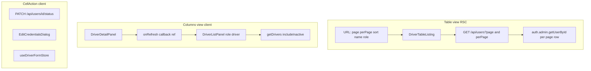

# Plan B — Phase 1: Unified Roster Data Layer + Actions

**Prerequisite (done):** [`20260521224017_make_update_driver_role_aware.sql`](supabase/migrations/20260521224017_make_update_driver_role_aware.sql) — `update_driver()` skips profile upsert for admins; production verified per [`docs/plans/update-driver-rpc-audit.md`](docs/plans/update-driver-rpc-audit.md).

**Scope boundary:** No route rename, nav changes, or `user-management` folder deletion. [`/dashboard/drivers`](src/app/dashboard/drivers/page.tsx) remains the entry point. Phase 2 handles mount on `/dashboard/users`, redirect, and hook relocation.

---

## Read first (before any code)

Read these files **completely** before writing a single line:

1. [`src/features/driver-management/api/drivers.service.ts`](src/features/driver-management/api/drivers.service.ts)
2. [`src/features/driver-management/components/driver-table-listing.tsx`](src/features/driver-management/components/driver-table-listing.tsx)
3. [`src/features/driver-management/components/drivers-table/columns.tsx`](src/features/driver-management/components/drivers-table/columns.tsx)
4. [`src/features/driver-management/components/drivers-table/index.tsx`](src/features/driver-management/components/drivers-table/index.tsx)
5. [`src/features/driver-management/components/drivers-table/cell-action.tsx`](src/features/driver-management/components/drivers-table/cell-action.tsx)
6. [`src/features/driver-management/components/driver-list-panel.tsx`](src/features/driver-management/components/driver-list-panel.tsx)
7. [`src/features/driver-management/components/driver-detail-panel.tsx`](src/features/driver-management/components/driver-detail-panel.tsx)
8. [`src/features/driver-management/components/drivers-column-view.tsx`](src/features/driver-management/components/drivers-column-view.tsx)
9. [`src/features/driver-management/components/driver-form-body.tsx`](src/features/driver-management/components/driver-form-body.tsx)
10. [`src/features/driver-management/components/driver-form.tsx`](src/features/driver-management/components/driver-form.tsx)
11. [`src/features/driver-management/types.ts`](src/features/driver-management/types.ts)
12. [`src/app/api/drivers/[id]/route.ts`](src/app/api/drivers/[id]/route.ts)
13. [`src/app/api/users/route.ts`](src/app/api/users/route.ts)
14. [`src/app/api/users/[id]/status/route.ts`](src/app/api/users/[id]/status/route.ts)
15. [`src/app/api/users/[id]/credentials/route.ts`](src/app/api/users/[id]/credentials/route.ts)
16. [`src/features/user-management/components/edit-credentials-dialog.tsx`](src/features/user-management/components/edit-credentials-dialog.tsx)
17. [`src/features/user-management/api/users.service.ts`](src/features/user-management/api/users.service.ts)
18. [`src/features/user-management/types.ts`](src/features/user-management/types.ts)
19. [`src/query/keys/users.ts`](src/query/keys/users.ts)
20. [`src/query/keys/reference.ts`](src/query/keys/reference.ts)
21. [`src/lib/searchparams.ts`](src/lib/searchparams.ts)
22. [`src/app/dashboard/drivers/page.tsx`](src/app/dashboard/drivers/page.tsx)
23. [`docs/plans/approach-b-audit.md`](docs/plans/approach-b-audit.md)
24. [`docs/plans/update-driver-rpc-audit.md`](docs/plans/update-driver-rpc-audit.md)
25. [`src/lib/supabase/server.ts`](src/lib/supabase/server.ts) — **required before Step 4 fetch**; canonical `await cookies()` + `cookieStore.getAll()` pattern in this repo



---

## Step 1 — Search params + `drivers.service` role filter

### [`src/lib/searchparams.ts`](src/lib/searchparams.ts)

Add to `searchParams` object (same pattern as `view` / `status`):

```ts
role: parseAsString.withDefault('all'),
```

Valid values at runtime: `'all' | 'driver' | 'admin'`. No enum parser — unknown values mean **no** `.eq('role', …)` filter (same as `'all'`).

[`src/app/dashboard/drivers/page.tsx`](src/app/dashboard/drivers/page.tsx) already calls `searchParamsCache.parse(searchParams)` — no page change needed once `role` is in the cache.

### [`src/features/driver-management/api/drivers.service.ts`](src/features/driver-management/api/drivers.service.ts)

- Extend `GetDriversFilters` with `role?: 'driver' | 'admin' | 'all'`.
- Replace unconditional `.eq('role', 'driver')` (line 39) with:

```ts
if (filters?.role && filters.role !== 'all') {
  query = query.eq('role', filters.role);
}
```

- Update module/`getDrivers` JSDoc from “accounts with role='driver'” to “company accounts (all roles when unfiltered)”.
- Add `@deprecated` on `deactivateDriver` pointing to `PATCH /api/users/[id]/status` — **do not delete** (Phase 2 cleanup).

**Build gate:** `bun run build`. No UI changes in this step.

---

## Step 2 — Gate driver-only form fields (before admin rows appear in listing)

**Order is mandatory** per your spec: complete this before Step 3 exposes admin rows in the table.

### [`src/features/driver-management/components/driver-form-body.tsx`](src/features/driver-management/components/driver-form-body.tsx)

After hooks, add:

```ts
const watchedRole = form.watch('role');
```

Wrap in `{watchedRole !== 'admin' && ( ... )}`:

- `license_number` field block
- `default_vehicle_id` field block
- Entire **Adresse** section (heading + `street`, `street_number`, `zip_code`, `city`, lat/lng via `AddressAutocomplete`)

**Zod schema diff:** Current [`driverFormSchema`](src/features/driver-management/components/driver-form-body.tsx) (lines 48–72) already marks profile/address fields as **optional** (no `.min(1)`). The only `.refine` is display-name on `first_name`/`last_name`/`name` — unchanged for admins. **No schema change required** unless you want explicit documentation; submission for admins may still send null profile fields in PATCH body (Plan A RPC ignores them).

### [`src/features/driver-management/components/driver-form.tsx`](src/features/driver-management/components/driver-form.tsx)

Replace hardcoded titles (lines 38–40) using store `driver` for edit mode:

```ts
const entityLabel =
  mode === 'create'
    ? 'Neuer Fahrer' // Phase 2 copy pass; create default role stays driver
    : driver?.role === 'admin'
      ? 'Admin'
      : 'Fahrer';
// create: `Neuer ${watchedRole === 'admin' ? 'Admin' : 'Fahrer'}` if create role select is used before open
```

Practical pattern from spec: read `driver?.role` in edit; for create use `form` watch via optional prop or default “Fahrer” until Phase 2 copy pass. Minimum: edit title `${entityLabel} bearbeiten`, create `Neuer Fahrer` (Phase 2 defers full create copy).

**Build gate:** `bun run build`.

---

## Step 3 — Extend `GET /api/users` (paginated roster + live email)

### [`src/app/api/users/route.ts`](src/app/api/users/route.ts)

**Preserve legacy behavior:** When `page` and `perPage` are **absent**, return the existing **flat `CompanyUser[]`** (unchanged shape for [`useUsers`](src/features/user-management/api/users.service.ts) on `/dashboard/users`).

**New path** when **both** `page` and `perPage` are present (read from `request.nextUrl.searchParams`):

| Param | Behavior |
| --- | --- |
| `page`, `perPage` | Required to activate paginated mode; `range((page-1)*perPage, page*perPage-1)` |
| `role` | `'all'` or absent → no filter; `'driver'` / `'admin'` → `.eq('role', role)` |
| `search` or `name` | Same `.or()` ilike as [`driver-table-listing.tsx`](src/features/driver-management/components/driver-table-listing.tsx) on name/first/last/email |
| `sort` | Parse with [`getSortingStateParser`](src/lib/parsers.ts) server-side; whitelist same columns as listing (`name`, `first_name`, `last_name`, `email`, `role`, `phone`, `is_active`, `company_id`) |

Implementation flow:

1. `requireAdmin()` → `company_id` filter on `accounts` (session client, RLS).
2. `select(..., { count: 'exact' })` with filters/sort/range.
3. For **current page rows only**, `createAdminClient().auth.admin.getUserById(id)` merge (same as today, bounded by page size).
4. Return JSON (paginated mode only):

```ts
{ data: CompanyUser[]; totalItems: number }
```

Use Supabase `count` for `totalItems` — **same field name as [`DriverTable`](src/features/driver-management/components/drivers-table/index.tsx) prop** so Step 4 passes through without renaming (`totalItems` today comes from `count ?? 0` in [`driver-table-listing.tsx`](src/features/driver-management/components/driver-table-listing.tsx) line 78–80).

On error, return `{ error: string }` with appropriate status.

**Note:** Search on live email cannot filter in SQL; keep search on `accounts` columns only (matches current table behavior).

---

## Step 4 — Wire table listing to paginated API + live email

### [`src/features/driver-management/components/driver-table-listing.tsx`](src/features/driver-management/components/driver-table-listing.tsx)

- Remove direct `createClient()` Supabase query and `.eq('role', 'driver')`.
- Read `role` from `searchParamsCache.get('role') ?? 'all'`.
- Server `fetch` to the **same Next.js origin** Route Handler with **explicit session cookie forwarding** (RSC → `fetch('/api/...')` does **not** forward cookies automatically; without this, `requireAdmin()` returns 401 and the table fails silently).

**Before writing the `fetch` call:** Read [`src/lib/supabase/server.ts`](src/lib/supabase/server.ts) in full. Copy its **exact** cookie access — `const cookieStore = await cookies()` and `cookieStore.getAll()` (lines 18–25 today). There is **no** existing `fetch(..., { headers: { Cookie: ... } })` call site in the repo; do **not** guess `cookies().toString()` or invent a different API.

**Serialize cookies for `fetch`:** After reading `server.ts`, build the request `Cookie` header from the same `getAll()` return value, e.g.:

```ts
cookieStore.getAll().map((c) => `${c.name}=${c.value}`).join('; ')
```

Only use a serialization shape that matches what `RequestCookies.getAll()` returns in this Next.js version (confirm types/fields when reading the file).

**Base URL:** There is **no** `NEXT_PUBLIC_APP_URL` in the repo — use a **relative** `/api/users?…` URL (same Next.js origin).

```ts
import { cookies } from 'next/headers';

const cookieStore = await cookies(); // same as server.ts
const params = new URLSearchParams({ /* page, perPage, sort, name/search, role */ });

const res = await fetch(`/api/users?${params}`, {
  cache: 'no-store',
  headers: {
    Cookie: cookieStore.getAll().map((c) => `${c.name}=${c.value}`).join('; ')
  }
});
```

If `!res.ok`, throw with API error body (surface 401 clearly in dev).

- Parse JSON: `{ data, totalItems }` — pass **directly** to `<DriverTable data={data} totalItems={totalItems} />` (no `total` → `totalItems` rename).
- Cast `data` to `DriverWithProfile[]` as today.
- Update error message to neutral “Benutzer” / “Konten” wording (optional, minimal).

**Build gate:** `bun run build`. Manually verify table at `/dashboard/drivers?view=table` shows admins when `role=all`.

**Auth smoke-test (required):** Logged-in admin → table loads rows (not empty error / 401) — see verification checklist.

---

## Step 5 — `CellAction`: status API, credentials, self-guard, reactivate

### [`src/features/driver-management/components/drivers-table/cell-action.tsx`](src/features/driver-management/components/drivers-table/cell-action.tsx)

Mirror patterns from [`users-table.tsx`](src/features/user-management/components/users-table.tsx):

| Action | Implementation |
| --- | --- |
| **Bearbeiten** | Unchanged — `useDriverFormStore.openForEdit` |
| **Zugangsdaten** | `EditCredentialsDialog` + `useUpdateCredentials` from [`user-management`](src/features/user-management/) (import OK in Phase 1; relocate in Phase 2). Map row → `CompanyUser`: `{ id, name, first_name, last_name, email, role, is_active, created_at: null, phone }` — use live `email` from listing once Step 4 ships. |
| **Deaktivieren / Reaktivieren** | `useUpdateStatus` → `PATCH /api/users/[id]/status` with `{ is_active: false \| true }`. Show **Reaktivieren** when `!data.is_active`. |
| **Self-guard** | Resolve `currentUserId` via `createClient().auth.getUser()` (same as UsersTable) — hide deactivate/reactivate for `data.id === currentUserId`. API also blocks self ([`status/route.ts`](src/app/api/users/[id]/status/route.ts) lines 41–45). |

- Remove `driversService.deactivateDriver` usage.
- On status/credentials success: `router.refresh()` (RSC table) **and** keep `useUpdateStatus` invalidations (`userKeys.list()`, `referenceKeys.drivers()`).
- Neutralize toast/modal copy where trivial (“Benutzer” vs “Fahrer”) — full i18n pass deferred to Phase 2.

**Build gate:** `bun run build`.

---

## Step 6 — Role toolbar on table view

### [`src/features/driver-management/components/drivers-table/index.tsx`](src/features/driver-management/components/drivers-table/index.tsx)

Add a **client** role filter control as `children` of [`DataTableToolbar`](src/components/ui/table/data-table-toolbar.tsx) (do **not** rely on column `meta.variant` — driver columns lack it per [approach-b-audit](docs/plans/approach-b-audit.md)).

Pattern: match [`DriversViewToggle`](src/features/driver-management/components/drivers-view-toggle.tsx) — bordered button group + `useQueryState('role', parseAsString.withDefault('all').withOptions({ shallow: false }))`.

Segments: **Alle** (`all`) | **Fahrer** (`driver`) | **Admins** (`admin`). On change, reset `page` to 1 (nuqs setter or companion `useQueryState('page')`).

Extract small `RosterRoleFilter` component in same folder if it keeps `index.tsx` readable.

**Build gate:** `bun run build`.

---

## Step 7 — Replace `window.__refreshDriverList` with callback ref

### [`src/features/driver-management/components/drivers-column-view.tsx`](src/features/driver-management/components/drivers-column-view.tsx)

- Hold `const listRefreshRef = useRef<(() => void) | null>(null)`.
- Pass `onRegisterRefresh={(fn) => { listRefreshRef.current = fn }}` to `DriverListPanel`.
- Pass `onRefresh={() => listRefreshRef.current?.()}` to `DriverDetailPanel`.

### [`src/features/driver-management/components/driver-list-panel.tsx`](src/features/driver-management/components/driver-list-panel.tsx)

- Add props: `onRegisterRefresh?: (refresh: () => void) => void`.
- In `useEffect`, call `onRegisterRefresh?.(() => fetchDrivers(debouncedSearch))` when `fetchDrivers` / `debouncedSearch` change.
- **Delete** `window.__refreshDriverList` assign/delete (lines 69–74).
- **`getDrivers` must pass `role: 'driver'`** explicitly so column view stays driver-only while table shows all roles.

### [`src/features/driver-management/components/driver-detail-panel.tsx`](src/features/driver-management/components/driver-detail-panel.tsx)

- Add `onRefresh?: () => void`.
- Replace `(window as any).__refreshDriverList()` in `handleSuccess` with `onRefresh?.()`.

**Build gate:** `bun run build`. Smoke-test columns: create driver → list refreshes without global.

---

## Step 8 — Types constant (small)

### [`src/features/driver-management/types.ts`](src/features/driver-management/types.ts)

Add shared constants for filters/forms:

```ts
export const ACCOUNT_ROLES = ['driver', 'admin'] as const;
export type AccountRole = (typeof ACCOUNT_ROLES)[number];
export type RosterRoleFilter = AccountRole | 'all';
```

Use in service filters and toolbar where helpful.

---

## Verification checklist (Phase 1 complete)

| Check | Expected |
| --- | --- |
| **RSC fetch auth** | Table loads correctly when logged in as admin (not 401 from Route Handler — confirms cookie forwarding works) |
| Table `role=all` | Drivers + admins visible; live email column |
| Table `role=admin` | Only admins; edit sheet hides license/vehicle/address |
| Deactivate driver | `is_active` false + cannot sign in (ban) |
| Reactivate | Menu item on inactive rows |
| Self row | No deactivate on current user |
| Credentials dialog | Opens; PATCH credentials works; table refreshes |
| Columns view | Still drivers only; list refresh after create |
| `/dashboard/users` | Unchanged thin table still works (`GET /api/users` without page params) |

---

## Explicitly deferred to Phase 2

- Route `/dashboard/users` hosts unified roster; redirect `/dashboard/drivers`
- Remove “Fahrer” nav; delete `UsersTable` / thin wrappers
- Move `EditCredentialsDialog`, `useUpdateCredentials`, `useUpdateStatus` into `driver-management` or shared module
- Copy pass (“Neuer Fahrer”, column placeholders, page title)
- Remove deprecated `deactivateDriver`
- Optional: column view all-roles + live email (not in Phase 1 file list)

---

## Risk notes

| Risk | Mitigation |
| --- | --- |
| Admin visible before Step 2 | Enforce step order + build gates |
| RSC `fetch` to internal API auth | **Must** forward `Cookie` via `await cookies()`; relative `/api/users`; no `NEXT_PUBLIC_APP_URL` in repo — verify checklist “RSC fetch auth” |
| `getUserById` N×page size | Acceptable (10–50 per page); same as audit recommendation |
| Credentials hook invalidates `userKeys.list()` only | Add `router.refresh()` in CellAction (required for RSC table) |
