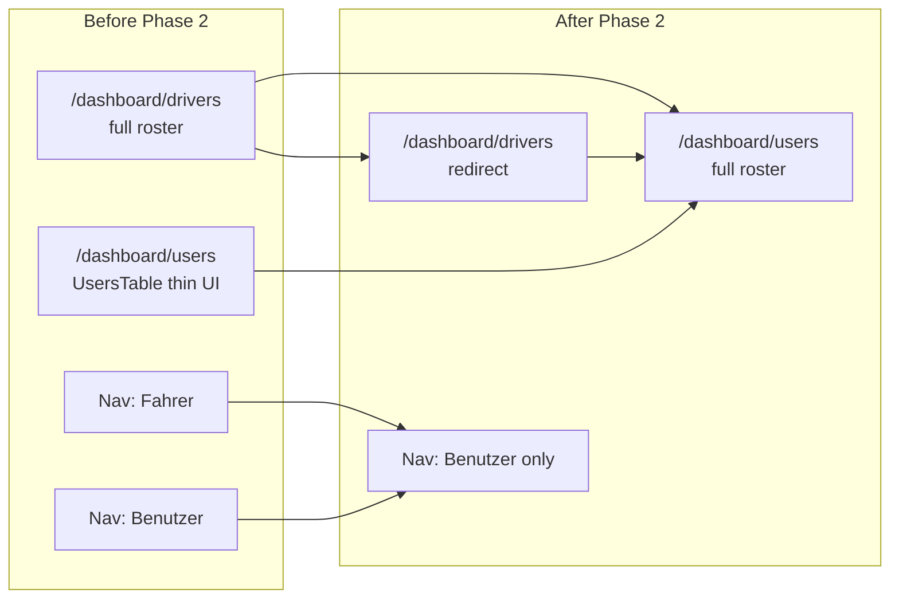

# Plan B — Phase 2: Route Merge, Nav Cleanup, Retire user-management UI

## Prerequisite

Phase 1 is done: roster at [`src/app/dashboard/drivers/page.tsx`](src/app/dashboard/drivers/page.tsx) supports all roles, paginated `GET /api/users`, live email, credentials/status actions, role toolbar, and column-view refresh callbacks.

---

## Grep report (import surface — run before coding)

| Search | Results |
|--------|---------|
| `UsersTable` | [`src/app/dashboard/users/page.tsx`](src/app/dashboard/users/page.tsx) (only consumer), [`src/features/user-management/components/users-table.tsx`](src/features/user-management/components/users-table.tsx) (definition) |
| `user-management/components/edit-credentials-dialog` | [`cell-action.tsx`](src/features/driver-management/components/drivers-table/cell-action.tsx), [`users-table.tsx`](src/features/user-management/components/users-table.tsx) (deleted in Step 5) |
| `user-management/api/users.service` | [`cell-action.tsx`](src/features/driver-management/components/drivers-table/cell-action.tsx), [`edit-credentials-dialog.tsx`](src/features/user-management/components/edit-credentials-dialog.tsx), [`users-table.tsx`](src/features/user-management/components/users-table.tsx) |
| `dashboard/drivers` | [`nav-config.ts`](src/config/nav-config.ts) (href), comment-only refs in driver-management components + [`use-column-navigation.ts`](src/hooks/use-column-navigation.ts) example |

**Safe to delete `UsersTable` after Step 1** — no other active importers.

**Note:** Current [`drivers/page.tsx`](src/app/dashboard/drivers/page.tsx) does **not** call `assertAdminOrRedirect()` (only [`users/page.tsx`](src/app/dashboard/users/page.tsx) and fleet do). Step 1 must add it per spec when mounting the roster on `/dashboard/users`.

**Hook refresh today:** [`users.service.ts`](src/features/user-management/api/users.service.ts) invalidates query keys only; `router.refresh()` lives in [`cell-action.tsx`](src/features/driver-management/components/drivers-table/cell-action.tsx). Step 4 will add `useRouter().refresh()` in relocated hooks per your spec and can remove duplicate `router.refresh()` from `cell-action` onSuccess paths.



---

## Step 1 — Mount roster on `/dashboard/users`

**File:** [`src/app/dashboard/users/page.tsx`](src/app/dashboard/users/page.tsx)

Replace thin `UsersTable` wrapper with the full tree from [`drivers/page.tsx`](src/app/dashboard/drivers/page.tsx):

- Imports: `PageContainer`, `DataTableSkeleton`, `DriverTableListing`, `DriverCreateButton`, `DriversColumnView`, `DriversViewToggle`, `DriverForm`, `searchParamsCache`, `Suspense`
- **First line in page function:** `await assertAdminOrRedirect()` (keep from current users page)
- `searchParamsCache.parse(searchParams)` + same `view` / `isColumnView` branching
- Same `PageContainer` props: `scrollable={false}`, header actions (`DriverCreateButton` when table view, `DriversViewToggle`)

**Only copy deltas:**

| Field | Value |
|-------|--------|
| `metadata.title` | `Dashboard: Benutzerverwaltung` |
| `metadata.description` | Keep roster-appropriate copy (e.g. existing users page description or align with “company accounts”) |
| `pageTitle` | `Benutzerverwaltung` |
| `pageDescription` | Update from “Fahrer…” to neutral roster copy (e.g. existing users page description) |

Do not drop `Suspense`, `DriverForm`, or column view branch.

**Build gate:** `bun run build`

---

## Step 2 — Permanent redirect `/dashboard/drivers`

**File:** [`src/app/dashboard/drivers/page.tsx`](src/app/dashboard/drivers/page.tsx)

Replace entire file with server `redirect('/dashboard/users')` only (keep file for bookmarks). No `assertAdminOrRedirect` needed on redirect page.

**Build gate:** `bun run build`

---

## Step 3 — Nav cleanup

**File:** [`src/config/nav-config.ts`](src/config/nav-config.ts)

- **Remove** Account child `{ title: 'Fahrer', url: '/dashboard/drivers', ... }` (lines 101–106)
- **Keep** `{ title: 'Benutzer', url: '/dashboard/users', ... }` — already present; no add needed
- Net: exactly **one fewer** nav item; do not reorder unrelated entries

**Build gate:** `bun run build`

---

## Step 4 — Relocate dialog + hooks

### 4a. Create [`src/features/driver-management/api/user-actions.service.ts`](src/features/driver-management/api/user-actions.service.ts)

- `'use client'`
- File header comment (per spec)
- Move `patchCredentials`, `patchStatus`, `useUpdateCredentials`, `useUpdateStatus` from [`users.service.ts`](src/features/user-management/api/users.service.ts)
- Preserve invalidations: `userKeys.list()`, `referenceKeys.drivers()` on status
- Add `useRouter()` in each hook’s `onSuccess` → `router.refresh()` (per spec; consolidates RSC table refresh)
- Keep `CompanyUser` type import from [`user-management/types`](src/features/user-management/types.ts) for now

### 4b. Create [`src/features/driver-management/components/edit-credentials-dialog.tsx`](src/features/driver-management/components/edit-credentials-dialog.tsx)

- Copy full dialog from user-management
- Change hook import to `../api/user-actions.service`
- Keep `CompanyUser` from user-management types (bridge until future cleanup)

### 4c. Update [`cell-action.tsx`](src/features/driver-management/components/drivers-table/cell-action.tsx)

- `EditCredentialsDialog` → `@/features/driver-management/components/edit-credentials-dialog`
- `useUpdateStatus` → `@/features/driver-management/api/user-actions.service`
- Remove redundant `router.refresh()` where hooks now refresh (credentials `onOpenChange` close path may still need refresh if dialog success doesn’t go through hook-only path — verify dialog calls mutation `onSuccess`)

### 4d. Bridges (do not delete folders)

**Pre-4d gate — circular import check (required before writing bridges):**

Trace the module graph after 4a–4c. The only cross-feature dependency from `driver-management` back into `user-management` must be a **type-only** import:

```text
driver-management/api/user-actions.service.ts
  → import type { CompanyUser } from user-management/types.ts   ✓ leaf (no imports)

driver-management/components/edit-credentials-dialog.tsx
  → ../api/user-actions.service
  → import type { CompanyUser } from user-management/types.ts   ✓

user-management/types.ts
  → (no imports)                                               ✓ leaf

user-management/api/users.service.ts  (bridge)
  → re-export hooks from driver-management/api/user-actions.service
  → import type { CompanyUser } from ./types for useUsers only
  → must NOT import edit-credentials-dialog or any driver-management component

user-management/components/edit-credentials-dialog.tsx  (bridge)
  → re-export component from driver-management/components/edit-credentials-dialog
  → must NOT import users.service
```

**Verified: no cycle.** `user-management/types.ts` is a pure type module with zero imports. `user-actions.service.ts` must not import `users.service.ts` or any `user-management/components/*` file. Use `import type { CompanyUser }` (not value import) in `user-actions.service.ts` so TypeScript erases the edge at compile time.

**Clarify the two-hop confusion:** After 4d, the dialog bridge is **one hop** (component re-export), not `edit-credentials-dialog → users.service → user-actions`:

```text
user-management/edit-credentials-dialog  (bridge)
  → driver-management/edit-credentials-dialog
    → driver-management/api/user-actions.service
      → user-management/types (type only)
```

The `users.service` re-export bridge is **hooks only** (`useUpdateCredentials`, `useUpdateStatus`). Legacy code that imported hooks from `users.service` still works via that second path; `cell-action` should import hooks from `user-actions.service` directly (4c), not via the bridge.

If `bun run build` fails with a circular dependency warning after 4d, stop and fix before Step 5 — do not add a barrel file that re-exports both hooks and dialog from one `user-management/index.ts`.

[`edit-credentials-dialog.tsx`](src/features/user-management/components/edit-credentials-dialog.tsx) → re-export from driver-management + `@deprecated` comment (component only; no `users.service` import in this file)

[`users.service.ts`](src/features/user-management/api/users.service.ts):

- Top-level `@deprecated` JSDoc module comment
- Re-export `useUpdateCredentials`, `useUpdateStatus` from new service
- **Keep** `useUsers`, `fetchUsers` unchanged

**Build gate:** `bun run build`

---

## Step 5 — Retire `UsersTable`

**Pre-delete grep:** Confirm `UsersTable` only in `users/page.tsx` (replaced in Step 1) + `users-table.tsx`.

**Delete:** [`src/features/user-management/components/users-table.tsx`](src/features/user-management/components/users-table.tsx)

**Modify:** [`src/features/user-management/types.ts`](src/features/user-management/types.ts) — add `@deprecated` JSDoc on `CompanyUser`; **no field changes**

**Keep:** `user-management/` folder (`useUsers`, bridges, types)

**Optional cleanup (not blocking):** Remove unused `deactivateDriver` from [`drivers.service.ts`](src/features/driver-management/api/drivers.service.ts) — zero callers today.

**Build gate:** `bun run build`

---

## Step 6 — Documentation

### [`docs/user-management.md`](docs/user-management.md)

- Canonical UI route: `/dashboard/users` powered by **driver-management**
- `UsersTable` retired; dialog/hooks in `src/features/driver-management/`
- `user-management` deprecated; `useUsers` + `CompanyUser` bridges remain
- API routes unchanged (`GET /api/users`, credentials, status)

### [`docs/driver-system.md`](docs/driver-system.md)

- Update Admin section: route `/dashboard/users`, nav Account → Benutzer
- `/dashboard/drivers` → permanent redirect
- All roles in table; column view drivers-only (intentional)
- Co-located `EditCredentialsDialog` + `user-actions.service.ts`

### [`docs/plans/approach-b-audit.md`](docs/plans/approach-b-audit.md)

Append **`## Plan Status`** (mirror [`update-driver-rpc-audit.md`](docs/plans/update-driver-rpc-audit.md) pattern):

- Phase 1: complete (reference prior work)
- Phase 2: complete with date + checklist (route, nav, hooks moved, UsersTable deleted, docs)

**Optional comment-only updates** (non-blocking): JSDoc in `driver-table-listing.tsx`, `drivers-column-view.tsx`, `columns.tsx`, `index.tsx`, `use-column-navigation.ts` example URL → `/dashboard/users`.

---

## Verification checklist

| Check | Expected |
|-------|----------|
| `/dashboard/users` | Full roster (table + columns); `assertAdminOrRedirect` |
| `/dashboard/drivers` | 307/redirect to `/dashboard/users` |
| Nav | Only “Benutzer”; no “Fahrer” |
| Table actions | Credentials + deactivate/reactivate still work |
| `/dashboard/users` legacy API | N/A for full roster (uses paginated API) |
| `useUsers` | Still compiles; no UI consumer until future cleanup |
| Build | `bun run build` passes after each step |

---

## Out of scope (explicit)

- Copy pass (“Neuer Fahrer” → “Neuer Benutzer”, page-wide i18n)
- Deleting `user-management/` folder or `CompanyUser` type
- Column view all-roles + live email
- API route moves or RPC changes
