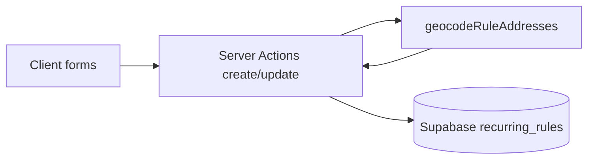

# Plan C — Recurring rule coordinate stabilisation

## Constraint: server-side geocoding vs current architecture

[`src/lib/supabase/client.ts`](src/lib/supabase/client.ts) is a **`'use client'`** module. [`src/features/trips/api/recurring-rules.service.ts`](src/features/trips/api/recurring-rules.service.ts) imports it, so **`createRule` / `updateRule` run in the browser**. They **cannot** safely call [`src/lib/google-geocoding.ts`](src/lib/google-geocoding.ts) (`GOOGLE_MAPS_API_KEY` is server-only).

**Adaptation (required):** Implement save-time geocoding in a **`'use server'`** module (Next.js Server Actions) that uses [`createClient` from `@/lib/supabase/server`](src/lib/supabase/server.ts) for inserts/updates. Wire all consumers to these actions instead of `recurringRulesService.createRule` / `updateRule` (see **Migration gate** below).

Keep **`getClientRules`**, **`getRuleById`**, **`deleteRule`** on the existing browser service (unchanged).

### Migration gate — remove `createRule` / `updateRule` from the browser service

**Do not** remove or stop exporting browser `createRule` / `updateRule` until every caller is migrated.

1. **Grep the full codebase** for `createRule` and `updateRule` (not only the three known form entry points). Include partial matches that refer to `recurringRulesService.createRule` / `updateRule` and any destructured `{ createRule, updateRule }` from that service.
2. If any **React Query** (or similar) **mutation hooks** wrap these methods (e.g. `useCreateRule`, `useUpdateRule`), rewire those hooks to call the **server actions** instead of the browser service.
3. After **every** call site is confirmed migrated and build/test pass, **then** remove or stop exporting browser `createRule` / `updateRule` so new code cannot bypass server geocoding.

---

## Step 1 — Migration

- **Filename:** use timestamp **after** the current latest migration [`20260504130000_kts_fehler.sql`](supabase/migrations/20260504130000_kts_fehler.sql), e.g. `supabase/migrations/20260505120000_add-coords-to-recurring-rules.sql` (adjust if you add other migrations first).
- **Content:** exactly as specified ( `ADD COLUMN IF NOT EXISTS` … `FLOAT8`, COMMENTs). No RLS, no NOT NULL.

**Build gate:** `bun run build` (types unchanged initially — should pass).

---

## Step 2 — `database.types.ts`

Add next to `pickup_address` / `dropoff_address` in [`src/types/database.types.ts`](src/types/database.types.ts) `recurring_rules` **Row** / **Insert** / **Update**:

- `pickup_lat`, `pickup_lng`, `dropoff_lat`, `dropoff_lng`: `number | null` on Row; optional on Insert/Update.

**Build gate:** `bun run build`.

---

## Step 3 — `src/lib/geocode-rule-addresses.ts`

- Implement as specified: `Promise.allSettled`, `[plan-c]` logs on rejection, **never throw**, return nulls for failed legs.
- Do **not** add `'use server'` to this file unless required — instead enforce **server-only imports** by only importing from the server actions module (document in file header comment).

**Build gate:** `bun run build`.

---

## Step 4 — Server actions + geocode merge (replaces “service-only” Step 4)

**New file:** e.g. [`src/features/trips/api/recurring-rules.actions.ts`](src/features/trips/api/recurring-rules.actions.ts) with `'use server'` at top.

- **`createRecurringRule(rule: InsertRecurringRule)`:** `const coords = await geocodeRuleAddresses(rule.pickup_address, rule.dropoff_address)` → `insert({ ...rule, ...coords })` via server Supabase client.

- **`updateRecurringRule(id: string, payload: UpdateRecurringRule)`:**  
  - **Fetch existing row** with `select('*').eq('id', id).single()` when determining geocode need (do not rely on `'pickup_address' in payload` — edit forms send **full** [`buildRecurringRulePayload`](src/features/clients/lib/build-recurring-rule-payload.ts) objects, so those keys are always present).  
  - **Geocode iff** `payload.pickup_address !== existing.pickup_address || payload.dropoff_address !== existing.dropoff_address`.  
  - Merge addresses for geocoding: use payload fields (they are the full new values).  
  - Merge coords into update payload when geocoding ran; if geocode returns all nulls, still persist (fail-open).

Document in [`docs/plans/plan-c-implementation.md`](docs/plans/plan-c-implementation.md): **prefetch + string compare** — avoids extra API calls for billing-only edits and matches actual submit shape.

**Call-site updates:** replace `recurringRulesService.createRule` / `updateRule` with the new server actions everywhere they appear (UI **and** any hooks from the **Migration gate** above).

**Build gate:** `bun run build`, then `bun test`. Only after full-repo migration, remove browser `createRule` / `updateRule` per the gate.

---

## Step 5 — Cron: prefer stored coords, structured fields, exceptions, return swap

File: [`src/app/api/cron/generate-recurring-trips/route.ts`](src/app/api/cron/generate-recurring-trips/route.ts).

Today, `pickupAddress` / `dropoffAddress` are computed then both passed to `resolveGeoLine` ([lines 213–221](src/app/api/cron/generate-recurring-trips/route.ts)).

**Exception bypass (mandatory):** If `exception?.modified_pickup_address` or `exception?.modified_dropoff_address` is set, **always** use the existing `resolveGeoLine` path for both legs — **never** use `rule.pickup_lat` / `dropoff_*` for that occurrence.

**Base rule path (no address overrides on the exception):** If all of `rule.pickup_lat`, `rule.pickup_lng`, `rule.dropoff_lat`, `rule.dropoff_lng` are non-null:

- **Outbound:** physical pickup = `rule.pickup_address` → stored `pickup_lat/lng`; physical dropoff = `rule.dropoff_address` → stored `dropoff_lat/lng`.
- **Return (`isReturnTrip`):** address strings are **swapped** ([lines 213–218](src/app/api/cron/generate-recurring-trips/route.ts)); stored coords must follow the **same swap**: pickup leg uses **`dropoff_lat/lng`**, dropoff leg uses **`pickup_lat/lng`**.

**Structured fields (`street`, `zip_code`, …):** Stored rule rows do not carry structured fields. **Recommended approach (clean + consistent with [`driving-metrics-api.md`](docs/driving-metrics-api.md)):**  

1. Always call `resolveGeoLine(pickupAddress)` and `resolveGeoLine(dropoffAddress)` to obtain `GeocodedAddressLineResult` for **structured columns** on the trip.  
2. When stored coords apply for that leg, **replace** `lat`/`lng` on that result object with the stored values before:  
   - passing to `resolveDrivingMetricsWithCache` (use the **same** numbers written to `trips.pickup_lat` / `dropoff_lat`), and  
   - writing trip rows — so trip coordinates match the cache key and avoid jitter.

3. When falling back (null stored coords), use geocode results as today.

**`geoCache` and stored-coordinate overrides (mandatory):** The in-memory `geoCache` in this route is keyed by trimmed address string. When lat/lng from **`rule.pickup_lat` / `dropoff_*`** are applied on top of a `GeocodedAddressLineResult`, **do not** write that **modified** object back into `geoCache`. Only **unmodified** results from live `resolveGeoLine` / `geocodeAddressLineToStructured` belong in the cache. Apply coordinate overrides **after** cache lookup and cache write — otherwise a later trip in the **same cron run** with the **same address string** but as an exception override (free-text, must use fresh geocoding) could incorrectly receive the stored-coordinate lat/lng from cache.

Add concise **WHY** comments (Plan C / stable coords / exception bypass / return swap / geoCache policy).

**Build gate:** `bun run build`, `bun test`.

---

## Step 6 — `supabase db push`, docs, plan log

- Run **`supabase db push`** (or project-standard equivalent) after migration file exists and types align.
- Update [`docs/driving-metrics-api.md`](docs/driving-metrics-api.md): new section **“Recurring Rule Coordinate Stabilisation (Plan C)”** covering columns, server save paths, fail-open geocode, cron preference order, exceptions always live-geocoded, deferred Option 2 / `place_id` on rules, `[plan-c]` prefix.
- Create [`docs/plans/plan-c-implementation.md`](docs/plans/plan-c-implementation.md): steps, migration name, **server actions vs client service** decision, cron strategy (structured + lat override vs metrics-only), build/test outputs, deferred items.
- Copy completed plan to `.cursor/plans/` per team convention.

---

## Deferred (out of scope)

Per your spec: Option 2 Places capture, `place_id` on `recurring_rules`, `recurring_rule_exceptions` schema changes, backfill SQL, `route_metrics_cache` / [`google-directions.ts`](src/lib/google-directions.ts) changes.

---

## Mermaid — save path (after change)

