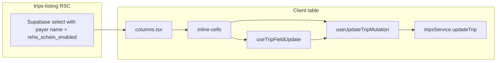

# Plan E — Inline KTS + Reha Schein cells

## Preconditions (already true)

- [`columns.tsx`](src/features/trips/components/trips-tables/columns.tsx) already starts with **`'use client'`** (line 1) — no change needed for Step 6 on that point.
- **`useUpdateTripMutation`** / **`tripsService.updateTrip`** stay unchanged ([`use-update-trip-mutation.ts`](src/features/trips/hooks/use-update-trip-mutation.ts), [`trips.service.ts`](src/features/trips/api/trips.service.ts)).
- **`kts_document_applies`** is listed in **`shouldRecalculatePrice`** ([`trip-price-engine.ts`](src/features/trips/lib/trip-price-engine.ts) ~298) — toggling KTS **on/off in the grid will run the same optional price recalculation** as other KTS edits. No extra work; be aware of server load.

## Step 1 — Widen payer embed in listing query

**File:** [`trips-listing.tsx`](src/features/trips/components/trips-listing.tsx)

There are **two** identical Supabase select fragments (lines ~88–94 list, ~96–106 kanban). Update **both** embeds:

- From: `payer:payers(name)`
- To: `payer:payers(name, reha_schein_enabled)`

**Type hygiene:** Listing currently uses `trips: any[]`. Introduce a small **explicit row type\*** used where the table data is typed (e.g. cast passed to `TripsTable`, or export from `trips.service.ts` / a narrow `trip-list-row.types.ts`) so embed shape is:

`payer: { name: string; reha_schein_enabled: boolean } | null`

\*Minimal approach: `type TripListRow = Trip & { payer: ... }` next to listing or next to `Trip` export — avoid sprinkling `any` on new cells.

**Constraint:** No other query/RSC/filter/sort/pagination changes.

**Gate:** `bun run build`

---

## Step 2 — `useTripFieldUpdate`

**New file:** [`src/features/trips/hooks/use-trip-field-update.ts`](src/features/trips/hooks/use-trip-field-update.ts)

Implement exactly as in your prompt: wrap **`useUpdateTripMutation`**, expose **`updateField`** and **`isPending`**, generic **`K extends keyof UpdateTrip`**, patch shape `{ [field]: value } as UpdateTrip`.

Add a short **why** comment (wrapper = consistent invalidation/loading for single-field cells; multi-field = direct mutation + comment at call site).

**Gate:** `bun run build`

---

## Step 3 — `inline-cells/kts-cells.tsx`

**New file:** [`src/features/trips/components/trips-tables/inline-cells/kts-cells.tsx`](src/features/trips/components/trips-tables/inline-cells/kts-cells.tsx)

- **`TripRow`**: `Trip & { payer: { name: string; reha_schein_enabled: boolean } | null }` (payer widened for type alignment with Step 1 even if KTS cells do not read payer).
- **`KtsSwitchCell`**: `Switch`; ON → **`useTripFieldUpdate`** `kts_document_applies: true`; OFF → **`useUpdateTripMutation`** with `{ kts_document_applies: false, kts_fehler: false, kts_fehler_beschreibung: null }` plus inline comment (cascade / multi-field).
- **`KtsFehlerSwitchCell`**: if `!trip.kts_document_applies` → `—`; else `Switch`; checked path single-field `kts_fehler: true`; unchecked path multi-field `kts_fehler: false` + `kts_fehler_beschreibung: null`.
- **`KtsFehlerTextCell`**: debounced **`useDebouncedCallback`** ([`use-debounced-callback.ts`](src/hooks/use-debounced-callback.ts)) 400ms → **`updateField(..., 'kts_fehler_beschreibung', value || null)`**; local **`draft`** + **`useEffect`** sync from `trip.kts_fehler_beschreibung` with **why** comment; read-only branches match existing tooltip/truncate pattern when KTS or error flag off.

Imports per your list (`Switch`, Tooltip stack, `cn`, hooks, `Trip`).

**Gate:** `bun run build`

---

## Step 4 — `inline-cells/reha-cells.tsx`

**New file:** [`src/features/trips/components/trips-tables/inline-cells/reha-cells.tsx`](src/features/trips/components/trips-tables/inline-cells/reha-cells.tsx)

- Same **`TripRow`** pattern.
- **`RehaScheinSwitchCell`**: if `!trip.payer?.reha_schein_enabled` → `—`; else **`Switch`** + **`useTripFieldUpdate`** `reha_schein`.
- **Why** comment on payer gate (parity with detail sheet).

**Gate:** `bun run build`

---

## Step 5 — Barrel

**New file:** [`src/features/trips/components/trips-tables/inline-cells/index.ts`](src/features/trips/components/trips-tables/inline-cells/index.ts)

`export * from './kts-cells'` and `export * from './reha-cells'`, plus brief comment on adding future `*-cells.tsx`.

**Gate:** `bun run build`

---

## Step 6 — Wire `columns.tsx`

**File:** [`columns.tsx`](src/features/trips/components/trips-tables/columns.tsx)

- Single import:

```ts
import {
  KtsSwitchCell,
  KtsFehlerSwitchCell,
  KtsFehlerTextCell,
  RehaScheinSwitchCell
} from './inline-cells';
```

- Replace **only** the four **`cell`** renderers for `kts_document_applies`, `kts_fehler`, `kts_fehler_beschreibung`, `reha_schein` with the components passing `trip={row.original}`.

**Do not change:** column `id`, `header`, `meta`, `enableColumnFilter`, order, accessors, or any other column.

**Gate:** `bun run build`

---

## Step 7 — Docs + final verification

**New file:** [`docs/trips-inline-editing.md`](docs/trips-inline-editing.md) — content as in your prompt (folder layout, how to add cells, single vs multi-field table, current cells, payer embed note, deferred items).

Ensure **why** comments exist at: `use-trip-field-update.ts`, `KtsSwitchCell` off-path, `KtsFehlerTextCell` sync effect, `RehaScheinSwitchCell` guard, `inline-cells/index.ts`.

**Gate:** `bun run build` and `bun test`

---

## Architecture (data flow)



---

## Hard rules (checklist)

| Rule | Action |
|------|--------|
| Barrel-only imports in `columns.tsx` | Import from `./inline-cells` only |
| Single-field vs multi-field | `useTripFieldUpdate` vs direct `mutate` + comment |
| Payer gate | `reha_schein_enabled` from embed only; update **both** list + kanban selects |
| No optimistic UI | Keep invalidation-only behavior |
| Only four columns touched | Headers/meta/order unchanged |
| No new npm deps | Use existing Switch, Tooltip, hooks |
