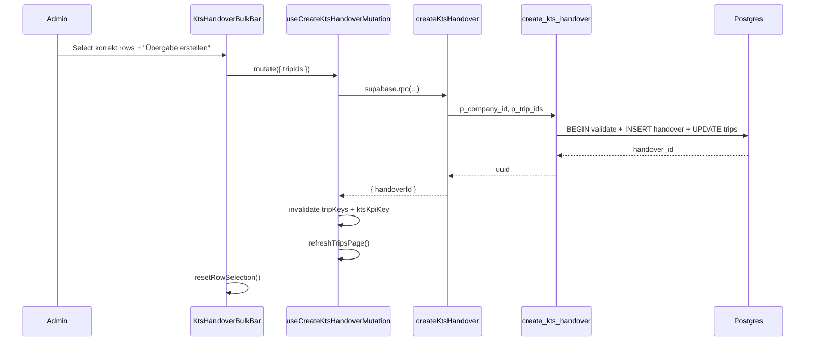

# PR3.3 Übergabe (Handover) Implementation Plan

## Current state (verified)

- Checkbox column exists in [`kts-columns.tsx`](src/features/kts/components/kts-table/kts-columns.tsx); **no status gating**, any row selectable.
- `rowSelection` wired via [`useDataTable`](src/hooks/use-data-table.ts) (`enableRowSelection: true` hardcoded at line 304).
- TODO at [`kts-data-table.tsx:41`](src/features/kts/components/kts-table/kts-data-table.tsx) — bulk bar not wired.
- [`markKtsUebergeben`](src/features/kts/kts.service.ts) is a **throwing stub** (lines 357–363).
- No `kts_handovers` table in migrations; `uebergeben` enum already exists ([`20260610140000_kts_status.sql`](supabase/migrations/20260610140000_kts_status.sql)).
- Pagination supports `bulkActions` slot ([`data-table-pagination.tsx:28`](src/components/ui/table/data-table-pagination.tsx)); Fahrten uses [`TripsPaginationBulkActions`](src/features/trips/components/trips-tables/trips-pagination-bulk-actions.tsx).

## Architecture



---

## Step 1 — Migration (BUILD GATE: `supabase db push`)

**File:** `supabase/migrations/20260610160000_kts_handovers.sql`

Model after [`20260610120000_kts_corrections.sql`](supabase/migrations/20260610120000_kts_corrections.sql) with these **corrections to the user spec**:

| Spec item | Use instead |
|-----------|-------------|
| RLS subquery on `public.profiles` | `public.accounts` (matches `kts_corrections`) |
| Single `FOR ALL` policy | Separate `SELECT` + `INSERT` policies; **no UPDATE/DELETE** (append-only audit) |
| RPC without admin guard | Mirror [`get_kts_queue_kpis`](supabase/migrations/20260610150000_kts_queue_kpis.sql): `current_user_is_admin()` AND `p_company_id = current_user_company_id()` |

### 1a. `kts_handovers` table

```sql
CREATE TABLE public.kts_handovers (
  id          uuid PRIMARY KEY DEFAULT gen_random_uuid(),
  company_id  uuid NOT NULL REFERENCES public.companies(id) ON DELETE CASCADE,
  created_at  timestamptz NOT NULL DEFAULT now(),
  created_by  uuid REFERENCES auth.users(id) ON DELETE SET NULL
);
```

- Column comments (mirror `kts_corrections` style).
- Indexes: `(company_id)`, `(company_id, created_at DESC)`.
- RLS enabled; policies:

```sql
-- Pattern from kts_corrections_select / _insert
company_id = (SELECT a.company_id FROM public.accounts a WHERE a.id = auth.uid())
```

- `GRANT SELECT, INSERT ON public.kts_handovers TO authenticated, service_role;`

### 1b. FK on `trips`

```sql
ALTER TABLE public.trips
  ADD COLUMN IF NOT EXISTS kts_handover_id uuid
  REFERENCES public.kts_handovers(id) ON DELETE SET NULL;

CREATE INDEX IF NOT EXISTS idx_trips_kts_handover_id
  ON public.trips (kts_handover_id)
  WHERE kts_handover_id IS NOT NULL;
```

### 1c. RPC `create_kts_handover(p_company_id uuid, p_trip_ids uuid[]) RETURNS uuid`

Single transaction (`plpgsql`). Hardening beyond user draft:

1. **Authorize:** reject unless `current_user_is_admin()` AND `p_company_id = current_user_company_id()`.
2. **Reject empty** `p_trip_ids`.
3. **Validate all trips:** `COUNT(*) WHERE id = ANY(p_trip_ids) AND company_id = p_company_id AND kts_status = 'korrekt' AND kts_document_applies = true` must equal `array_length(p_trip_ids, 1)` (catches wrong company, wrong status, missing IDs).
4. **Insert** `kts_handovers (company_id, created_by)` with `auth.uid()`.
5. **Update** trips: `kts_status = 'uebergeben'`, `kts_handover_id = v_handover_id`, `kts_fehler = false`.
6. `SET search_path = public`; `REVOKE ALL FROM PUBLIC`; `GRANT EXECUTE TO authenticated`.
7. `COMMENT ON FUNCTION` documenting atomic batch semantics.

**Stop after Step 1** — no app code until migration applies cleanly.

---

## Step 2 — Regenerate `database.types.ts`

```bash
bun run db:types
# equivalent: npx supabase gen types typescript --local > src/types/database.types.ts
```

Expect new entries mirroring [`kts_corrections`](src/types/database.types.ts) (~L1844):

- `Tables.kts_handovers` (Row/Insert/Update + Relationships)
- `trips.kts_handover_id` on trips Row/Insert/Update
- `Functions.create_kts_handover` with `Args: { p_company_id, p_trip_ids }` and `Returns: string`

If local Supabase is unavailable, manually patch types to match migration (same pattern as prior KTS RPC patches).

---

## Step 3 — Service layer ([`kts.service.ts`](src/features/kts/kts.service.ts))

**Remove** throwing `markKtsUebergeben` stub.

**Add:**

```typescript
export interface CreateKtsHandoverPayload {
  companyId: string;
  tripIds: string[];
}

export async function createKtsHandover(
  supabase: SupabaseClient,
  payload: CreateKtsHandoverPayload
): Promise<{ handoverId: string }>
```

- Client-side guard: `tripIds.length > 0` or throw early.
- Call `supabase.rpc('create_kts_handover', { p_company_id, p_trip_ids })`.
- Map RPC/Postgres errors to German user messages (e.g. eligibility failure).
- Export `KtsHandover` type from `Database['public']['Tables']['kts_handovers']['Row']` if needed later.

No per-trip `updateTripKts` loop — RPC is sole write path.

---

## Step 4 — Mutation hook ([`use-kts-status.ts`](src/features/kts/hooks/use-kts-status.ts))

**Add** `useCreateKtsHandoverMutation()`:

- `mutationFn`: resolve `companyId` via shared helper (see **companyId source** below), then `createKtsHandover(supabase, { companyId, tripIds })`.
- **No optimistic updates** (match existing queue mutations).
- `onSuccess`: for each `tripId` in payload → invalidate `tripKeys.detail(tripId)`; also `tripKeys.all`, `ktsKpiKey`; `refreshTripsPage()` if provider present.
- Extend `useKtsMutationSideEffects` with `onKtsBatchWriteSuccess(tripIds: string[])` to avoid N duplicate refresh calls.

### companyId source (verified before execution)

`fetchCompanyId` in [`use-kts-kpis.ts`](src/features/kts/hooks/use-kts-kpis.ts) is **module-private** (line 23 — not exported). It cannot be imported from `use-kts-status.ts` as-is.

**Required prep (Step 4a):** Extract to a shared module, e.g. `src/features/kts/lib/fetch-kts-company-id.ts`:

```typescript
export async function fetchKtsCompanyId(): Promise<string | null> {
  // move body from use-kts-kpis.ts fetchCompanyId
}
```

- Update `use-kts-kpis.ts` to import and call `fetchKtsCompanyId`.
- Import same helper in `useCreateKtsHandoverMutation` mutationFn.
- If `companyId` is null, throw a clear error before RPC (e.g. "Unternehmen konnte nicht ermittelt werden.").

No duplication — single source of truth for admin company resolution.

---

## Step 5 — Gate checkbox to `korrekt` ([`kts-columns.tsx`](src/features/kts/components/kts-table/kts-columns.tsx))

In `select` column:

**Cell:** disable checkbox when `row.original.kts_status !== 'korrekt'`; `aria-label` unchanged.

**Header:** replace naive `toggleAllPageRowsSelected` with logic that toggles **only korrekt rows on current page**:

```typescript
const korrektRows = table.getRowModel().rows.filter(
  (r) => r.original.kts_status === 'korrekt'
);
// compute checked / indeterminate from korrektRows only
// onCheckedChange: select/deselect korrektRows individually
```

**Optional hardening** (recommended, 1-line change): in [`use-data-table.ts`](src/hooks/use-data-table.ts) line 304, change to `enableRowSelection: tableProps.enableRowSelection ?? true` and pass from [`kts-table/index.tsx`](src/features/kts/components/kts-table/index.tsx):

```typescript
enableRowSelection: (row) => row.original.kts_status === 'korrekt'
```

This prevents programmatic selection of ineligible rows and aligns header "select page" with TanStack semantics. Does not affect Fahrten (default remains `true`).

---

## Step 6 — Bulk action bar (NEW [`kts-handover-bulk-bar.tsx`](src/features/kts/components/kts-table/kts-handover-bulk-bar.tsx))

Fork [`TripsPaginationBulkActions`](src/features/trips/components/trips-tables/trips-pagination-bulk-actions.tsx) — slimmer scope:

| Element | Behavior |
|---------|----------|
| Visibility | `table.getSelectedRowModel().rows.length === 0` → return `null` |
| "Auswahl aufheben" | `table.resetRowSelection()` — `Icons.close` |
| "Übergabe erstellen" | Primary button — opens `AlertDialog` confirm |
| Confirm dialog | "X KTS-Belege an Buchhaltung übergeben?" + cancel/confirm |
| Pending | Disable buttons; spinner on confirm |
| Success | `toast.success` (non-blocking); close dialog; `table.resetRowSelection()` |
| Error | **Inline in AlertDialog** — not `toast.error`. Keep dialog open; set `errorMessage` state from caught RPC/Postgres message; render `<p className="text-destructive text-sm">` below description so admin can read full message (especially on large batches, e.g. 20 trips) before dismissing. Clear `errorMessage` when dialog reopens. |

**Error vs success feedback (locked):**

- **Success:** `toast.success` — fast, non-blocking (same as Fahrten bulk delete success path).
- **Failure:** inline in confirm dialog only — consequential batch errors deserve readable, persistent context; no toast on error.

**Icons** ([`icons.tsx`](src/components/icons.tsx)): no `Handshake` / `PackageCheck` / `Upload` / `Send`. Use:

- `Icons.close` (X) — clear selection
- `Icons.post` (FileText) or `Icons.arrowRight` — handover action (pick one; `post` fits KTS nav metaphor)
- `Icons.spinner` — pending state

**Client filter before mutate:** only pass trip IDs where `kts_status === 'korrekt'` (defense in depth; server RPC validates anyway).

Props: `{ table: TanstackTable<KtsTripRow> }`.

---

## Step 7 — Wire bulk bar ([`kts-table/index.tsx`](src/features/kts/components/kts-table/index.tsx) + [`kts-data-table.tsx`](src/features/kts/components/kts-table/kts-data-table.tsx))

**`kts-table/index.tsx`:**

```typescript
paginationProps={{
  totalDatasetCount: totalItems,
  datasetNounPlural: 'KTS-Belege',
  bulkActions: <KtsHandoverBulkBar table={table} />
}}
```

**`kts-data-table.tsx`:** remove TODO comment; no structural change needed — `DataTablePagination` already accepts `bulkActions` via `paginationProps`.

Pagination footer will show "N von M KTS-Belege ausgewählt" automatically when rows selected ([`data-table-pagination.tsx:48-53`](src/components/ui/table/data-table-pagination.tsx)).

---

## Step 8 — Docs ([`docs/kts-architecture.md`](docs/kts-architecture.md))

- **§3.4:** Update transition row — `korrekt → uebergeben` via `createKtsHandover` / RPC (remove "stub" wording).
- **§3.3 or new §3.6:** Document `kts_handovers` table schema + RLS + `trips.kts_handover_id`.
- **§3.5:** Remove "bulk handover deferred"; note korrekt-only selection + bulk bar.
- **§7.1 exports table:** Replace `markKtsUebergeben` stub with `createKtsHandover`; add `useCreateKtsHandoverMutation`.
- **§7.2 roadmap:** Mark PR3.3 shipped; PR4 next.

---

## Files changed (summary)

| File | Change |
|------|--------|
| `supabase/migrations/20260610160000_kts_handovers.sql` | NEW |
| `src/types/database.types.ts` | Regen |
| `src/features/kts/lib/fetch-kts-company-id.ts` | NEW — shared `fetchKtsCompanyId` (extracted from use-kts-kpis) |
| `src/features/kts/hooks/use-kts-kpis.ts` | Import shared company helper |
| `src/features/kts/kts.service.ts` | `createKtsHandover`; remove stub |
| `src/features/kts/hooks/use-kts-status.ts` | `useCreateKtsHandoverMutation` + batch invalidation |
| `src/features/kts/components/kts-table/kts-columns.tsx` | Korrekt-only checkboxes |
| `src/features/kts/components/kts-table/kts-handover-bulk-bar.tsx` | NEW |
| `src/features/kts/components/kts-table/index.tsx` | Wire `bulkActions` |
| `src/features/kts/components/kts-table/kts-data-table.tsx` | Remove TODO |
| `src/hooks/use-data-table.ts` | Optional 1-line `enableRowSelection` coalesce |
| `docs/kts-architecture.md` | Handover docs |

**Not changed:** Fahrten components, `data-table.tsx`, listing filters (uebergeben rows remain on queue; default filter still `ungeprueft`).

---

## Build gates

| Gate | When |
|------|------|
| `supabase db push` (or apply migration) | After Step 1 |
| `bun run db:types` | Step 2 |
| `bun run build` | After all steps |
| `bun test` | 224 existing tests must pass |

---

## Product / UX notes

- Selection is **current page only** (`toggleAllPageRowsSelected` semantics) — acceptable per audit; document in confirm dialog if needed.
- After handover, rows transition to `uebergeben` and disappear from default `ungeprueft` filter; admin can view them via status filter including `uebergeben`.
- **Deferred:** accountant gate (open correction round), mobile handover, optimistic UI, KPI breakdown.

## Risks

- **Partial handover:** mitigated by RPC transaction; do not implement N sequential `updateTripKts` calls.
- **RLS mismatch:** must use `accounts`, not `profiles`.
- **SECURITY DEFINER RPC:** must include admin + company guard (same class as `get_kts_queue_kpis`).
