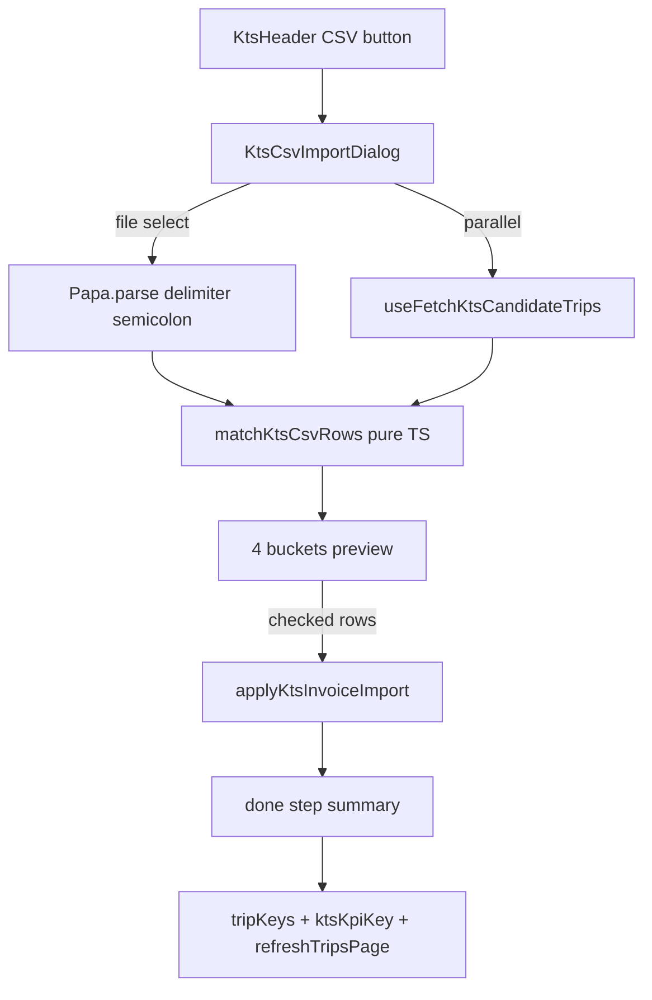

# PR4.1 — KTS CSV Import UI

## Architecture



**Prior art to mirror exactly:** [`zahlungsabgleich-dialog.tsx`](src/features/bank-reconciliation/components/zahlungsabgleich-dialog.tsx) + [`use-zahlungsabgleich.ts`](src/features/bank-reconciliation/hooks/use-zahlungsabgleich.ts) — string-literal `step`, conditional render, `FileUploader`, checkbox selection sets, `onReset` on close.

**Existing gaps PR4.1 fills:**
- No import button in [`kts-header.tsx`](src/app/dashboard/kts/kts-header.tsx) (KPI toggle only)
- No `applyKtsInvoiceImport` in [`kts.service.ts`](src/features/kts/kts.service.ts) (pattern: [`createKtsHandover`](src/features/kts/kts.service.ts) lines 393–415)
- KTS list is **RSC-paginated** — matching cannot use table props; lazy candidate fetch required ([`pr4.1-ui-audit.md`](docs/plans/pr4.1-ui-audit.md) §9)
- `abgerechnet` badge/filter incomplete in [`kts-status.ts`](src/lib/kts-status.ts); TODO workaround in [`kts-columns.tsx`](src/features/kts/components/kts-table/kts-columns.tsx) lines 175–177
- [`kts-actions-cell.tsx`](src/features/kts/components/kts-table/kts-actions-cell.tsx) line 79: only `uebergeben` renders dash — add `abgerechnet`

---

## Step 1 — Service + mutation hooks

### [`kts.service.ts`](src/features/kts/kts.service.ts)

Add types + RPC wrapper following `createKtsHandover` pattern:

```typescript
export type ApplyKtsInvoiceImportPayload = {
  companyId: string;
  rows: Array<{
    tripId: string;
    belegnummer: string;
    invoiceAmount: number;
    eigenanteil: number;
  }>;
  handoverId?: string | null;
  sourceFilename?: string | null;
};

export async function applyKtsInvoiceImport(
  supabase: SupabaseClient,
  payload: ApplyKtsInvoiceImportPayload
): Promise<{ importId: string }>
```

- Call `supabase.rpc('apply_kts_invoice_import', { p_company_id, p_rows, p_handover_id, p_source_filename })` with snake_case JSON rows: `{ trip_id, belegnummer, invoice_amount, eigenanteil }`
- RPC returns `uuid` only ([migration](supabase/migrations/20260610172000_kts_invoice_import_rpc.sql))
- **Done-step stamped count (cosmetic):** use `payload.rows.length` (checked rows the admin sent) — no post-RPC `kts_external_invoices.row_count` fetch. The admin already saw what was checked; RPC skip-not-fail for race conditions is defense-in-depth. *Alternative (not preferred):* second round-trip to read `row_count` for ground truth — adds latency for little UX gain.
- Add `mapApplyKtsInvoiceImportError()` for German UX (mirror `mapCreateKtsHandoverError`)
- Add `KTS_STATUS_ABGERECHNET = 'abgerechnet' as const` here or in `kts-status.ts` (user spec: `kts-status.ts`)

Add pure fetch helper (used by hook):

```typescript
export async function fetchKtsCandidateTrips(
  supabase: SupabaseClient,
  companyId: string
): Promise<KtsCandidateTrip[]>
```

Select exactly as specified — no `kts_status` filter.

### New file: [`use-kts-invoice-import.ts`](src/features/kts/hooks/use-kts-invoice-import.ts)

**Do not extend** [`use-kts-status.ts`](src/features/kts/hooks/use-kts-status.ts).

Exports:

| Hook | Role |
| ---- | ---- |
| `useFetchKtsCandidateTrips({ enabled })` | `useQuery` with key `['kts', 'import-candidates', companyId]`; `enabled` false until file select; uses `fetchKtsCompanyId()` |
| `useApplyKtsInvoiceImportMutation()` | wraps `applyKtsInvoiceImport`; `onSuccess` mirrors `onKtsBatchWriteSuccess` from [`use-kts-status.ts`](src/features/kts/hooks/use-kts-status.ts) lines 34–42 |

Invalidation (mandatory):

```typescript
for (const row of payload.rows) {
  void queryClient.invalidateQueries({ queryKey: tripKeys.detail(row.tripId) });
}
void queryClient.invalidateQueries({ queryKey: tripKeys.all });
void queryClient.invalidateQueries({ queryKey: ktsKpiKey });
if (rscRefresh) await rscRefresh.refreshTripsPage();
```

Use `useOptionalTripsRscRefresh()` from [`trips-rsc-refresh-provider.tsx`](src/features/trips/providers/trips-rsc-refresh-provider.tsx).

**Build gate:** `bun run build`

---

## Step 2 — Parsing + matching utilities

### New file: [`kts-csv-import-utils.ts`](src/features/kts/lib/kts-csv-import-utils.ts)

Pure TypeScript — **no Supabase**. Co-locate types: `KtsCsvRow`, `KtsCandidateTrip`, `KtsMatchResult`, bucket row types.

### Functions

**`normalizeCsvPatientName(raw)`** — per spec:
- Extract Schein-ID via `\((\d+)\)` on raw; null if absent or `'0'`
- Strip parenthetical before comma-split
- Split first comma → `lastName` / remainder → first whitespace token = `firstName`
- `normalized = clientDisplayNameFromParts(firstName, lastName)` from [`build-trip-details-patch.ts`](src/features/trips/trip-detail-sheet/lib/build-trip-details-patch.ts) lines 21–28

**`parseGermanAmount(raw)`** — mirror [`parse-bank-csv.ts`](src/features/bank-reconciliation/lib/parse-bank-csv.ts) lines 31–34 + strip `€`:
```typescript
raw.trim().replace(/[€\s]/g, '').replace(/\./g, '').replace(',', '.')
```

**`parseGermanDate(raw)`** — input `DD.MM.YYYY`:
- Validate 3 parts; produce Berlin-intent `ymd` string `YYYY-MM-DD`
- For trip comparison use **`parseScheduledAtOrFallback(iso)?.ymd`** from [`trip-time.ts`](src/features/trips/lib/trip-time.ts) lines 189–198 — **compare ymd strings**, not naive Date/ISO equality
- JSDoc: why Berlin TZ matters (same invariant as `buildScheduledAt` / Fahrten filters)

**`validateKtsAccountantCsvHeaders(metaFields: string[])`** — pure guard before matching:

- **Required headers (exact names, case-sensitive):** `Transportdatum`, `Patient`, `Belegnummer`, `Gesamtpreis`, `Eigenanteil`
- Pass `Object.keys(papaResults.meta.fields ?? [])` or first row keys after Papa Parse with `header: true`
- Returns `{ ok: true }` or `{ ok: false }` — throws/returns typed error class `InvalidKtsAccountantCsvError` (mirror `InvalidBankCsvFormatError` in bank reconciliation)
- **WHY:** bank CSVs and Fahrten exports share `.csv` extension but have different columns — fail fast with a clear German message instead of producing nonsense buckets

**`matchKtsCsvRows(csvRows, trips)`** — implement cascade exactly as spec:

1. **Patient ID:** `kts_patient_id === scheinId` + same Berlin ymd; >1 trips with different `kts_belegnummer` → Low-Confidence
2. **Name fallback:** date filter first; linked client → `clientDisplayNameFromParts(first, last)` case-insensitive; non-client → `client_name`; exact → Matched; partial single → Low-Confidence; zero → Unmatched; >1 different beleg → Low-Confidence
3. **Already-imported:** post-match, if `kts_belegnummer IS NOT NULL` → Bereits importiert bucket (overrides match quality)
4. **Non-uebergeben hint:** flag on row when `kts_status !== 'uebergeben'` — does not block commit
5. **Multi-trip per Belegnummer:** each CSV row → one preview row per matched trip (outbound + return both appear)

Per-row validation (after header check passes): skip/flag rows with unparseable amounts/dates.

Every exported function gets **WHY** JSDoc (business reason, not mechanics).

**Build gate:** `bun run build`

---

## Step 3 — Badge + filter wiring

### [`kts-status.ts`](src/lib/kts-status.ts)

1. Add `abgerechnet` cva variant: `bg-blue-50 text-blue-800 border-blue-200 dark:bg-blue-950/40 dark:text-blue-300 dark:border-blue-800`
2. `KTS_STATUS_DOT.abgerechnet = 'bg-blue-500'`
3. Append `'abgerechnet'` to `KTS_STATUS_VALUES`
4. `export const KTS_STATUS_ABGERECHNET = 'abgerechnet' as const`

### [`kts-columns.tsx`](src/features/kts/components/kts-table/kts-columns.tsx)

Remove lines 175–177 TODO workaround; pass `status` directly to `ktsStatusBadge({ status })`.

### [`kts-actions-cell.tsx`](src/features/kts/components/kts-table/kts-actions-cell.tsx)

Extend terminal-state check:

```typescript
if (status === 'uebergeben' || status === 'abgerechnet') {
  return <span className='text-muted-foreground text-xs'>—</span>;
}
```

**Build gate:** `bun run build`

---

## Step 4 — Dialog component

### New file: [`kts-csv-import-dialog.tsx`](src/features/kts/components/kts-csv-import-dialog.tsx)

**Props:** `{ open: boolean; onOpenChange: (open: boolean) => void }`

**Orchestration hook** (same file or `use-kts-csv-import.ts` colocated): mirror `useZahlungsabgleich` — owns `step`, parsed rows, match result, checkbox sets, filename, error, done counts.

**Step union:** `'idle' | 'loading' | 'reviewing' | 'confirming' | 'done'`

**Loading error sub-state:** while `step === 'loading'`, track optional `loadError: string | null`. If header validation fails (wrong file type — e.g. bank CSV or trip export), Papa Parse error, or candidate fetch failure:

- Set `loadError` to: **"Die Datei konnte nicht verarbeitet werden. Bitte prüfen Sie, ob es sich um die korrekte KTS-Abrechnungsdatei handelt."**
- Render error UI **instead of** spinner (still `step === 'loading'`, not a new step value)
- Show **"Erneut versuchen"** button → calls `onReset()` partial (clear file, `loadError`, disable candidate query) → `step = 'idle'`
- Do **not** crash or advance to `reviewing`

| Step | UI |
| ---- | -- |
| `idle` | [`FileUploader`](src/components/file-uploader.tsx) — `.csv` only; on select → Papa `{ delimiter: ';', header: true, skipEmptyLines: true }` + enable candidate fetch → `loading` |
| `loading` | Default: spinner "Fahrten werden geladen und abgeglichen…". On success: `validateKtsAccountantCsvHeaders` → fetch candidates → `matchKtsCsvRows` → `reviewing`. On header/parse/fetch failure: error sub-state (see above). |
| `reviewing` | Four sections (scrollable, max-h like Zahlungsabgleich `max-h-[90vh]`) |
| `confirming` | Spinner: "Import wird durchgeführt…" |
| `done` | Summary counts + "Schließen" |

**Review sections (order):**

1. **Zugeordnet** — pre-checked; columns: Datum, Fahrgast, Belegnummer, Gesamtpreis, Eigenanteil, Status badge, Hinweis (non-uebergeben text)
2. **Niedrige Konfidenz** — **unchecked by default** (hard rule); + Reason column
3. **Nicht zugeordnet** — display only + deferred PR4.3 message
4. **Bereits importiert** — display only; show existing `kts_belegnummer`

**Footer:** "Abbrechen" | "Importieren (N Fahrten)" — N = checked Matched + checked Low-Confidence; disabled if N=0.

**Selection state:** `Set<string>` keyed by stable row key (e.g. `csvRowIndex-tripId`).

**Close behavior:** `onReset()` clears step/selection/file state (like Zahlungsabgleich `handleOpenChange`).

**Commit payload:** only checked rows → `useApplyKtsInvoiceImportMutation` with `sourceFilename`.

**Done step counts (all from preview + commit payload — no post-RPC fetch):**
- **Stamped:** `payload.rows.length` (checked rows sent to RPC)
- **Skipped (bereits importiert):** `bereitsImportiert` bucket size from preview (unchanged from upload)
- **Unmatched:** unmatched bucket size from preview

**Build gate:** `bun run build`

---

## Step 5 — Wire into header

### [`kts-header.tsx`](src/app/dashboard/kts/kts-header.tsx)

- Add `importOpen` / `setImportOpen` state
- Add `Button variant='outline' size='sm'` "CSV importieren" in the header row **next to** existing KPI toggle (wrap both in `flex gap-2` — preserve title/subtitle/KPI section unchanged)
- Conditional render:

```tsx
{importOpen && (
  <KtsCsvImportDialog open={importOpen} onOpenChange={setImportOpen} />
)}
```

Pattern matches [`invoice-list-table/index.tsx`](src/features/invoices/components/invoice-list-table/index.tsx) lines 86, 257–261.

**Build gate:** `bun run build`

---

## Step 6 — Berlin date safety (constraint on Step 2)

Enforced in `matchKtsCsvRows`:

- Trip side: `parseScheduledAtOrFallback(trip.scheduled_at)?.ymd`
- CSV side: `parseGermanDate(transportdatum)` → comparable `ymd`
- **Never** `new Date(iso).toDateString()`, UTC midnight tricks, or raw ISO prefix compare
- Trips with `scheduled_at = null` → cannot date-match (fall through to Unmatched or name-only with Low-Confidence if product allows — document in JSDoc)

Verified via Step 2 build gate.

---

## Step 7 — Smoke test checklist

Manual verification after full build:

1. Upload real semicolon accountant CSV → four buckets render
1b. Upload wrong CSV (bank export or trip export) → loading error message + "Erneut versuchen" → returns to idle without crash
2. Matched row with `kts_status !== 'uebergeben'` → hint visible
3. Check Low-Confidence row → footer N increments
4. Uncheck Matched row → N decrements
5. Import → done step shows correct counts
6. Close → queue refreshes; stamped trips show blue `abgerechnet` badge
7. Re-upload same CSV → all rows in Bereits importiert

---

## Step 8 — Documentation (mandatory)

### [`docs/kts-architecture.md`](docs/kts-architecture.md)

| Section | Updates |
| ------- | ------- |
| **§3.7** | Mark PR4.1 shipped; document matching cascade, `normalizeCsvPatientName` location, lazy fetch rationale |
| **§7.2** | PR4.1 → shipped; PR4.2 (versendet/bezahlt/ruecklaufer), PR4.3 (manual linking) as next |
| **§9** | Add PR4.1 implementation status row |
| **§10 Code map** | Add row: `kts-csv-import-dialog.tsx`, `use-kts-invoice-import.ts`, `kts-csv-import-utils.ts` |

Fix stale §3.7 line 248 ("Sheet in kts-header") → Dialog.

### Inline WHY comments (all new code)

Required topics:
- Lazy candidate fetch on file select (not dialog open)
- Low-Confidence unchecked by default (admin opt-in)
- Blue `abgerechnet` (green reserved for `bezahlt` in PR4.2)
- Berlin ymd comparison for Transportdatum
- Skip-not-fail alignment with preview Bereits importiert bucket
- Header validation fail-fast (wrong CSV type) vs silent bad matches

---

## Hard rules checklist

- Zahlungsabgleich step pattern — no stepper library
- Lazy fetch on file select only
- `matchKtsCsvRows` pure — no DB inside
- Low-Confidence unchecked by default
- No `kts_status` filter on candidate fetch
- `parseGermanAmount` always — never raw `parseFloat` on German strings
- Berlin ymd via `parseScheduledAtOrFallback` — never naive ISO compare
- Preserve existing KtsHeader KPI behavior
- `bun run build` after each step
- Step 8 docs + WHY comments non-negotiable
- Invalid/wrong CSV headers → loading error sub-state with German message + "Erneut versuchen"; never advance to reviewing

---

## Deferred (out of scope)

- **PR4.2:** `versendet`, `bezahlt`, `ruecklaufer` enum + payment CSV
- **PR4.3:** manual Unmatched linking, handover dropdown, import history view
- Flow 3 Krankenkasse payment advice

---

## File summary

| Action | File |
| ------ | ---- |
| Modify | `src/features/kts/kts.service.ts` |
| Create | `src/features/kts/hooks/use-kts-invoice-import.ts` |
| Create | `src/features/kts/lib/kts-csv-import-utils.ts` |
| Modify | `src/lib/kts-status.ts` |
| Modify | `src/features/kts/components/kts-table/kts-columns.tsx` |
| Modify | `src/features/kts/components/kts-table/kts-actions-cell.tsx` |
| Create | `src/features/kts/components/kts-csv-import-dialog.tsx` |
| Modify | `src/app/dashboard/kts/kts-header.tsx` |
| Modify | `docs/kts-architecture.md` |

Optional: unit tests for `normalizeCsvPatientName` + `matchKtsCsvRows` in `src/features/kts/lib/__tests__/` — not required by spec but high-value for cascade logic.
