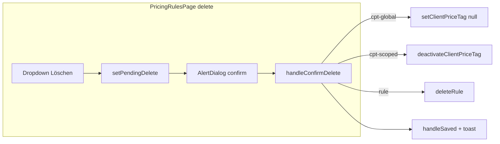

# Preisregeln delete, CPT RLS, panel error visibility

## Fix 1 — [`src/features/payers/components/pricing-rules-page.tsx`](src/features/payers/components/pricing-rules-page.tsx)

**Imports:** Add shadcn `AlertDialog` primitives from [`@/components/ui/alert-dialog`](src/components/ui/alert-dialog.tsx) (same set as elsewhere: `AlertDialog`, `AlertDialogContent`, `AlertDialogHeader`, `AlertDialogTitle`, `AlertDialogDescription`, `AlertDialogFooter`, `AlertDialogCancel`, `AlertDialogAction`).

**State:** Introduce a discriminated union for pending deletes so global CPT still uses `setClientPriceTag` and scoped CPT uses `deactivateClientPriceTag`:

```ts
type PendingDelete =
  | { kind: 'cpt-global'; clientId: string; label: string }
  | { kind: 'cpt-scoped'; id: string; label: string }
  | { kind: 'rule'; id: string; label: string };
const [pendingDelete, setPendingDelete] = useState<PendingDelete | null>(null);
```

(Equivalent to the user’s `cpt-global` / `cpt` / `rule` split.)

**CPT row “Löschen” (current 387–420):** Remove `window.confirm` and the async IIFE. On `onSelect`, call `setPendingDelete` with:

- **Global** (`!tag.payer_id && !tag.billing_variant_id`): `{ kind: 'cpt-global', clientId: tag.client_id, label: ... }`
- **Scoped:** `{ kind: 'cpt-scoped', id: tag.id, label: ... }`

**Label for CPT:** `tag.client?.name` does not exist on [`ClientPriceTagWithContext`](src/features/payers/api/client-price-tags.service.ts) (client has `first_name`, `last_name`, `company_name`, `is_company`). Reuse the same display as the table: `clientDisplayName(tag.client)` with a short fallback (e.g. `'Kunden-Preis'`) when `client` is missing.

**Billing row “Löschen” (current 501–506):** Replace `void deleteRule(row.data.id)` with `setPendingDelete({ kind: 'rule', id: row.data.id, label: ... })`.

**Label for rules:** [`BillingPricingRuleWithContext`](src/features/payers/api/billing-pricing-rules.api.ts) does **not** type `payer` on the row; it always has `breadcrumb`. Use `row.data.breadcrumb` (or its first segment) so TypeScript stays clean and the dialog matches what the user sees in the table. Fallback string e.g. `'Preisregel'` if needed.

**Shared `AlertDialog`:** Render once near the bottom of the page JSX (e.g. after the table `</div>`, before or after `PricingRuleDialog`), controlled by `open={pendingDelete !== null}` and `onOpenChange` clearing state when closed (`!open && setPendingDelete(null)`). Use the structure from your spec; wire **title/description** to `pendingDelete` (optional small copy tweak: CPT vs rule — your snippet uses a single title “Preisregel löschen?” which is slightly misleading for CPT; can keep one generic title like “Eintrag löschen?” if you prefer).

**`handleConfirmConfirmDelete`:** Implement as `useCallback` async function inside the component (needs `pendingDelete`, `deleteRule`, `handleSaved`, `setPendingDelete`, `setClientPriceTag`, `deactivateClientPriceTag`):

1. If `!pendingDelete` return.
2. `try`:
   - `cpt-global` → `await setClientPriceTag(pendingDelete.clientId, null)`
   - `cpt-scoped` → `await deactivateClientPriceTag(pendingDelete.id)`
   - `rule` → `await deleteRule(pendingDelete.id)`
3. Then `handleSaved()`, `toast.success('Entfernt')`.
4. `catch` → `toast.error('Entfernen fehlgeschlagen')`.
5. `finally` → `setPendingDelete(null)`.

**`AlertDialogAction`:** `onClick={() => { void handleConfirmDelete(); }}` (or equivalent) so the promise is explicitly handled.

This removes bare `void deleteRule` (errors now caught) and replaces native confirm with in-app dialog for both paths.

---

## Fix 2 — RLS migration + panel error UI

### New migration

Add **[`supabase/migrations/YYYYMMDDHHMMSS_fix_cpt_rls.sql`](supabase/migrations/)** (use a timestamp **after** existing migrations, e.g. `20260412150000` or current time — **do not edit** [`20260412140000_client_price_tags.sql`](supabase/migrations/20260412140000_client_price_tags.sql)).

Contents per your spec:

1. `DROP POLICY IF EXISTS client_price_tags_admin ON public.client_price_tags;`
2. Recreate **`client_price_tags_admin`** — `FOR ALL` with `current_user_is_admin()` + `company_id = current_user_company_id()` (same `USING` / `WITH CHECK` as today).
3. Create **`client_price_tags_read`** — `FOR SELECT TO authenticated` with `USING (company_id = public.current_user_company_id())`.

**Semantics:** Non-admins can **read** company rows; **writes** still require the admin policy (INSERT/UPDATE/DELETE only match `FOR ALL` admin policy, not the SELECT-only policy).

**Your environment:** Run `bunx supabase db push` (or your usual workflow) after adding the file. The plan cannot run SQL against your live project from here.

### [`src/features/clients/components/client-detail-panel.tsx`](src/features/clients/components/client-detail-panel.tsx)

Inside the **Kunden-Preise** section (around 290–301), extend the conditional rendering:

- Keep `priceTagsQuery.isLoading` branch as-is.
- Add **`priceTagsQuery.isError`** branch with:  
  `<p className='text-destructive text-xs'>Preise konnten nicht geladen werden.</p>`  
  (class order can follow project Tailwind habits; user asked `text-xs text-destructive`.)
- When not loading and not error, keep rendering `ClientPriceTagsPanelBody` with `priceTagsQuery.data ?? []`.

Avoid showing the error line and the empty body at the same time (e.g. `else if (isError)` then `else` for success).

---

## Fix 3 — [`listClientPriceTagsForManager`](src/features/payers/api/client-price-tags.service.ts)

**No code change:** Confirm the query chain has **no** `.eq('is_active', true)` on `client_price_tags` for the manager list. Current code (lines 76–86) only filters `.eq('client_id', clientId)` — **leave as-is**.

---

## Verification (local)

- **`bun run build`** and **`bun test`** — must pass, zero TS errors.
- **Supabase (manual):** After push, run your listed `SELECT COUNT(*)` / sample queries in the SQL editor; optionally `SELECT public.current_user_is_admin();` as you described.


