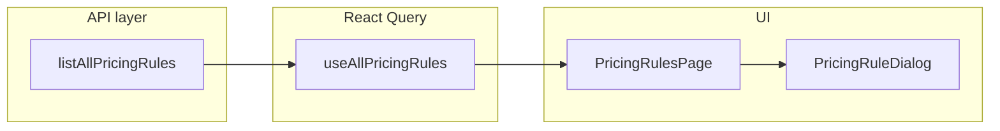

> **Implementiert.** Aktuelle Feature- und Architektur-Referenz: [`docs/preisregeln.md`](../../docs/preisregeln.md).

# Unified pricing rules page (`/dashboard/abrechnung/preise`)

## 1. New API: `listAllPricingRules` + types + `useAllPricingRules()`

### Data access ([`src/features/payers/api/billing-pricing-rules.api.ts`](src/features/payers/api/billing-pricing-rules.api.ts))

- **Add** (do not modify existing exported functions) a new async function `listAllPricingRules()`:
  - Call `getSessionCompanyId()` and `createClient()` like existing functions.
  - **Single** `.from('billing_pricing_rules').select(...)` with **nested embeds** so PostgREST returns rule columns plus joined names in one round-trip, filtered with `.eq('company_id', companyId)`, ordered e.g. `created_at` descending.
  - Suggested `select` shape (adjust FK hints if Supabase/PostgREST requires explicit disambiguation — use relationship names from generated types, e.g. `payers!billing_pricing_rules_payer_id_fkey`):

```txt
*,
payer:payers!billing_pricing_rules_payer_id_fkey ( id, name ),
billing_type:billing_types!billing_pricing_rules_billing_type_id_fkey (
  id, name, payer_id,
  payer:payers!billing_types_payer_id_fkey ( id, name )
),
billing_variant:billing_variants!billing_pricing_rules_billing_variant_id_fkey (
  id, name, billing_type_id,
  billing_type:billing_types!billing_variants_billing_type_id_fkey (
    id, name, payer_id,
    payer:payers!billing_types_payer_id_fkey ( id, name )
  )
)
```

- **Map** each raw row to a stable TS shape (null-check embeds; one of the three scope FKs is non-null by DB constraint):
  - Derive `scope_level`: `'payer' | 'billing_type' | 'billing_variant'` from which of `payer_id`, `billing_type_id`, `billing_variant_id` is set.
  - Build **`breadcrumb`** (display + search) with separator ` › ` (U+203A):
    - Payer: `PayerName`
    - Type: `PayerName › TypeName` (payer from `billing_type.payer` or `billing_type.payer_id` join)
    - Variant: `PayerName › TypeName › VariantName`
  - Expose **`payer_id_for_scope`**: for payer rules `payer_id`; for type/variant rules the joined `billing_types.payer_id` (required to build `PricingRuleScope` for edit/create API payloads).

### TypeScript types (add in the same API file or a sibling `billing-pricing-rules.types.ts` next to the API — prefer **same file** to avoid import sprawl unless the mapper grows large)

Define and export the following **in full**:

```typescript
import type { BillingPricingRuleRow } from './billing-pricing-rules.api'; // if split file, import Row from api

export type PricingRuleScopeLevel = 'payer' | 'billing_type' | 'billing_variant';

/** One pricing rule plus UI context from joins (single-company list). */
export type BillingPricingRuleWithContext = BillingPricingRuleRow & {
  scope_level: PricingRuleScopeLevel;
  breadcrumb: string;
  /** Owning Kostenträger id for API scope payloads (always set). */
  payer_id_for_scope: string;
};
```

Add a small exported helper (same module) for the dialog and table:

```typescript
import type { PricingRuleScope } from './billing-pricing-rules.api';

export function pricingRuleRowToScope(row: BillingPricingRuleWithContext): PricingRuleScope {
  if (row.scope_level === 'payer') {
    return { kind: 'payer', payerId: row.payer_id! };
  }
  if (row.scope_level === 'billing_type') {
    return {
      kind: 'billing_type',
      payerId: row.payer_id_for_scope,
      billingTypeId: row.billing_type_id!
    };
  }
  return {
    kind: 'billing_variant',
    payerId: row.payer_id_for_scope,
    billingVariantId: row.billing_variant_id!
  };
}
```

### React Query ([`src/query/keys/reference.ts`](src/query/keys/reference.ts) + new hook file)

- **Add** to `referenceKeys`:

```typescript
allBillingPricingRules: () =>
  [...referenceKeys.root, 'allBillingPricingRules'] as const,
```

- **New file** [`src/features/payers/hooks/use-all-pricing-rules.ts`](src/features/payers/hooks/use-all-pricing-rules.ts):
  - `useQuery` with `queryKey: referenceKeys.allBillingPricingRules()`, `queryFn: listAllPricingRules`, sensible `staleTime` (e.g. 30s like per-payer rules).
  - Export **`useAllPricingRules()`** returning the query result plus mutations **or** keep mutations only in the page — recommended: include `createRule` / `updateRule` / `deleteRule` mirroring [`use-billing-pricing-rules.ts`](src/features/payers/hooks/use-billing-pricing-rules.ts), but on success **invalidate**:
    - `referenceKeys.allBillingPricingRules()`
    - All per-payer caches: `queryClient.invalidateQueries({ queryKey: ['reference', 'billingPricingRules'] })` (prefix match) so open Kostenträger sheets stay consistent.

---

## 2. Scope selector inside `PricingRuleDialog`

**File:** [`src/features/payers/components/pricing-rule-dialog.tsx`](src/features/payers/components/pricing-rule-dialog.tsx)

### Props change (backward compatible)

Extend `PricingRuleDialogProps`:

```typescript
export interface PricingRuleDialogProps {
  open: boolean;
  onOpenChange: (open: boolean) => void;
  /**
   * Fixed scope (Kostenträger sheet / family / variant dialogs). When null and not editing, show scope picker (global page create).
   */
  scope: PricingRuleScope | null;
  editing: BillingPricingRuleRow | null;
  onSaved: () => void;
}
```

- **Existing call sites** ([`payer-details-sheet.tsx`](src/features/payers/components/payer-details-sheet.tsx), [`edit-billing-family-dialog.tsx`](src/features/payers/components/edit-billing-family-dialog.tsx), [`edit-billing-variant-dialog.tsx`](src/features/payers/components/edit-billing-variant-dialog.tsx)) already pass a concrete `scope` — **no behavioral change**; picker stays hidden.

### Behavior

- **`editing != null`**: Never show scope picker; use `pricingRuleRowToScope` from the parent for `scope` when opening from the global table (parent passes resolved `PricingRuleScope`, same as today). Dialog continues to use `scope` only for labels / create path; update path unchanged.
- **`editing == null && scope !== null`**: Current behavior — show static scope label (`scopeLabel` / existing copy).
- **`editing == null && scope === null`**: Render **scope picker** above the form:
  1. **Kostenträger** — required `Select`, options from **`usePayers()`** (existing hook).
  2. **Abrechnungsfamilie** — optional `Select`; enabled when payer selected; options from **`useBillingTypes(selectedPayerId)`** (existing hook).
  3. **Unterart** — optional `Select`; enabled when a family is selected; options from that family’s `billing_variants` in `BillingFamilyWithVariants`.
  - **Effective scope** for create: most specific selection — if variant selected → `billing_variant`; else if family selected → `billing_type`; else → `payer`. Reset dependent selects when upstream changes (e.g. payer change clears family + variant).
  - Disable primary submit until payer is chosen and internal resolved scope is valid.
  - `createPricingRule` branch uses the **resolved** `PricingRuleScope` (from props when fixed, from internal state when `scope === null`).

---

## 3. `PricingRulesPage` + `formatPricingRuleConfigSummary`

### Location choice

- Put the page in **[`src/features/payers/components/pricing-rules-page.tsx`](src/features/payers/components/pricing-rules-page.tsx)**.
- **Justification:** There is no `features/abrechnung/` module; Abrechnung routes already import from domain features (e.g. [`rechnungsempfaenger-page.tsx`](src/features/rechnungsempfaenger/components/rechnungsempfaenger-page.tsx)). Pricing rules, dialog, delete control, and billing tree hooks all live under `features/payers` — co-location minimizes coupling and matches existing patterns.

### Config summary helper

**New file:** [`src/features/payers/lib/format-pricing-rule-config-summary.ts`](src/features/payers/lib/format-pricing-rule-config-summary.ts)

Pure function (no React), German formatting via `Intl.NumberFormat('de-DE', { style: 'currency', currency: 'EUR' })` inside the function or passed in — keep signature as requested:

```typescript
import type { PricingStrategy } from '@/features/invoices/types/pricing.types';
import type { Json } from '@/types/database.types';

export function formatPricingRuleConfigSummary(
  strategy: PricingStrategy,
  config: Json
): string;
```

**Coverage (all six strategies):**

| Strategy | Summary idea |
|----------|----------------|
| `client_price_tag` | Short label e.g. „Kunde Preis-Tag“ or „—“; include approach fee if present |
| `manual_trip_price` | „Manuell“ + optional approach fee |
| `no_price` | „Kein Preis“ + optional approach fee |
| `tiered_km` | Compact tier summary, e.g. first tier „0–X km: Y €/km“ or „N Staffeln“ if many |
| `fixed_below_threshold_then_km` | „≤ T km: Pauschal A €; danach km-Staffel“ (abbreviated) |
| `time_based` | „Pauschal A € / Zeitfenster“ + optional holiday hint |

Use defensive parsing (`typeof` / `Array.isArray`) — invalid JSON should not throw; return a safe fallback string.

### Page UI

- Mirror structure of [`RechnungsempfaengerPage`](src/features/rechnungsempfaenger/components/rechnungsempfaenger-page.tsx): `max-w-*` container, title **„Preisregeln“**, subtitle, primary **„Neue Regel“** with `Plus` icon.
- **Filter bar** (client-side only): `Select` „Alle Ebenen“ (`'all' | PricingRuleScopeLevel`), „Alle Strategien“ (`'all' | PricingStrategy`), `Input` search on **normalized breadcrumb** (lowercase `includes`; no new deps — acceptable interpretation of „fuzzy“ without Fuse).
- **Table:** shadcn `Table` — columns: Ebene (Badge), Zugeordnet zu, Strategie ([`PRICING_STRATEGY_LABELS_DE`](src/features/invoices/lib/pricing-strategy-labels-de.ts)), Konfiguration (`formatPricingRuleConfigSummary`), Status (`Badge` active/inactive), Actions (Bearbeiten → dialog with `editing` + `scope = pricingRuleRowToScope(row)`; delete via [`PricingRuleDeleteButton`](src/features/payers/components/pricing-rule-delete-button.tsx) with `deleteRule` from `useAllPricingRules` mutations).
- **Empty state:** friendly copy + CTA button opening create dialog with `scope={null}`.
- Loading: `Skeleton` rows; error: short destructive text.

---

## 4. Route

**New file:** [`src/app/dashboard/abrechnung/preise/page.tsx`](src/app/dashboard/abrechnung/preise/page.tsx)

Copy the pattern from [`src/app/dashboard/abrechnung/rechnungsempfaenger/page.tsx`](src/app/dashboard/abrechnung/rechnungsempfaenger/page.tsx): server `createClient`, session check, `redirect` if unauthenticated, render `PricingRulesPage` inside the same padded wrapper. Set `metadata.title` / `description` (German).

---

## 5. Nav entry

**File:** [`src/config/nav-config.ts`](src/config/nav-config.ts)

Under **Abrechnung** `items`, **after** „Rechnungsempfänger“ and **before** „Vorlagen“, insert:

```typescript
{
  title: 'Preisregeln',
  url: '/dashboard/abrechnung/preise',
  shortcut: ['p', 'r']
}
```

Verify no duplicate shortcut pair exists (currently none for `['p','r']`).

---

## 6. Files to touch (complete list)

| File | Change |
|------|--------|
| [`src/features/payers/api/billing-pricing-rules.api.ts`](src/features/payers/api/billing-pricing-rules.api.ts) | Add types `PricingRuleScopeLevel`, `BillingPricingRuleWithContext`, helper `pricingRuleRowToScope`, mapper + **`listAllPricingRules`** (additive only). |
| [`src/query/keys/reference.ts`](src/query/keys/reference.ts) | Add `allBillingPricingRules` key. |
| [`src/features/payers/hooks/use-all-pricing-rules.ts`](src/features/payers/hooks/use-all-pricing-rules.ts) | **New:** `useAllPricingRules` (+ mutations + invalidation as in §1). |
| [`src/features/payers/lib/format-pricing-rule-config-summary.ts`](src/features/payers/lib/format-pricing-rule-config-summary.ts) | **New:** `formatPricingRuleConfigSummary`. |
| [`src/features/payers/components/pricing-rule-dialog.tsx`](src/features/payers/components/pricing-rule-dialog.tsx) | `scope: PricingRuleScope \| null`; scope picker UI when `scope === null && !editing`; resolve scope on create. |
| [`src/features/payers/components/pricing-rules-page.tsx`](src/features/payers/components/pricing-rules-page.tsx) | **New:** full page (filters, table, dialogs, empty state). |
| [`src/app/dashboard/abrechnung/preise/page.tsx`](src/app/dashboard/abrechnung/preise/page.tsx) | **New:** route shell. |
| [`src/config/nav-config.ts`](src/config/nav-config.ts) | Insert Preisregeln nav item. |
| [`docs/pricing-engine.md`](docs/pricing-engine.md) | **Mandatory** — new subsection per §8. |
| [`docs/invoices-module.md`](docs/invoices-module.md) | **Mandatory** — short pointer / subsection per §8 (where readers already see `resolveTripPrice`). |
| [`src/query/README.md`](src/query/README.md) | **Mandatory** — document `referenceKeys.allBillingPricingRules` per §8. |

---

## 7. Files explicitly NOT touched

- [`src/features/payers/components/payer-details-sheet.tsx`](src/features/payers/components/payer-details-sheet.tsx) — pricing section unchanged.
- [`src/features/invoices/lib/resolve-trip-price.ts`](src/features/invoices/lib/resolve-trip-price.ts) — no changes.
- Existing exports in [`billing-pricing-rules.api.ts`](src/features/payers/api/billing-pricing-rules.api.ts) — **no edits** to `listPricingRulesForPayer`, `createPricingRule`, `updatePricingRule`, `deletePricingRule`, or existing types beyond **adding** new symbols.

---

## 8. Docs to update

### [`docs/pricing-engine.md`](docs/pricing-engine.md) (primary)

This file already documents `billing_pricing_rules`, `resolvePricingRule`, and the relationship to `resolveTripPrice`. **Add a new subsection** titled **„Zentrale Preisregelverwaltung (`/dashboard/abrechnung/preise`)"** immediately **after** the existing pricing-engine / catalog section (the part that describes rule cascade and builder loading).

The subsection must document:

1. **`listAllPricingRules`** — company-scoped global query (single Supabase round-trip; RLS enforces tenant), complementing per-payer `listPricingRulesForPayer`.
2. **Join shape** — nested embeds resolve names along **payer → billing_type → billing_variant** (variant embed includes its `billing_type` and that type’s `payer` for breadcrumb + `payer_id_for_scope`).
3. **`BillingPricingRuleWithContext`** — enriched list type used by the catalog page (`scope_level`, `breadcrumb`, `payer_id_for_scope` derived in the API mapper, not DB columns).
4. **`PricingRuleDialog`** — accepts **`scope: null`** for the create-from-global-page flow (scope picker); existing Kostenträger / family / variant dialogs keep passing a fixed `PricingRuleScope`.
5. **`useAllPricingRules` mutations** — invalidate **`referenceKeys.allBillingPricingRules()`** **and** the **`['reference', 'billingPricingRules']`** prefix so per-payer caches and open Kostenträger sheets stay aligned.

### [`docs/invoices-module.md`](docs/invoices-module.md)

Where that file already discusses **`resolveTripPrice()`** and invoice pricing (3-tier hierarchy), add a **short pointer** (one paragraph or bullet) to the global Preisregeln page and to the new subsection in **`docs/pricing-engine.md`** — so readers who start from the invoices module still discover the catalog.

### [`src/query/README.md`](src/query/README.md) (**mandatory**)

Extend the documentation for [`keys/reference.ts`](src/query/keys/reference.ts): add **one row** to the reference-keys documentation. (If the README uses prose bullets rather than a markdown table, add an equivalent **table row** or a new bullet line with the same columns as the intent below.)

| Key | Purpose | Owning feature / hook | Invalidation triggers |
|-----|---------|----------------------|------------------------|
| `referenceKeys.allBillingPricingRules()` | All `billing_pricing_rules` for the session company with joined payer/type/variant names for the catalog table | `useAllPricingRules` (`src/features/payers/hooks/use-all-pricing-rules.ts`) | After create/update/delete via that hook; also invalidate `['reference', 'billingPricingRules']` prefix alongside it |

---

## 9. Required inline comments

Cursor must add the following comments when implementing (not exhaustive of all comments — these are **required**).

### `listAllPricingRules` in [`billing-pricing-rules.api.ts`](src/features/payers/api/billing-pricing-rules.api.ts)

- **JSDoc block** above the function covering:
  - Single round-trip via PostgREST **nested embeds**.
  - **Why FK aliases** are used in the `select` string (disambiguation / stable relationship hints when PostgREST requires them).
  - That **`scope_level`** and **`breadcrumb`** are **derived in the mapper** (not database columns).
  - That **`payer_id_for_scope`** is always populated because the **DB constraint** enforces exactly one scope FK per row (`payer_id` XOR `billing_type_id` XOR `billing_variant_id` semantics).

### `pricingRuleRowToScope` helper (same file)

- **One-line comment** above each `if` / branch:
  - Payer branch: `// Kostenträger-wide rule`
  - Billing type branch: `// Abrechnungsfamilie rule`
  - Variant branch: `// Unterart rule`

### [`use-all-pricing-rules.ts`](src/features/payers/hooks/use-all-pricing-rules.ts)

- **Comment** immediately above the `invalidateQueries` calls (or shared invalidation helper): explain why **both** the **global** key and the **per-payer** `billingPricingRules` prefix are invalidated — **Kostenträger detail sheets open in other tabs** (or the same tab) must not show stale pricing rows after mutations from the catalog.

### [`format-pricing-rule-config-summary.ts`](src/features/payers/lib/format-pricing-rule-config-summary.ts)

- **One-line comment** above **each strategy branch** describing the **expected `config` JSON shape** (align field names with [`pricing-rule-config.schema.ts`](src/features/invoices/lib/pricing-rule-config.schema.ts), e.g. `tiered_km`: `// config.tiers: Array<{ from_km, to_km, price_per_km }>` plus optional `approach_fee_net`).
- **Comment** above the defensive parsing / fallback block: **no Zod** here because this is a **pure display** utility with **no persistence boundary** — it **must never throw** on malformed or partial JSON.

### Scope picker block in [`pricing-rule-dialog.tsx`](src/features/payers/components/pricing-rule-dialog.tsx)

- **Comment** above the three-select block: *Scope picker — only shown when `scope` prop is `null` (create from global page). Hidden for all existing call sites that pass a pre-set scope.*
- **Comment** above dependent-reset logic (clearing family/variant when payer changes, etc.): *Reset downstream selections when upstream changes — prevents stale variant selection from a previously chosen family.*

### [`pricing-rules-page.tsx`](src/features/payers/components/pricing-rules-page.tsx)

- **File-level comment** at the top (below `'use client'` if present): *Central pricing catalog. Data from `useAllPricingRules` (company-scoped). All filtering is client-side — rule count per company is bounded and never requires server-side pagination.*
- **Comment** above the `useMemo` (or equivalent) that applies filters: *Three independent filters applied in sequence: scope level → strategy → breadcrumb search.*

---

## Implementation order (avoid broken intermediate states)

1. **`referenceKeys.allBillingPricingRules`** — standalone, no consumers yet.
2. **`listAllPricingRules` + `BillingPricingRuleWithContext` + `pricingRuleRowToScope`** in API file; verify embed `select` against real Supabase schema (adjust FK aliases if needed).
3. **`formatPricingRuleConfigSummary`** — pure function, no React, no network. **Document each strategy’s expected config JSON shape in comments** (see §9). Verify all six strategies are covered and **none throws** on malformed input.
4. **`useAllPricingRules`** hook wired to the new API + invalidation strategy.
5. **`PricingRuleDialog`**: implement `scope: null` + picker; keep existing call sites compiling with unchanged `scope` objects.
6. **`PricingRulesPage`** using hook + dialog + delete button + summary helper.
7. **Route** `preise/page.tsx` importing the page component.
8. **`nav-config.ts`** entry last (pure navigation; page already exists).


