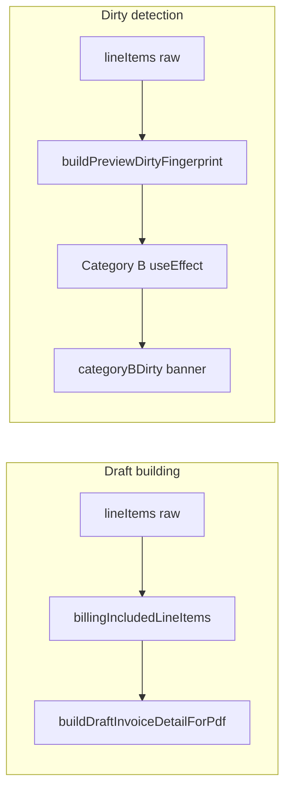

# Restore "Vorschau veraltet" Banner + Extract Dirty Fingerprint

## Root cause (confirmed in audit)

[`docs/plans/preview-banner-broken-audit.md`](docs/plans/preview-banner-broken-audit.md): Category B hashed **pre-filtered** `includedLineItemsForDraft` (inclusion bit always `+1`), omitted price fields since `caaa514`, and swallowed edits before `pdf.url` via `hasCompletedFirstRenderRef` guard. Phase 3 `billingIncludedLineItems` swap did **not** cause this.



---

## Field mapping (user-confirmed substitution)

`BuilderLineItem` has **no** `net_amount` field. **Do not hash `unit_price`.**

Per raw `BuilderLineItem`, fold into `hashIncluded` sum:

| Field | Expression | Why |
|-------|------------|-----|
| `position` | `(position ?? 0) * 1000` | unchanged from current hash |
| `effective_distance_km` | `Math.round((effective_distance_km ?? 0) * 100)` | km edits |
| inclusion | `isBillingIncludedRow(item) ? 1 : 0` | meaningful on **unfiltered** input |
| net | `Math.round((item.price_resolution?.net ?? 0) * 100)` | unit price / km repricing |
| gross | `Math.round((item.price_resolution?.gross ?? 0) * 100)` | tax rate / gross path |
| manual override | `Math.round((item.manualGrossTotal ?? 0) * 100)` | explicit Brutto override |

**Null safety:** all price fields use `?? 0` — unresolved rows contribute zero (no phantom changes on first load).

Cancelled slices (`billedCancelledTrips`, `passiveCancelledTrips`): keep existing id fold + km + `isBillingIncludedRow(row)`.

`excludedTrips`: unchanged — `client_name.length` + reason char sum.

Return format: `"${included}_${billed}_${passive}_${excluded}"`.

---

## Step 1 — Create [`src/features/invoices/lib/preview-dirty-fingerprint.ts`](src/features/invoices/lib/preview-dirty-fingerprint.ts)

**Export:** `buildPreviewDirtyFingerprint(lineItems, billedCancelledTrips, passiveCancelledTrips, excludedTrips): string`

**Imports:**
- Types from [`invoice.types.ts`](src/features/invoices/types/invoice.types.ts)
- `isBillingIncludedRow` from [`billing-inclusion.ts`](src/features/invoices/lib/billing-inclusion.ts) (read-only; do **not** modify billing-inclusion)

**Module JSDoc must cover:**
- Separation from `billing-inclusion.ts` (billable slices vs dirty fingerprint)
- Hashed fields table (above) + why each was chosen
- Explicitly **not** hashed: addresses, warnings, `trip_id`, status — no PDF impact
- Category B dirty signal relationship
- **Never** use this for draft PDF building — use `billingIncludedLineItems` for that

**Delete candidate:** local `buildCategoryBSignature` in preview hook (L83–119) has **no other callers** — remove entirely after wiring new function.

**Gate:** `bun run build`

---

## Step 2 — Tests [`src/features/invoices/lib/__tests__/preview-dirty-fingerprint.test.ts`](src/features/invoices/lib/__tests__/preview-dirty-fingerprint.test.ts)

**No existing test file** for preview fingerprint (confirmed via grep).

Reuse pattern from [`trip-write-back.test.ts`](src/features/invoices/lib/__tests__/trip-write-back.test.ts): `minimalLineItem(overrides)` with valid `price_resolution`, `billingInclusion`, etc.

| Test | Assert |
|------|--------|
| Two identical calls | Same string |
| `billingInclusion.included` false → true | Signature changes |
| `price_resolution.net` changes | Signature changes |
| `price_resolution.gross` changes | Signature changes |
| `manualGrossTotal` changes | Signature changes |
| `effective_distance_km` changes | Signature changes |
| `position` changes | Signature changes |
| Row removed from `lineItems` | Signature changes |
| Empty arrays | Stable non-empty string |
| `ExcludedTripRow` reason changes | Signature changes |
| Opted-out row + `price_resolution.net` change | Signature changes (raw input fix) |

**Gate:** `bun test` — all **24 existing** billing-inclusion / write-back / PDF tests still green

---

## Step 3 — Fix [`use-invoice-builder-pdf-preview.tsx`](src/features/invoices/components/invoice-builder/use-invoice-builder-pdf-preview.tsx)

**3a — Category B input (primary fix)**

Replace L484–504:

```typescript
const sig = buildPreviewDirtyFingerprint(
  lineItems,
  billedCancelledTrips,
  passiveCancelledTrips,
  excludedTrips
);
```

Deps: `[lineItems, billedCancelledTrips, passiveCancelledTrips, excludedTrips]` (replace `includedLineItemsForDraft`).

Import: `@/features/invoices/lib/preview-dirty-fingerprint`

Remove local `buildCategoryBSignature` (L79–120) and stale comment about JSON.stringify at L79–82.

**3b — First-render race (secondary fix)**

L496–497: remove `hasCompletedFirstRenderRef` guard — always `setCategoryBDirty(true)` when signature changes (after baseline established).

Keep ref + L390–393 effect (Category A still gates on `hasCompletedFirstRenderRef`).

**Pre-flight verified (2026-06-08):** `hasCompletedFirstRenderRef` appears in **exactly 5 code paths** — only **one** is Category B dirty gating. Do **not** widen removal scope.

| Lines | Role | Keep on execute? |
|-------|------|----------------|
| L207 | `useRef(false)` declaration | Yes |
| L390–393 | Set `true` when `pdf.url` exists | Yes |
| L401 | Reset `false` when `livePreviewActive` false | Yes |
| L414 | First-draft effect: `if (hasCompletedFirstRenderRef.current) return` — skip re-scheduling initial auto-render | Yes |
| L430 | Category A effect: `if (!hasCompletedFirstRenderRef.current) return` — no layout auto-render until first blob | Yes |
| **L496–497** | Category B effect: guard before `setCategoryBDirty(true)` | **Remove guard only here** |

Category A (L428–457) and large-invoice dirty (L462–480) do **not** read this ref. The ref is not a global “preview ready” switch — it coordinates first-render scheduling + Category A debounce only.

Update L388–389 comment — ref is for Category A / first-render logic, not Category B dirty gating.

**3c — Preserve `includedLineItemsForDraft` (L299–302)**

Do **not** change logic. Add comment:

```typescript
// why: draft building uses billable-only slice; dirty detection uses raw
// lineItems via buildPreviewDirtyFingerprint — different inputs, different jobs
```

**Inline why comments** at every changed line (swap, guard removal, preservation comment).

**Gate:** `bun run build`

---

## Step 4 — Full gate

```bash
bun run build
bun test
```

Stop if any pre-existing test fails.

---

## Step 5 — Documentation

| File | Update |
|------|--------|
| [`preview-dirty-fingerprint.ts`](src/features/invoices/lib/preview-dirty-fingerprint.ts) | Confirm module JSDoc complete |
| [`docs/invoices-module.md`](docs/invoices-module.md) | New **Preview dirty detection** section after billing inclusion: two-function split, hashed fields table, no JSON.stringify |
| [`docs/plans/preview-banner-broken-audit.md`](docs/plans/preview-banner-broken-audit.md) | Status: **Fix applied — 2026-06-08**; root cause note |
| [`use-invoice-builder-pdf-preview.tsx`](src/features/invoices/components/invoice-builder/use-invoice-builder-pdf-preview.tsx) | Update file-header contract (L18, L247 area in docs) — replace `buildCategoryBSignature` references |

Replace docs line ~247: `buildCategoryBSignature` → `buildPreviewDirtyFingerprint` with updated field list.

---

## Hard rules

1. **Do not modify** [`billing-inclusion.ts`](src/features/invoices/lib/billing-inclusion.ts), [`index.tsx`](src/features/invoices/components/invoice-builder/index.tsx), PDF components, or Phase 1–4 billing tests
2. **`includedLineItemsForDraft`** stays for `buildDraftInvoiceDetailForPdf` only
3. Build gate between every step
4. No `JSON.stringify` of full rows

---

## Recommended commit

Single commit after all steps pass:

`fix(invoices): restore preview dirty banner with buildPreviewDirtyFingerprint`
