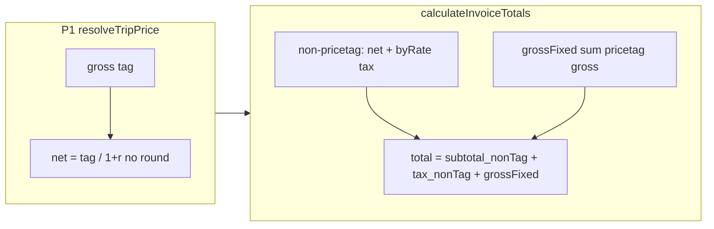

# Client price tag: totals + regression tests

## Dependency (required for Part 4)

The new tests require **unrounded** `unit_price_net` / `net` on the P1 path. Today [`resolve-trip-price.ts`](src/features/invoices/lib/resolve-trip-price.ts) does:

```369:377:src/features/invoices/lib/resolve-trip-price.ts
    const net = roundMoneyOnce(tag / (1 + taxRate));
    return {
      gross: tag,
      net,
      ...
      unit_price_net: net,
```

**Change:** For Priority 1 only, set `net` and `unit_price_net` to `tag / (1 + taxRate)` **without** `roundMoneyOnce`. Keep `gross: tag` unchanged. Do **not** attach `approach_fee_net` on this path (already true). This matches your note: approach remains net-based and only enters via existing `× (1 + tax_rate)` paths elsewhere.

**Existing test:** [`resolve-trip-price.test.ts`](src/features/invoices/lib/__tests__/resolve-trip-price.test.ts) `price_tag beats tiered rule` uses `119` @ `19%` where `119/1.19 === 100` — it should still pass; optionally tighten to `expect(r.net).toBe(100)` if desired.

---

## Part 3 — [`calculateInvoiceTotals`](src/features/invoices/api/invoice-line-items.api.ts)

**Problem:** For `client_price_tag`, `unit_price × quantity` is rounded net; tax is computed from that net again → **double rounding** vs. the negotiated **gross** anchor.

**Target behavior (aligned with your sketch, with explicit header fields):**

- **Pricetag line detection:** `item.price_resolution.strategy_used === 'client_price_tag' && item.price_resolution.gross != null`.
- **`grossFixed` accumulator (per line):**  
  `(price_resolution.gross * item.quantity) + (item.approach_fee_net ?? 0) * (1 + item.tax_rate)`  
  — transport gross is the tag × qty; approach stays **net in DB**, gross-up with the line’s `tax_rate` (unchanged semantics).
- **Non-pricetag lines:** Keep the current loop: `baseNet = unit_price * quantity`, `lineTotal = baseNet + approach_fee_net`, feed `subtotal` and `byRate[tax_rate]` as today.
- **`total`:**  
  `Math.round((subtotal + taxAmount + grossFixed) * 100) / 100`  
  where `subtotal` / `taxAmount` come **only** from non-pricetag lines (existing `byRate` → breakdown → tax sum), and `grossFixed` sums pricetag line grosses as above.

**`subtotal` and `tax_amount` stored on `invoices`:** These are labeled Netto / MwSt in the UI ([`invoice.types.ts`](src/features/invoices/types/invoice.types.ts) comments, step-4 / PDF). They must stay meaningful:

- Add **`priceTagNetTotal`**: per pricetag line,  
  `(gross * quantity) / (1 + tax_rate) + (approach_fee_net ?? 0)`  
  (full-precision division; **no** `roundMoneyOnce` on the transport net split — consistent with resolver change).
- **Returned `subtotal`** = `round((nonTagSubtotal + priceTagNetTotal) * 100) / 100`.
- **Returned `taxAmount`**: Prefer **`total - subtotal`** rounded to cents so **Netto + MwSt = Brutto** always holds for the stored header. Alternatively, `taxNonTag` from breakdown + sum of per-line pricetag tax `(lineGross - lineNet)` rounded per line; document if you choose the latter for audit trail.

**`breakdown` (mixed tax rates):** Extend `byRate` so pricetag lines contribute **implied transport net** `gross * qty / (1 + rate)` plus **`approach_fee_net`** into the same `tax_rate` bucket as non-pricetag lines. Keep building `breakdown` from merged `byRate` with the existing `net` / `tax` rounding. Note: per-bucket `round(net * rate)` can differ by ±0.01 from line-by-line tax; if that breaks a UI assertion, adjust later. Single-rate invoices (typical) stay clean.

**Comment / invariant:** Update the JSDoc above `calculateInvoiceTotals` to state it must stay consistent with [`insertLineItems`](src/features/invoices/api/invoice-line-items.api.ts) line gross: for pricetag, `(unit*qty + approach) * (1+rate)` should match `gross*qty + approach*(1+rate)` once `unit_price_net` is unrounded; if float noise appears in edge cases, a small follow-up can special-case `total_price` in `insertLineItems` to use `price_resolution.gross` (out of scope unless build/tests expose drift).

---

## Part 4 — Tests in [`resolve-trip-price.test.ts`](src/features/invoices/lib/__tests__/resolve-trip-price.test.ts)

Add exactly the two cases you specified:

1. **`client_price_tag 32.60 @ 7% — 13 trips gross total must be exactly 423.80`** — build resolution with `price_tag: 32.60`, assert `strategy_used`, `gross`, then `Math.round(r.gross! * 13 * 100) / 100 === 423.80`.
2. **`unit_price_net is not pre-rounded`** — `not.toBe(30.47)` and `toBeCloseTo(32.60 / 1.07, 8)`.

**Optional but valuable:** One test on `calculateInvoiceTotals` with 13 synthetic `BuilderLineItem`s (pricetag, `quantity: 1`, `gross: 32.60`, `tax_rate: 0.07`, `unit_price` matching resolver) asserting `total === 423.80` — proves Part 3 end-to-end. Only add if you want coverage beyond the resolver file.

---

## Task: update-pricing-engine-docs (todo `update-pricing-engine-docs`)

Execute **after** `regression-tests` and **before** `verify-build-test`.

### 1. [`src/features/invoices/lib/resolve-trip-price.ts`](src/features/invoices/lib/resolve-trip-price.ts)

Add a block comment at the top of the file, **directly below the imports**, before `roundMoneyOnce`:

```ts
/**
 * # Pricing engine — rounding contract
 *
 * ## Gross-anchor strategies (P1 — `client_price_tag`)
 *
 * The client contract specifies a **gross** price (incl. VAT). The gross value
 * is the single source of truth and must never be recomputed from a rounded net.
 *
 * Rules:
 *   - `gross` in `PriceResolution` is set directly from `client.price_tag`.
 *   - `unit_price_net` = `tag / (1 + taxRate)` — stored as full-precision float,
 *     NOT rounded with `roundMoneyOnce`. Rounding here would cause drift when
 *     multiplied across N trips (e.g. 32.60 × 13 = 423.80, not 423.84).
 *   - `net` (display field) = same full-precision value; callers that display
 *     a formatted net should round at render time, not at storage time.
 *   - `calculateInvoiceTotals` must detect pricetag lines and sum
 *     `gross × quantity` directly — never re-derive gross from the stored net.
 *
 * ## Net-anchor strategies (P2–P4 and all billing rules)
 *
 * The billing rule, trip price, or km rate defines a **net** amount. Tax is
 * applied on top and must only be rounded **once, at the total level**.
 *
 * Rules:
 *   - `unit_price_net` is rounded with `roundMoneyOnce` at resolution time
 *     (acceptable: these strategies are defined in net terms so the net is
 *     the anchor, and per-unit rounding error stays within ±0.005 per line).
 *   - For per-km strategies (`tiered_km`, `fixed_below_threshold_then_km`),
 *     `tieredNetTotal` applies ONE `roundMoneyOnce` on the total net for the
 *     trip — never per-segment — to minimise accumulated error.
 *   - `calculateInvoiceTotals` accumulates `unit_price × quantity` per line
 *     into `byRate` buckets, then applies `Math.round(net × rate × 100) / 100`
 *     once per tax-rate bucket. This is the correct sequence: sum first, round last.
 *
 * ## `approach_fee_net`
 *
 * Always net-anchored regardless of the base transport strategy. It is stored
 * as net and grossed up with `× (1 + tax_rate)` in `insertLineItems` and in
 * `calculateInvoiceTotals`. It is NEVER included in `priceResolution.gross`.
 */
```

### 2. [`src/features/invoices/api/invoice-line-items.api.ts`](src/features/invoices/api/invoice-line-items.api.ts)

**`insertLineItems`:** Add an inline comment directly above the `total_price` expression:

```ts
// total_price persisted to invoice_line_items.
//
// For `client_price_tag` lines, the gross is the anchor (set in resolveTripPrice
// P1 branch). We use price_resolution.gross × quantity so that the stored line
// gross matches the negotiated tag exactly — no float drift from round(net) × qty.
//
// For all other strategies (net-anchored), gross is derived here as
// (unit_price × quantity + approach_fee_net) × (1 + tax_rate). The one-time
// rounding happens here at line level, not inside the resolver.
//
// approach_fee_net is always net-anchored and follows the net-anchor path
// regardless of the base transport strategy.
```

**`calculateInvoiceTotals`:** Add an inline comment directly above the `grossFixed` accumulator (once implemented):

```ts
// Gross-anchor path (client_price_tag):
// Sum gross × quantity directly. Do NOT re-derive from stored unit_price_net,
// because unit_price_net is a full-precision float (gross / (1 + rate)) and
// multiplying it back up would reintroduce the rounding error we are fixing.
// approach_fee_net is still net-anchored so it is grossed up separately.
```

Add an inline comment above the `byRate` accumulator block for non-pricetag lines:

```ts
// Net-anchor path (all strategies except client_price_tag):
// Accumulate net line totals by tax rate. Tax is computed ONCE per rate bucket
// below (round(bucketNet × rate)), not per line, to minimise rounding drift
// across many trips at the same rate.
```

**Implementation note:** If `insertLineItems` does not yet use `price_resolution.gross × quantity` for pricetag lines when assigning `total_price`, update the expression in the same pass so code matches these comments and [`docs/pricing-engine-3.md`](docs/pricing-engine-3.md).

### 3. [`docs/pricing-engine-3.md`](docs/pricing-engine-3.md)

If this file does not exist yet, add it (or split from [`docs/pricing-engine.md`](docs/pricing-engine.md)) so the rounding contract lives at the path named in the todo.

Find the **"Rounding"** section (currently: *"For tiered_km and fixed_below_threshold_then_km, segment amounts use raw km × ratePerKm, then one Math.round(total * 100) / 100 per line"*) and **replace** it with:

```markdown
## Rounding contract
The engine uses two anchoring strategies. Every pricing path belongs to exactly one.
### Gross-anchor (P1 — `client_price_tag`)
The client contract specifies a gross (incl. VAT) price. The gross value is
immutable and must propagate without modification to `invoices.total`.
| Step | Rule |
|---|---|
| `resolveTripPrice` | `unit_price_net = tag / (1 + taxRate)` — **no** `roundMoneyOnce` |
| `insertLineItems` | `total_price = price_resolution.gross × quantity + approach_fee_net × (1 + rate)` |
| `calculateInvoiceTotals` | `grossFixed += gross × quantity + approach_fee_net × (1 + rate)` — never re-derives from net |
| Final `total` | `round(nonTagSubtotal + nonTagTax + grossFixed)` |
Example — 13 trips × €32.60 gross @ 7% VAT:
- ✅ Correct: `32.60 × 13 = 423.80`
- ❌ Wrong (pre-rounding net): `round(32.60/1.07) × 13 × 1.07 = 30.47 × 13 × 1.07 = 423.84`
### Net-anchor (P2–P4 and all billing rules)
The billing rule, km rate, or trip price defines a net amount. VAT is added on top.
| Step | Rule |
|---|---|
| `resolveTripPrice` | `unit_price_net` rounded with `roundMoneyOnce` at resolution time |
| `tieredNetTotal` | One `roundMoneyOnce` on the trip total — **never per segment** |
| `calculateInvoiceTotals` | Accumulate net into `byRate` buckets; `round(bucketNet × rate)` once per rate |
| Final `total` | `round(subtotal + taxAmount)` |
### `approach_fee_net`
Always net-anchored, regardless of the base transport strategy. Stored as net,
grossed up with `× (1 + tax_rate)` in `insertLineItems` and `calculateInvoiceTotals`.
Never included in `price_resolution.gross`.
```

After completing this doc task, continue with **`verify-build-test`** as planned.

---

## Verification

Run from repo root:

- `bun run build`
- `bun run test`

Report any failures (file + assertion). Likely follow-ups if they appear: [`line-item-net-display`](src/features/invoices/lib/__tests__/line-item-net-display.test.ts) (unlikely), PDF totals tests, or float/`insertLineItems` alignment.


