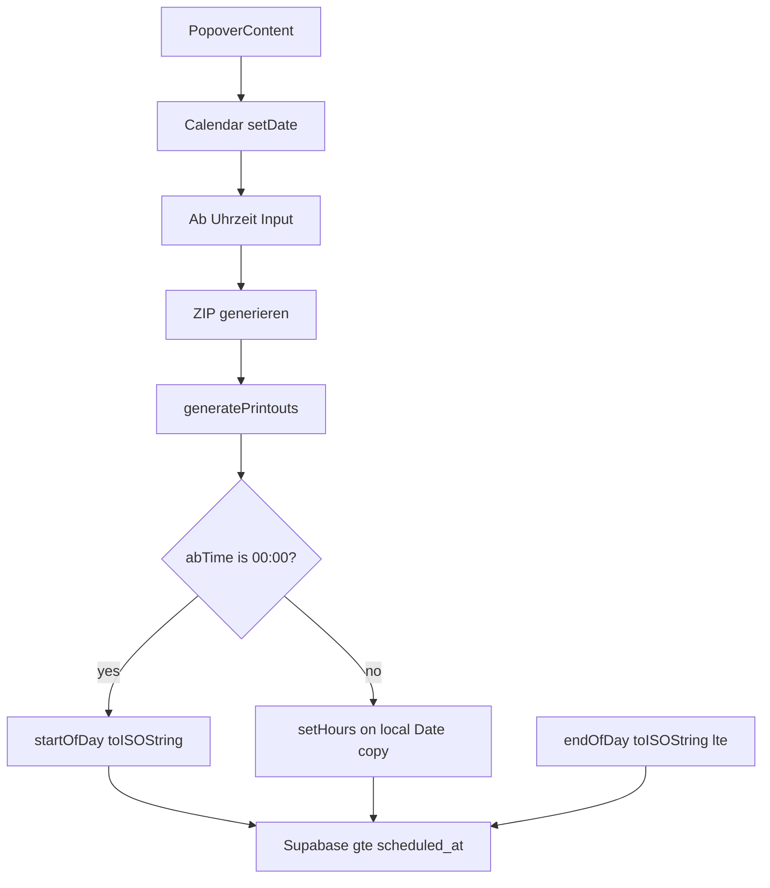

# Print "Ab Uhrzeit" on `PrintTripsButton`

## Context

- Target: [`src/features/trips/components/print-trips-button.tsx`](src/features/trips/components/print-trips-button.tsx) — today `start = startOfDay(date).toISOString()`, `end = endOfDay(date).toISOString()`, query `.gte/.lte` on `scheduled_at`, cancelled exclusion unchanged.
- Reference for `type='time'`: [`recurring-rule-form-body.tsx`](src/features/clients/components/recurring-rule-form-body.tsx) uses RHF + `Input type='time'`; this feature uses **standalone** [`Label`](src/components/ui/label.tsx) + [`Input`](src/components/ui/input.tsx) as specified (no `DateTimePicker`, no new deps).
- Audit: [`docs/plans/print-ab-uhrzeit-audit.md`](docs/plans/print-ab-uhrzeit-audit.md); pipeline doc: [`docs/print-trips-export.md`](docs/print-trips-export.md).

## Implementation steps

### 1 — `abTime` state

- Add `import` for `Label` and `Input` from `@/components/ui/...`.
- After existing hooks, add:

```ts
// Default matches full-day: startOfDay path — never use wall-clock "now" as default
const [abTime, setAbTime] = React.useState<string>('00:00');
```

- **Build note:** Until Step 2 wires `abTime`, ESLint may flag it unused. If `bun run build` or lint fails, **combine Step 1 + Step 2 in one edit** (same file, same commit slice) so `abTime` is read in `generatePrintouts`.

### 2 — `start` calculation in `generatePrintouts`

Replace the single line `const start = startOfDay(date).toISOString();` with the user-specified ternary + IIFE, preceded by a short comment block explaining:

- `abTime === '00:00'` keeps **exact** `startOfDay(date).toISOString()` (no behavior change).
- Else: copy `date` with `new Date(date)`, `setHours(hours, minutes, 0, 0)` locally, `toISOString()` — **no** `Z` suffix string concatenation for local intent.

Leave `const end = endOfDay(date).toISOString();` unchanged.

### 3 — Popover UI row

Inside `PopoverContent`, **after** `<Calendar ... />` and **before** the footer `div` with "ZIP generieren", insert the wrapped `Label` + `Input type='time'` block from the user spec (`id="ab-uhrzeit"`, `disabled={isGenerating || !date}`, `className` on wrapper/input). Add the placement comment above the block.

### 4 — Reset `abTime` on day change

Replace `onSelect={setDate}` on `Calendar` with:

```tsx
onSelect={(d) => {
  setDate(d);
  setAbTime('00:00'); // Partial-day bound is per-day; avoid carrying over across Calendar picks
}}
```

(If `d` is `undefined` on clear, resetting `abTime` is still harmless.)

## Hard rules (verify before merge)

- Default `00:00` path = **only** `startOfDay(date).toISOString()` for `start`.
- Do not change `buildColumns`, `buildItemsByColumn`, `printableTrips`, templates, or `end`.
- No UTC-local hack strings for non-default branch.

## Docs (after build passes)

1. [`docs/print-trips-export.md`](docs/print-trips-export.md): short paragraph — Ab Uhrzeit in popover; default full day; non-default lower bound on `scheduled_at` for selected local day; `00:00` preserves original `startOfDay` path.
2. [`docs/plans/print-ab-uhrzeit-audit.md`](docs/plans/print-ab-uhrzeit-audit.md): **Implementation status** at top (use actual merge date, e.g. 2026-04-27 per workspace context).

## Verification

- `bun run build` after code edits and after doc-only edits if CI requires it.
- Manual: same day + `00:00` export matches prior row count vs stash; same day + e.g. `14:00` narrows list.


