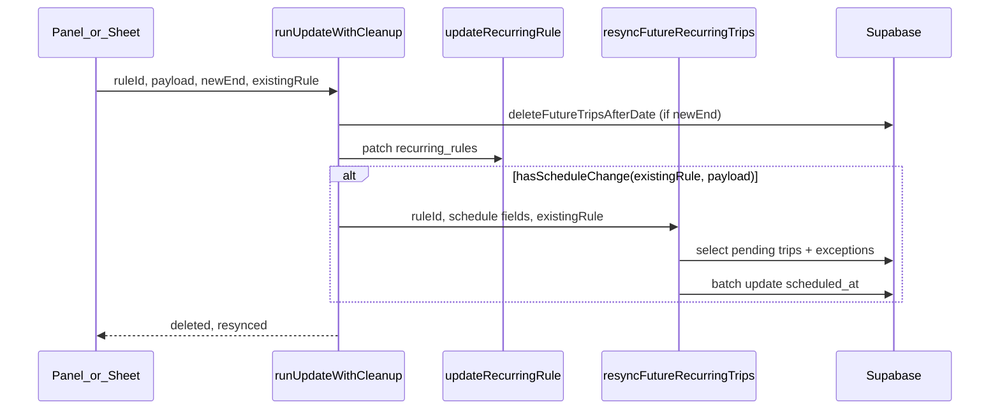

# Recurring rule schedule resync

## Read phase (mandatory before Step 1)

Read these files **completely** before writing code. Do not skip implicit dependencies.

| File | Why |
|------|-----|
| [`src/features/clients/lib/recurring-rule-submit-flow.ts`](src/features/clients/lib/recurring-rule-submit-flow.ts) | `runUpdateWithCleanup` extension point |
| [`src/features/trips/api/recurring-rules.actions.ts`](src/features/trips/api/recurring-rules.actions.ts) | New `resyncFutureRecurringTrips` server action |
| [`src/features/trips/api/recurring-rules.service.ts`](src/features/trips/api/recurring-rules.service.ts) | `RecurringRule` / `UpdateRecurringRule` types |
| [`src/features/clients/lib/build-recurring-rule-payload.ts`](src/features/clients/lib/build-recurring-rule-payload.ts) | **Read line 99 explicitly:** `return_mode: values.return_mode` is always set on every Panel/Sheet save — confirms `payload.return_mode` is always present in normal flows; the `?? existingRule.return_mode` fallback in Step 3 is **purely defensive** (implement the pattern cleanly; no bug to fix here) |
| [`src/features/clients/components/recurring-rule-panel.tsx`](src/features/clients/components/recurring-rule-panel.tsx) | Submit + toast call sites |
| [`src/features/clients/components/recurring-rule-sheet.tsx`](src/features/clients/components/recurring-rule-sheet.tsx) | Same pattern as panel |
| [`src/lib/recurring-trip-generator.ts`](src/lib/recurring-trip-generator.ts) | `scheduledIsoFromBerlinCalendarAndClock` / `clockToHhMmSs` to extract |
| [`src/features/trips/lib/trip-time.ts`](src/features/trips/lib/trip-time.ts) | `buildScheduledAt` canonical write path |
| [`src/features/trips/lib/trip-business-date.ts`](src/features/trips/lib/trip-business-date.ts) | `todayYmdInBusinessTz` for Berlin “today” |
| [`src/types/database.types.ts`](src/types/database.types.ts) | `trips`, `recurring_rules`, `recurring_rule_exceptions` columns |
| [`docs/features/recurring-rules-overview.md`](docs/features/recurring-rules-overview.md) | Doc update target |

---

## Context (from read phase)

- **Root cause** ([`docs/plans/recurring-rule-time-update-audit.md`](docs/plans/recurring-rule-time-update-audit.md)): `runUpdateWithCleanup` updates `recurring_rules` only; `generateRecurringTrips` skips existing rows via dedup — no trip sync on edit.
- **Call sites**: Both [`recurring-rule-panel.tsx`](src/features/clients/components/recurring-rule-panel.tsx) and [`recurring-rule-sheet.tsx`](src/features/clients/components/recurring-rule-sheet.tsx) call `runUpdateWithCleanup` (2 call sites each: normal save + `handleShortenConfirm`). Only the normal save path (3-arg, `newEnd` null or after shorten with same schedule) needs `existingRule`.
- **Berlin “today”**: [`todayYmdInBusinessTz()`](src/features/trips/lib/trip-business-date.ts) — same pattern as [`recurring-rules.service.ts`](src/features/trips/api/recurring-rules.service.ts) `deleteRule`.
- **Time construction**: Canonical path is [`buildScheduledAt(ymd, hm)`](src/features/trips/lib/trip-time.ts). Generator wraps it in private `scheduledIsoFromBerlinCalendarAndClock` + `clockToHhMmSs` in [`recurring-trip-generator.ts`](src/lib/recurring-trip-generator.ts) (lines 58–75) — **not exported today**.
- **Status constant**: Use `TripStatus` / literal `'pending'` from [`src/lib/trip-status.ts`](src/lib/trip-status.ts) (`'pending'` is the DB value for offene Fahrten).
- **Schema gap (important)**: `trips` has **no `exception_id`** column ([`database.types.ts`](src/types/database.types.ts)). Exception overrides live in `recurring_rule_exceptions` keyed by `(rule_id, exception_date, original_pickup_time)`. Skip logic must query that table (same keys as the cron), not `exception_id IS NULL`.
- **No `date-utils.ts`** in repo; use `trip-business-date.ts` + `trip-time.ts`.



---

## New shared module (small refactor, enables Step 2 without duplication)

Add [`src/features/trips/lib/recurring-trip-schedule.ts`](src/features/trips/lib/recurring-trip-schedule.ts) (server-safe, no client hooks):

| Export | Purpose |
|--------|---------|
| `clockToHhMmSs(clock)` | Move from generator — normalizes `HH:MM` / `HH:MM:SS` |
| `scheduledIsoFromBerlinCalendarAndClock(dateStr, timeHhMmSs)` | Thin wrapper over `buildScheduledAt` (same as generator today) |
| `isRecurringReturnLeg(link_type)` | `link_type === 'return'` |
| `exceptionOriginalPickupTimeKey(trip, priorRule)` | Mirrors cron exception lookup key using **pre-update** rule times (`priorRule.pickup_time`, `priorRule.return_time`, `priorRule.return_mode`) — **never** `payload` / new schedule |
| `computeResyncScheduledAt(trip, newSchedule)` | Pure: given leg + `requested_date` + new `pickup_time` / `return_time` / `return_mode`, returns new `scheduled_at` ISO or `null` |

Refactor [`recurring-trip-generator.ts`](src/lib/recurring-trip-generator.ts) to import `clockToHhMmSs` and `scheduledIsoFromBerlinCalendarAndClock` from this module (delete local copies). Keeps one source of truth.

Add unit tests in [`src/features/trips/lib/__tests__/recurring-trip-schedule.test.ts`](src/features/trips/lib/__tests__/recurring-trip-schedule.test.ts) for `computeResyncScheduledAt` and exception-key derivation — **include a case proving `exceptionOriginalPickupTimeKey` uses `priorRule.pickup_time` (old time), not the new schedule** (covers Step 5 `bun test` gate).

---

## Step 1 — `hasScheduleChange` (no wiring yet)

**File:** [`recurring-rule-submit-flow.ts`](src/features/clients/lib/recurring-rule-submit-flow.ts)

```ts
export function hasScheduleChange(
  existing: RecurringRule,
  payload: UpdateRecurringRule
): boolean
```

- Import `RecurringRule` from [`recurring-rules.service.ts`](src/features/trips/api/recurring-rules.service.ts).
- Compare normalized values for: `pickup_time`, `return_time`, `return_mode` (`?? null`, trim times).
- **WHY comment**: only these three affect materialised `scheduled_at`; addresses/billing/geocode are intentionally excluded (deferred).
- Not called yet. **Build gate:** `bun run build`.

---

## Step 2 — `resyncFutureRecurringTrips` server action

**File:** [`recurring-rules.actions.ts`](src/features/trips/api/recurring-rules.actions.ts)

### Signature (slight extension vs spec — `return_mode` required for `time_tbd` legs)

```ts
export async function resyncFutureRecurringTrips(
  ruleId: string,
  schedule: {
    pickup_time: string | null;
    return_time: string | null;
    return_mode: string;
  },
  priorRule: RecurringRule
): Promise<{ resynced: number }>
```

`priorRule` = pre-update `existingRule` from UI (needed for exception `original_pickup_time` keys that were stamped at generation time).

**Highest-risk invariant:** `exceptionOriginalPickupTimeKey(trip, priorRule)` must read **`priorRule.pickup_time` / `priorRule.return_time` / `priorRule.return_mode`** (the times at materialisation), **not** `schedule.*` from the payload. Inverting this causes exception-protected trips to be **silently overwritten** instead of skipped. Add an explicit inline comment at the call site and verify with a unit test before marking Step 2 complete.

### Auth

Same guard as [`deleteFutureTripsAfterDate`](src/features/trips/api/recurring-rules.actions.ts): `requireAdminContext()` + `assertRuleBelongsToCompany(ctx, ruleId)`; use `ctx.supabase`.

### Query trips (2 reads, no N+1 writes)

1. **Trips:**
   - `.from('trips').select('id, requested_date, link_type, scheduled_at')`
   - `.eq('rule_id', ruleId)`
   - `.eq('status', 'pending' as TripStatus)` — **only pending**
   - `.gte('requested_date', todayYmdInBusinessTz())`
   - `.not('requested_date', 'is', null)`

2. **Exceptions** (for skip set):
   - `.from('recurring_rule_exceptions').select('exception_date, original_pickup_time, modified_pickup_time, modified_pickup_address, modified_dropoff_address')`
   - `.eq('rule_id', ruleId)`
   - `.gte('exception_date', todayYmdInBusinessTz())`

### Skip rules (replaces non-existent `exception_id`)

Skip a trip when an exception row matches:
- `exception_date === trip.requested_date`
- `original_pickup_time === exceptionOriginalPickupTimeKey(trip, priorRule)`
- AND (`modified_pickup_time` OR `modified_pickup_address` OR `modified_dropoff_address` is non-null)

**WHY:** exception-derived times/addresses must not be overwritten by rule-level resync (deferred: rewriting exception rows themselves).

Also skip return legs when `schedule.return_mode === 'none'` (no schedule to apply; deleting stale return legs is out of scope).

### Recompute + batch update

For each qualifying trip:
- `newAt = computeResyncScheduledAt(trip, schedule)` — uses **new** schedule only here
- If `newAt === trip.scheduled_at` (normalize null/ISO), skip
- Group `id[]` by `newAt` value (use `Map<string | null, string[]>`)
- For each group, **chunk `ids` into batches of max 500** before calling Supabase (`.in()` practical limit ~1,000; 500 is safe headroom for URL/query length)
- One `.update({ scheduled_at: value }).in('id', chunk)` per chunk (including `null` bucket)

Return `{ resynced: totalUpdatedIds }`.

**WHY comments** on: pending-only immutability, Berlin date filter, exception guard (priorRule key direction), batch-by-value + chunking pattern.

**Step 2 completion gate:** Before marking Step 2 done, explicitly confirm `exceptionOriginalPickupTimeKey` is called with `priorRule` (3rd arg to `resyncFutureRecurringTrips`), never with `schedule`.

Not wired to submit flow yet. **Build gate:** `bun run build`.

---

## Step 3 — Wire into `runUpdateWithCleanup`

**File:** [`recurring-rule-submit-flow.ts`](src/features/clients/lib/recurring-rule-submit-flow.ts)

```ts
export async function runUpdateWithCleanup(
  ruleId: string,
  payload: UpdateRecurringRule,
  newEnd: string | null,
  existingRule?: RecurringRule
): Promise<{ deleted: number; resynced: number }>
```

After successful `updateRecurringRule`:
- If `existingRule` provided **and** `hasScheduleChange(existingRule, payload)`:
  - `await resyncFutureRecurringTrips(ruleId, { pickup_time: payload.pickup_time ?? null, return_time: payload.return_time ?? null, return_mode: payload.return_mode ?? existingRule.return_mode }, existingRule)`
  - 3rd arg **must** be `existingRule` (pre-update) — passed through as `priorRule` for exception skip keys
- Else `resynced = 0`

**`return_mode` in resync call:** Use `payload.return_mode ?? existingRule.return_mode` as a defensive partial-update pattern. **Not a problem to solve** — during read phase, confirm [`build-recurring-rule-payload.ts`](src/features/clients/lib/build-recurring-rule-payload.ts) line 99 always includes `return_mode`; Panel/Sheet always build the full payload. Implement the `??` fallback cleanly for type-safe partial `UpdateRecurringRule` callers; it will not trigger in normal UI saves.

**WHY comment:** `existingRule` optional so shorten-confirm and any legacy callers stay backward-compatible.

`handleShortenConfirm` paths keep 3-arg calls — resync does not run there unless schedule also changed (acceptable; primary fix is time-only `newEnd=null` path).

**Build gate:** `bun run build`.

---

## Step 4 — Panel + Sheet toasts

**Files:**
- [`recurring-rule-panel.tsx`](src/features/clients/components/recurring-rule-panel.tsx) — `handleSubmit` only (not `handleShortenConfirm`)
- [`recurring-rule-sheet.tsx`](src/features/clients/components/recurring-rule-sheet.tsx) — same pattern

```ts
const { deleted, resynced } = await runUpdateWithCleanup(
  existingRule.id,
  payload,
  null,
  existingRule
);
```

Toast priority (per spec):
1. `resynced > 0` → `Regel aktualisiert. ${resynced} Fahrten wurden auf die neue Zeit aktualisiert.`
2. else `deleted > 0` → existing delete message
3. else → `Regel erfolgreich aktualisiert`

**Build gate:** `bun run build`.

---

## Step 5 — Docs + tests (mandatory)

### Inline comments
- `hasScheduleChange`, `resyncFutureRecurringTrips`, new `runUpdateWithCleanup` branch (as specified).

### [`docs/features/recurring-rules-overview.md`](docs/features/recurring-rules-overview.md)
New section **"Regel-Update: Synchronisation bestehender Fahrten"** covering:
- Trigger fields: `pickup_time`, `return_time`, `return_mode`
- Affected trips: `pending`, `rule_id` set, `requested_date >= today` (Berlin)
- Exception guard via `recurring_rule_exceptions`
- Toast copy
- Explicitly **not** synced: assigned/completed/cancelled, address-only edits, exception rows

### [`docs/plans/recurring-rule-time-update-audit.md`](docs/plans/recurring-rule-time-update-audit.md)
- Add **Status: Resolved**
- One-line link: implemented via this plan / PR

### Tests
- [`recurring-trip-schedule.test.ts`](src/features/trips/lib/__tests__/recurring-trip-schedule.test.ts): Berlin `scheduled_at` recompute (e.g. 13:45→13:30), timeless outbound (`null`), return `time_tbd` (`null`), exception key matching

**Build gate:** `bun run build` + `bun test`

---

## Hard rules checklist

| Rule | How |
|------|-----|
| Only `pending` | `.eq('status', 'pending')` |
| No exception overwrite | Skip via `recurring_rule_exceptions` match |
| Berlin today | `todayYmdInBusinessTz()` |
| No N+1 updates | Group by `scheduled_at`, then chunk each group (max **500** IDs per `.in()` call) |
| Optional `existingRule` | 4th param optional; 3-arg callers unchanged |
| No `rule_id IS NULL` trips | Query filters `.eq('rule_id', ruleId)` |
| Reuse schedule math | Shared `recurring-trip-schedule.ts` + `buildScheduledAt` |
| **9. Exception key direction** | In `exceptionOriginalPickupTimeKey()`, derive the key from **`priorRule`** (pre-update `existingRule` from the UI), **NOT** from `payload` / `schedule`. Uses `priorRule.pickup_time`, `priorRule.return_time`, `priorRule.return_mode`. Inverting this causes exception-protected trips to be overwritten. **Verify explicitly before marking Step 2 complete.** |
| **10. Chunk `.in()` batches** | Every `.update().in('id', ids)` must split `ids` into chunks of **max 500** to avoid Supabase query-length / `.in()` row limits (~1,000 practical ceiling). |

### Implementation risks (watch list)

1. **Exception skip (highest risk):** Key direction `priorRule` vs `schedule` — see rule 9 and Step 2 completion gate.
2. **Batch update ceiling:** Many distinct `scheduled_at` values → many groups; each group still chunked to 500 IDs — see rule 10.
3. **`return_mode` fallback:** Defensive `??` only — `build-recurring-rule-payload.ts` line 99 always sets `return_mode` on UI saves; implement the pattern, do not investigate further.

---

## Files changed (summary)

| File | Change |
|------|--------|
| [`recurring-rules.actions.ts`](src/features/trips/api/recurring-rules.actions.ts) | `resyncFutureRecurringTrips` |
| [`recurring-rule-submit-flow.ts`](src/features/clients/lib/recurring-rule-submit-flow.ts) | `hasScheduleChange`, extended `runUpdateWithCleanup` |
| [`recurring-trip-schedule.ts`](src/features/trips/lib/recurring-trip-schedule.ts) | **New** shared schedule helpers |
| [`recurring-trip-generator.ts`](src/lib/recurring-trip-generator.ts) | Import shared helpers (remove duplicates) |
| [`recurring-rule-panel.tsx`](src/features/clients/components/recurring-rule-panel.tsx) | Pass `existingRule`, resync toast |
| [`recurring-rule-sheet.tsx`](src/features/clients/components/recurring-rule-sheet.tsx) | Same |
| [`recurring-trip-schedule.test.ts`](src/features/trips/lib/__tests__/recurring-trip-schedule.test.ts) | **New** unit tests |
| [`recurring-rules-overview.md`](docs/features/recurring-rules-overview.md) | Resync section |
| [`recurring-rule-time-update-audit.md`](docs/plans/recurring-rule-time-update-audit.md) | Resolved status |

---

## Deferred (unchanged)

Non-pending resync, address/geocode resync, confirmation dialog, updating `recurring_rule_exceptions` when rule time changes, deep Sheet refactor beyond toast + 4th arg.
