# Regelfahrten: end-date cleanup + on-demand generation

## Context (validated against codebase)

- Generation today lives entirely in [`src/app/api/cron/generate-recurring-trips/route.ts`](src/app/api/cron/generate-recurring-trips/route.ts) (~700 lines), scheduled via [`vercel.json`](vercel.json) at `0 3 * * *` UTC.
- Rule writes use [`recurring-rules.actions.ts`](src/features/trips/api/recurring-rules.actions.ts) (no admin guard today; session client + RLS).
- Form shells share [`RecurringRuleFormBody`](src/features/clients/components/recurring-rule-form-body.tsx) but duplicate submit logic in Sheet, Panel, and Create sheet.
- **No cron unit tests exist** (`bun test` only covers `src/features/trips/lib/__tests__` + invoices). Build gate still applies; no cron regression tests to preserve.
- **14-day horizon** is currently the magic number `14` at line 106 of the cron route — must become a named exported constant.
- **Auth note:** `requireAdmin()` in [`require-admin.ts`](src/lib/api/require-admin.ts) returns `NextResponse` (route-handler shape). For server actions, follow the throw-based [`requireAdminContext()`](src/features/driver-planning/api/driver-planning.service.ts) pattern — add a small `requireAdminContext()` in recurring-rules layer (or shared helper) that throws `Unauthorized` / `Forbidden`.

```mermaid
flowchart TD
  subgraph createFlow [Create flow]
    FormCreate[Form shell submit]
    CreateAction[createRecurringRule]
    TriggerAction[triggerGenerationForRule]
    Generator[generateRecurringTrips ruleId]
    FormCreate --> CreateAction --> TriggerAction --> Generator
  end

  subgraph editFlow [Edit flow - end date shorten]
    FormEdit[Form shell submit]
    Count[countFutureTripsAfterDate]
    Dialog[ShortenEndDateDialog]
    DeleteAction[deleteFutureTripsAfterDate]
    UpdateAction[updateRecurringRule]
    FormEdit --> Count
    Count -->|count gt 0| Dialog
    Count -->|count eq 0| UpdateAction
    Dialog -->|confirm| DeleteAction --> UpdateAction
    Dialog -->|cancel| FormEdit
  end

  subgraph cronFlow [Nightly cron unchanged]
    CronRoute[GET generate-recurring-trips]
    CronRoute --> GeneratorAll[generateRecurringTrips no filter]
  end
```



---

## Step 1 — Shared cleanup predicate + `countFutureTripsAfterDate`

**File:** [`src/features/trips/api/recurring-rules.service.ts`](src/features/trips/api/recurring-rules.service.ts)

Add a **private predicate comment block** and a **shared filter shape** so count and delete cannot drift:

```ts
// Predicate (must match deleteFutureTripsAfterDate exactly):
// rule_id = ruleId
// requested_date > afterYmd   (strictly after new end_date; trip ON end_date kept)
// status = 'pending'            (assigned/in_progress/completed/cancelled untouched)
// ingestion_source = 'recurring_rule' OR null
```

Add `countFutureTripsAfterDate(ruleId, afterYmd)` using browser `createClient()` + `{ count: 'exact', head: true }` as specified.

**Product implication:** Only `pending` trips are removed on end-date shorten. Future trips already `assigned` or `in_progress` survive — intentional per hard rules.

**Intentional predicate divergence (do not unify):** [`deleteRule`](src/features/trips/api/recurring-rules.service.ts) uses `.not('status', 'in', '("completed","cancelled")')` and therefore **deletes assigned and in_progress** future trips when the whole rule is removed. `deleteFutureTripsAfterDate` uses `.eq('status', 'pending')` only — a **narrower, surgical cleanup** when the rule continues to exist but its calendar window shrinks. These are different product intents; aligning them would be a regression. A **mandatory WHY comment** must be added directly on `deleteRule`'s trip-delete block during Step 7 (see Step 7 checklist).

**Build gate:** `bun run build`

---

## Step 2 — `deleteFutureTripsAfterDate` server action

**File:** [`src/features/trips/api/recurring-rules.actions.ts`](src/features/trips/api/recurring-rules.actions.ts)

Add exported `deleteFutureTripsAfterDate(ruleId, afterYmd)`:

- First line: `requireAdminContext()` (new helper in same file or `recurring-rules-admin.ts`)
- Session `createClient()` for delete (RLS-scoped; same as existing `createRecurringRule`)
- **Tenant guard:** load rule → join `clients.company_id` → assert `company_id === auth.companyId` before delete (prevents cross-tenant ID guessing)
- Identical predicate to Step 1; `.select('id')` to return `deleted` count
- Does **not** update `recurring_rules` (separate from `updateRecurringRule` per spec)

**Do not** add a `cleanup` flag to `updateRecurringRule` — the Files Changed table mentions it, but Steps 2/6 correctly keep cleanup as a separate confirmed call.

**Build gate:** `bun run build`

---

## Step 3 — Extract `recurring-trip-generator.ts`

**New file:** [`src/lib/recurring-trip-generator.ts`](src/lib/recurring-trip-generator.ts)

| Export | Purpose |
| --- | --- |
| `RECURRING_TRIP_GENERATION_HORIZON_DAYS = 14` | Single source for window length |
| `generateRecurringTrips(options?: { ruleId?: string })` | Core generator |

**Extraction checklist** (move from cron route, do not duplicate):

- Berlin window: `todayLocal` → `addDays(..., RECURRING_TRIP_GENERATION_HORIZON_DAYS)`
- Rules query: `.eq('is_active', true)` + **when `ruleId` set, `.eq('id', ruleId)` on the initial query** (filter before RRule loop — comment WHY: avoids loading/geocoding unrelated rules on on-demand path)
- Exceptions fetch, geo/directions caches, `buildTripPayload`, `insertIfAbsent`, pricing via `loadPricingContext` / `computeTripPrice`
- Hin/Rück `linked_trip_id` backfill

**Client:** use [`createAdminClient()`](src/lib/supabase/admin.ts) (not inline `createClient`).

**Server-only guard:** top-of-file JSDoc + never import from `'use client'` modules (match [`admin.ts`](src/lib/supabase/admin.ts) pattern).

**Return shape:**

```ts
{ generated: number; skipped: number; errors: number }
```

- `generated` = new inserts (current `tripsInserted`)
- `errors` = current `errorCount`
- `skipped` = occurrences where `insertIfAbsent` found existing leg (increment in `insertIfAbsent` when returning existing id without insert) — gives useful on-demand toast context

**Thin cron wrapper** — [`route.ts`](src/app/api/cron/generate-recurring-trips/route.ts) retains:

1. `CRON_SECRET` auth (unchanged)
2. `generateRecurringTrips()` call
3. JSON response: keep `{ generated, errors, timestamp }` for monitors; optionally add `skipped` (non-breaking additive field)

**Build gate:** `bun run build` + `bun test` (existing suites must pass)

---

## Step 4 — `triggerGenerationForRule` server action

**File:** [`src/features/trips/api/recurring-rules.actions.ts`](src/features/trips/api/recurring-rules.actions.ts)

```ts
export async function triggerGenerationForRule(ruleId: string)
  → { generated: number; error: string | null }
```

- `requireAdminContext()` first
- **Tenant guard:** verify rule belongs to admin's company (same join as Step 2) before calling generator
- `generateRecurringTrips({ ruleId })` — service role inside module; no `CRON_SECRET` HTTP hop
- Catch errors → `{ generated: 0, error: message }`; success → `{ generated: result.generated, error: null }`

**Build gate:** `bun run build`

---

## Step 5 — `ShortenEndDateDialog`

**New file:** [`src/features/recurring-rules/components/shorten-end-date-dialog.tsx`](src/features/recurring-rules/components/shorten-end-date-dialog.tsx)

Controlled `AlertDialog` mirroring [`delete-recurring-rule-dialog.tsx`](src/features/recurring-rules/components/delete-recurring-rule-dialog.tsx):

| Prop | Role |
| --- | --- |
| `ruleId`, `newEndDate`, `tripCount` | Display |
| `isOpen`, `onOpenChange` | Control |
| `onConfirm`, `onCancel` | Parent-owned flow |
| `isConfirming` | Loading state |

Copy (German) per spec. Destructive confirm: "Fahrten löschen und speichern".

**Parent responsibility for `tripCount === 0`:** shell never opens dialog; proceeds directly to update. Dialog does not self-bypass (comment WHY in component).

**Build gate:** `bun run build`

---

## Step 6 — Wire both gaps into three form shells

Update all three — no partial implementation:

| Shell | Gap 1 (edit shorten) | Gap 2 (create generate) |
| --- | --- | --- |
| [`recurring-rule-sheet.tsx`](src/features/clients/components/recurring-rule-sheet.tsx) | yes (`initialData`) | yes (create branch only) |
| [`recurring-rule-panel.tsx`](src/features/clients/components/recurring-rule-panel.tsx) | yes (`existingRule`) | yes (`isNew`) |
| [`create-recurring-rule-sheet.tsx`](src/features/recurring-rules/components/create-recurring-rule-sheet.tsx) | n/a (create only) | yes |

### Gap 1 — Edit end-date shortening

**`end_date` format verification (read before implementing):**

[`RecurringRuleFormBody`](src/features/clients/components/recurring-rule-form-body.tsx) binds `end_date` to `<Input type='date' {...field} />` with Zod `end_date: z.string().optional()`. HTML `type='date'` inputs emit **`yyyy-MM-dd` strings** (never `Date` objects or localized strings). DB-loaded values (`initialData.end_date`) are also ISO date strings from Supabase. String comparison `<` is therefore safe **when `newEnd` is non-empty**.

**Defensive normalization (required in all three shells):** Before `isShortening` or passing `newEnd` to count/delete/update, normalize via a one-liner helper (extract to `src/features/clients/lib/normalize-rule-end-date.ts` or inline identically in each shell):

```ts
function normalizeRuleEndDate(raw: string | null | undefined): string | null {
  const trimmed = raw?.trim() ?? '';
  return trimmed === '' ? null : trimmed; // already yyyy-MM-dd from type='date'
}
```

Use `normalizeRuleEndDate(values.end_date)` for `newEnd` and `normalizeRuleEndDate(oldEndRaw)` for the stored rule value. Add a one-line comment at the call site: `// type='date' + Zod string → yyyy-MM-dd; normalize empty → null`.

**Detection** (all edit paths):

```ts
const oldEnd = normalizeRuleEndDate(existingRule?.end_date ?? initialData?.end_date);
const newEnd = normalizeRuleEndDate(values.end_date);
const isShortening =
  oldEnd != null && newEnd != null && newEnd < oldEnd;
```

**Flow:**

1. `handleSubmit` builds payload as today
2. If `isShortening`:
   - `count = await recurringRulesService.countFutureTripsAfterDate(ruleId, newEnd)`
   - If `count > 0`: stash `pendingPayload` + `pendingDeletedCount` state, open `ShortenEndDateDialog`, **return early** (`isSubmitting` stays true or use separate `isConfirmingShorten`)
   - If `count === 0`: proceed to `updateRecurringRule` silently
3. On dialog **confirm**: `deleteFutureTripsAfterDate(ruleId, newEnd)` → `updateRecurringRule` → toast with deleted count
4. On dialog **cancel**: close dialog, clear pending state, **no writes**, form stays open

**Date display in dialog:** format `newEndDate` as `dd.MM.yyyy` for admin readability.

### Gap 2 — Create on-demand generation

After successful `createRecurringRule` (use returned `data.id`):

1. Keep submit button loading through `triggerGenerationForRule(data.id)`
2. Success toast: `Regel erstellt. ${generated} Fahrten wurden für die nächsten 14 Tage generiert.`
3. On generation error: primary toast still "Regel erstellt"; secondary warning toast per spec — **do not roll back rule**

**CreateRecurringRuleSheet** must use `createRecurringRule` return value (`data`) — currently only checks `error`; extend to capture `data.id`.

**Build gate:** `bun run build`

---

## Step 7 — Docs + inline comments (mandatory)

**Update** [`docs/features/recurring-rules-overview.md`](docs/features/recurring-rules-overview.md):

- New section: **End-date shortening cleanup** (trigger, predicate, what is preserved: completed/cancelled/assigned/in_progress)
- New section: **On-demand generation on create** (14-day Berlin window, non-fatal failure, nightly cron fallback)
- New subsection: **Predicate divergence: rule delete vs end-date shorten** — table comparing `deleteRule` vs `deleteFutureTripsAfterDate` (status filter, date filter, intent). Explicitly state that unifying them is a regression risk.
- Cross-link generator module path

**Mandatory code comment on `deleteRule` (non-negotiable):**

In [`recurring-rules.service.ts`](src/features/trips/api/recurring-rules.service.ts), add a block comment immediately above the `deleteFutureTrips` branch inside `deleteRule` explaining:

- **Why broader status filter:** whole-rule deletion is destructive teardown — admin expects all non-terminal future legs (including assigned/in_progress) to go away.
- **Why `deleteFutureTripsAfterDate` is narrower:** rule still exists; only unassigned (`pending`) legs beyond the new end date are removed; assigned/in_progress legs need dispatcher attention.
- **Do not align predicates** without an explicit product decision.

Example shape (implementer may refine wording, intent must be preserved):

```ts
// WHY status filter differs from deleteFutureTripsAfterDate (end-date shorten):
// Rule delete = teardown → remove all non-terminal future trips (assigned/in_progress too).
// End-date shorten = surgical → pending only; assigned/in_progress preserved for dispatcher.
// Do NOT change this to .eq('status', 'pending') without a product review.
```

**Inline WHY comments** (not WHAT) on:

- `RECURRING_TRIP_GENERATION_HORIZON_DAYS` + `ruleId` filter placement in generator
- Shared cleanup predicate in service + action (`countFutureTripsAfterDate` / `deleteFutureTripsAfterDate`)
- `deleteRule` predicate divergence (mandatory block above)
- `normalizeRuleEndDate` / `isShortening` call site (type='date' → yyyy-MM-dd)
- `ShortenEndDateDialog` parent-owned bypass at `count === 0`
- Non-fatal generation failure in each shell
- Tenant guard before service-role generation

**Update** [`docs/access-control.md`](docs/access-control.md) (one paragraph): on-demand generation via server action uses service role internally; `CRON_SECRET` remains cron-only.

**Final gate:** `bun run build` + `bun test`

---

## Hard rules checklist (implementation verification)

| Rule | How enforced |
| --- | --- |
| One generator module | All logic in `recurring-trip-generator.ts`; route is thin wrapper |
| No secrets in browser | `triggerGenerationForRule` server action only; generator never imported client-side |
| Delete `pending` only | `.eq('status', 'pending')` in both count + delete |
| Keep boundary trip | `.gt('requested_date', afterYmd)` not `gte` |
| Count === delete predicate | Shared comment + identical query filters; consider extracting `buildTripsAfterDateCleanupQuery(supabase, ruleId, afterYmd)` internal helper in actions file used by both service method copy and action (or export tiny shared fn from `src/features/trips/lib/recurring-trip-cleanup-predicate.ts`) |
| Cancel = no writes | Dialog cancel clears pending state, never calls delete/update |
| Named 14-day constant | `RECURRING_TRIP_GENERATION_HORIZON_DAYS` exported from generator |
| `deleteRule` ≠ shorten predicate | Mandatory WHY block comment on `deleteRule` in Step 7; docs table in overview |
| `isShortening` date format | `normalizeRuleEndDate()` before comparison; comment cites `type='date'` + Zod string |

---

## Out of scope (explicit)

- Edit-triggered re-generation (time/address/rrule changes)
- Return-leg calendar offset
- Schema migrations
- `cancelRecurringSeries` Berlin timezone fix
- Refactoring three shells into a shared hook (optional follow-up)
