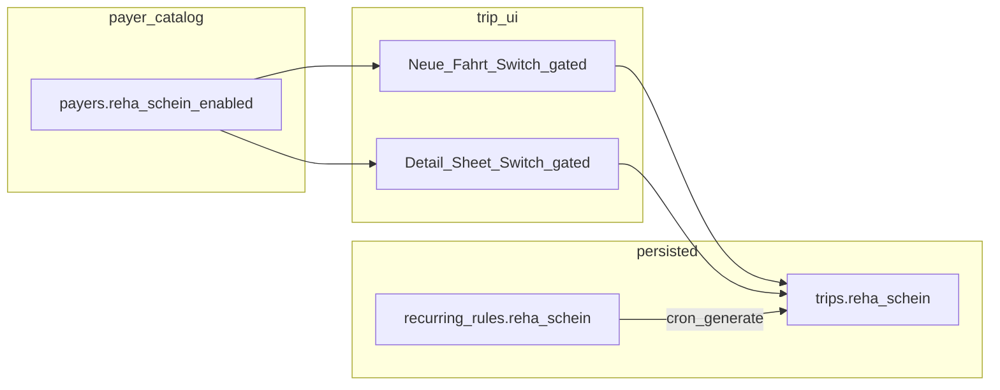

# Implementation Plan A — Reha Schein

## Prerequisites (read as specified)

Read the eleven code/doc files listed in your brief (migration models, [`database.types.ts`](src/types/database.types.ts) slices, [`payer.types.ts`](src/features/payers/types/payer.types.ts), [`payer-details-sheet.tsx`](src/features/payers/components/payer-details-sheet.tsx), [`payer-section.tsx`](src/features/trips/components/create-trip/sections/payer-section.tsx), [`trip-detail-sheet.tsx`](src/features/trips/trip-detail-sheet/trip-detail-sheet.tsx) KTS block, [`duplicate-trips.ts`](src/features/trips/lib/duplicate-trips.ts), [`build-return-trip-insert.ts`](src/features/trips/lib/build-return-trip-insert.ts), [`generate-recurring-trips/route.ts`](src/app/api/cron/generate-recurring-trips/route.ts), [`csv-export-constants.ts`](src/features/trips/components/csv-export/csv-export-constants.ts), [`kts-architecture.md`](docs/kts-architecture.md)).

**Critical correction:** `manual_km_enabled` is **not** saved via `PayersService.updatePayer`. It uses [`updatePayerManualKmEnabled`](src/features/payers/api/payers.service.ts) (lines **472–482**) plus query invalidations in [`payer-details-sheet.tsx`](src/features/payers/components/payer-details-sheet.tsx) (`handleManualKmEnabledChange`, **~214–227**). Reha payer gate must mirror **that** pattern, not `updatePayer`.

## Scope gap vs your “Files Changed” table

Implementing cleanly **requires these additional files** (otherwise the app will not compile or Neue Fahrt cannot read the gate):

| File | Why |
|------|-----|
| [`src/features/payers/api/payers.service.ts`](src/features/payers/api/payers.service.ts) | Extend `getPayers` **`select`** to include `reha_schein_enabled`; add **`updatePayerRehaScheinEnabled`** (same shape as [`updatePayerManualKmEnabled`](src/features/payers/api/payers.service.ts)). |
| [`src/features/trips/api/trip-reference-data.ts`](src/features/trips/api/trip-reference-data.ts) | [`fetchPayers`](src/features/trips/api/trip-reference-data.ts) currently selects only `id, name, kts_default, no_invoice_required_default` (**~32**). Add `reha_schein_enabled`. |
| [`src/features/trips/types/trip-form-reference.types.ts`](src/features/trips/types/trip-form-reference.types.ts) | Add `reha_schein_enabled: boolean` to [`PayerOption`](src/features/trips/types/trip-form-reference.types.ts). |
| [`src/features/trips/components/create-trip/schema.ts`](src/features/trips/components/create-trip/schema.ts) | Add `reha_schein: z.boolean().default(false)` (no refinements). |
| [`src/features/trips/components/create-trip/create-trip-form.tsx`](src/features/trips/components/create-trip/create-trip-form.tsx) | `defaultValues`, submit `baseTrip` / insert payload, and any **field reset** when payer changes (mirror how KTS is cleared when payer changes—only reset `reha_schein` when appropriate, e.g. `false` when switching payer or when new payer’s gate is false). |
| [`src/features/trips/trip-detail-sheet/lib/build-trip-details-patch.ts`](src/features/trips/trip-detail-sheet/lib/build-trip-details-patch.ts) | Extend `BuildTripDetailsPatchInput` with `rehaScheinDraft`; diff against `trip.reha_schein` and set `patch.reha_schein`. |
| [`src/features/trips/trip-detail-sheet/lib/paired-trip-sync.ts`](src/features/trips/trip-detail-sheet/lib/paired-trip-sync.ts) | **Parity with KTS:** add `'reha_schein'` to [`PAIRED_SYNC_COLUMN_KEYS`](src/features/trips/trip-detail-sheet/lib/paired-trip-sync.ts) (~24–61), extend `PartnerSyncDrafts`, and set `reha_schein` in [`buildPartnerSyncPatchFromDrafts`](src/features/trips/trip-detail-sheet/lib/paired-trip-sync.ts) (~227–267). Without this, linked-leg sync can drop Reha or skip paired prompts when only Reha changes. |

Optional but recommended: extend [`trips-listing.tsx`](src/features/trips/components/trips-listing.tsx) payer embed to `payer:payers(name, reha_schein_enabled)` only if the **detail sheet** reads payer from the list row—verify after reading how `TripDetailSheet` receives payer (likely [`getTripById`](src/features/trips/api/trips.service.ts) `payers(*)` already covers it).

**Recurring rules UI:** Your plan adds `recurring_rules.reha_schein` and cron propagation. There is **no** client form in the listed files to set it; new rules will stay **`false`** until a future UI (document this under “deferred” or “follow-up” in [`kts-architecture.md`](docs/kts-architecture.md)).

## Step 1 — Migration

- New file: **`supabase/migrations/20260514120000_reha_schein.sql`** (timestamp **after** latest `20260513220000_*`).
- Use **`public.payers` / `public.trips` / `public.recurring_rules`** (match project style; your snippet omitted `public.`).
- Content exactly: three `ALTER TABLE … ADD COLUMN IF NOT EXISTS` blocks as specified; **no** indexes, triggers, or RLS.
- **Comment (why):** `recurring_rules` column exists so **generated trips inherit** the flag from the rule on cron insert (same rationale as KTS fields).
- **Build gate:** `bun run build`.

## Step 2 — TypeScript types

- [`database.types.ts`](src/types/database.types.ts): add columns to **`Row` and matching `Insert` / `Update`** slices for `payers`, `trips`, and `recurring_rules` (Insert/Update are required for [`InsertTrip`](src/features/trips/api/trips.service.ts) and Supabase `update` typing).
- [`payer.types.ts`](src/features/payers/types/payer.types.ts): `reha_schein_enabled: boolean` adjacent to `manual_km_enabled`.
- **Build gate:** `bun run build`.

## Step 3 — Payer settings UI

- [`payers.service.ts`](src/features/payers/api/payers.service.ts): include `reha_schein_enabled` in `getPayers` select; add **`updatePayerRehaScheinEnabled(payerId, enabled, supabase)`** mirroring manual KM.
- [`payer-details-sheet.tsx`](src/features/payers/components/payer-details-sheet.tsx):
  - New card **directly below** the manual KM card (~491–511).
  - **`Switch`** + `handleRehaScheinEnabledChange`: same busy flag pattern as `manualKmToggleBusy` (separate `useState` or reuse pattern with distinct state).
  - Invalidate **`[PAYERS_QUERY_KEY]`** and **`referenceKeys.payers()`** on success (same as manual KM).
- **Labels:** module-level `const` strings (e.g. `REHA_SCHEIN_LABEL`, `REHA_SCHEIN_PAYER_HELPER`) to satisfy “no raw magic strings” without new files.
- **Build gate:** `bun run build`.

## Step 4 — Neue Fahrt

- [`trip-form-reference.types.ts`](src/features/trips/types/trip-form-reference.types.ts) + [`trip-reference-data.ts`](src/features/trips/api/trip-reference-data.ts): gate data on `PayerOption.reha_schein_enabled`.
- [`schema.ts`](src/features/trips/components/create-trip/schema.ts): `reha_schein` boolean default `false`.
- [`payer-section.tsx`](src/features/trips/components/create-trip/sections/payer-section.tsx): `FormField` `Switch` **below** KTS block, visible iff `watchedPayerId && selectedPayer?.reha_schein_enabled` (resolve selected payer from `payers.find(id)` like other payer-driven UI).
- [`create-trip-form.tsx`](src/features/trips/components/create-trip/create-trip-form.tsx): ensure submit payload passes `reha_schein` (and defaults on payer change consistent with UX—typically reset to `false` when payer changes or gate is false).
- **Build gate:** `bun run build`.

## Step 5 — Trip detail sheet + patch + paired sync

- **Fetch shape:** Confirm trip load path (`getTripById` selects `payers(*)` in [`trips.service.ts`](src/features/trips/api/trips.service.ts)—full payer row will include `reha_schein_enabled` once DB + types align). If any code path embeds only `payers(name)`, extend that select minimally.
- [`trip-detail-sheet.tsx`](src/features/trips/trip-detail-sheet/trip-detail-sheet.tsx):
  - State: `rehaScheinDraft` + hydrate from `trip.reha_schelin` ~~ `trip.reha_schein` ~~ in the same effect as KTS drafts (~512 region).
  - UI: **`Switch`** labelled **„Reha-Schein"**, **below** the KTS-Fehler / textarea block **and below** main KTS `Switch`, only when payer has `reha_schein_enabled`.
  - Include in dirty-footprint compare and [`buildTripDetailsPatch`](src/features/trips/trip-detail-sheet/lib/build-trip-details-patch.ts) input.
  - Pass `rehaScheinDraft` into [`paired-trip-sync`](src/features/trips/trip-detail-sheet/lib/paired-trip-sync.ts) `PartnerSyncDrafts` builder call sites (~814–876 region—adjust line numbers during implementation).
- [`build-trip-details-patch.ts`](src/features/trips/trip-detail-sheet/lib/build-trip-details-patch.ts): conditional patch for `reha_schein` vs `trip.reha_schein`.
- [`paired-trip-sync.ts`](src/features/trips/trip-detail-sheet/lib/paired-trip-sync.ts): as described above.
- **Build gate:** `bun run build`.

## Step 6 — Propagation + cron + tests

- [`duplicate-trips.ts`](src/features/trips/lib/duplicate-trips.ts): add **`reha_schein`** to [`copyRouteAndPassengerFields`](src/features/trips/lib/duplicate-trips.ts) Pick union and returned object (**~220–316**)—copy **`!!source.reha_schein`** (no `kts_source`-style sentinel unless you explicitly want symmetry; absent product spec, mirror boolean only).
- [`build-return-trip-insert.ts`](src/features/trips/lib/build-return-trip-insert.ts): set `reha_schein` from **`outbound.reha_schein`** (**~71–119** alongside KTS fields).
- [`generate-recurring-trips/route.ts`](src/app/api/cron/generate-recurring-trips/route.ts): add `reha_schein: rule.reha_schein ?? false` inside [`buildTripPayload`](src/app/api/cron/generate-recurring-trips/route.ts) return (**~322+**) and mirror into any **`TripInsert`** spread paths where `outboundPayload` / `returnPayload` get recomputed (**~580+**, **~650+**) if fields are reiterated for `computeTripPrice` wrappers (follow existing `kts_document_applies` pattern).
- **Build gate:** `bun run build`.
- **`bun test`:** Fix any fixtures/types that instantiate full trip objects (minimal diffs).

## Step 7 — Documentation + “why” comments

- [`docs/kts-architecture.md`](docs/kts-architecture.md): new **„Reha-Schein"** section: payer gate, trip flag, `recurring_rules` mirror purpose, UI surfaces + condition, propagation list, explicit non-goals (no error/reason, no pricing, no CSV/PDF/checking tab yet), and **optional** note that **recurring rule UI** doesn’t expose the flag yet.
- Inline **why** comments (migration, payer-details gate, conditional Switches in trip UIs, each propagation site, paired-sync key list entry).

---

## Naming and invariants

- DB: **`reha_schein`** / **`reha_schein_enabled`** (snake_case English, consistent with `manual_km_enabled`).
- Do **not** touch KTS-specific logic ordering, refinement, or paired KTS behaviours.

## Build discipline

After **each** numbered step (and tests after step 6): run **`bun run build`** (and **`bun test`** where mandated). Stop on failure.

