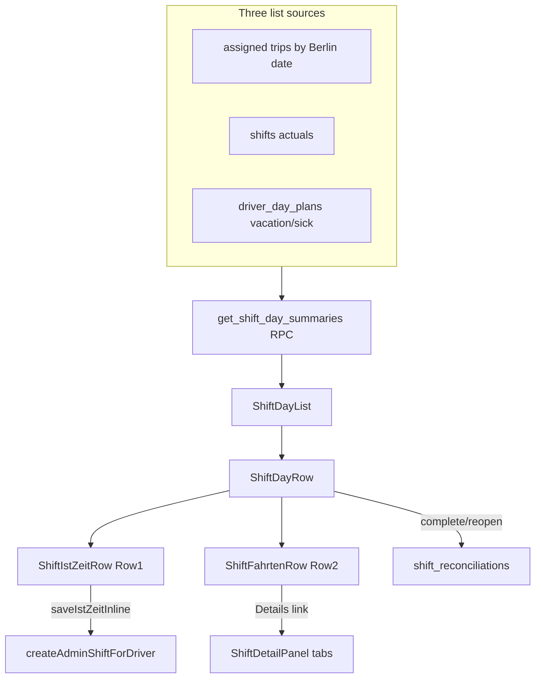

# Schichtzettel Phase A — Unified Workspace

## Architecture



## Hard rules (updated)

- `bun run build` after **every** step before proceeding.
- `status` column DEFAULT `'completed'` — never change default to `'open'`.
- **`showIstZeit` assignment:** hardcoded `true` in [`shift-day-list.tsx`](src/features/shift-reconciliations/components/shift-day-list.tsx) only; documented on `IstZeitRowProps` in [`types.ts`](src/features/shift-reconciliations/types.ts). Passthrough props OK; no scattered `if (showIstZeit)` elsewhere.
- `saveIstZeitInline` **must** call [`createAdminShiftForDriver`](src/features/driver-planning/api/admin-shifts.service.ts) — no duplicated timezone/upsert logic.
- Inline save: silent success (no toast, no navigation).
- Phase B placeholder comment in [`shift-day-row.tsx`](src/features/shift-reconciliations/components/shift-day-row.tsx) is mandatory.
- Kilometer tab: placeholder UI only — no schema/service.
- Do **not** change: `ShiftTimeForm`, trips service, `updateTripManualPrice`, `upsertDayPlan`, `/driver/shift`.
- **RPC migration:** never DROP a function across separate migrations. Within one migration file, **`DROP FUNCTION IF EXISTS` + `CREATE FUNCTION`** in the same transaction when `RETURNS TABLE` columns change (PostgreSQL cannot `CREATE OR REPLACE` with a different return type).

## Pre-flight verification (Step 1b)

Before writing DROP, confirm from [`20260502120002_billing_type_accepts_self_payment.sql`](supabase/migrations/20260502120002_billing_type_accepts_self_payment.sql):

```sql
DROP FUNCTION IF EXISTS public.get_shift_day_summaries(uuid, uuid);
-- exact signature: (p_driver_id uuid, p_company_id uuid)
```

Re-apply in the **same migration file** after CREATE:

```sql
GRANT EXECUTE ON FUNCTION public.get_shift_day_summaries(uuid, uuid) TO authenticated;
COMMENT ON FUNCTION public.get_shift_day_summaries IS '...';
```

Include WHY comment block per user spec:

```sql
-- WHY DROP instead of CREATE OR REPLACE: PostgreSQL requires DROP when
-- RETURNS TABLE columns change — CREATE OR REPLACE only works when the
-- return type is identical. DROP + CREATE in the same transaction is
-- atomic — no window where the function is missing.
```

---

## Step 1 — Migrations

### 1a — [`supabase/migrations/<ts>_add_reconciliation_status.sql`](supabase/migrations/)

```sql
ALTER TABLE public.shift_reconciliations
  ADD COLUMN IF NOT EXISTS status text
    NOT NULL DEFAULT 'completed'
    CHECK (status IN ('open', 'completed'));
```

Comment as specified (existing rows implied completion via `confirmShift`).

### 1b — [`supabase/migrations/<ts+1>_update_shift_day_summaries.sql`](supabase/migrations/)

Replace RPC with three-source union (FULL OUTER JOIN pattern via `UNION` of date keys + LEFT JOINs):

| Source | Logic |
|--------|-------|
| Trip days | Existing assigned-trip aggregation; use `COALESCE(bt.accepts_self_payment, p.accepts_self_payment)` (from [`20260502120002`](supabase/migrations/20260502120002_billing_type_accepts_self_payment.sql)) |
| Shift-only days (D3) | `shifts` where Berlin `(started_at AT TIME ZONE 'Europe/Berlin')::date` has **no** assigned trips |
| Plan-only days | `driver_day_plans` where `status IN ('vacation', 'sick')` and no trip/shift row for that date |

**Return columns** (rename `shift_date` → `date`):

- `date`, `day_type` (`trips` \| `shift_only` \| `plan_only`)
- `total_trips`, `selbstzahler_count`, `rechnung_count`, `total_revenue` (sum `COALESCE(manual_gross_price, gross_price)` all trips)
- `shift_started_at`, `shift_ended_at`, `shift_break_minutes` (paired `break_start`/`break_end` from `shift_events`, sum minutes)
- `shift_entered_by` (`shifts.entered_by`)
- `reconciliation_status` (`shift_reconciliations.status` or NULL)
- `plan_status` (`driver_day_plans.status` or NULL)

**`day_type` CASE precedence:** `plan_only` when plan is vacation/sick and no trips; else `trips` when `total_trips > 0`; else `shift_only` when shift exists; else default `trips` with zeros.

**Removed from list RPC:** `is_reconciled`, `self_pay_total`, `unconfigured_count`, `reconciled_by_name` — detail view still uses `getReconciliation` + `ShiftSummaryBar` for unconfigured payer alert.

After both migrations: `bun run db:types` → update [`database.types.ts`](src/types/database.types.ts) `shift_reconciliations.status` + RPC return type.

**BUILD GATE**

---

## Step 2 — Types

File: [`src/features/shift-reconciliations/types.ts`](src/features/shift-reconciliations/types.ts)

- Add `ReconciliationStatus`, `RECONCILIATION_STATUS`, `ShiftDayType`
- Extend `ShiftDaySummary` with all new RPC fields; rename `shift_date` → `date` (update [`group-by-month.ts`](src/features/shift-reconciliations/lib/group-by-month.ts))
- Add `IstZeitRowProps` exactly as spec (with Option B / Option A WHY on `showIstZeit`)
- Extend `ShiftReconciliation` / `ShiftReconciliationWithMeta` with `status: ReconciliationStatus`

**BUILD GATE**

---

## Step 3 — Service layer

File: [`src/features/shift-reconciliations/api/shift-reconciliations.service.ts`](src/features/shift-reconciliations/api/shift-reconciliations.service.ts)

### 3a — Rename `confirmShift` → `completeReconciliation`

Update all callers in same step: [`actions.ts`](src/features/shift-reconciliations/actions.ts), [`use-confirm-shift.ts`](src/features/shift-reconciliations/hooks/use-confirm-shift.ts) (rename hook to `use-complete-reconciliation.ts`).

**D1 gate (Option B):** Before upsert, load shift via same window as today (`getZonedDayBoundsIso` + `shifts` query):

- **No shift row** → proceed (hourly skip allowed)
- **Shift row exists** with `started_at` AND `ended_at` both non-null → proceed
- **Shift row exists** with either null → throw `IST_ZEIT_INCOMPLETE`

Note: spec text says "no started_at" but `shifts.started_at` is NOT NULL on insert; implement as **incomplete pair** (`ended_at IS NULL` or missing end in practice). Client-side partial inline state (one time filled, not saved) is handled in UI separately.

Upsert with `status: 'completed'`.

### 3b — `reopenReconciliation(driverId, date)`

`UPDATE … SET status = 'open', confirmed_by = userId, confirmed_at = now()` — throw `RECONCILIATION_NOT_FOUND` if no row (D2 audit trail).

### 3c — `saveIstZeitInline({ driverId, date, startTime, endTime, breakMinutes })`

- Validate both times present before calling admin service
- Convert `breakMinutes` → single break pair for `createAdminShiftForDriver`:
  - `0` → `breaks: undefined`
  - `> 0` → one centered break interval (start/end HH:mm derived from start/end times so event duration equals `breakMinutes`; document formula in inline comment)
- **Import** `createAdminShiftForDriver` from [`admin-shifts.service.ts`](src/features/driver-planning/api/admin-shifts.service.ts) directly (not `createAdminShiftAction`) to avoid wrong `revalidatePath`

### 3d — Update `mapRpcShiftDaySummary` + `getShiftDaySummaries` for new shape

**BUILD GATE**

---

## Step 4 — Actions

File: [`src/features/shift-reconciliations/actions.ts`](src/features/shift-reconciliations/actions.ts)

Structured results (match [`driver-planning/actions.ts`](src/features/driver-planning/actions.ts) pattern):

| Action | Error mapping | Revalidate |
|--------|---------------|----------|
| `completeReconciliationAction` | `IST_ZEIT_INCOMPLETE` → German message | `/dashboard/shift-reconciliations` |
| `reopenReconciliationAction` | `RECONCILIATION_NOT_FOUND` → `NOT_FOUND` | same |
| `saveIstZeitInlineAction` | generic `error: string` | same |

Deprecate/remove `confirmShiftReconciliationAction` alias after rename.

**BUILD GATE**

---

## Step 5 — `ShiftIstZeitRow`

New: [`shift-ist-zeit-row.tsx`](src/features/shift-reconciliations/components/shift-ist-zeit-row.tsx)

- Props: `IstZeitRowProps`; `if (!showIstZeit) return null`
- Pre-fill from `startedAt`/`endedAt`/`breakMinutes` via `parseScheduledAtOrFallback` (Berlin HH:mm)
- **Arbeitsstunden:** `(Ende − Beginn − Pause)` → `"8,0 Std."` via `Intl.NumberFormat('de-DE', …)` — see Implementation notes (comma, not period)
- **€/h:** `totalRevenue / arbeitsstunden` only when both > 0
- Save on blur + Enter; loading opacity 0.6; inline error; **no success toast**
- Hook: `useSaveIstZeitInline` → invalidates `shiftReconciliationKeys.summaries(driverId)`

Mandatory WHY comments per spec.

**BUILD GATE**

---

## Step 6 — `ShiftFahrtenRow`

New: [`shift-fahrten-row.tsx`](src/features/shift-reconciliations/components/shift-fahrten-row.tsx)

- Flex split bar (Selbstzahler primary tint vs Rechnung blue tint)
- `detailHref`: `/dashboard/shift-reconciliations?driver=${id}&date=${date}&mode=detail`
- `shift_only` + zero trips → muted "Keine Fahrten erfasst" + Details link still shown

**BUILD GATE**

---

## Step 7 — `ShiftDayRow`

New: [`shift-day-row.tsx`](src/features/shift-reconciliations/components/shift-day-row.tsx)

**Header:** date (de locale) | status badge | Abschließen / Erneut öffnen

| Badge | Condition |
|-------|-----------|
| Nicht geprüft | `reconciliation_status` null |
| In Bearbeitung | `open` |
| Abgeschlossen | `completed` |
| Plan badge | `plan_only` — reuse [`plan-status-badge.tsx`](src/features/driver-planning/components/plan-status-badge.tsx) or equivalent for vacation/sick |

**Actions:**

- `plan_only` → header only, no rows, no buttons
- Abschließen disabled when: shift exists in RPC with incomplete times (`shift_started_at` XOR `shift_ended_at`) OR local Ist-Zeit partial state
- Completed → `Erneut öffnen` → `reopenReconciliationAction`

**Rows:** `ShiftIstZeitRow` → `ShiftFahrtenRow` → `{/* Phase B: ShiftFahrtenbuchRow — vehicle_shift_logs */}`

**BUILD GATE**

---

## Step 8 — Rewrite `ShiftDayList`

File: [`shift-day-list.tsx`](src/features/shift-reconciliations/components/shift-day-list.tsx)

- Remove expand/collapse + inline `ShiftDetailPanel`
- Map days → `<ShiftDayRow summary={…} showIstZeit={true} />` with mandatory Option B comment
- Empty state: "Keine Schichten gefunden"
- Keep month grouping via updated `groupByMonth` (`day.date`)

Update [`shift-reconciliation-page-client.tsx`](src/features/shift-reconciliations/components/shift-reconciliation-page-client.tsx) header comment: list no longer embeds detail; `mode=detail` still opens full `ShiftDetailPanel`.

**BUILD GATE**

---

## Step 9 — Detail panel tabs

File: [`shift-detail-panel.tsx`](src/features/shift-reconciliations/components/shift-detail-panel.tsx)

shadcn `Tabs`:

| Tab | Content |
|-----|---------|
| Fahrten | Existing `ShiftSummaryBar` + `ShiftTripsTable` |
| Ist-Zeit | `AdminShiftEntryForm` with `onSaved` → refetch queries (do **not** close/navigate) |
| Kilometer | Placeholder Card + Phase B comment |
| Abschluss | D1 checklist + complete/reopen + notes textarea |

Delete [`shift-confirm-button.tsx`](src/features/shift-reconciliations/components/shift-confirm-button.tsx) — only used here (verified via grep).

Replace [`use-confirm-shift.ts`](src/features/shift-reconciliations/hooks/use-confirm-shift.ts) usage in Abschluss tab.

**BUILD GATE**

---

## Step 10 — Summary bar

File: [`shift-summary-bar.tsx`](src/features/shift-reconciliations/components/shift-summary-bar.tsx)

Status-aware badge text:

- `completed` → "Abgeschlossen von …"
- `open` → "In Bearbeitung"
- null → "Noch nicht geprüft"

Pass `reconciliation.status` from updated `getReconciliation` select.

**BUILD GATE**

---

## Step 11 — Deep link

File: [`day-plan-edit-popover.tsx`](src/features/driver-planning/components/day-plan-edit-popover.tsx)

Below `AdminShiftEntryForm` in Ist-Zeit tab:

```tsx
<Link href={`/dashboard/shift-reconciliations?driver=${driverId}&date=${planDate}&mode=detail`}>
  Vollständigen Abgleich öffnen →
</Link>
```

(D4: full-page navigation, not sheet — satisfies product decision via popover shortcut; no cell-level navigation in this phase.)

**BUILD GATE**

---

## Step 12 — Docs + mandatory comments

- [`docs/shift-reconciliations.md`](docs/shift-reconciliations.md) — Phase A section (two-row design, showIstZeit pattern, status migration, D1–D5, day types, €/h rules, Abschluss prerequisites, deep link)
- [`docs/driver-planning.md`](docs/driver-planning.md) — cross-reference to Phase A
- Inline WHY comments in: `shift-ist-zeit-row.tsx`, `shift-day-row.tsx`, `shift-day-list.tsx`, `shift-reconciliations.service.ts`, Step 1b migration

**Final BUILD GATE:** `bun run build`

---

## Implementation notes

### D1 naming collision

[`docs/driver-planning.md`](docs/driver-planning.md) Phase 4 uses D1–D4 for **admin shift entry** rules. Phase A reconciliation decisions are **separate D1–D5** — document clearly in Phase A section to avoid confusion.

### `breakMinutes` → `createAdminShiftForDriver`

Admin service expects `breaks: Array<{ start, end }>`. Derive one synthetic pair whose duration equals `breakMinutes` (centered in shift window) so `shift_break_minutes` RPC and payroll math stay consistent.

### Arbeitsstunden helper (verified — German decimal comma)

Reuse minute math from [`shift-entry-form.tsx`](src/features/driver-portal/components/shift-entry-form.tsx) (`parseTimeToMinutes` pattern: handle overnight end, subtract pause minutes).

**Display format is mandatory de-DE comma, not JS default period:**

- Output: `"8,0 Std."` — **not** `"8.0 Std."`
- Implementation: `Intl.NumberFormat('de-DE', { minimumFractionDigits: 1, maximumFractionDigits: 1 }).format(hoursDecimal) + ' Std.'`
- Example: 8 hours exactly → `"8,0 Std."`; 7.5 hours → `"7,5 Std."`
- Show `"—"` when either Beginn or Ende is empty

**€/h** uses the same locale: `Intl.NumberFormat('de-DE', { style: 'currency', currency: 'EUR' }).format(rate) + '/h'` → `"47,50 €/h"` (reuse [`SHIFT_RECONCILIATION_CURRENCY_LOCALE`](src/features/shift-reconciliations/lib/constants.ts) constant).

Do **not** use `formatPaidDuration` (returns `"8 h 0 min"`) or raw `toFixed(1)` (always period).

### Query invalidation (verified — driver-scoped, no month key)

Confirmed in [`query-keys.ts`](src/features/shift-reconciliations/lib/query-keys.ts):

```typescript
summaries: (driverId: string) =>
  [SHIFT_RECONCILIATIONS_QUERY_ROOT, 'summaries', driverId] as const
```

- **No month/date segment** — one query loads **all days** for the driver (RPC `ORDER BY date DESC`).
- Month sections in the list are **client-side only** ([`group-by-month.ts`](src/features/shift-reconciliations/lib/group-by-month.ts)); there is no month-filtered cache today.
- Invalidating `shiftReconciliationKeys.summaries(driverId)` therefore refreshes the **entire** list, including days in other month scroll sections — correct for inline save on any visible row.

Existing pattern already matches ([`use-update-trip-price.ts`](src/features/shift-reconciliations/hooks/use-update-trip-price.ts), [`use-confirm-shift.ts`](src/features/shift-reconciliations/hooks/use-confirm-shift.ts)): invalidate `summaries(driverId)` + `trips(driverId, date)` + `record(driverId, date)`.

**Phase A rule:** all three hooks (`useSaveIstZeitInline`, `useCompleteReconciliation`, `useReopenReconciliation`) must follow the same triple invalidation. Do **not** add a month key unless a future month-scoped query is introduced (would break refresh unless invalidation scope is updated).

### Manual test plan

Execute all 12 scenarios from user spec after Step 12 (inline save, Row 2 navigation, Option B complete without times, partial block, reopen, shift-only day, Urlaub/Krank, detail tabs, deep link, €/h conditions).
