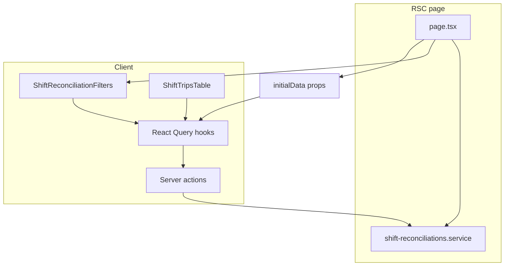

# Schichtzettel reconciliation — implementation plan

## Corrections to the written spec (must follow)

These differ from the brief’s Step 6 / service placement; they match the actual repo.

### Navigation icon (Step 6)

[`NavItem`](src/types/index.ts) uses `icon?: keyof typeof Icons`, and [`nav-config.ts`](src/config/nav-config.ts) passes string keys (`'dashboard'`, `'user'`, …), not Lucide components.

- Add a new entry to [`src/components/icons.tsx`](src/components/icons.tsx) (e.g. Tabler `IconClipboardCheck` or similar from the existing `@tabler/icons-react` import style).
- In [`src/config/nav-config.ts`](src/config/nav-config.ts), add the **Account** child with `icon: '<newKey>'` after the Fahrer item, `url: '/dashboard/shift-reconciliations'`, and a **new shortcut** pair that does not collide (see existing combinations in the same file).

### Server-only service vs client hooks (Step 3–4)

[`createClient()`](src/lib/supabase/server.ts) from `@/lib/supabase/server` uses `cookies()` and is **only valid in Server Components, Route Handlers, or Server Actions**—not in client components.

The repo currently has **no** `use server` actions (grep is empty).

> This means we are introducing the `'use server'` pattern for the first time in this codebase. Cursor must read `docs/SUPABASE_INTEGRATION.md` and `docs/server-state-query.md` fully before writing `actions.ts` to ensure the pattern is consistent with the project's existing architecture conventions. The actions file is a thin delegation layer — no business logic lives there.

To keep the service server-only **and** use `useMutation` / `useQuery` in client UI:

- Implement [`src/features/shift-reconciliations/api/shift-reconciliations.service.ts`](src/features/shift-reconciliations/api/shift-reconciliations.service.ts) with `createClient` from `@/lib/supabase/server` (as you specified).
- Add **[`src/features/shift-reconciliations/actions.ts`](src/features/shift-reconciliations/actions.ts)** (or colocated `*.actions.ts`) with `'use server'` wrappers that call the service—one exported async function per operation the hooks need (`getTripsForShift`, `getReconciliation`, `updateTripManualPrice`, `confirmShift`, and optionally `getDrivers` if not only loaded in RSC).
- Hooks in [`src/features/shift-reconciliations/hooks/`](src/features/shift-reconciliations/hooks/) use `useQuery` / `useMutation` with `queryFn` / `mutationFn` calling these **server actions** (not importing the service module into client code).

RSC [`page.tsx`](src/app/dashboard/shift-reconciliations/page.tsx) may call the service **directly** (same as triage) for initial data and pass `initialData` / `staleTime: 0` into client children to avoid a double fetch on first paint.

### Trip time column name

`trips` has **`scheduled_at`**, not `pickup_time`. In [`types.ts`](src/features/shift-reconciliations/types.ts) use `scheduled_at` (or keep an internal alias, but the query and sort must use the real column).

### Date filter for `getTripsForShift`

Do **not** use naive `YYYY-MM-DDT00:00:00.000Z` / end-of-UTC-day only. Reuse the same business-timezone day bounds as Fahrten: [`getZonedDayBoundsIso`](src/features/trips/lib/trip-business-date.ts) and filter `scheduled_at` with `gte` / `lt` the returned `startISO` / `endExclusiveISO`—see [`trips-listing.tsx`](src/features/trips/components/trips-listing.tsx) (~214) pattern and [`docs/trips-date-filter.md`](docs/trips-date-filter.md).

### Trip status filter

The plan uses **`status = 'assigned'`** only. That matches your scope but **excludes** `in_progress` / `completed` trips (often on a paper Schichtzettel). **Deferred** per your list—call this out in `docs/shift-reconciliations.md` so the limitation is explicit.

### Tests (Step 8)

[`package.json`](package.json) `"test"` runs `bun test src/features/invoices/lib/__tests__` only. The final build gate for this feature is: (1) `bun run build` passes with zero errors, and (2) `bun test` passes without regression — meaning the existing invoice tests must still pass. No new tests are required for this feature unless `getEffectivePrice` and `isSelfPay` unit tests are explicitly added (optional, out of scope). Do not treat a passing `bun test` as validating the new feature — it only confirms no regression.

---

## Step 1 — Migration

Create [`supabase/migrations/<timestamp>_shift_reconciliations.sql`](supabase/migrations/) exactly as in your spec:

- `payers.accepts_self_payment` nullable boolean + comment.
- `shift_reconciliations` table, `UNIQUE (company_id, driver_id, date)`, nullable `shift_id` FK, `ON DELETE SET NULL` on `shift_id` as specified.
- RLS: single policy `FOR ALL` with `current_user_company_id()` and `current_user_is_admin()` (same spirit as [20260409170000_add_missing_rls.sql](supabase/migrations/20260409170000_add_missing_rls.sql) payers block)—assumes these helpers already exist in DB from prior migrations.

After the `shift_reconciliations` table (and its indexes/RLS) are in place in the same migration file, add the **RPC: `get_shift_day_summaries`** block below, before the migration file’s closing section.

---

**RPC: `get_shift_day_summaries`**

Add this function to the migration file. It returns one row per calendar day that has at least one assigned trip for the given driver, enriched with reconciliation status:

```sql
CREATE OR REPLACE FUNCTION public.get_shift_day_summaries(
  p_driver_id   uuid,
  p_company_id  uuid
)
RETURNS TABLE (
  shift_date          date,
  total_trips         bigint,
  self_pay_count      bigint,
  self_pay_total      numeric,
  invoice_count       bigint,
  unconfigured_count  bigint,
  is_reconciled       boolean,
  reconciled_by_name  text,
  reconciled_at       timestamptz
)
LANGUAGE sql
STABLE
SECURITY DEFINER
AS $$
  SELECT
    (t.scheduled_at AT TIME ZONE 'Europe/Berlin')::date   AS shift_date,
    COUNT(*)                                               AS total_trips,
    COUNT(*) FILTER (WHERE p.accepts_self_payment = true)  AS self_pay_count,
    COALESCE(
      SUM(
        COALESCE(t.manual_gross_price, t.gross_price)
      ) FILTER (WHERE p.accepts_self_payment = true),
      0
    )                                                      AS self_pay_total,
    COUNT(*) FILTER (WHERE p.accepts_self_payment = false) AS invoice_count,
    COUNT(*) FILTER (WHERE p.accepts_self_payment IS NULL) AS unconfigured_count,
    (sr.id IS NOT NULL)                                    AS is_reconciled,
    a.full_name                                            AS reconciled_by_name,
    sr.confirmed_at                                        AS reconciled_at
  FROM public.trips t
  JOIN public.payers p
    ON p.id = t.payer_id
  LEFT JOIN public.shift_reconciliations sr
    ON  sr.driver_id   = t.driver_id
    AND sr.company_id  = t.company_id
    AND sr.date        = (t.scheduled_at AT TIME ZONE 'Europe/Berlin')::date
  LEFT JOIN public.accounts a
    ON a.id = sr.confirmed_by
  WHERE
    t.driver_id  = p_driver_id
    AND t.company_id = p_company_id
    AND t.status     = 'assigned'
  GROUP BY
    shift_date,
    sr.id,
    a.full_name,
    sr.confirmed_at
  ORDER BY
    shift_date DESC;
$$;

GRANT EXECUTE ON FUNCTION public.get_shift_day_summaries(uuid, uuid)
  TO authenticated;

COMMENT ON FUNCTION public.get_shift_day_summaries IS
  'Returns one aggregated row per calendar day (Europe/Berlin timezone) for a given driver.
   Used by the Schichtzettel list view to show shift summaries without loading full trip rows.
   Only trips with status = assigned are included (deferred: completed trips).
   self_pay_total uses manual_gross_price when set, falling back to gross_price.
   SECURITY DEFINER runs as owner; RLS on trips and shift_reconciliations still enforced
   via the WHERE company_id filter.';
```

**Invariants for this RPC:**

- Timezone is hardcoded to `Europe/Berlin` — same as `getZonedDayBoundsIso` in the frontend utility
- `manual_gross_price` takes priority over `gross_price` in the sum — consistent with `getEffectivePrice` in types.ts
- Returns zero rows when the driver has no assigned trips — never errors
- `is_reconciled` is false when no `shift_reconciliations` row exists for that day — the LEFT JOIN handles this
- `SECURITY DEFINER` is used so the function can join `accounts` for `reconciled_by_name` without requiring the caller to have direct SELECT on accounts; the company_id WHERE clause enforces tenant isolation

**Build:** `bun run build`

---

## Step 2 — `database.types.ts`

Additive edits only, with `// TODO: regenerate with supabase gen types` on new/changed `payers` fields and the whole `shift_reconciliations` table block.

- Extend `payers` Row/Insert/Update for `accepts_self_payment`.
- Add full `shift_reconciliations` table typings (Row/Insert/Update/Relationships) per your shape; if `Update` is too narrow for future admin edits, keep it minimal as specified.

Add the RPC return type to `database.types.ts` **Functions** block:

```typescript
// TODO: regenerate with `supabase gen types` after migration
get_shift_day_summaries: {
  Args: {
    p_driver_id: string
    p_company_id: string
  }
  Returns: {
    shift_date: string           // date as YYYY-MM-DD string
    total_trips: number
    self_pay_count: number
    self_pay_total: number
    invoice_count: number
    unconfigured_count: number
    is_reconciled: boolean
    reconciled_by_name: string | null
    reconciled_at: string | null
  }[]
}
```

**Build:** `bun run build`

---

## Step 3 — Feature types + service

- [`src/features/shift-reconciliations/types.ts`](src/features/shift-reconciliations/types.ts) — your `ShiftTrip`, `ShiftReconciliation`, `getEffectivePrice`, `isSelfPay`, `isUnconfiguredPayer` (use `scheduled_at` in `ShiftTrip`). Also add `ShiftDaySummary`:

```typescript
export type ShiftDaySummary = {
  shift_date: string
  total_trips: number
  self_pay_count: number
  self_pay_total: number
  invoice_count: number
  unconfigured_count: number
  is_reconciled: boolean
  reconciled_by_name: string | null
  reconciled_at: string | null
}
```

- [`src/features/shift-reconciliations/api/shift-reconciliations.service.ts`](src/features/shift-reconciliations/api/shift-reconciliations.service.ts):

  - **`getDrivers`**: `accounts` where `company_id = <tenant>` and `role = 'driver'` and `is_active` if that column is used; return display name from `name` or composed `first_name`/`last_name` (match [`driver-select-cell`](src/features/trips/hooks/use-trip-reference-queries.ts) / drivers listing).

  - **`getTripsForShift`**: `eq('driver_id', driverId)`, `eq('status', 'assigned')` (string constant), date range via `getZonedDayBoundsIso(date)`, `select` on trips + `payer:payers!trips_payer_id_fkey(...)` embed. Order by `scheduled_at` ascending. Map to `ShiftTrip`.

  - **`updateTripManualPrice`**: `from('trips').update({ manual_gross_price: value }).eq('id', tripId)` only—**never** `gross_price`, `net_price`, `base_net_price`, `approach_fee_net`. Do **not** import [`tripsService`](src/features/trips/api/trips.service.ts).

  - **`confirmShift`**: get `company_id` from session account; `upsert` on `(company_id, driver_id, date)` or insert + handle conflict; set `confirmed_by` to current user id from server context; `shift_id` (optional): before upserting, attempt a single lookup of `shifts` for this `driver_id` within the business-day bounds returned by `getZonedDayBoundsIso(date)` (same pattern as `getShiftForDriverByDate` in `shifts.service.ts`). If a row is found, include its `id` as `shift_id`. If no row is found, or if the lookup throws, proceed with `shift_id: null` — the absence of a shift row must never block or fail the confirmation. Add a why-comment on this lookup explaining that `shifts` rows are driver-created and may legitimately not exist for a given reconciliation date.

  - **`getReconciliation`**: `maybeSingle` by `company_id`, `driver_id`, `date`.

  - **`getShiftDaySummaries`**: fetch aggregated day summaries for the list view. Calls the `get_shift_day_summaries` RPC — returns one row per day, ordered newest first. Used only in **State B** (driver selected, no date). Never called in **State C** (detail view). `getShiftDaySummaries(driverId: string): Promise<ShiftDaySummary[]>`. Implementation: `supabase.rpc('get_shift_day_summaries', { p_driver_id: driverId, p_company_id: companyId })` with `companyId` from the server session (same pattern as `confirmShift`). Return the data array typed as `ShiftDaySummary[]`.

- Add **server actions** file calling the above (see “Corrections”), including a **thin wrapper** for `getShiftDaySummaries` (same delegation pattern as the other actions).

**Inline why-comments** (per Step 8) on bypassing `tripsService` and on nullable `shift_id`.

**Build:** `bun run build`

---

## Step 4 — Query keys and hooks

- Add [`src/features/shift-reconciliations/lib/query-keys.ts`](src/features/shift-reconciliations/lib/query-keys.ts) (or under `src/query/`) exporting namespaced keys/factory: base `'shift-reconciliations'`, `trips(driverId, date)`, `record(driverId, date)`, `summaries(driverId)`—**no** collision with `tripKeys` or `PAYERS_QUERY_KEY`.

- Hooks mirror style in [`src/features/trips/hooks/`](src/features/trips/hooks/) (e.g. `useQuery`, `useMutation`, `queryClient.invalidateQueries` on success):
  - `use-shift-trips.ts`
  - `use-shift-reconciliation.ts`
  - `use-update-trip-price.ts`
  - `use-confirm-shift.ts`
  - `use-shift-day-summaries.ts` — `useQuery` wrapping `getShiftDaySummaries(driverId)`; key `['shift-reconciliations', 'summaries', driverId]`; **enabled** only when `driverId` is defined; `staleTime: 5 * 60 * 1000` (5 minutes — summaries do not need real-time freshness). When `useConfirmShift` mutation succeeds, it must **additionally** invalidate `['shift-reconciliations', 'summaries', driverId]` so the reconciliation badge updates immediately in the list without a manual reload.
- [`src/features/shift-reconciliations/hooks/index.ts`](src/features/shift-reconciliations/hooks/index.ts) barrel export.

`queryFn` calls server actions, not the service, from client components.

**Build:** `bun run build`

---

## Step 5 — UI components and page

The page has **three** URL-driven states. Components are built for each state. Existing detail components from the original plan (summary bar, trips table, confirm button) become the **expanded panel** — their internal logic is unchanged.

---

**URL state contract (nuqs):**

- `?driver=<id>` — driver selected
- `?driver=<id>&date=YYYY-MM-DD` — driver + date (detail mode)
- No params — empty prompt

The date param, when set, must be a valid `YYYY-MM-DD` string. Default date for the date picker (when opened) is today in `Europe/Berlin` timezone using the existing [`todayYmdInBusinessTz`](src/features/trips/lib/trip-business-date.ts) utility.

---

**`shift-reconciliation-filters.tsx`**

- Driver dropdown (pre-populated from RSC `getDrivers()`) + date picker (shadcn DatePicker, optional/clearable)
- Clears the `date` param when the driver changes — prevents stale date+driver combinations
- Clearing the date returns to list mode (State B)
- When date is cleared, push `?driver=<id>` only — no `date` param

---

**`shift-day-list.tsx`** *(new — State B only)*

Renders the grouped monthly list when a driver is selected but no date is chosen.

Structure:

- Group `ShiftDaySummary[]` by calendar month (derived from `shift_date`) — newest month first
- Each month renders a section header: "April 2026", "März 2026", etc. (German locale, `de-DE`)
- Each day renders as one row with:
  - Left: weekday + date — "Mo, 28. Apr" (German short format)
  - Centre: "Fahrten gesamt: N · Selbstzahler: XX,XX € (N) · Rechnung: N Fahrten" — show amber dot if `unconfigured_count > 0`
  - Right: reconciliation badge — green "✓ Bestätigt" (with confirmer name on hover/tooltip) or amber "Nicht geprüft"
  - Far right: chevron icon, rotates when expanded
- Click a row: expand inline to show the detail panel (trip table + summary bar + confirm button) for that date
- Only one row can be expanded at a time — expanding a new row collapses the previous one
- When a row is expanded, set `?driver=<id>&date=YYYY-MM-DD` in the URL so the expanded state is bookmarkable and survives a reload
- When the expanded row's `useConfirmShift` succeeds: close the expansion, the list row badge updates immediately via React Query cache invalidation (no reload needed)
- Empty state when `useShiftDaySummaries` returns an empty array: "Keine Fahrten für diesen Fahrer gefunden"
- Loading state: skeleton rows (3–5) while the query fetches

**Month grouping logic** — implement as a pure utility function in `src/features/shift-reconciliations/lib/group-by-month.ts`:

```typescript
// Groups ShiftDaySummary[] into { monthLabel: string; days: ShiftDaySummary[] }[]
// monthLabel uses de-DE locale: "April 2026", "März 2026"
// Input is already ordered newest-first from the RPC — preserve that order within each group
groupByMonth(summaries: ShiftDaySummary[]): { monthLabel: string; days: ShiftDaySummary[] }[]
```

---

**`shift-detail-panel.tsx`** *(new — wraps existing detail components)*

A thin wrapper that accepts `driverId: string` and `date: string` as props and renders:

1. `<ShiftSummaryBar>` — trip counts and totals for this date
2. `<ShiftTripsTable>` — expandable trip list with inline price edit
3. `<ShiftConfirmButton>` — confirmation action

Used in two places:

- Inside `shift-day-list.tsx` as the expanded panel for a list row
- Directly on the page in State C (driver + date in URL)

This wrapper handles its own data fetching via `useShiftTrips` and `useShiftReconciliation` — it does not receive trips as props. This means State C and the expanded list row share identical behavior with no duplication.

---

**`src/app/dashboard/shift-reconciliations/page.tsx`** (RSC)

RSC responsibilities:

- Always: pre-fetch `getDrivers()`, pass as prop to filters
- When `driver` + `date` both present (State C): pre-fetch trips and reconciliation record, pass as React Query initial data to `ShiftDetailPanel`
- When `driver` only (State B): pre-fetch `getShiftDaySummaries(driverId)`, pass as React Query initial data to `ShiftDayList`
- `export const dynamic = 'force-dynamic'` (required for searchParams in Next.js App Router — confirm pattern against [`src/app/dashboard/trips/page.tsx`](src/app/dashboard/trips/page.tsx))

Page layout:

```
<PageHeader title="Schichtzettel-Abgleich" />
<ShiftReconciliationFilters drivers={drivers} />

{/* State A */}
{!driver && <EmptyState message="Bitte einen Fahrer auswählen" />}

{/* State B */}
{driver && !date && <ShiftDayList driverId={driver} initialData={summaries} />}

{/* State C */}
{driver && date && <ShiftDetailPanel driverId={driver} date={date} initialData={...} />}
```

**Build gate:** `bun run build` — must pass before Step 6.

---

## Step 6 — Navigation

- Update [`icons.tsx`](src/components/icons.tsx) + [`nav-config.ts`](src/config/nav-config.ts) as in “Corrections”.

**Build:** `bun run build`

---

## Step 7 — Payers

- Extend [`PayersService.getPayers` select](src/features/payers/api/payers.service.ts) and `updatePayer` payload for `accepts_self_payment`.
- Extend [`Payer` / `PayerWithBillingCount`](src/features/payers/types/payer.types.ts) and [`usePayers` mutation args](src/features/payers/hooks/use-payers.ts).
- In [`payer-details-sheet.tsx`](src/features/payers/components/payer-details-sheet.tsx): add the tri-state toggle UX (null vs false vs true) in edit mode; wire to `updatePayer`—**read the full file** before choosing placement (last field or next to `no_invoice_required` cascade as you prefer).

**Invalidate** `referenceKeys.payers()` and `[PAYERS_QUERY_KEY]` on success (existing `onSuccess` already does).

**Build:** `bun run build`

---

## Step 8 — Documentation

- New [`docs/shift-reconciliations.md`](docs/shift-reconciliations.md): purpose, data model, price rules, RLS, URL state, component tree, deferred items, status=`assigned` limitation.
- Append **“Plan Status”** sections to [`docs/plans/schichtzettel-audit.md`](docs/plans/schichtzettel-audit.md) and [`docs/plans/schichtzettel-shifts-audit.md`](docs/plans/schichtzettel-shifts-audit.md) with implementation date.
- “Why” comments in new service, types, page, and actions (per your list).

**Gates:** `bun run build` (zero errors) and `bun test` (existing invoice tests pass, no regression).

---

## Architecture sketch



---

## Deferred items

- Zuzahlung / co-payment (partial self-pay on invoice trips)
- Filtering by completed trip status (pending driver trip update feature)
- Mobile layout optimisation
- Bulk price correction
- PDF export of reconciled shift
- Multi-driver view (all drivers' shifts on one page — future dashboard widget)
- Date range filter on the list view (currently shows all history; pagination or infinite scroll may be needed at scale)
- Linking `shift_reconciliations.shift_id` to any UI (column exists for future use only)

---

## Hard rules (unchanged from brief)

- Writes only to `manual_gross_price` for price corrections; never `gross_price` / `net_price` / `base_net_price` / `approach_fee_net` in payloads.
- `accepts_self_payment === null` is **unconfigured**—warning UI, not treated as invoice.
- No edits under `src/features/trips/` for behaviour changes (read-only reference).
- Named constants for statuses, query keys, and locale in formatting helpers.
- Server actions in `actions.ts` are delegation only — they call one service function each and return its result. No business logic, no Supabase queries, and no `createClient` calls inside `actions.ts` itself. All data access lives in the service.

> The `get_shift_day_summaries` RPC is the only place aggregation happens — never sum or count trips in JavaScript from full trip arrays for the list view. The RPC result is the source of truth for the list.

> The `Europe/Berlin` timezone string used in the RPC must match the frontend `getZonedDayBoundsIso` utility exactly. If the utility ever changes its timezone reference, the RPC must be updated in the same migration.
