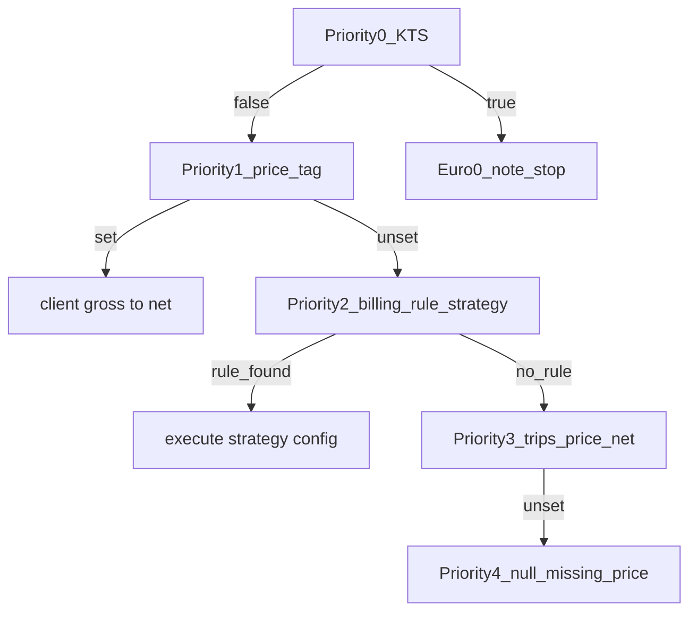

# Spec C — Pricing, Recipients, Invoice Builder (V1)

## Locked product rules (reference)

**Price cascade** (pure resolver, no DB inside):

- **Rounding:** For `tiered_km` / `fixed_below_threshold_then_km` km segments: accumulate **raw** `km * ratePerKm`, then **once** `Math.round(rawTotal * 100) / 100` per line item (no per-segment rounding).
- **Time-based:** Weekday + clock in **Europe/Berlin** via existing `[@date-fns/tz](package.json)` + `date-fns` (e.g. `toZonedTime` / TZDate pattern — align with package API). Holidays: compare trip’s **Berlin local calendar date** `YYYY-MM-DD` to config list.
- **Pricing rule uniqueness:** Three partial unique indexes **exactly** as specified (variant / billing_type-only / payer-only, each with `is_active = TRUE` and NULL guards). Violations surface on insert/update.
- **Recipients:** Snapshot `rechnungsempfaenger_snapshot` on **every** invoice at creation. **PDF:** `per_client` → client remains primary addressee + salutation; **additional** labeled block “Rechnungsempfänger / Zahlungspflichtiger” from snapshot. `monthly` / `single_trip` → **only** snapshot block as legal addressee (no client header block).
- **Builder line items:** Replace `[BuilderLineItem.no_invoice_required](src/features/invoices/types/invoice.types.ts)` with `**no_invoice_warning: boolean`** derived once from `trips.no_invoice_required` in `[buildLineItemsFromTrips](src/features/invoices/api/invoice-line-items.api.ts)`. Update `[step-3-line-items.tsx](src/features/invoices/components/invoice-builder/step-3-line-items.tsx)` and `[InvoicePdfDocument.tsx](src/features/invoices/components/invoice-pdf/InvoicePdfDocument.tsx)` dummy line-item mapping. Trip row unchanged.

**Spec correction:** Phase 5 recipient logic lives in `[InvoicePdfDocument.tsx](src/features/invoices/components/invoice-pdf/InvoicePdfDocument.tsx)` / `[invoice-pdf-cover-header.tsx](src/features/invoices/components/invoice-pdf/invoice-pdf-cover-header.tsx)`, **not** `[build-invoice-pdf-summary.ts](src/features/invoices/components/invoice-pdf/lib/build-invoice-pdf-summary.ts)` (routes only).

**Existing bug (fix in Phase 4):** `[fetchTripsForBuilder](src/features/invoices/api/invoice-line-items.api.ts)` incorrectly uses `.eq('billing_variant_id', params.billing_type_id)`. Filter by `**billing_types.id`** via `billing_variants.billing_type_id` (Supabase `!inner` on `billing_variants` or prefetch variant ids).

---

## Phase 1 — Migrations

**New SQL files** (names: `YYYYMMDD000000_...` sequential; English `COMMENT ON TABLE/COLUMN`):

1. `billing_pricing_rules` — columns per spec + `company_id` NOT NULL FK `companies`. Scope FKs are nullable in the schema but **exactly one** of `(payer_id, billing_type_id, billing_variant_id)` must be non-null per row — **enforce with a single `CHECK`** (e.g. count-non-null = 1). Rationale: a row cannot represent two levels at once; cascade precedence is for *which row wins at resolution time*, not for multi-FK rows. Strategy CHECK. `config` JSONB default `{}`. **Three partial unique indexes** (user-provided). Indexes for company/scope. **RLS** mirror `[20260404103000_no_invoice_fremdfirma_recurring.sql](supabase/migrations/20260404103000_no_invoice_fremdfirma_recurring.sql)` (`accounts.company_id`). `GRANT SELECT,INSERT,UPDATE,DELETE` to `authenticated, service_role`.
2. `rechnungsempfaenger` — table per spec, RLS + GRANT + comments.
3. `ALTER payers`, `billing_types`, `billing_variants` — `rechnungsempfaenger_id` FK SET NULL + English comments.
4. `ALTER invoices` — `rechnungsempfaenger_id`, `rechnungsempfaenger_snapshot` JSONB + immutability comment.
5. `ALTER invoice_line_items` — `pricing_strategy_used`, `pricing_source`, `kts_override` (defaults), and `**price_resolution_snapshot` JSONB** (nullable for legacy rows). Store the **full frozen `PriceResolution*`* object at invoice creation (same immutability principle as other line-item snapshots). Keeps denormalized `pricing_strategy_used` / `pricing_source` for easy querying/reporting; JSONB preserves tier breakdown, notes, and audit detail if catalog rules change later. English `COMMENT ON COLUMN`. **Do not** change existing snapshot column semantics otherwise.

Regenerate types: `[src/types/database.types.ts](src/types/database.types.ts)` (`bun run db:types` / project script).

---

## Phase 2 — Resolver layer

**New under** `[src/features/invoices/lib/](src/features/invoices/lib/)`:

| File                             | Role                                                                                                                                                                                                                              |
| -------------------------------- | --------------------------------------------------------------------------------------------------------------------------------------------------------------------------------------------------------------------------------- |
| `pricing-rule-config.schema.ts`  | `z.discriminatedUnion('strategy', [...])` for all six strategies; validate at API boundary before writes; comment per branch                                                                                                      |
| `resolve-pricing-rule.ts`        | Pure: pick active rule variant → billing_type → payer (same precedence idea as `[resolve-kts-default.ts](src/features/trips/lib/resolve-kts-default.ts)`)                                                                         |
| `resolve-trip-price.ts`          | Pure: locked P0–P4; Berlin time for `time_based`; tier sum then single round; returns rich `PriceResolution` + quantity/unit semantics for line items (same shape serialized into `invoice_line_items.price_resolution_snapshot`) |
| `resolve-rechnungsempfaenger.ts` | Pure: variant → type → payer → null (catalog FKs only)                                                                                                                                                                            |

**Adapt** `[price-calculator.ts](src/features/invoices/lib/price-calculator.ts)`: thin wrapper or re-export mapping `PriceResolution` → existing `PriceResult` where needed so call sites stay stable during refactor.

**Tests:** Add minimal Vitest (or Bun test) — matrix: KTS, price_tag vs each strategy, no rule + trips.price, `no_price`, tier rounding once, Berlin DST edge (optional).

**Docs:** `[docs/pricing-engine.md](docs/pricing-engine.md)`, `[src/features/invoices/lib/README.md](src/features/invoices/lib/README.md)`.

---

## Phase 3 — Admin UI

- **Feature module** `[src/features/rechnungsempfaenger/](src/features/rechnungsempfaenger/)` — `api/`, `components/`, `hooks/`, `types/` — CRUD list + dialog; nav entry in `[nav-config.ts](src/config/nav-config.ts)` (mirror Fremdfirmen route pattern under `src/app/dashboard/...`).
- **Catalog assignment:** recipient picker on `[payer-details-sheet.tsx](src/features/payers/components/payer-details-sheet.tsx)`, `[edit-billing-family-dialog.tsx](src/features/payers/components/edit-billing-family-dialog.tsx)`, `[edit-billing-variant-dialog.tsx](src/features/payers/components/edit-billing-variant-dialog.tsx)`.
- **Pricing rules:** editor dialog/section — strategy select; `useFieldArray` for tiers; time-based weekdays + holiday list; empty config for tag/manual/no_price. **Handle unique index errors** with clear German UI message.
- **API:** `[src/features/payers/api/billing-pricing-rules.api.ts](src/features/payers/api/billing-pricing-rules.api.ts)` — pricing rules are **catalog admin** (Phase 3 UI on payer/billing screens), not invoice-builder concerns; invoice code **imports** this API only where needed (e.g. loading rules into the builder). TanStack Query keys/invalidation per `[src/query/README.md](src/query/README.md)`.

**Docs:** `[docs/rechnungsempfaenger.md](docs/rechnungsempfaenger.md)`.

---

## Phase 4 — Invoice builder

- Fix trip fetch + extend select: `billing_variant` include `billing_type_id` for rule resolution.
- Load active rules for payer (company-scoped); pass arrays into pure resolvers.
- Extend `[invoice.types.ts](src/features/invoices/types/invoice.types.ts)`: `BuilderLineItem` (+ in-memory `price_resolution` / strategy / source / `kts_override` per spec), `**no_invoice_warning` only**; extend `InvoiceRow` / `InvoiceLineItemRow` / `InvoiceDetail` for new DB fields, `**price_resolution_snapshot` on persisted line items**, recipient snapshot on invoice.
- `[buildLineItemsFromTrips](src/features/invoices/api/invoice-line-items.api.ts)`: wire resolver; KTS €0 + note; persist-oriented fields for `insertLineItems`.
- `[insertLineItems](src/features/invoices/api/invoice-line-items.api.ts)`: populate new line item columns including `**price_resolution_snapshot`** (serialize `PriceResolution` as JSON).
- `[createInvoice](src/features/invoices/api/invoices.api.ts)` + builder hook/step 4: `rechnungsempfaenger_id` override + **snapshot JSON** at create (comment: §14 freeze). Invoice fetch must return snapshot for PDF.
- Steps 2–4 UI: recipient preview/warning, rule preview (optional), line badges, step 4 confirmation + override.

---

## Phase 5 — PDF

- `[InvoicePdfDocument.tsx](src/features/invoices/components/invoice-pdf/InvoicePdfDocument.tsx)`: implement **mode-based** recipient layout using `rechnungsempfaenger_snapshot` (fallback only if snapshot missing — should not happen for new invoices; define safe legacy fallback).
- Extend `[invoice-pdf-cover-header.tsx](src/features/invoices/components/invoice-pdf/invoice-pdf-cover-header.tsx)` props if needed for secondary “Rechnungsempfänger” block in `per_client`.

---

## Dependency chain

`Phase 1` → `Phase 2` → (`Phase 3` ∥ prep types) → `Phase 4` → `Phase 5`.

---

## Out of scope (unchanged)

V2: client-level recipient, auto-split by billing_type, hard `no_invoice` exclusion, trip-detail price preview, Fremdfirma reconciliation.