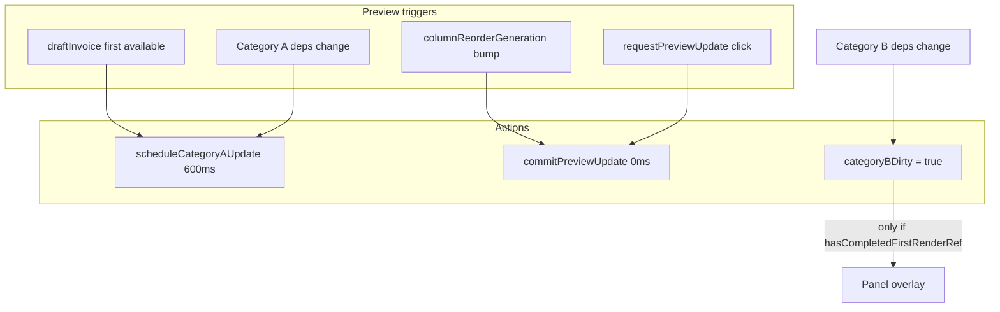

# Split-trigger PDF preview + continuous iframe

## Problem summary

| Bug | Root cause | Fix |
|---|---|---|
| Tab OOM crash | Every KM/price blur fires full `react-pdf` layout (~80–200 MB/render) via `updatePdf` on `draftInvoice` changes | Gate **Category B** (trip data) behind manual refresh |
| Preview flicker | [`invoice-builder-pdf-panel.tsx`](src/features/invoices/components/invoice-builder/invoice-builder-pdf-panel.tsx) L70–73 unmounts iframe when `pdf.loading` | Keep iframe when `pdf.url` exists; overlay badge instead |

**Out of scope:** [`InvoicePdfDocument.tsx`](src/features/invoices/components/invoice-pdf/InvoicePdfDocument.tsx) structure, trip editing handlers, save path.

---

## Step 1 — Dependency classification (comment contract)

Add a comment block at the top of [`use-invoice-builder-pdf-preview.tsx`](src/features/invoices/components/invoice-builder/use-invoice-builder-pdf-preview.tsx) before any logic changes.

### `draftInvoice` useMemo deps (L216–231)

| Dependency | Category | Notes |
|---|---|---|
| `livePreviewActive` | **Gate** | Derived: `lineItems.length > 0 && step2Values && companyProfile`. Not a render trigger itself. |
| `companyId` | **A** | Invoice identity; stable per session. |
| `companyProfileForDraft` | **A** | Company profile + signed logo URL. |
| `step2Values` | **A** | Payer, period, mode, billing scope — template/header context. |
| `includedLineItemsForDraft` | **B** | Derived from `lineItems` (billing-included filter). Trip prices/KM/inclusion. |
| `billedCancelledTrips` | **B** | **Flagged:** not in user list but is trip data (opted-in cancelled pricing). Must gate with B. |
| `payers` | **A** | Lookup for payer name/address resolution; static during session. |
| `clients` | **A** | Lookup for per_client mode; static during session. |
| `paymentDueDays` | **A** | Template/meta (Step 5 overlay or default). |
| `introText` | **A** | Brieftext. |
| `outroText` | **A** | Brieftext. |
| `recipientRow` | **A** | Rechnungsempfänger display. |
| `placeholderInvoiceNumber` | **A** | Static per mount. |
| `columnProfile` | **A** | PDF Vorlage columns/layout flags. |

### Current `updatePdf` useEffect deps (L282–292)

| Dependency | Category | Notes |
|---|---|---|
| `draftInvoice` | **Mixed** | **Split:** replace with explicit A-only trigger effect + manual `requestPreviewUpdate`. Always pass *current* `draftInvoice` at call time (includes latest B data). |
| `introText` | **A** | |
| `outroText` | **A** | |
| `columnProfile` | **A** | |
| `columnReorderGeneration` | **A** | Immediate refresh (0 ms delay). |
| `updatePdf` | **Stable** | From `usePDF`. |
| `paymentQrDataUrl` | **A** | QR payload derived from invoice meta/totals; lightweight regen OK. |
| `passiveCancelledTrips` | **B** | Stornierte appendix rows. |
| `excludedTrips` | **B** | Ausgeschlossene appendix rows. |

### Ambiguous / related (not direct effect deps)

| Item | Classification | Reasoning |
|---|---|---|
| `lineItems` (hook param) | **B** | Source for `includedLineItemsForDraft`. |
| `paymentQrDataUrl` generation effect (L236–252) | **Keep as-is** | Depends on `draftInvoice`; cheap async, not a PDF layout pass. |
| Logo URL effect (L122–144) | **A** | Company branding. |

**Build gate:** comment-only change → `bun run build`.

---

## Step 2 — Split trigger logic in preview hook

### Constants

```ts
/** why: coalesce rapid Category A (layout) edits without flooding react-pdf layout. */
const PREVIEW_CATEGORY_A_DEBOUNCE_MS = 600;
/** why: column drag-reorder must feel instant — same as today. */
const PREVIEW_COLUMN_REORDER_DELAY_MS = 0;
```

### New state / refs

- `categoryBDirty: boolean` (initial `false`) — exposed as `isDirty`
- `hasCompletedFirstRenderRef: boolean` — set `true` when `pdf.url` first becomes non-null (via `useEffect` on `pdf.url`)
- `previewPayloadRef` — holds latest `{ draftInvoice, introText, outroText, paymentQrDataUrl, columnProfile, passiveCancelledTrips, excludedTrips }` updated every render so debounced/immediate callbacks never read stale B data

### Extract shared render helper

```ts
function commitPreviewUpdate(): void {
  const p = previewPayloadRef.current;
  if (!p.draftInvoice) return;
  updatePdf(<InvoicePdfDocument invoice={p.draftInvoice} ... />);
}
```

### Four effects (replace monolithic L256–292 effect)



1. **Initial render** (one-time per preview session)
   - When `draftInvoice` becomes non-null and `!hasCompletedFirstRenderRef.current` → schedule Category A debounced update (600 ms).
   - Covers create-mode trip fetch and edit-mode hydration without setting dirty.

2. **Category A auto-render** — deps: `introText`, `outroText`, `columnProfile`, `columnReorderGeneration`, `paymentQrDataUrl`, `companyProfileForDraft`, `step2Values`, `paymentDueDays`, `recipientRow`, `payers`, `clients`, `companyId` (same fields that affect layout/template, **not** B arrays).
   - All Category A changes go through `scheduleCategoryAUpdate`: **600 ms** debounce by default; **`columnReorderGeneration` bump → 0 ms** (immediate `commitPreviewUpdate`, same as today). Category A never bypasses this scheduler except via the reorder 0 ms branch — it does **not** take a separate ad-hoc immediate path.
   - Calls `commitPreviewUpdate()` — **does not** clear `categoryBDirty` unless we explicitly want that (see edge case below).

3. **Category B dirty tracking** — deps: `includedLineItemsForDraft`, `billedCancelledTrips`, `passiveCancelledTrips`, `excludedTrips`.
   - Use a ref to store previous B signature; skip first comparison (initial load).
   - Only `setCategoryBDirty(true)` when signature changes **and** `hasCompletedFirstRenderRef.current`.
   - **Never** calls `updatePdf`.

4. **`livePreviewActive` → dirty reset** — `useEffect` watching `livePreviewActive`:
   - When `livePreviewActive` becomes `false` (all trips removed, `step2Values` cleared, etc.), call `setCategoryBDirty(false)`.
   - why: without this reset, `draftInvoice` becomes `null` but a stale `categoryBDirty === true` would leave the panel showing "Vorschau veraltet" over an outdated PDF with no valid `draftInvoice` and no way to clear the flag.

### `requestPreviewUpdate`

- `setCategoryBDirty(false)`
- Clear any pending Category A debounce timer — why: if a layout change was queued (e.g. admin edited a text block and then immediately clicked Aktualisieren), clearing the pending timer prevents a double render; `commitPreviewUpdate` already uses the latest `draftInvoice` which includes the layout change. Without clearing, two renders would fire within 600 ms with identical content.
- `commitPreviewUpdate()` immediately (0 ms)

### Return type extension

```ts
return { pdf, draftInvoice, livePreviewActive, isDirty: categoryBDirty, requestPreviewUpdate };
```

### Edge case (document in why-comment)

When `categoryBDirty === true` and a Category A change fires, `commitPreviewUpdate()` uses the **current** `draftInvoice` (which already includes latest trip edits in React state). The PDF will reflect trip changes even though the user did not click Aktualisieren — trigger was layout-only, content is always fresh from `draftInvoice`. This is acceptable and matches "layout preview with current in-memory data."

### Verify `draftInvoice` includes all B data

[`buildDraftInvoiceDetailForPdf`](src/features/invoices/components/invoice-pdf/build-draft-invoice-detail-for-pdf.ts) receives:
- `lineItems: includedLineItemsForDraft` (normal billed trips)
- `billedCancelledTrips` (opted-in cancelled)

`InvoicePdfDocument` additionally receives `passiveCancelledTrips` and `excludedTrips` as direct props in `commitPreviewUpdate`. All B sources covered.

**Build gate:** `bun run build` + `bun test` (167/167).

---

## Step 3 — Continuous iframe in panel

Update [`invoice-builder-pdf-panel.tsx`](src/features/invoices/components/invoice-builder/invoice-builder-pdf-panel.tsx):

**New props:** `isDirty: boolean`, `onRequestPreviewUpdate: () => void`

**Render logic** (inside the `draftInvoice` truthy branch):

| Condition | UI |
|---|---|
| `!pdf.url && pdf.loading` | Full-panel "Vorschau wird aktualisiert…" (unchanged — first load) |
| `!pdf.url && !pdf.loading && isDirty` | Full-panel **"Vorschau laden"** button → `onRequestPreviewUpdate` |
| `!pdf.url && !pdf.loading && !isDirty` | Full-panel "Vorschau wird geladen…" (unchanged) |
| `pdf.url` | **Always** render `<iframe src={pdf.url} />` (never conditional on `pdf.loading`) |
| `pdf.url && pdf.loading` | Top-right overlay badge: `Loader2` + "Wird aktualisiert…" |
| `pdf.url && isDirty && !pdf.loading` | Top banner: "Vorschau veraltet" + Button "Aktualisieren" (`RefreshCw`) |

Use `absolute` positioning on overlays within the existing `relative` `PanelBody`. iframe `src={pdf.url}` only when `pdf.url` is truthy — never assign `undefined`/`null` during in-progress renders.

### Blob URL revocation (memory)

**Owner:** [`invoice-builder-pdf-panel.tsx`](src/features/invoices/components/invoice-builder/invoice-builder-pdf-panel.tsx) — the panel displays the iframe and is the only place that binds `pdf.url` to `src`.

`usePDF` calls `URL.createObjectURL` on every completed render. While react-pdf revokes the previous URL when its internal `state.url` updates, repeated manual refreshes can still accumulate blob URLs if the panel holds an old `src` reference. Add explicit cleanup in the panel:

- `displayedPdfUrlRef: useRef<string | null>(null)` — tracks the URL currently bound to the iframe.
- `useEffect` on `pdf.url`: when `pdf.url` changes to a **new** non-null value and `displayedPdfUrlRef.current` is a different non-null URL, call `URL.revokeObjectURL(displayedPdfUrlRef.current)` **before** the next render assigns the new `src`. Then set `displayedPdfUrlRef.current = pdf.url`.
- On unmount: revoke `displayedPdfUrlRef.current` if set.
- why-comment: manual Category B refreshes can run many times per session; revoking superseded blob URLs prevents the same class of heap leak as unbounded auto-renders.

Do **not** revoke the URL still shown in the iframe while `pdf.loading === true` — only revoke the **previous** URL when swapping to a **new** completed `pdf.url`.

**Build gate:** `bun run build`.

---

## Step 4 — Wire props in shell

In [`index.tsx`](src/features/invoices/components/invoice-builder/index.tsx):

```ts
const { pdf, draftInvoice, isDirty, requestPreviewUpdate } = useInvoiceBuilderPdfPreview({...});
```

Pass identical props to **both** panel instances (desktop L827–834, mobile sheet L842–848):

```tsx
<InvoiceBuilderPdfPanel
  ...
  pdf={pdf}
  isDirty={isDirty}
  onRequestPreviewUpdate={requestPreviewUpdate}
/>
```

**Build gate:** `bun run build` + `bun test` (167/167).

---

## Step 5 — Scenario verification (manual trace)

### Scenario A — columnProfile change

1. Admin toggles column in Step 4 → `builderColumnProfile` changes → Category A effect schedules debounced `commitPreviewUpdate`.
2. `categoryBDirty` unchanged (false).
3. Panel: iframe stays visible; top-right "Wird aktualisiert…" badge during `pdf.loading`.
4. New PDF replaces blob URL when ready.

### Scenario B — KM override on trip #47

1. `applyKmOverride` → `lineItems` new ref → `includedLineItemsForDraft` changes → Category B effect sets `categoryBDirty = true` (after first render).
2. Category A effect does **not** fire; `updatePdf` **not** called.
3. Panel: previous iframe visible; top "Vorschau veraltet" + Aktualisieren overlay.
4. Click Aktualisieren → `requestPreviewUpdate` → immediate `commitPreviewUpdate` → `categoryBDirty = false` → iframe stays visible with loading badge → new PDF.

**Build gate:** `bun run build` + `bun test` (167/167).

---

## Step 6 — Documentation

Update [`docs/invoices-module.md`](docs/invoices-module.md) § "Builder preview" (L188 area):

- Split-trigger model: Category A (auto, 600 ms debounce) vs Category B (manual)
- List classified deps (mirror comment block)
- Continuous iframe pattern (`usePDF` keeps previous `url` during `loading`)
- Note: browser `usePDF` runs layout on main thread (not Web Worker) — why B gating matters at 120+ trips
- Mobile sheet parity

Add why-comments on: classification block, B dirty effect, A debounce effect, initial render effect, `requestPreviewUpdate`, panel overlay branches.

---

## Files touched (4 only)

| File | Change |
|---|---|
| [`use-invoice-builder-pdf-preview.tsx`](src/features/invoices/components/invoice-builder/use-invoice-builder-pdf-preview.tsx) | Classification comment, split effects, dirty state, `requestPreviewUpdate` |
| [`invoice-builder-pdf-panel.tsx`](src/features/invoices/components/invoice-builder/invoice-builder-pdf-panel.tsx) | Continuous iframe + overlays |
| [`index.tsx`](src/features/invoices/components/invoice-builder/index.tsx) | Wire `isDirty` + `requestPreviewUpdate` to both panels |
| [`docs/invoices-module.md`](docs/invoices-module.md) | Document new behaviour |
