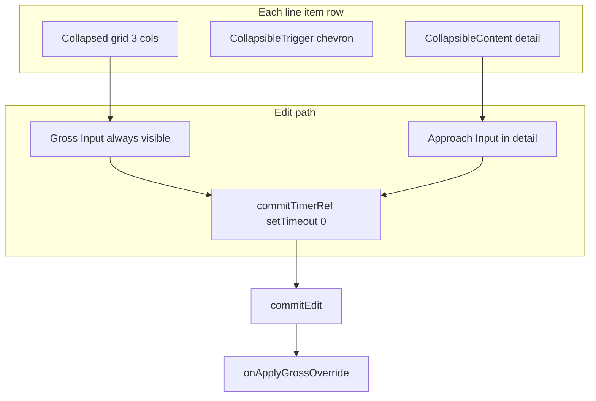

# Step 3 UI — Collapsible row layout

## Scope (frozen)

- **Only file with logic/markup changes:** [src/features/invoices/components/invoice-builder/step-3-line-items.tsx](src/features/invoices/components/invoice-builder/step-3-line-items.tsx)
- **Do not change:** [index.tsx](src/features/invoices/components/invoice-builder/index.tsx), [use-invoice-builder.ts](src/features/invoices/hooks/use-invoice-builder.ts), [invoice.types.ts](src/features/invoices/types/invoice.types.ts), [line-item-net-display.ts](src/features/invoices/lib/line-item-net-display.ts)
- **Deferred:** extracting `priceResolutionBadge` / shared warning icon components

## Corrections to the attached spec (must follow codebase, not the pseudocode verbatim)

### 1) Footer props — not `totals.net`

`Step3LineItems` receives **three separate numbers** today ([step-3-line-items.tsx](src/features/invoices/components/invoice-builder/step-3-line-items.tsx) lines 131–135): `subtotal`, `taxAmount`, `total`. There is no `totals` object on props. The sticky bar must use those names (same semantics as current table footer: Netto = `subtotal`, MwSt = `taxAmount`, Brutto = `total`).

### 2) Currency helper — no `formatCurrency` import

The file already defines **`formatEur`** via `Intl.NumberFormat('de-DE', { style: 'currency', currency: 'EUR' })` (lines 123–128). Hard rule “no magic numbers” is satisfied by **reusing `formatEur`** everywhere the spec says `formatCurrency` (optional: local alias `const formatCurrency = formatEur` for readability — still one implementation).

### 3) Live back-calculation math in the expanded panel

The draft snippet `net = gross / (1 + rate)` is **incorrect** when Anfahrt (brutto) is non-zero. The engine and current UI use **transport net** = `(gross - approachGross) / (1 + rate)` (see existing block at lines 411–422). The “live” row while editing should match that for **Netto (Fahrt)**; optionally show **Anfahrt net** as `approachGross / (1 + rate)` when approach &gt; 0, consistent with the old Anfahrt column helper text.

If you also show VAT breakdown, derive it from **full gross** vs **full net** without inventing new rounding rules: e.g. `vat = gross - (transportNet + approachNet)` where `approachNet = approachGross / (1 + rate)`, or keep a single primary line “Netto (Fahrt): …” to avoid misleading split lines.

### 4) `originalPriceResolution` optional

On `BuilderLineItem`, `originalPriceResolution` is optional ([invoice.types.ts](src/features/invoices/types/invoice.types.ts)). Ghost “War: …” must use **`item.originalPriceResolution?.gross`**.

### 5) Radix `Collapsible` controlled mode

- `onOpenChange` receives **`(open: boolean)`** — do not ignore it. Drive `openRows` from that boolean (plus the rules below), instead of blind `toggleRow()` on every callback.
- **`open` prop:** `const expanded = openRows.has(position) || isEditingThisRow` (chevron rotation and `CollapsibleContent` visibility should key off **`expanded`**, not raw `openRows.has`, or the chevron will lie while editing).
- When `onOpenChange(false)` fires but **`isEditingThisRow`** is still true, **do not remove** the row from `openRows` (or removal is harmless because `expanded` stays true — but then `isOpen` for labels must be `expanded`). Simplest: on close request, `if (!isEditingThisRow) { remove from set }`.

### 6) Always-on inputs + blur snapshot (stale closure)

The draft calls `handleBlur(editing)` where `editing` may still be **`null` on the first blur** after focus because `setEditing` is asynchronous. Preserve the audit’s intent by keeping a **`editingRef`** (or equivalent) updated whenever `editing` changes (`useEffect`), and have **`onBlur` call `handleBlur(editingRef.current)`** after verifying `editingRef.current?.position === item.position`. Same for **Enter** key paths: commit from ref or functional `setEditing` update so the latest strings are committed.

### 7) `CollapsibleTrigger` / grid layout

Wrap each row in **`relative`** container. Place the chevron trigger so it does not break the 3-column grid (e.g. absolutely positioned `top-2 right-2`, with **`pr-6` or similar** on the collapsed row so text does not sit under the icon). Revisit **`stopPropagation`** on the trigger — only use if a parent click handler would steal the toggle; avoid blocking Radix from opening.

### 8) Tooltip wiring

If individual `Tooltip` instances are used in the collapsed row, wrap the list (or the whole component return) in **`TooltipProvider`** once — matches patterns elsewhere and avoids missing provider errors.

### 9) Step 1-only build gate

Adding `openRows` / `toggleRow` / `ensureRowOpen` with **no render usage** can fail **`noUnusedLocals`** / ESLint. **Practical gate:** implement Step 1 state **together with** Step 2 UI in one change set, or introduce the smallest possible use (e.g. pass `openRows` to a no-op that references it) — prefer **single PR chunk: state + layout**.

## Implementation outline

1. **Imports / cleanup**
   - Add: `Collapsible`, `CollapsibleContent`, `CollapsibleTrigger` from [collapsible.tsx](src/components/ui/collapsible.tsx); `ChevronDown` from `lucide-react`; `cn` from `@/lib/utils`.
   - Remove: `Table*` imports, unused `Button` / `Pencil` if nothing uses them after rewrite.
   - Keep: `formatTaxRate`, `getWarningLabel`, `lineItemGrossTotalForDisplay`, `Alert`, banners, loading empty states.

2. **State** (as specified, plus `editingRef` sync)
   - `openRows: Set<number>` with **`toggleRow`** / **`ensureRowOpen`** (ensure is idempotent add).
   - Keep `editing`, `commitTimerRef`, `handleBlur`, `handleFocus`, `cancelEdit`, `commitEdit` — extend `commitEdit` callers to use latest draft via ref if needed.

3. **Row shell**
   - Outer: `flex flex-col divide-y divide-border` (or `gap-0` + divide as in spec).
   - Each item: `Collapsible` with `open={expanded}` and corrected `onOpenChange`.
   - Collapsed row: `grid grid-cols-[1fr_1fr_auto] gap-x-3 px-4 py-2.5` with **`border-l-2`** always present (`border-transparent` vs `border-amber-400`).

4. **Collapsed content**
   - Col1: `client_name`, date line (`line_date` formatted as today — weekday + date; time only in detail per spec).
   - Col2: `pickup_address` / `dropoff_address` stacked truncated.
   - Col3: Manuell badge + reset (`X`), warning **icon + Tooltip** (concat `getWarningLabel` with ` · ` as in spec), **always-on** gross `Input`, distance caption.
   - **Focus gross:** init editing state (same pre-fill rules as current `startEdit`: empty string when gross null), `ensureRowOpen(position)`.

5. **Expanded detail**
   - Time (`HH:mm Uhr`), strategy `Badge`, `MwSt {formatTaxRate}`.
   - Anfahrt `Input` — always shown; value from `editing` when `isEditingThisRow` else `approach_fee_gross` string; **onFocus** must ensure editing state exists for this row (same as gross) so `onChange` updates apply.
   - Ghost price: `originalPriceResolution?.gross` + `formatEur`.
   - Live line when editing: **correct transport net formula** (and optional approach net / VAT — keep consistent, not `gross/(1+r)` alone).
   - Expanded warning **text** rows (no tooltip required).

6. **Sticky footer**
   - Use **`subtotal` / `taxAmount` / `total`** + `formatEur`; mirror label copy from current footer (“Netto”, “MwSt”, “Brutto”).

7. **Verification**
   - `bun run build` and `bun test` after the rewrite.

## Step 4 — Documentation (mandatory)

1. Update [docs/plans/step3-ui-redesign-audit.md](docs/plans/step3-ui-redesign-audit.md): add a short **“Implementation status”** section at top or bottom marking this redesign as **implemented** (date + pointer to `step-3-line-items.tsx`).
2. In `step-3-line-items.tsx`, add concise **inline comments** at the decision points listed in your spec:
   - `Set` + per-row `Collapsible` vs `Accordion type="single"` (multi-expand for comparison)
   - `border-l-2 border-transparent` on non-overridden rows (no layout shift)
   - `open={expanded}` / `expanded || isEditing` (auto-expand while editing; chevron state)
   - `ensureRowOpen` on gross focus (idempotent; don’t collapse user-opened rows)
   - `editingRef` + `handleBlur` snapshot / why not only `handleBlur(editing)` from render closure

## Risk note

Controlled `Collapsible` while **`open` is forced true by `isEditing`** can desync internal state if close is attempted; handling `onOpenChange(false)` while editing as **no-op for collapsing** (or “commit then allow close”) avoids flicker — document the chosen behavior in a one-line comment.
