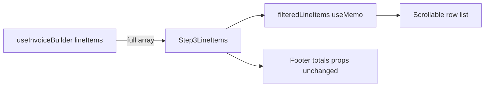

# Step 3 Passenger Search + Opt-Out Layout Fix

## Constraints (non-negotiable)

- **View-layer only:** `lineItems` prop stays the full unfiltered array; never mutate, splice, or pass filtered data to handlers/totals/save.
- **Read-only parents:** No edits to [`index.tsx`](src/features/invoices/components/invoice-builder/index.tsx), [`use-invoice-builder.ts`](src/features/invoices/hooks/use-invoice-builder.ts), or types.
- **Out of scope:** cancelled-trips search, URL persistence, other fields, Steps 1/2/4.

**Explicitly deferred (this PR):**

- **Scroll-to-first-match + hover highlight** — filter-first design already puts the first match at the top of the visible list; `scrollIntoView` on every keystroke would fight manual scrolling during the 300 ms debounce window and requires `data-position` on every `<Collapsible>` for no gain here. If product later wants a “highlight all matches, don’t filter” toggle, add scroll-to at that point.



---

## File 1 — Create [`passenger-search-bar.tsx`](src/features/invoices/components/invoice-builder/passenger-search-bar.tsx)

New isolated widget (do **not** import `TourenSearchBar`).

**Pattern copied from** [`touren-search-bar.tsx`](src/features/driver-portal/components/touren/touren-search-bar.tsx):
- Local `localValue` state + 300 ms debounced `onChange` to parent
- `useEffect` sync when parent `value` resets
- Clear button when non-empty (based on `localValue`)
- Timer cleanup on clear

**Invoice-builder adaptations:**
- Icons: `Search` + `X` from `lucide-react` (matches Step 3; **not** imported in parent)
- `Input` classes: `h-9 pr-9 pl-9 text-sm`
- Default placeholder: `Fahrgast suchen…`
- `aria-label='Fahrgast suchen'`
- **Result badge inside the component** (Gap 2 fix) — avoids parent/child debounce mismatch on count display

**Props interface:**

```ts
interface PassengerSearchBarProps {
  value: string;
  onChange: (value: string) => void;
  totalCount: number;
  filteredCount: number;
  placeholder?: string;
  className?: string;
}
```

**Badge behaviour:**
- Show `{filteredCount} / {totalCount}` badge only when `localValue.trim().length > 0` (same moment the clear button appears — tied to what the user sees typing, not the debounced parent value)
- Layout: flex row — `PassengerSearchBar` root is `flex flex-wrap items-center gap-2`; input wrapper `min-w-0 flex-1`; badge `variant='secondary' className='h-6 shrink-0 tabular-nums'`

**Known cosmetic limitation (document in parent, Gap 3):** Parent `filteredLineItems` and intro copy still key off debounced `passengerSearch`. During the 300 ms window after a keystroke, intro may briefly show the previous filter’s `N von M` while the list has not yet re-filtered. Acceptable for filter-first UX; add a one-line comment above `filteredLineItems` useMemo in Step 3:

```ts
// why: debounce lives in PassengerSearchBar — filteredLineItems trails local input by ~300ms; do not move debounce here without updating intro copy too.
```

Export `PassengerSearchBar` as a named function declaration.

---

## File 2 — Edit [`step-3-line-items.tsx`](src/features/invoices/components/invoice-builder/step-3-line-items.tsx)

### 2a — Search state + filter

Add imports: `useMemo`, `PassengerSearchBar` only (no lucide icons in parent).

```ts
const [passengerSearch, setPassengerSearch] = useState('');

// why: debounce lives in PassengerSearchBar — filteredLineItems trails local input by ~300ms; do not move debounce here without updating intro copy too.
const filteredLineItems = useMemo(() => {
  const q = passengerSearch.trim().toLocaleLowerCase('de-DE');
  if (!q) return lineItems;
  return lineItems.filter((item) =>
    (item.client_name ?? '').toLocaleLowerCase('de-DE').includes(q)
  );
}, [lineItems, passengerSearch]);

const isSearchActive = passengerSearch.trim().length > 0;
```

**Reset search when trip set reloads:** `useEffect(() => setPassengerSearch(''), [lineItems])`.

**Lint gate (after 2a):** Run `bun run lint` on touched files before continuing — catches unused imports (e.g. accidental `Search` import in parent) early.

### 2b — Search UI placement

Between alert stack and bordered list (`L503`), only when `lineItems.length > 0`:

```tsx
<PassengerSearchBar
  value={passengerSearch}
  onChange={setPassengerSearch}
  totalCount={lineItems.length}
  filteredCount={filteredLineItems.length}
  className='w-full'
/>
```

No separate badge in parent.

### 2c — Intro copy

| Condition | Copy |
|-----------|------|
| No active search | `{lineItems.length} Fahrten gefunden. …` (unchanged) |
| Active search | `{filteredLineItems.length} von {lineItems.length} Fahrten. …` |

`isSearchActive` uses debounced `passengerSearch` — consistent with `filteredLineItems`, not with badge inside child (badge uses `localValue`). Brief intro/list mismatch during debounce is acceptable (see comment in 2a).

Alerts (`ktsLineCount`, `noInvLineCount`) use full `lineItems`.

### 2d — Swap map target + empty filter state

- `lineItems.map` → `filteredLineItems.map` in scroll container (`L509`).
- Empty filter: `lineItems.length > 0 && filteredLineItems.length === 0` → centered message with `passengerSearch.trim()`.
- Footer totals and confirm `disabled={lineItems.length === 0}` unchanged.
- Scroll-fade `useEffect` deps: add `filteredLineItems` (or `passengerSearch`).

### 2e — Opt-out layout fix (Gap 1 — no magic width on rail)

**Problem with prior plan:** `w-[4.5rem]` is an arbitrary magic number; long badge text (`Ausgeschlossen (Ursprungsrechnung)`) clips or wraps badly inside a fixed narrow rail.

**Approach:** Inclusion rail holds **checkbox + warning icon only**. Opt-out badge + reason move **outside** the `grid-cols-[auto_1fr]` container as a full-width sibling row.

**1. Inclusion rail — checkbox + warnings only** (`L587–653`)

```tsx
<div className='row-span-2 flex w-5 shrink-0 flex-col items-start gap-1.5 pt-0.5'>
  <Checkbox … />
  {/* Remove opt-out Badge + reason from here */}
  {item.warnings.length > 0 && !isOptedOut ? (
    <Tooltip>…AlertTriangle…</Tooltip>
  ) : null}
</div>
```

- `w-5` (20px) matches checkbox width; `auto` grid track stays stable.
- When opted out, warnings-only tooltip can still show if `item.warnings.length > 0` (keep or hide behind `!isOptedOut` — prefer showing warnings even when opted out; only opt-out chrome moves out).

**Revised warning rule:** Show `AlertTriangle` when `item.warnings.length > 0` regardless of opt-out (opt-out state is shown in the row below). Remove the `(isOptedOut || item.warnings.length > 0)` wrapper that bundled opt-out badge with warnings.

**2. Opt-out row — full width below grid**

After the `grid grid-cols-[auto_1fr]` div closes, still inside the border-l row wrapper, before `CollapsibleTrigger`:

```tsx
{isOptedOut && (
  <div className='flex flex-col items-start gap-0.5 px-4 pb-1'>
    <Badge
      variant='outline'
      className='h-4 shrink-0 border-amber-400 px-1 text-[10px] text-amber-700'
    >
      {item.exclusionInherited
        ? 'Ausgeschlossen (Ursprungsrechnung)'
        : 'Ausgeschlossen'}
    </Badge>
    {item.billingInclusion.reason ? (
      <span className='line-clamp-2 text-[10px] leading-tight text-amber-600'>
        {item.billingInclusion.reason}
      </span>
    ) : null}
  </div>
)}
```

Reason text gets full row width (`px-4` aligned with grid padding) and wraps gracefully.

**3. Hide KM-manuell badge row when opted out** (`L764–796`)

```tsx
{!isOptedOut && item.isManualKmOverride ? ( … ) : null}
```

**4. Disable reset buttons when opted out**

`disabled={isOptedOut}` on KM / MwSt / Taxameter reset `Button`s (L781, L852, L934).

Existing `disabled={isOptedOut}` on KM `Input`, tax `Select`, gross `Input` unchanged.

---

## Verification checklist

1. Type passenger name — list filters; badge in search bar shows `N / total` (synced with typed text via `localValue`).
2. Clear search — full list; badge hidden.
3. No matches — empty state; confirm still enabled when `lineItems.length > 0`.
4. Opt out a row — rail stays `w-5`; badge + reason on full-width row below grid; KM-manuell hidden; resets disabled.
5. Long exclusion reason + “Ursprungsrechnung” badge — wraps on full-width row, does not widen grid.
6. Footer totals unchanged when filtering.
7. `confirmationRows` / section summary in `index.tsx` unchanged.

**Lint:** `bun run lint` after Step 2a and again at end.

---

## What does not change

| Surface | Reason |
|---------|--------|
| `index.tsx` `Step3LineItems` props | Search is internal |
| `confirmationRows` / `section3SummaryText` | Billable count, not search |
| `use-invoice-builder` totals | Full `lineItems` |
| PDF / save / inclusion handlers | Full array by `position` |
| Stornierte Fahrten section | Deferred |
| Scroll-to / hover highlight | Deferred — filter-first design |
