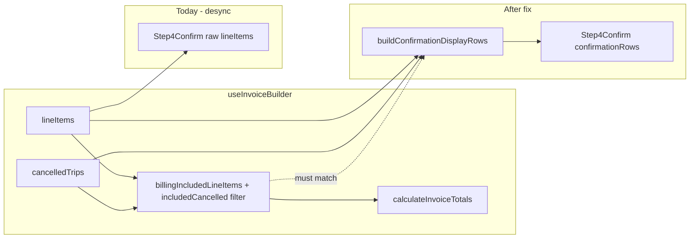

# Step 4 Confirmation Display Desync Fix

## Problem (verified)

Totals in [`use-invoice-builder.ts`](src/features/invoices/hooks/use-invoice-builder.ts) L903–919 are correct:

```903:919:src/features/invoices/hooks/use-invoice-builder.ts
  const includedNormal = billingIncludedLineItems(lineItems);
  const includedCancelled = cancelledTrips.filter(
    (c) => c.billingInclusion.included && c.price_resolution != null
  );
  const totals = calculateInvoiceTotals([
    ...includedNormal,
    ...includedCancelled.map((c) => ({
      price_resolution: c.price_resolution!,
      // ...
    }))
  ]);
```

Display is wrong because [`index.tsx`](src/features/invoices/components/invoice-builder/index.tsx) passes raw data:

- L799: `lineItemCount={lineItems.length}`
- L842: `lineItems={lineItems}`
- L476: Section 3 summary `` `${lineItems.length} Positionen · …` ``

[`step-4-confirm.tsx`](src/features/invoices/components/invoice-builder/step-4-confirm.tsx) renders props verbatim (L331 map, L292–294 count). Submit at L385 (`form.handleSubmit(onConfirm)`) sends **form meta only** — unchanged by this fix.



---

## Step 1 — New helper + type

**Create** [`src/features/invoices/lib/build-confirmation-display-rows.ts`](src/features/invoices/lib/build-confirmation-display-rows.ts)

**Export `ConfirmationDisplayRow`** (exact fields from your spec):

| Field | Purpose |
|-------|---------|
| `key` | React key — `trip_id ?? position` (normal), `id` (cancelled) |
| `position` | 1-based display `#` |
| `description` | Normal: `item.description`; cancelled: built string |
| `price_resolution` | `PriceResolution` from [`pricing.types`](src/features/invoices/types/pricing.types) |
| `manualGrossTotal` | Pass-through for normal rows; `null` for cancelled |
| `rowType` | `'normal' \| 'cancelled'` |

**Export `buildConfirmationDisplayRows(lineItems, cancelledTrips)`:**

1. **Normal rows:** `billingIncludedLineItems(lineItems)` → map with `rowType: 'normal'`, preserve `item.position` and `item.description`.
2. **Cancelled rows:** filter **identically** to hook L906–908:
   `cancelledTrips.filter(c => c.billingInclusion.included && c.price_resolution != null)`
   - Positions: `normals.length + idx + 1`
   - Keys: `c.id`
   - `manualGrossTotal: null`
   - **Description format** (confirmation-only; differs from persist `Storno-Fahrt:` in [`invoice-line-items.api.ts`](src/features/invoices/api/invoice-line-items.api.ts) L1030):
     - Date: `toLocaleDateString('de-DE', { day: '2-digit', month: '2-digit', year: 'numeric' })` on `scheduled_at` (same locale approach as normal rows in L670–676)
     - Client: resolve like step-3 / insert — `client.first_name + last_name` join, else `client_name?.trim()`, fallback `'Stornierte Fahrt'`
     - Template: `` `${dateStr} · ${clientLabel} (Stornogebühr)` ``
     - Step 3 has no single description string (client + date shown separately); this format is intentional for the confirmation table and satisfies the required test assertion.
3. **Return:** `[...normalRows, ...cancelledRows]` sorted by `position` ascending.

**Module JSDoc** must document:
- Separation from [`billing-inclusion.ts`](src/features/invoices/lib/billing-inclusion.ts) (predicates vs display assembly)
- **Mirroring contract** with hook L906–908 — if that filter changes, this helper must change too
- `rowType`, cancelled `key` = `id`, future quote-builder reuse note
- Explicit exclusions: opted-out normals, opted-out cancelled, unpriced cancelled

**Do not modify** `billing-inclusion.ts` or `use-invoice-builder.ts`.

**Gate:** `bun run build`

---

## Step 2 — Unit tests

**Create** [`src/features/invoices/lib/__tests__/build-confirmation-display-rows.test.ts`](src/features/invoices/lib/__tests__/build-confirmation-display-rows.test.ts)

Reuse the [`trip-write-back.test.ts`](src/features/invoices/lib/__tests__/trip-write-back.test.ts) `baseItem` pattern → `minimalLineItem(overrides)` and new `minimalCancelledTrip(overrides)` with required `billingInclusion` + optional `price_resolution`.

Implement all 10 scenarios from your spec table (included/opted-out normals, priced/unpriced cancelled, empty input, position ordering, description contains `Stornogebühr`, unique keys).

**Gate:** `bun test` — full suite must stay green (currently 81 tests in invoice lib folder alone; no regressions).

---

## Step 3 — Wire `index.tsx`

In [`index.tsx`](src/features/invoices/components/invoice-builder/index.tsx):

**3a.** Import `buildConfirmationDisplayRows` from `../../lib/build-confirmation-display-rows`.

Add memo **after existing PDF memos** (must be defined before `section3SummaryText` useMemo at L474):

```typescript
const confirmationRows = useMemo(
  () => buildConfirmationDisplayRows(lineItems, cancelledTrips),
  [lineItems, cancelledTrips]
);
```

**Why comment:** mirrors hook totals slice L903–919; must stay in sync if that filter changes.

**3b.** Step4Confirm props (L795–845):
- `lineItems={confirmationRows}`
- `lineItemCount={confirmationRows.length}`

**3c.** Section 3 summary (L474–477):
- Empty guard: `confirmationRows.length === 0`
- Count string: `confirmationRows.length`
- Deps: `[confirmationRows.length, totals.subtotal]`

**Verified before implementation (memo deps + guard):**
- **Deps are correct:** The existing memo already uses a primitive length dep (`lineItems.length`), not the array reference. Switching to `confirmationRows.length` preserves that pattern — `confirmationRows` is its own `useMemo`, so its reference changes whenever `lineItems` or `cancelledTrips` change, but the summary only needs to recompute when the **displayed count** or **subtotal** changes; `.length` is the right primitive dep and avoids unnecessary recomputation when array identity changes but length/subtotal do not.
- **No loading/unlocked logic in this memo today:** The current guard is solely `if (lineItems.length === 0) return ''`. Section lock/unlock is on `BuilderSectionCard` via `locked={isLocked(3)}` (L665); the “Weiter zu PDF-Vorlage” footer uses `section4Unlocked` (L672) — neither is inside `section3SummaryText`. Do **not** add or remove any other guards; only swap `lineItems.length` → `confirmationRows.length` in the empty check and count string.
- **Intentional empty-guard behavior change:** When raw `lineItems` exist but every normal trip is opted out and no cancelled trip is opted-in/priced, the old guard still showed a summary (wrong count). The new guard returns `''` (no collapsed summary), which matches the billable slice. When only opted-in cancelled rows exist (`lineItems.length === 0` but `confirmationRows.length > 0`), the new guard correctly shows a summary — an improvement over today.

**Why comment** on summary fix: subtotal already filtered; raw `lineItems.length` counted opted-out rows.

**Do not touch:** PDF memos (`excludedTripsForPdf`, `billedCancelledTripsForPdf`, etc.), `createInvoice` / `updateInvoice` handlers.

**Gate:** `bun run build`

---

## Step 4 — Update `step-4-confirm.tsx`

In [`step-4-confirm.tsx`](src/features/invoices/components/invoice-builder/step-4-confirm.tsx):

**4a.** Props: `lineItems: ConfirmationDisplayRow[]`  
Import from **`../../lib/build-confirmation-display-rows`** (not `../../../../lib/` — that path is wrong from this file). Remove unused `BuilderLineItem` import.

**Why comment** on prop type: cancelled trips are not `BuilderLineItem`; display type carries only rendered fields.

**4b.** Table render (L331+):
- Map key: `row.key` (not `item.position` — cancelled rows use trip `id`)
- `#`: `row.position`
- Beschreibung: `row.description`
- Preis: **`row.price_resolution.net`** via existing `formatEur`, `null`/`undefined` → `'—'`
  - Drop `lineItemNetAmountForDisplay` import — it requires `BuilderLineItem.unit_price` / `quantity` which `ConfirmationDisplayRow` intentionally omits; `price_resolution.net` aligns with the totals slice.
- Tooltip: unchanged — `row.price_resolution.source` + `strategy_used`

**4c.** Optional (recommended, minimal): `row.rowType === 'cancelled'` → add `text-muted-foreground` on the `TableRow`.

**Submit handler:** leave L385 `onSubmit={form.handleSubmit(onConfirm)}` unchanged. Add explicit **why comment** that submit reads `step4Values` only, not display rows.

**Gate:** `bun run build`

---

## Step 5 — Full gate

```bash
bun run build
bun test
```

Stop on any failure before docs.

---

## Step 6 — Documentation (mandatory)

| Target | Action |
|--------|--------|
| [`build-confirmation-display-rows.ts`](src/features/invoices/lib/build-confirmation-display-rows.ts) | Verify Step 1 JSDoc complete |
| [`docs/invoices-module.md`](docs/invoices-module.md) | New **Confirmation display rows** section after billing inclusion (L192+): purpose, mirroring contract, `ConfirmationDisplayRow` fields, exclusions, quote reuse |
| [`docs/plans/step4-confirm-desync-audit.md`](docs/plans/step4-confirm-desync-audit.md) | Status: **Fix applied — 2026-06-08**; list closed gaps (count, table filter, billed cancelled visible, Section 3 aligned) |
| `index.tsx` + `step-4-confirm.tsx` | Why comments at each changed site per your Step 6d list |

Note: audit lives under `docs/plans/`, not `.cursor/plans/`.

---

## Hard constraints checklist

- `billing-inclusion.ts` — import only, no edits
- Cancelled filter === hook L906–908 exactly
- Submit / persist / PDF memos — untouched
- No new inline `billingInclusion.included` filters for Step 4 display
- Single commit when done: `fix(invoices): align Step 4 confirmation table and count with billing-included totals slice`

---

## Files touched (summary)

| File | Change |
|------|--------|
| `lib/build-confirmation-display-rows.ts` | NEW |
| `lib/__tests__/build-confirmation-display-rows.test.ts` | NEW |
| `components/invoice-builder/index.tsx` | `confirmationRows` memo + prop/summary fixes |
| `components/invoice-builder/step-4-confirm.tsx` | `ConfirmationDisplayRow[]` render path |
| `docs/invoices-module.md` | Confirmation display section |
| `docs/plans/step4-confirm-desync-audit.md` | Fix applied status |
