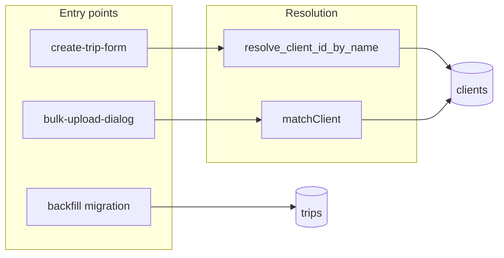

# Best-effort `client_id` enrichment at trip creation

## Phase 1 — Data repair migration

Add [`supabase/migrations/YYYYMMDDHHMMSS_backfill_trip_client_ids.sql`](supabase/migrations/YYYYMMDDHHMMSS_backfill_trip_client_ids.sql) containing:

1. **Backfill `UPDATE`** — Use your provided statement verbatim (normalized full name via `lower(trim(...))` and `concat_ws(' ', c.first_name, c.last_name)`, scoped by `company_id`, only when the per-company count of clients with that normalized name is exactly `1`).

2. **RPC for runtime resolution (recommended in the same file)** — PostgREST cannot express “normalized concatenated name equals input” without a computed column or function. To avoid loading every client on each debounced form call, add:

   - `public.resolve_client_id_by_name(p_company_id uuid, p_full_name text) RETURNS uuid`
   - Logic: `NULL` if `trim(p_full_name)` is empty; else `SELECT c.id FROM clients c WHERE c.company_id = p_company_id AND lower(trim(concat_ws(' ', c.first_name, c.last_name))) = lower(trim(p_full_name))` with a `HAVING COUNT(*) = 1` / subquery pattern mirroring the `UPDATE` (return the id only when exactly one row matches).
   - `STABLE`, `SECURITY INVOKER`, `search_path = public`
   - `GRANT EXECUTE` to `authenticated` (and `service_role` if cron/admin ever needs it)

3. After push, run **`bunx supabase db push`** (no `supabase` script in [`package.json`](package.json); use CLI via bunx/npx). Report updated row count with a one-off query: `SELECT COUNT(*) FROM trips WHERE client_id IS NOT NULL AND updated_at ...` is unreliable; instead run **`SELECT COUNT(*) AS updated FROM trips t JOIN clients c ON ...`** is wrong. Prefer: before/after snapshot of `COUNT(*) WHERE client_id IS NULL AND client_name IS NOT NULL` or log **`GET DIAGNOSTICS`** in a `DO` block in the migration (optional). Simplest: note in migration comment “run SELECT count before/after” or use a follow-up SQL in the PR description.

4. Regenerate types if the new RPC is added: **`bun run db:types`** (or project’s documented command) so [`src/types/database.types.ts`](src/types/database.types.ts) includes `resolve_client_id_by_name`.

## Phase 2 — Shared utility

Create [`src/features/trips/lib/resolve-client-by-name.ts`](src/features/trips/lib/resolve-client-by-name.ts):

- **`resolveClientByName(name: string, companyId: string, supabase: SupabaseClient<Database>): Promise<string | null>`**
- Trim input; if empty after trim → return `null` without calling DB.
- Call **`supabase.rpc('resolve_client_id_by_name', { p_company_id: companyId, p_full_name: trimmed })`** and map `data` to `string | null` (handle `null`/error: return `null`, **never throw** — matches “best-effort” contract).
- JSDoc: unambiguous match only; silent failure; aligns with [`docs/trip-client-linking.md`](docs/trip-client-linking.md) (new).

**Note:** The user brief asked for `ILIKE`; the migration and RPC should use **normalized equality** (`lower(trim(...))`) so manual form, bulk, SQL backfill, and RPC stay **one semantic**. Document that choice in JSDoc and docs (avoids accidental substring matches).

## Phase 3 — Manual trip form ([`create-trip-form.tsx`](src/features/trips/components/create-trip/create-trip-form.tsx))

1. **Load `companyId` once** — Add `useState` + `useEffect` that mirrors the existing submit path (~lines 1097–1104): `createSupabaseClient()`, `auth.getUser()`, `accounts.select('company_id').eq('id', user.id).single()`. Store `companyId` in state (or ref) for the resolver.

2. **Debounced silent enrichment** — `useEffect` (or `useDebouncedCallback` if already in repo; else `setTimeout` + cleanup) watching **`passengers`**, **`watchedPayerId`**, **`companyId`**:
   - Bail if `!companyId || !watchedPayerId` (per your spec).
   - Debounce ~400ms.
   - For each passenger: if `client_id` already set → skip; if both names empty → skip.
   - Build `fullName` as `[first_name, last_name].filter(Boolean).join(' ').trim()` (same spirit as insert payload).
   - Call `resolveClientByName(fullName, companyId, supabase)`.
   - If result: **`setPassengers`** only for that `uid` **if `client_id` is still null** (avoid races with user picking from autosuggest). Use a monotonically increasing **effect generation** or **AbortController** so stale async results do not overwrite newer state.
   - No toast, no loading UI.

3. **Comment** immediately above the resolver invocation:

   ```ts
   // Best-effort: attempt to link passenger to a Stammdaten client when
   // an exact name match exists. Does not block submission on failure.
   ```

4. **Draft / preselected client** — When passengers are hydrated from draft (`setPassengers`), the same effect should run so saved free-text names get enriched after payer+company are available.

## Phase 4 — CSV bulk upload ([`match-client.ts`](src/features/trips/components/bulk-upload/match-client.ts) / [`bulk-upload-dialog.tsx`](src/features/trips/components/bulk-upload-dialog.tsx))

- **Verify** (no change expected): every row with passenger fields runs `findMatchingClient` → `matchClient` before building `builtTrip`; when `matched: true`, `client_id` is set (`906` in dialog); when `matched: false`, `client_id` stays `null` and import is not blocked.
- **Optional parity (only if you want the same normalization as SQL):** After `matchedClient` is null and `fullNameFromCsv` is non-empty, call `resolveClientByName(fullNameFromCsv, companyId, supabase)` once per row (you already have `companyId` and `supabase` in the parser scope). This is a **one-line enrichment** and does not change blocking. **If you want zero bulk diff**, skip this and document that bulk relies on `matchClient`’s stricter rules (phone / first+last / last+ZIP).

## Phase 5 — Docs, comments, build

1. **[`docs/bulk-upload-behavior-rules.md`](docs/bulk-upload-behavior-rules.md)** — New subsection: best-effort Stammdaten link; `matchClient` + (if implemented) `resolveClientByName`; ambiguous/no match leaves `client_id` null; import still proceeds.

2. **New [`docs/trip-client-linking.md`](docs/trip-client-linking.md)** — Three passenger types: (1) Stammdaten-linked (`client_id` set), (2) named but unregistered (`client_name` only), (3) anonymous (both null). Explain **per_client** invoice builder requires `client_id` ([`fetchTripsForBuilder`](src/features/invoices/api/invoice-line-items.api.ts) `.eq('client_id', ...)`). Describe backfill + form enrichment + bulk matching.

3. **[`src/features/invoices/api/invoice-line-items.api.ts`](src/features/invoices/api/invoice-line-items.api.ts)** — Above `.eq('client_id', params.client_id)`:

   ```ts
   // Trips with client_id = null are excluded here by design.
   // Best-effort resolution at trip creation ensures client_id is set
   // when a Stammdaten match exists. See docs/trip-client-linking.md.
   ```

4. **Run `bun run build`** — zero TS/build errors before merging docs (per your ordering).

## Explicit non-goals (unchanged)

- No NOT NULL on `trips.client_id`
- No blocking or wizard changes for bulk unresolved clients
- No changes to invoice query logic beyond the comment


