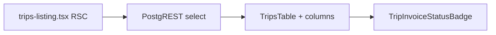

# Trip invoice status badge (trips list)

## Data flow




- List data stays server-fetched in `[src/features/trips/components/trips-listing.tsx](src/features/trips/components/trips-listing.tsx)` (existing `select` at lines 47–56).
- Embed adds `invoice_line_items` rows linked by `trip_id` (manual line items with `trip_id IS NULL` never appear on a trip row).
- Nested `invoices(...)` supplies `status` (+ `paid_at` / `sent_at` per your types; resolver only needs `status` today).

## Change 1 — Widen `select` in `trips-listing.tsx`

Append to the existing template string (after the `fremdfirma:fremdfirmen(...)` line), preserving formatting:

```text
invoice_line_items!invoice_line_items_trip_id_fkey(
  invoice_id,
  invoices(status, paid_at, sent_at)
)
```

Add the inline comment you specified (`// For trip invoice status badge — only trip_id-linked items; manual lines (trip_id IS NULL) are excluded by the FK join`).

**FK hint:** Postgres default name for `invoice_line_items.trip_id → trips.id` is `invoice_line_items_trip_id_fkey` (matches inline `REFERENCES` in `[supabase/migrations/20260331130000_create_invoice_line_items.sql](supabase/migrations/20260331130000_create_invoice_line_items.sql)`). If the embed fails at runtime with an “relationship not found” style error, confirm the live constraint name in Supabase (`information_schema` / Dashboard) — only then rename the hint.

**RLS:** `[supabase/migrations/20260401180000_invoices_invoice_line_items_rls.sql](supabase/migrations/20260401180000_invoices_invoice_line_items_rls.sql)` scopes `invoice_line_items` and `invoices` SELECT to company admins via parent invoice; same session that already reads `trips` should see consistent rows. No migration change expected for this feature.

**Payload size:** List queries can return more rows per trip (one embed object per line item). Acceptable for first version; watch Kanban `limit(2000)` if performance becomes an issue.

## Change 2 — New `[src/features/trips/components/trip-invoice-status-badge.tsx](src/features/trips/components/trip-invoice-status-badge.tsx)`

- `'use client'` not required unless you add hooks; your snippet is presentational — a server-importable module is fine. Prefer **no** `'use client'` unless something forces it.
- Implement exactly the types, `resolveEffectiveStatus`, `statusConfig`, and `TripInvoiceStatusBadge` you provided.
- Add the Storno explanation comment above `resolveEffectiveStatus` (original becomes `corrected`, storno line items on `draft` — ignoring `corrected` surfaces `draft` from the storno invoice).

**Optional type hygiene:** Reuse `InvoiceStatus` from `[src/features/invoices/types/invoice.types.ts](src/features/invoices/types/invoice.types.ts)` for the invoice `status` union instead of duplicating literals — only if it stays a strict superset of what PostgREST returns.

**Header label note:** Your spec uses `title="Abrechnung"` for the new column, but `[src/features/trips/components/trips-tables/columns.tsx](src/features/trips/components/trips-tables/columns.tsx)` already uses **Abrechnung** for the billing variant column (line ~348). Implement as you specified; consider renaming one header to **Rechnungsstatus** in a quick follow-up if duplicate headers confuse users.

## Change 3 — Column in `[src/features/trips/components/trips-tables/columns.tsx](src/features/trips/components/trips-tables/columns.tsx)`

- Import `TripInvoiceStatusBadge`.
- Insert the new column **immediately after** the trip workflow `status` column (the one with `tripStatusBadge` / `TripStatus`), with your `id: 'invoice_status'`, header, cell (`row.original.invoice_line_items ?? []`), and the inline comment about the widened select.
- Consider `enableSorting: false` and `enableColumnFilter: false` to match adjacent computed columns (e.g. `status` sets `enableColumnFilter: false`).

## Verification

- Run `bun run build` from repo root.
- Smoke-test `/dashboard/trips` list: uninvoiced trip, draft-only, sent, paid, and storno scenario (corrected ignored, storno draft visible) if you have seed data.

## Out of scope (not requested)

- Kanban cards and mobile list do not get the badge unless you extend those UIs separately.
- No TanStack Query key changes — list remains RSC; existing `refreshTripsPage()` still refreshes embedded data.

