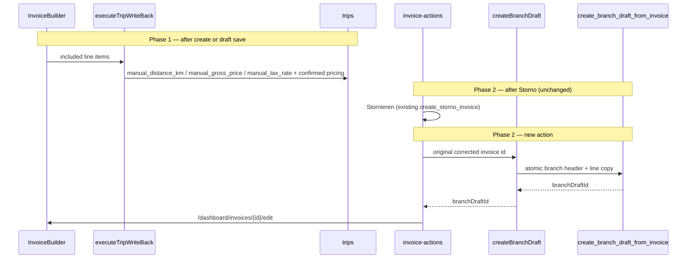

# Trip Override Write-Back + Branch Draft Flow

## Architecture overview



**Hard constraints (unchanged from spec):**
- [`storno.ts`](src/features/invoices/lib/storno.ts) + `create_storno_invoice` — zero functional changes
- Never write `trips.tax_rate`, `trips.driving_distance_km`, or `trips.net_price` from invoice flows
- Branch draft created **only** inside RPC transaction
- Regenerate types via `bun run db:types` after each migration (never hand-edit [`database.types.ts`](src/types/database.types.ts))
- **Hide Stornieren when `cancels_invoice_id != null`** — Stornorechnung rows are not storno-eligible; only originals (`cancels_invoice_id == null`) may show Stornieren
- Build gate: `bun run build` after every step
- Step 1 additional gate: `bun test src/features/invoices/lib/__tests__/trip-write-back.test.ts` must pass before Step 2
- Full test suite gate: `bun test` after Step 7

---

## Pre-execution gaps (addressed in plan)

The items below were raised in review and are now explicit requirements — not optional notes.

---

## Phase 1 — Trip override write-back

### Step 0 — Migration: `manual_tax_rate` on `trips`

**New file:** `supabase/migrations/YYYYMMDDHHMMSS_trips_manual_tax_rate.sql`

```sql
ALTER TABLE public.trips
  ADD COLUMN IF NOT EXISTS manual_tax_rate NUMERIC DEFAULT NULL;
-- + COMMENT ON COLUMN (per spec)
```

**Then:** `bun run db:types`

**Also update** hand-maintained [`InvoiceRow`](src/features/invoices/types/invoice.types.ts) only if needed for app types before regen catches up — prefer relying on regenerated DB types for `Trip`/`UpdateTrip`.

---

### Step 1 — Fix [`trip-write-back.ts`](src/features/invoices/lib/trip-write-back.ts)

Current bug: `buildTripWriteBackPatch` writes `tax_rate: item.tax_rate` unconditionally (line 24).

**Changes:**

| Field | Rule |
|-------|------|
| `manual_tax_rate` | Set **only** when `item.isManualTaxRateOverride === true`, value = `item.tax_rate` |
| `tax_rate` | **Remove** from patch entirely |
| `manual_distance_km` | Keep: only when `isManualKmOverride && manualDistanceKm != null` (already correct) |
| `manual_gross_price` | Keep: only when `isManualOverride && manualGrossTotal != null` (already correct) |
| `base_net_price`, `approach_fee_net`, `gross_price` | Keep writing confirmed invoice values (not in `PRICING_RELEVANT_FIELDS` — no price-engine recalc) |
| `net_price` | Never in patch |

Update [`TripWriteBackPatch`](src/features/invoices/types/invoice.types.ts): replace required `tax_rate` with optional `manual_tax_rate?`. Adjust [`FailedSyncItem`](src/features/invoices/types/invoice.types.ts) display field (keep showing line `tax_rate` at failure time for UI, not trip column).

**Unit tests (required — build gate before Step 2):**

- **File:** `src/features/invoices/lib/__tests__/trip-write-back.test.ts` (matches existing invoice lib test layout, e.g. `apply-tax-rate-override.test.ts` in hooks)
- **Command:** `bun test src/features/invoices/lib/__tests__/trip-write-back.test.ts`
- **Must pass** before proceeding to Step 2 (in addition to `bun run build`)

**Required test cases for `buildTripWriteBackPatch`:**

| # | Assertion |
|---|-----------|
| (a) | `manual_tax_rate` is present in patch **only** when `isManualTaxRateOverride === true`; absent otherwise |
| (b) | `tax_rate` is **never** a key on the returned patch |
| (c) | `net_price` is **never** a key on the returned patch |
| (d) | `driving_distance_km` is **never** a key on the returned patch |

Optional additional cases: KM/gross conditional patches (`manual_distance_km`, `manual_gross_price`) — keep if quick, not blocking.

**Verify:** `executeTripWriteBack` filter unchanged — `billingInclusion.included && trip_id !== null`.

**Build gate:** `bun run build` **and** `bun test src/features/invoices/lib/__tests__/trip-write-back.test.ts` before Step 2.

---

### Step 2 — Effective tax rate resolution

**New utility** (same module pattern as [`resolve-effective-distance.ts`](src/features/invoices/lib/resolve-effective-distance.ts)) — either extend that file or add `resolve-effective-tax-rate.ts`:

```ts
export function resolveEffectiveTaxRate(input: {
  manualTaxRate: number | null | undefined;
  taxRate: number | null | undefined;
  effectiveDistanceKm: number | null | undefined;
}): number {
  if (input.manualTaxRate != null) return input.manualTaxRate;
  // why: preserve §12 UStG distance tiering for trips without a write-back override;
  // trip.tax_rate is the billing-engine value at trip creation, not the invoice VAT tier.
  const fromDistance = resolveTaxRate(input.effectiveDistanceKm).rate;
  return fromDistance;
}
```

**Call sites to update (read each file first):**

1. [`fetchTripsForBuilder`](src/features/invoices/api/invoice-line-items.api.ts) — add `manual_tax_rate` to trips `select`
2. [`buildLineItemsFromTrips`](src/features/invoices/api/invoice-line-items.api.ts) — replace `resolveTaxRate(effectiveDistanceKm).rate` with `resolveEffectiveTaxRate({ manualTaxRate: trip.manual_tax_rate, taxRate: trip.tax_rate, effectiveDistanceKm })`
3. [`buildCancelledTripBillingState`](src/features/invoices/api/invoice-line-items.api.ts) — same pattern if cancelled fetch includes pricing fields
4. Add `manual_tax_rate?: number | null` to [`TripForInvoice`](src/features/invoices/types/invoice.types.ts) / cancelled trip shape as needed

**Do not** change Storno, PDF, or unrelated trip UI unless they read trip tax for invoice build.

---

## Phase 2 — Branch draft flow

### Step 3 — Migration: `replaces_invoice_id` on `invoices`

**New file:** `supabase/migrations/YYYYMMDDHHMMSS_invoices_replaces_invoice_id.sql`

- Column `replaces_invoice_id UUID REFERENCES invoices(id) ON DELETE SET NULL`
- Partial unique index `WHERE replaces_invoice_id IS NOT NULL`
- Column comment per spec

**Then:** `bun run db:types`

**Update** [`InvoiceRow`](src/features/invoices/types/invoice.types.ts): add `replaces_invoice_id: string | null`

---

### Step 4 — RPC: `create_branch_draft_from_invoice`

**New file:** `supabase/migrations/YYYYMMDDHHMMSS_create_branch_draft_rpc.sql`

**Pre-flight (mandatory before writing INSERT):** Re-read `invoices` columns — migration [`20260401193000_add_invoice_text_block_columns.sql`](supabase/migrations/20260401193000_add_invoice_text_block_columns.sql) confirms **`intro_block_id` and `outro_block_id` exist** on `public.invoices` as nullable UUID FKs to `invoice_text_blocks`. They are persisted at create time via [`createInvoice`](src/features/invoices/api/invoices.api.ts) (`intro_block_id` / `outro_block_id` in the insert payload), not builder-only form state. **Safe to copy** from the corrected original header in the RPC INSERT.

If regen/types or a future migration ever removed these columns, omit them from the INSERT rather than failing — but today they are on the row.

Mirror auth from [`create_storno_invoice`](supabase/migrations/20260411120000_storno_atomic_rpc.sql):
- `SECURITY DEFINER`, `SET search_path = public`
- `current_user_is_admin()` + `p_company_id = current_user_company_id()`

**Single transaction:**

1. Load original; require `status = 'corrected'` (raise `23514` if not)
2. Guard: no existing row with `replaces_invoice_id = p_original_invoice_id`
3. INSERT branch header — copy from original:
   - `payer_id`, `billing_type_id`, `billing_variant_id`, `mode`, `client_id`, `period_from`, `period_to`
   - `payment_due_days`, `intro_block_id`, `outro_block_id` (verified on row — copy for PDF/builder parity)
   - `rechnungsempfaenger_id`, `rechnungsempfaenger_snapshot`, `client_reference_fields_snapshot`, `pdf_column_override`
   - **`subtotal`, `tax_amount`, `total`** copied positive from original (corrective draft matches storniert amounts)
   - `status = 'draft'`, `invoice_number = p_branch_invoice_number`, `replaces_invoice_id = p_original_invoice_id`, `company_id = p_company_id`
   - `cancels_invoice_id = NULL` (branch is not a Storno)
4. INSERT line items — `INSERT … SELECT` from `invoice_line_items WHERE invoice_id = p_original_invoice_id`, all snapshot columns verbatim, new `invoice_id`, preserve `position`
5. `RETURN branch_draft_id`

**Do not** modify `create_storno_invoice`.

---

### Step 5 — `createBranchDraft()` in [`invoices.api.ts`](src/features/invoices/api/invoices.api.ts)

New exported function (no changes to existing exports):

1. `generateNextInvoiceNumber()` — same as [`storno.ts`](src/features/invoices/lib/storno.ts) L62
2. `supabase.rpc('create_branch_draft_from_invoice', { p_company_id, p_original_invoice_id, p_branch_invoice_number })`
3. Return `{ branchDraftId: string }`

Add helper **`branchDraftExistsForOriginal(originalInvoiceId: string): Promise<boolean>`** — `select id from invoices where replaces_invoice_id = eq limit 1` — used by detail UI gating.

---

### Step 6 — `useCreateBranchDraft` in [`use-invoice.ts`](src/features/invoices/hooks/use-invoice.ts)

New hook alongside `useCreateStornorechnung`:

- `mutationFn`: `createBranchDraft`
- `onSuccess`: invalidate `invoiceKeys.all` + `invoiceKeys.full(originalId)` + `invoiceKeys.full(branchDraftId)` (match Storno pattern; add branch id invalidation)
- Return standard `useMutation` result (`mutate`/`mutateAsync`, `isPending`, `error`) — **no router** in hook

Optional: `useBranchDraftExists(originalInvoiceId)` query hook wrapping `branchDraftExistsForOriginal`.

---

### Step 7 — UI: [`invoice-actions.tsx`](src/features/invoices/components/invoice-detail/invoice-actions.tsx)

**Step 7 pre-flight — verify `InvoiceStatus` type:**

At the start of Step 7, confirm [`InvoiceStatus`](src/features/invoices/types/invoice.types.ts) includes `'corrected'` (already present at L54–59). Use `InvoiceStatus` / typed comparisons — no raw `'corrected'` string literals outside the union if avoidable.

**Confirm `InvoiceActions` is rendered on Storno detail:** [`invoice-detail/index.tsx`](src/features/invoices/components/invoice-detail/index.tsx) L409 renders `<InvoiceActions invoice={invoice} />` for all invoice detail pages, including Stornorechnung rows (`status = 'draft'`, `cancels_invoice_id` set).

---

**Critical fix — terminal-state guard (easy to miss):**

Current code at L84–86:

```ts
if (['paid', 'cancelled', 'corrected'].includes(invoice.status)) {
  return null;
}
```

This **silently hides all buttons** on corrected invoices, including the new one. **Do not leave this as-is.**

**Required refactor:**

1. Remove `'corrected'` from the early `return null` list.
2. Keep `return null` only for `paid` and `cancelled` (true terminal states with no branch action).
3. For `status === 'corrected'`, render **only** the branch button block (no sent/paid/storno actions).
4. Do not use a blanket early return that swallows corrected invoices.

---

**"Neue Rechnung erstellen" visibility:**

| Invoice context | Show branch button | RPC `p_original_invoice_id` |
|-----------------|-------------------|----------------------------|
| `status === 'corrected'` | Yes | `invoice.id` |
| `cancels_invoice_id != null` (Storno detail, usually `draft`) | Yes | `invoice.cancels_invoice_id` |

**Hide branch button** on: normal `draft` (no `cancels_invoice_id`), `sent`, `paid`, `cancelled`.

**Gating:** `useQuery` → `branchDraftExistsForOriginal(originalInvoiceId)`; disable + tooltip `"Für diese Rechnung wurde bereits eine Korrekturrechnung erstellt."`

**Confirm dialog** (separate from Storno): title/body/labels per spec.

**On confirm:** `useCreateBranchDraft` → `router.push(\`/dashboard/invoices/${branchDraftId}/edit\`)` (same route as existing Bearbeiten L95).

---

**Storno detail page — button clash (must fix in same Step 7):**

Because Stornorechnung rows are `status = 'draft'`, the **existing** draft actions would incorrectly appear alongside the branch button.

**Hard rule:** **Hide Stornieren when `cancels_invoice_id != null`.** Do not rely on status alone — a Storno document is a `draft`, so the current L136 guard (`status === 'draft'`) would still show Stornieren unless `cancels_invoice_id` is checked.

At top of component:

```ts
const isStornoDocument = invoice.cancels_invoice_id != null;
```

Stornieren block (L135–175) must become:

```tsx
{(['draft', 'sent'] as InvoiceStatus[]).includes(invoice.status) &&
  !isStornoDocument && (
  /* existing Stornieren AlertDialog — unchanged inside */
)}
```

| Existing button | On Storno detail today | Required behaviour |
|-----------------|------------------------|-------------------|
| **Stornieren** | Shown (L136 — any `draft`) | **Hidden** — `!isStornoDocument` guard above |
| **Als versendet markieren** | Shown | **Keep** — sending the Storno PDF to the payer is valid |
| **Bearbeiten** | Shown if `revision_invoices_enabled` | **Hide** when `isStornoDocument` — corrective work is via branch draft |

**Stornieren on original invoices:** unchanged — still shown for `draft` and `sent` when `cancels_invoice_id == null`.

---

### Step 7b — Edit route guard (required for branch redirect)

**File:** [`src/app/dashboard/invoices/[id]/edit/page.tsx`](src/app/dashboard/invoices/[id]/edit/page.tsx)

Extend server guard (currently L41–56):

```ts
.select('id, status, replaces_invoice_id, payer:payers(revision_invoices_enabled)')

const isBranchDraft = invoice.replaces_invoice_id != null;
const canEdit =
  invoice.status === 'draft' &&
  (isBranchDraft || payerFlagEnabled);
```

**Decision (confirmed):** Branch drafts **bypass** `revision_invoices_enabled`. Flag remains required for all other draft re-opens.

Add inline `why` comment documenting the two paths.

---

### Step 8 — Docs and audit update

- [`docs/invoices-module.md`](docs/invoices-module.md): new sections for `manual_tax_rate`, write-back rules, `replaces_invoice_id`, branch RPC, full Storno → branch flow, deferred items list
- [`docs/plans/trip-override-storno-audit.md`](docs/plans/trip-override-storno-audit.md): mark implemented items / add "Implemented" status table
- Inline `why` comments on all new/changed paths (per spec)

---

## Files touched (summary)

| File | Phase |
|------|-------|
| 3 new SQL migrations | 0, 3, 4 |
| `trip-write-back.ts` + `TripWriteBackPatch` type | 1 |
| `resolve-effective-tax-rate.ts` (or extend distance module) | 1 |
| `invoice-line-items.api.ts` + `TripForInvoice` | 1 |
| `invoices.api.ts` | 2 |
| `use-invoice.ts` | 2 |
| `invoice-actions.tsx` | 2 |
| `edit/page.tsx` | 2 |
| `invoice.types.ts` (`replaces_invoice_id`, patch type) | 1–2 |
| `database.types.ts` | regen only |
| docs | 8 |

---

## Deferred (explicitly out of scope)

- `trip_ids_matching_invoice_effective_status` RPC update
- Persist `isManualOverride` / KM / tax badges on `invoice_line_items`
- Branch draft trip write-back policy
- Abrechnung `cancelled` path cleanup
