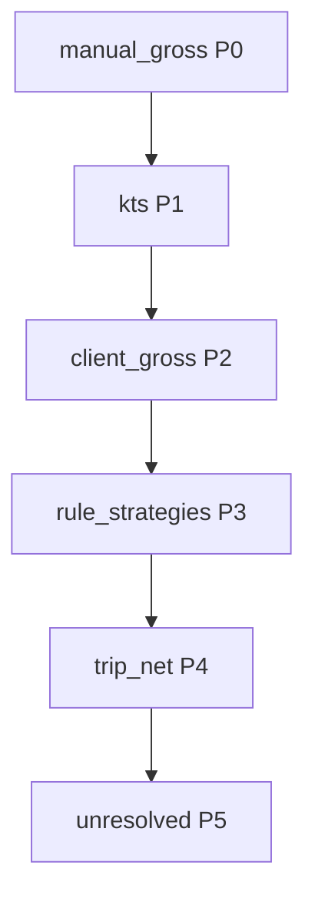

# Plan: Trip price single source of truth (Steps 0–4)

## Preconditions / corrections to the spec

- **[`src/features/invoices/api/invoice-line-items.api.ts`](src/features/invoices/api/invoice-line-items.api.ts)** (not a separate `build-line-items-from-trips.ts`) defines **`buildLineItemsFromTrips`** and **`fetchTripsForBuilder`**. Step 2 changes belong here, plus [`TripForInvoice`](src/features/invoices/types/invoice.types.ts) and the `select` list in `fetchTripsForBuilder`.
- **[`src/features/invoices/hooks/use-invoice-builder.ts`](src/features/invoices/hooks/use-invoice-builder.ts)** only calls `buildLineItemsFromTrips(trips, …)`; it does **not** construct `TripPriceInput`. No Step 2a snippet in this file unless a later need appears (e.g. unrelated wiring).
- **Types:** [`PriceResolutionSource`](src/features/invoices/types/pricing.types.ts) has no `'manual_gross_price'` today — add it, or the P0 `source` in the spec will not compile.
- **Recalculation path:** [`computeTripPrice`](src/features/trips/lib/trip-price-engine.ts) builds `TripPriceInput` and calls `resolveTripPrice`. It must pass **`manual_gross_price`** from the trip row, or P0 will never run when **persisting** prices. Same for **[`resolveTripForPricing`](src/features/trips/lib/trip-price-engine.ts)**: keep **`net_price: null`**, but **add** `manual_gross_price` to the `select` and merge it from `patch ?? current` (do **not** null it), otherwise any pricing `updateTrip` would ignore stored taxameter. This is consistent with the user’s “do not touch `net_price: null`” rule.
- **UI / badge (authoritative):** P0 and catalog **`manual_trip_price`** both use `strategy_used: 'manual_trip_price'`. **Do not** use `strategy_used` alone to pick the “Taxameter” label. **“Taxameter”** when **`item.price_resolution.source === 'manual_gross_price'`** (fare already on the trip row) **or** **`item.isManualOverride === true`** (admin entered gross in the current builder session before save) — both are taxameter fare; only timing differs. Otherwise catalog **`manual_trip_price`** rows **keep the existing “Manuell”** label. Apply the same condition for the inline compact `Badge` and related copy.
- **P0 (taxameter) and Anfahrt:** Do **not** apply `withApproachFeeFromRule` on P0. The taxameter total already includes the approach fee; wrapping P0 in `withApproachFeeFromRule` would double-count Anfahrt. P0 must return the result of `resolution(…)` **directly**, with **`approach_fee_net: 0`** (explicitly no separate approach line for this path).
- **Extra “Manuell” string:** In [`step-3-line-items.tsx`](src/features/invoices/components/invoice-builder/step-3-line-items.tsx) there is a **third** `Manuell` in the compact row `Badge` (~line 429) plus `aria-label='Preis zurücksetzen'`. Use the same combined rule: **Taxameter** when `source === 'manual_gross_price'` **or** `isManualOverride === true`; otherwise keep “Manuell” where appropriate for non-taxameter cases.

---

## Step 0 — Data backfill (no app code)

1. Run **exactly** the user’s count query (pre-check):

   `COUNT(*) FROM trips WHERE net_price IS NULL AND payer_id IS NOT NULL`

2. If 0, skip. If &gt; 0, add a **one-off script** (e.g. `scripts/backfill-null-trip-net-prices.ts`) that:
   - Fetches rows matching the same filter.
   - For each row, builds [`ComputeTripPriceInput`](src/features/trips/lib/trip-price-engine.ts) (include **`manual_gross_price`** once that field exists on the type — if Step 0 runs before code changes, use the **current** shape and re-run or branch; **recommended order:** run Step 0 **after** Step 1 code so one script shape matches production).
   - `loadPricingContext` + `computeTripPrice` + `update` with service role.
   - Logs: updated, unresolved (all-null), errors with ids.

3. **Order recommendation:** implement Step 1 (types + `computeTripPrice` + `resolveTripForPricing` pass-through) first, then run backfill, then Steps 2–3. If you must backfill before code deploy, document that the script must use the pre–P0 `computeTripPrice` only.

4. **Environments:** dev/staging first; production only after validation.

**Build gate:** N/A (data only) — but confirm counts in logs.

---

## Step 1 — `resolveTripPrice` P0 (taxameter) + engine plumbing

**Files (minimum):**

| File | Change |
|------|--------|
| [`resolve-trip-price.ts`](src/features/invoices/lib/resolve-trip-price.ts) | Extend `TripPriceInput` with `manual_gross_price`; add P0 branch **before** current KTS; renumber file comments P0–P5; KTS → P1, client tag → P2, rules → P3, trip net → P4, unresolved → P5. **P0:** return `resolution(…)` only, set `approach_fee_net: 0` — **do not** call `withApproachFeeFromRule` (taxameter gross already includes Anfahrt). `source: 'manual_gross_price'` requires **pricing.types** update. |
| [`pricing.types.ts`](src/features/invoices/types/pricing.types.ts) | Add `'manual_gross_price'` to `PriceResolutionSource`. |
| [`trip-price-engine.ts`](src/features/trips/lib/trip-price-engine.ts) | Add `manual_gross_price` to `ComputeTripPriceInput`; pass into `TripPriceInput` in `computeTripPrice`; extend `resolveTripForPricing` select + merged field (see above). `computeTripPrice` total-net merge with `approach_fee_net` must treat P0 as **no extra** approach (P0 already all-in). |
| [`resolve-trip-price.test.ts`](src/features/invoices/lib/__tests__/resolve-trip-price.test.ts) | Add: P0 `manual_gross` wins over KTS; P0 has no added approach fee. Update any test that assumed KTS is first. |

**Build gate:** `bun run build` and `bun test`.

---

## Step 2 — Builder data path

**Files:**

| File | Change |
|------|--------|
| [`invoice.types.ts`](src/features/invoices/types/invoice.types.ts) | `TripForInvoice`: `manual_gross_price: number \| null`. |
| [`invoice-line-items.api.ts`](src/features/invoices/api/invoice-line-items.api.ts) | Add `manual_gross_price` to `fetchTripsForBuilder` `select`. Pass `manual_gross_price: trip.manual_gross_price ?? null` into the object passed to `resolveTripPricePure` in `buildLineItemsFromTrips`. Add short “why” comment. |
| [`database.types.ts`](src/types/database.types.ts) | Only touch if out of sync with DB (migration already added column). |

**Build gate:** `bun run build`.

---

## Step 3 — Step 3 UI copy

- [`step-3-line-items.tsx`](src/features/invoices/components/invoice-builder/step-3-line-items.tsx): In `priceResolutionBadge` (and the inline compact `Badge` / `aria-label`), use **“Taxameter”** when **`item.price_resolution.source === 'manual_gross_price'` OR `item.isManualOverride === true`**. Rationale: both are the admin recording a taxameter fare — `source` when it was persisted on the trip, `isManualOverride` when typed in the current session before save. The existing `strategy_used === 'manual_trip_price'` branch (catalog) **keeps** label **“Manuell”** when **neither** of those conditions holds. Do not relabel all `manual_trip_price` rows.

**Build gate:** `bun run build`.

---

## Step 4 — Docs

- [`docs/plans/trip-price-source-of-truth-audit.md`](docs/plans/trip-price-source-of-truth-audit.md) and [`docs/plans/resolve-trip-price-internals-audit.md`](docs/plans/resolve-trip-price-internals-audit.md): add **Implementation status** (date, files, note on P0 order).
- Inline comments on new paths (P0, builder input, badge distinction).

**Deferred:** per user — schema split, bare `createTrip` / return insert, taxameter on trip edit, Step 3 tab order.

---

## Risks / notes

- **P0 and `computeTripPrice`:** After `resolveTripPrice`, `computeTripPrice` adds `approachFeeNet` to `resolution.net` for stored `trips.net_price`. For P0, `approach_fee_net` is **0** so the stored snapshot does not double-count Anfahrt.
- **`legacyPriceSource`:** may return `null` for `manual_gross_price` unless you extend the union in [`BuilderLineItem['price_source']`](src/features/invoices/types/invoice.types.ts) — only if you need PDF/legacy parity.
