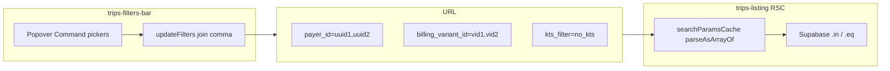

# Trips filters: KTS + multi-select plan

Based on [docs/plans/trips-filters-multi-select-audit.md](docs/plans/trips-filters-multi-select-audit.md) and the files you listed. **No shared `TripsKtsFilter` type file** — duplicate a small allowlist constant in Step 1 files only (avoids a new module and client/server import boundaries).



**Out of scope (per your spec):** `fetchBillingVariantsForPayers`, `kanbanKey` updates, CSV export dialog (TODO comment only in Step 3), changes to [step-2-params.tsx](src/features/invoices/components/invoice-builder/step-2-params.tsx).

---

## Step 1 — KTS: `no_kts` and `no_reha`

**Goal:** Two new filter modes without touching payer/billing URL shape.

### [src/lib/searchparams.ts](src/lib/searchparams.ts)

- Update `kts_filter` comment only:
  - `kts | kts_fehler | no_kts | no_reha; absent = all trips`
- Keep `parseAsString` (no parser change).

### [src/features/trips/components/trips-listing.tsx](src/features/trips/components/trips-listing.tsx)

Extend the existing KTS `if / else if` block (after `kts_fehler`):

| Value | PostgREST |
|-------|-----------|
| `no_kts` | `.eq('kts_document_applies', false)` |
| `no_reha` | `.eq('reha_schein', false)` |

Columns are on `trips` per [docs/kts-architecture.md](docs/kts-architecture.md) — no RPC/migration.

Optional (recommended): server-side allowlist — unknown `kts_filter` values behave like `'all'` (parity with client), e.g. only apply branches for known literals.

### [src/features/trips/components/trips-filters-bar.tsx](src/features/trips/components/trips-filters-bar.tsx)

- Add module-level allowlist, e.g. `const TRIPS_KTS_FILTER_VALUES = ['all', 'kts', 'kts_fehler', 'no_kts', 'no_reha'] as const` and derive normalized `ktsFilter` from `ktsFilterRaw` (fallback `'all'`).
- Add two `<SelectItem>` entries under the KTS `<Select>`:
  - `no_kts` — label **KTS: Kein KTS**
  - `no_reha` — label **KTS: Kein Reha-Schein** (or **Kein Reha-Schein** without duplicate “KTS:” if you prefer shorter copy; keep consistent with existing “KTS: …” prefix).
- `hasAdvancedFilters`: unchanged logic (`ktsFilter !== 'all'` already covers new values once allowlisted).

**Do not change** `payer_id`, `billing_variant_id`, or `updateFilters` in Step 1.

### Build gate (Step 1)

```bash
bun run build
```

Stop if build fails; do not start Step 2.

---

## Step 2 — Multi-select Kostenträger (`payer_id`)

**Goal:** Comma-separated UUIDs in one param; server `.in('payer_id', ids)`; Option B — hide/clear Abrechnung when payer count ≠ 1.

### [src/lib/searchparams.ts](src/lib/searchparams.ts)

- Import `parseAsArrayOf` from **`'nuqs/server'` only** — same module as existing `parseAsString`. **Do not** import from `'nuqs'` (client bundle); `searchparams.ts` is consumed by the RSC and a client import would break the server boundary.
- Replace `payer_id: parseAsString` with:
  ```ts
  payer_id: parseAsArrayOf(parseAsString, ','),
  ```
- Leave `billing_variant_id` as `parseAsString` until Step 3 (single-value URLs still work).

### [src/features/trips/components/trips-listing.tsx](src/features/trips/components/trips-listing.tsx)

- Read `const payerIds = searchParamsCache.get('payer_id')` → `string[] | null`.
- Replace payer block:
  ```ts
  if (payerIds?.length) {
    query = query.in('payer_id', payerIds);
  }
  ```
- Remove legacy `payerId !== 'all'` checks (server never relied on literal `'all'` in URL).

### [src/features/trips/components/trips-filters-bar.tsx](src/features/trips/components/trips-filters-bar.tsx)

**URL read (client stays on `useSearchParams`, not nuqs hooks):**

- Parse payers once with helper `parseCommaSeparatedIds(param: string | null): string[]`:
  ```ts
  // Absent param → []; present but empty "" → []. No extra guard needed.
  param?.split(',').filter(Boolean) ?? []
  ```
- Drop `payerId` sentinel `?? 'all'`; **empty array = no filter**.

**`useTripFormData` (critical — do not pass joined string):**

```ts
const singlePayerIdForBilling =
  selectedPayerIds.length === 1 ? selectedPayerIds[0]! : null;
const { drivers, payers, billingVariants } = useTripFormData(singlePayerIdForBilling);
```

**`updateFilters` helper:**

- Widen signature to `Record<string, string | string[] | null | undefined>`.
- Semantics: **`undefined` = skip key** (leave URL unchanged); **`null` or `''` = delete**; **`string[]` = join with comma**; **`string` = set scalar**.
- Implement explicitly (required — payer toggle relies on `billing_variant_id: undefined` vs `null`):

```ts
Object.entries(updates).forEach(([key, value]) => {
  if (value === undefined) return; // skip — leave URL key unchanged
  if (value === null || value === '') {
    params.delete(key);
  } else if (Array.isArray(value)) {
    value.length > 0 ? params.set(key, value.join(',')) : params.delete(key);
  } else {
    params.set(key, value);
  }
});
```

- Payer multi-select on change:
  ```ts
  updateFilters({
    payer_id: nextIds,
    billing_variant_id: nextIds.length === 1 ? undefined : null
  });
  ```
  When count goes from 1 → >1, `null` clears `billing_variant_id` from the URL immediately (Option B).

**Replace payer `<Select>`** with inline **Popover + Command** multi-select modeled on [MonthlyBillingTypesPicker](src/features/invoices/components/invoice-builder/step-2-params.tsx) (checkbox row + clear row), adapted to filter-bar trigger classes (`h-10 min-h-10 … md:h-9` like other filters, not invoice `border-dashed`):

- Options: all `payers` from `useTripFormData`.
- Toggle IDs in a `Set`; on change use the `updateFilters` call above (undefined vs null for billing).
- Trigger label: `Alle Kostenträger` / payer name / `N Kostenträger gewählt`.
- `CommandInput` placeholder e.g. `Kostenträger suchen…`.

**Billing UI (Option B, partial — full multi-select in Step 3):**

- Change **render guard only** from `payerId !== 'all'` to `selectedPayerIds.length === 1 && billingVariants.length > 0`.
- **Do not refactor** the billing `<Select>` `onValueChange` handler in Step 2 — leave it as today (`updateFilters({ billing_variant_id: val })` / `null` for “all”). Step 3 replaces the entire billing control; avoid a half-migrated billing UI before the Step 2 build gate.

**`hasAdvancedFilters`:**

- `selectedPayerIds.length > 0` instead of `payerId !== 'all'`.

**Reset:** still `payer_id: null` (delete key) — sufficient.

### Build gate (Step 2)

```bash
bun run build
```

Stop if build fails; do not start Step 3.

---

## Step 3 — Multi-select Abrechnung (`billing_variant_id`)

**Goal:** Multi-select variants only when **exactly one** payer selected; server `.in('billing_variant_id', ids)`.

### [src/lib/searchparams.ts](src/lib/searchparams.ts)

- `billing_variant_id: parseAsArrayOf(parseAsString, ',')` — `parseAsArrayOf` imported from **`'nuqs/server'` only** (same rule as Step 2).

### [src/features/trips/components/trips-listing.tsx](src/features/trips/components/trips-listing.tsx)

- `const billingVariantIds = searchParamsCache.get('billing_variant_id')`.
- Apply filter only when `billingVariantIds?.length`:
  ```ts
  query = query.in('billing_variant_id', billingVariantIds);
  ```
- Remove `billingVariantId !== 'all'` legacy check.

### [src/features/trips/components/trips-filters-bar.tsx](src/features/trips/components/trips-filters-bar.tsx)

- Parse `selectedBillingVariantIds` from URL (same comma helper).
- Replace Abrechnung `<Select>` with Popover + Command multi-select (pattern from [MonthlyVariantSubsetPicker](src/features/invoices/components/invoice-builder/step-2-params.tsx)):
  - Two-line option label: `billing_type_name · name` + mono `code` (match current `<SelectItem>` layout).
  - `updateFilters({ billing_variant_id: ids })` via joined helper.
  - Trigger: `Alle Abrechnungen` / one variant label / **`N Abrechnungen gewählt`** (parallel to `N Kostenträger gewählt`).
- Render only when `selectedPayerIds.length === 1 && billingVariants.length > 0`.
- `hasAdvancedFilters`: `selectedBillingVariantIds.length > 0` instead of `billingVariantId !== 'all'`.

**TODO comment** (near payer/billing URL helpers or file header):

```ts
// TODO: csv-export-dialog.tsx still uses single payer_id / billing_variant_id — align when export supports multi-filter.
```

Do **not** edit [csv-export-dialog.tsx](src/features/trips/components/csv-export/csv-export-dialog.tsx) in this plan.

### Build gate (Step 3)

```bash
bun run build
```

---

## Regression checklist (manual, after Step 3)

| Scenario | Expected |
|----------|----------|
| No `payer_id` in URL | All payers; no Abrechnung picker |
| `payer_id=one-uuid` | Filtered trips; Abrechnung picker + variants load |
| `payer_id=uuid1,uuid2` | OR filter; Abrechnung hidden; `billing_variant_id` cleared from URL |
| `billing_variant_id=v1,v2` with one payer | Trips matching either variant |
| `kts_filter=no_kts` | Only `kts_document_applies = false` |
| `kts_filter=no_reha` | Only `reha_schein = false` |
| Reset button | All filter keys removed; page=1 |
| Old bookmark `?payer_id=single-uuid` | Still works via `parseAsArrayOf` |

---

## Files touched (summary)

| Step | Files |
|------|--------|
| 1 | `searchparams.ts`, `trips-listing.tsx`, `trips-filters-bar.tsx` |
| 2 | + `payer_id` parser + payer UI/helper in same three files |
| 3 | + `billing_variant_id` parser + billing UI in same three files |

**Unchanged:** `use-trip-form-data.ts`, `use-trip-reference-queries.ts`, `trip-reference-data.ts`, `step-2-params.tsx`, `reference.ts` (query keys stay per single payer).
