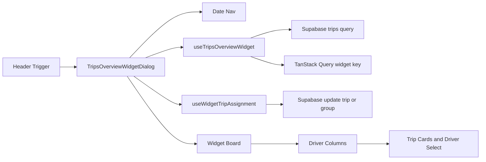

# Trips Overview Widget Plan

## Ground Rules
- Keep the existing full Kanban files untouched: `src/features/trips/components/kanban/kanban-board.tsx`, `kanban-column.tsx`, `kanban-trip-card.tsx`, `kanban-driver-column-header.tsx`, and `src/features/trips/stores/use-kanban-pending-store.ts`.
- Do not import `useKanbanPendingStore`, `useTripsRscRefresh`, `refreshTripsPage`, or `TripsRscRefreshProvider` in the widget.
- Use `src/lib/trip-status.ts` for status labels/classes; `src/features/trips/lib/trip-status.ts` does not exist.
- Treat drivers as active `accounts` rows from `useDriversQuery()`; the generated DB type is `Database['public']['Tables']['accounts']['Row']`.
- Run `bun run build` after each implementation step, then `bun test` after the header mount and docs step.

## Implementation Flow

1. Create `src/features/trips/hooks/use-trips-overview-widget.ts`.
   - Use `useQuery` with key `[...tripKeys.all, 'widget', dateString]`.
   - Derive `dateString` and Berlin day bounds via existing trip business date utilities (`getZonedDayBoundsIso`, `instantToYmdInBusinessTz`/local YMD pattern as appropriate), not manual timezone math.
   - Query `tripsService.getUpcomingTrips(startISO, endISO)`.
   - Add a debounced Supabase Realtime channel `trips-overview-widget-sync` using `createDebouncedInvalidateByQueryKey` from `src/query/realtime-bridge.ts`, with cleanup via `supabase.removeChannel(channel)`.
   - Return only `{ trips, isLoading, isError }`.

2. Create `src/features/trips/hooks/use-widget-trip-assignment.ts`.
   - Use `useMutation` with signature `{ trip: Trip; newDriverId: string | null }`.
   - Build the canonical patch with `buildAssignmentPatch(trip, { driver_id: newDriverId })`.
   - For grouped trips, mirror `DriverSelectCell`: update all rows with `.eq('group_id', trip.group_id)` using the Supabase client because `tripsService.updateTrip` only updates by `id`.
   - For single trips, use `tripsService.updateTrip(trip.id, patch)`.
   - On success, invalidate `tripKeys.all` and show the existing German success toast.
   - On error, show `Zuweisung fehlgeschlagen. Bitte erneut versuchen.`.
   - Include the single requested v2 comment for future `onDragEnd` usage.

3. Create `src/features/trips/lib/widget-columns.ts`.
   - Export `buildWidgetColumns(...)` as a pure adapter over `buildColumns` from `src/features/trips/lib/kanban-columns.ts`.
   - Call existing `buildColumns` with fixed `groupBy: 'driver'`.
   - Normalize Fremdfirma trips for widget grouping so they remain visible and route to `Nicht zugewiesen` instead of being hidden by full Kanban assumptions.
   - Manual checkpoint before continuing: review `widget-columns.ts` specifically and verify Fremdfirma rows cannot be routed into their existing `driver_id` column.
   - Keep `Nicht zugewiesen` first, then sort driver columns by earliest trip `scheduled_at` ascending; drivers without trips keep stable fallback ordering from `buildColumns`.
   - Export the widget column return type.

4. Create widget components under `src/features/trips/components/trips-overview-widget/`.
   - `trips-overview-widget-column.tsx`: render `KanbanDriverColumnHeader`, a per-column scroll area, existing `TripCard` with `disableDrag`, and inline driver reassignment controls for non-Fremdfirma trips.
   - Because `TripCard` still calls `useDraggable/useDroppable`, the board will still need a parent `DndContext` only if those hooks require context at runtime. If they do, use exactly `<DndContext sensors={[]}>`: no sensors beyond the empty array, no `onDragEnd`, and no `collisionDetection`. Do not add no-op handlers that could make cards respond to mouse events. Keep the required v2 DnD comments.
   - Render Fremdfirma trips as read-only with `TripAssigneeBadge` (`Extern · {name}`) and subtle opacity/border distinction.
   - Enforce `min-w-[200px]` on columns and independent vertical scrolling.

5. Create `trips-overview-widget-date-nav.tsx`.
   - Use `Button`, `ChevronLeft`, `ChevronRight`, `DatePicker` from `src/components/ui/date-time-picker.tsx`, and date-fns (`addDays`, `subDays`, `isToday`, `format`, `de`).
   - Use the existing `DatePicker` directly with a compact trigger rather than nesting another Popover around it.
   - Render prev, date picker/display, next, and always-visible `Heute`; make `Heute` `default` when selected date is today.

6. Create `trips-overview-widget-board.tsx`.
   - Accept trips, drivers, loading/error state, assignment callback, and pending state.
   - Memoize `buildWidgetColumns(trips, drivers)` and derive items per column with widget-specific Fremdfirma-to-unassigned grouping.
   - Render horizontal non-wrapping columns with `overflow-x-auto`, loading placeholders, empty state (`Keine Fahrten für diesen Tag geplant`), and error state (`Fahrten konnten nicht geladen werden.`).
   - Add the requested v2 DnD board-root comment only; no DnD implementation.

7. Create `trips-overview-widget-dialog.tsx`.
   - Own `selectedDate` state.
   - Wire `useTripsOverviewWidget(selectedDate)`, `useDriversQuery()`, and `useWidgetTripAssignment()`.
   - Use `DialogContent` with mobile fullscreen and desktop `max-w-[90vw] w-full`, `flex flex-col`, `min-h-0` layout.
   - Prevent backdrop close via `onInteractOutside={(e) => e.preventDefault()}`; keep Escape behavior.
   - Compose `DialogHeader`, date nav, and board.

8. Create `trips-overview-widget-trigger.tsx` and `index.ts`.
   - Trigger owns `open` state and renders an outline icon button matching `PendingAssignmentsPopover` (`relative h-9 w-9`).
   - Use `CalendarClock` icon and badge styling matching the dispatch bell badge.
   - Use the widget hook scoped to today to show the non-cancelled count badge. Count exactly `trips.filter((t) => t.status !== 'cancelled').length`; `cancelled` is the only status excluded.
   - Export only `TripsOverviewWidgetTrigger` from `index.ts`.

9. Modify `src/components/layout/header.tsx`.
   - Add the self-contained widget import with the required explanatory comment.
   - Insert `<TripsOverviewWidgetTrigger />` immediately before `<PendingAssignmentsPopover />`.
   - Leave all existing layout/classes unchanged.

10. Documentation and audit status.
   - Create `docs/features/trips-overview-widget.md` with purpose, component tree, data flow, v2 DnD integration guide, and known constraints.
   - Mark `docs/plans/trips-widget-audit.md` and `docs/plans/trips-widget-audit-2.md` as `IMPLEMENTED` at the top.
   - Ensure each new file contains the requested “why” comments, not generic restatements.

## Data Flow

## Verification
- Run `bun run build` after each implementation step.
- Run `bun test` after the header mount and final docs/comments step.
- After edits, run lints for touched files and fix introduced diagnostics.