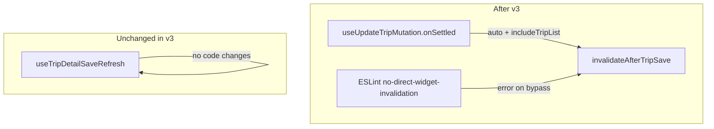

# v3: Enforcement and Structural Cleanup

## Current state (verified)

- [`invalidate-after-trip-save.ts`](src/features/trips/lib/invalidate-after-trip-save.ts) is stable — **do not edit** in v3.
- All v1/v2 write paths already call the helper; grep shows **no** direct `queryClient.invalidateQueries({ queryKey: tripKeys.unplannedRoot | timelessRuleTripsRoot })` outside the helper (realtime hooks use `createDebouncedInvalidateByQueryKey` — out of rule scope).
- [`use-update-trip-mutation.ts`](src/features/trips/hooks/use-update-trip-mutation.ts) `onSettled` still manually invalidates `tripKeys.detail(id)` + `tripKeys.all`; mutation variables shape is `{ id, patch }` (third `onSettled` arg).
- ESLint uses classic [`.eslintrc.json`](.eslintrc.json) (ESLint **8.48.0**, `eslint-config-next` **16.x**); no existing `src/eslint-rules/` folder. JSON cannot `require()` a local plugin — config must change format (see Step 3 registration caveat below).



---

## Step 1 — Migrate `useUpdateTripMutation.onSettled`

**File:** [`src/features/trips/hooks/use-update-trip-mutation.ts`](src/features/trips/hooks/use-update-trip-mutation.ts)

**Change only `onSettled`** (leave `onMutate` / `onError` untouched):

```typescript
import { invalidateAfterTripSave } from '../lib/invalidate-after-trip-save';

onSettled: async (_data, _err, { id, patch }) => {
  // WHY: 'auto' busts widget roots only for planning-relevant patches (scheduled_at,
  // driver_id, status, …). Notes/KTS/Reha/billing writes skip widget invalidation.
  await invalidateAfterTripSave(queryClient, {
    tripIds: [id],
    patch,
    includePlanningWidgets: 'auto',
    includeTripList: true
  });
}
```

**Effects on consumers (verified):**

| Consumer | Patch fields | Widget invalidation after step 1 |
| --- | --- | --- |
| [`trip-detail-sheet.tsx`](src/features/trips/trip-detail-sheet/trip-detail-sheet.tsx) `applyDetailsPatch` / `applyNotesSave` | planning vs notes | `'auto'` — widgets only on planning patches; `refreshAfterTripSave` may duplicate widget bust (harmless) |
| [`use-trip-field-update.ts`](src/features/trips/hooks/use-trip-field-update.ts) → KTS/Reha inline cells | KTS/Reha fields | No widget bust (`'auto'` miss) — correct |

Update the file-level JSDoc to mention the helper replaces manual detail/all invalidation.

**Build gate:** `bun run build`

---

## Step 2 — Hook simplification: DEFERRED to v4 (docs only)

Per your decision: **leave [`use-trip-detail-save-refresh.ts`](src/features/trips/trip-detail-sheet/hooks/use-trip-detail-save-refresh.ts) unchanged** — no implementation edits.

**Blocking callers** (all invoke `refreshAfterTripSave()` with **no options**):

1. [`trip-detail-sheet.tsx:751`](src/features/trips/trip-detail-sheet/trip-detail-sheet.tsx) — `applyNotesSave`
2. [`trip-detail-sheet.tsx:1584`](src/features/trips/trip-detail-sheet/trip-detail-sheet.tsx) — `onAfterSave={refreshAfterTripSave}` on `TripFremdfirmaSection`
3. [`trip-fremdfirma-section.tsx:107–113`](src/features/fremdfirmen/components/trip-fremdfirma-section.tsx) — `persist` → `await onAfterSave?.()` (indirect no-options path)

**Doc-only change in [`docs/trips/invalidation-contract.md`](docs/trips/invalidation-contract.md):**

- Under `useTripDetailSaveRefresh`, add a **“v4 blocked — hook simplification”** note listing the three callers with: *“passes no options — hook simplification blocked until these callers are migrated in a future pass.”*
- Move “Simplify `useTripDetailSaveRefresh`” from V3 Planned → **V4 Planned**.

No build gate for this step.

---

## Step 3 — ESLint rule `no-direct-widget-invalidation`

### 3a. Config format — REGISTRATION CAVEAT (verify before writing)

**Verified:** ESLint 8 classic config (`eslintrc`) expects `plugins` to be an **array of strings** (npm-resolvable plugin names). It does **not** accept a `require()`'d plugin object in the `plugins` array — that throws at runtime (`Plugins array cannot include file paths` / type errors). The earlier plan snippet `plugins: ['@typescript-eslint', invalidationContract]` is **incorrect** and will fail the lint build gate.

**Implementer must pick one working pattern and confirm with `bun run lint` before Step 4:**

#### Option A — `file:` npm package (minimal change, stays on classic eslintrc)

Best fit for v3 scope: smallest diff from current [`.eslintrc.json`](.eslintrc.json).

1. Create plugin folder e.g. [`eslint-plugin-invalidation-contract/`](eslint-plugin-invalidation-contract/) with:
   - `package.json`: `{ "name": "eslint-plugin-invalidation-contract", "main": "index.js" }`
   - `index.js`: re-export rules from [`src/eslint-rules/no-direct-widget-invalidation.js`](src/eslint-rules/no-direct-widget-invalidation.js)
2. Install locally: `bun add -d file:./eslint-plugin-invalidation-contract`
3. Replace [`.eslintrc.json`](.eslintrc.json) with [`.eslintrc.cjs`](.eslintrc.cjs) — copy all existing rules verbatim, add **string** plugin name:

```javascript
module.exports = {
  extends: 'next/core-web-vitals',
  plugins: ['@typescript-eslint', 'invalidation-contract'],
  rules: {
    // ...existing rules from .eslintrc.json...
    'invalidation-contract/no-direct-widget-invalidation': 'error'
  }
};
```

Delete `.eslintrc.json` after `.eslintrc.cjs` works.

#### Option B — Flat config (forward-compatible with Next 16 / eslint-config-next 16)

Use if Option A fails with `eslint-config-next` resolution or if migrating lint scripts anyway.

1. Create [`eslint.config.mjs`](eslint.config.mjs) spreading `eslint-config-next/core-web-vitals`
2. Register local plugin as an **object** (flat config only):

```javascript
import invalidationContract from './src/eslint-rules/index.js';

export default [
  ...nextVitals,
  {
    files: ['src/**/*.{js,jsx,ts,tsx}'],
    ignores: ['**/*.{test,spec}.{ts,tsx}'],
    plugins: {
      'invalidation-contract': invalidationContract
    },
    rules: {
      'invalidation-contract/no-direct-widget-invalidation': 'error'
      // plus migrated rules from .eslintrc.json
    }
  }
];
```

3. Remove `.eslintrc.json` / `.eslintrc.cjs` to avoid dual-config ambiguity.

**Pre-flight check:** run `eslint --print-config src/features/trips/hooks/use-update-trip-mutation.ts` (or `bun run lint`) immediately after registration — do not proceed to Step 4 until lint starts without config errors.

Keep [`.eslintrc.trips-time-guard.json`](.eslintrc.trips-time-guard.json) unchanged (separate `lint:trips-scheduled-at` script).

### 3b. Rule files (CREATE)

**[`src/eslint-rules/no-direct-widget-invalidation.js`](src/eslint-rules/no-direct-widget-invalidation.js)**

- File-level comment: enforces the invalidation contract; **error** severity so violations fail CI/commit, not silently at runtime.
- Flag `CallExpression` where callee is `.invalidateQueries` and first arg is `{ queryKey: … }`.
- **Do not flag:** calls inside [`invalidate-after-trip-save.ts`](src/features/trips/lib/invalidate-after-trip-save.ts) (filename check in `create(context)`)
- **Do not flag:** test files — via config `excludedFiles` / flat `ignores`
- **Do not flag:** `createDebouncedInvalidateByQueryKey(...)` (different callee)

#### Query-key detection — dual strategy (both required)

Read [`src/query/keys/trips.ts`](src/query/keys/trips.ts) before implementing. Confirmed runtime shapes:

```typescript
unplannedRoot: ['trips', 'unplanned'] as const,
timelessRuleTripsRoot: ['trips', 'timeless-rules'] as const,
```

These are **static object properties** (not factory functions). Real call sites pass them as member expressions, e.g. `{ queryKey: tripKeys.unplannedRoot }`. String-literal-only detection would miss the common case.

Implement **both** strategies in `isWidgetRootQueryKey(node)`:

| Strategy | AST pattern | Example |
| --- | --- | --- |
| **Primary — member expression** | `MemberExpression` with `property.name === 'unplannedRoot'` or `'timelessRuleTripsRoot'` (object is typically `tripKeys`; optionally also match any identifier binding named `tripKeys`) | `tripKeys.unplannedRoot` |
| **Fallback — inline array literal** | `ArrayExpression` whose first element is `'trips'` and second is `'unplanned'` or `'timeless-rules'` | `['trips', 'unplanned']` |

Do **not** rely on string-literal grep alone — that is fragile and misses variable references.

**[`src/eslint-rules/index.js`](src/eslint-rules/index.js)** (plugin barrel)

```javascript
module.exports = {
  rules: {
    'no-direct-widget-invalidation': require('./no-direct-widget-invalidation')
  }
};
```

(`meta.name` optional for classic `eslint-plugin-*` naming; flat config uses the `plugins` key as namespace.)

### 3c. Register rule (see 3a — do not use object in classic `plugins` array)

Rule id in all cases: `'invalidation-contract/no-direct-widget-invalidation': 'error'`

Scope to `src/**/*.{ts,tsx,js,jsx}` excluding test files and the helper file.

### 3d. Verification

1. `bun run lint` / `bun run lint:strict` — expect **zero** violations on current tree.
2. **Two scratch tests** (then delete scratch file):
   - Member expression: `queryClient.invalidateQueries({ queryKey: tripKeys.unplannedRoot })`
   - Inline literal: `queryClient.invalidateQueries({ queryKey: ['trips', 'unplanned'] })`
   Both must fire the rule.
3. Confirm realtime hooks ([`use-unplanned-trips.ts`](src/features/dashboard/hooks/use-unplanned-trips.ts), [`use-timeless-rule-trips.ts`](src/features/dashboard/hooks/use-timeless-rule-trips.ts)) remain clean (they use `createDebouncedInvalidateByQueryKey`, not direct `invalidateQueries`).

**Build gate:** `bun run build && bun run lint`

---

## Step 4 — Documentation (mandatory)

### [`docs/trips/invalidation-contract.md`](docs/trips/invalidation-contract.md)

- Mark V3 items **COMPLETE** (mutation migration, ESLint enforcement); move hook simplification to **V4 Planned** with blocking-callers note (Step 2).
- Update `useUpdateTripMutation` row in Deferred Paths → **MIGRATED IN V3**.
- Add **`## Enforcement`** section:
  - Rule name: `invalidation-contract/no-direct-widget-invalidation`
  - File: `src/eslint-rules/no-direct-widget-invalidation.js`
  - What it catches: direct `queryClient.invalidateQueries` on widget roots outside the helper
  - How to add a new trip save path: call `invalidateAfterTripSave` with appropriate `includePlanningWidgets`
  - If rule fires legitimately: extend the helper or add an explicit, documented exclusion (not a raw bypass)
- Document **permanently deferred** paths (unchanged, ESLint won't flag): `trip-write-back.ts`, KTS service/mutation, invoice/KTS fields
- Note Fremdfirma path still uses no-options `refreshAfterTripSave` — v4 candidate for `{ tripIds, patch, includePlanningWidgets: 'auto' }`

### [`docs/plans/widget-cache-staleness-audit.md`](docs/plans/widget-cache-staleness-audit.md)

- Overall status: **COMPLETE (v3 — enforcement active)**
- Add **`## V3 Summary`** (date 2026-06-23): mutation `onSettled` migrated, ESLint rule added, hook simplification deferred to v4
- Add note: *“From this point, any direct widget root invalidation outside the helper will fail the lint check at commit time.”*
- Update “Still deferred” table: remove `use-update-trip-mutation.ts`; note v4 hook simplification blockers

---

## Hard rules checklist

| Rule | Plan compliance |
| --- | --- |
| Do not modify `invalidate-after-trip-save.ts` | Yes |
| Do not touch `onMutate` / `onError` | Yes |
| Do not change `useTripDetailSaveRefresh` signature or implementation | Yes (v4) |
| ESLint severity = error | Yes |
| ESLint plugin: string name or flat config object — **not** object in classic `plugins` array | Yes (see Step 3a) |
| Rule detects both `tripKeys.unplannedRoot` member expr and inline `['trips','unplanned']` literals | Yes |
| Test files exempt | Yes (overrides) |
| `bun run build` after steps 1 and 3 | Yes |
| `bun run lint` zero errors after step 3 | Yes |

---

## Out of scope (explicit)

- `trip-write-back.ts`, `kts.service.ts`, `use-update-kts-mutation.ts` — no migration; document as permanently deferred
- Migrating the three no-options `refreshAfterTripSave` callers — **v4**
- Manual smoke tests in audit doc remain _Pending_ (unchanged)
