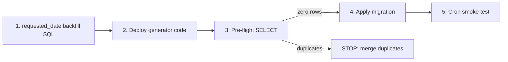

# v4a: Generator Hardening + Unique Index

## Prerequisites (read before coding)

Read in full:
- [`src/lib/recurring-trip-generator.ts`](src/lib/recurring-trip-generator.ts) — change sites at lines **352–374** (dedup) and **636–650** (linking)
- [`src/features/trips/lib/trip-business-date.ts`](src/features/trips/lib/trip-business-date.ts) — Berlin YMD contract (no code changes)
- [`src/features/trips/lib/trip-time.ts`](src/features/trips/lib/trip-time.ts) — write-path TZ (no code changes)
- [`docs/plans/v4-generator-audit.md`](docs/plans/v4-generator-audit.md)
- [`docs/plans/v4a-linking-approach-recommendation.md`](docs/plans/v4a-linking-approach-recommendation.md)

**Out of scope (do not touch):** v4b detail-sheet invalidation, v5a display TZ, v5b constant consolidation, v5c `linkTripPairBidirectional()`, transactions, `create-trip-form.tsx`, `duplicate-trips.ts`, `bulk-upload-dialog.tsx`.

---

## Deployment sequence (critical)



**1. Backfill (manual SQL, pre-approved)** — run before code deploy:

```sql
UPDATE trips
SET requested_date = DATE(scheduled_at AT TIME ZONE 'Europe/Berlin')
WHERE rule_id IS NOT NULL
  AND requested_date IS NULL
  AND scheduled_at IS NOT NULL
  AND status NOT IN ('cancelled', 'completed');
```

**WHY the status filter:** Matches the timezone audit’s approved backfill and the partial unique index scope. Without it, cancelled/completed historical rule trips would get `requested_date` written unnecessarily — operationally harmless today (index excludes them), but mutates records that should be left as-is.

Per [`v4-timezone-audit.md`](docs/plans/v4-timezone-audit.md): safe for all remaining **active** NULL+scheduled rows (~7). **No NULL fallback is added to dedup in v4a** — backfill is required so `findExistingRecurringLegId` can match Berlin YMD keys.

**2. Deploy code** (Steps 1–2 below).

**3. Pre-flight** (Step 3) — must return **zero rows** before index.

**4. Apply migration** via `supabase db push` or dashboard.

**5. Smoke test** — cron or on-demand via [`recurring-rules.actions.ts`](src/features/trips/api/recurring-rules.actions.ts) `generateRecurringTrips({ ruleId })`.

**Post-v4a follow-up (separate plan / session — do not skip):**

- **Duplicate merge** (Ingrid/Kira/Ulrike) if pre-flight fails after backfill
- **Two-phase link-repair SQL** ([`v4-generator-audit.md` §R1d](docs/plans/v4-generator-audit.md)) — required to fix the 416 existing broken links; cron will not reach trips outside the generation window

---

## Step 1 — Fix `findExistingRecurringLegId` (Bug A)

**File:** [`src/lib/recurring-trip-generator.ts`](src/lib/recurring-trip-generator.ts) lines **358–373**

**Change the query builder** — replace `.select('id')` with `.select('id, created_at')` on the initial chain (line 360).

**Replace** the `maybeSingle()` block:

```typescript
// CURRENT (lines 371-373)
const { data, error } = await query.maybeSingle();
if (error || !data) return null;
return data.id;
```

**With** explicit array handling per spec:

- `.limit(2)` instead of `.maybeSingle()` — eliminates PGRST116
- **0 rows** → `null` (insert proceeds)
- **1 row** → `data[0].id` (skip insert)
- **≥2 rows** → `console.warn` + return latest by `created_at` (skip insert, link to canonical)
- **query error** → `console.error` with full dedup key context + `null` (fail-open preserved but visible)

**Implementation note:** Do not chain two `.select()` calls. Single select on the builder: `.select('id, created_at')` then `.limit(2)`.

**Not changed:** `insertIfAbsent`, loop structure, `buildTripPayload`, NULL dedup fallback (intentionally deferred — backfill handles legacy).

**Build gate:** `bun run build`

---

## Step 2 — Fix bidirectional linking (Bug B)

**File:** [`src/lib/recurring-trip-generator.ts`](src/lib/recurring-trip-generator.ts) lines **636–650**

**Keep** existing outbound UPDATE unchanged.

**Add immediately after** the outbound error handler (before closing `}` of occurrence loop at line 651):

```typescript
// WHY: return must always be repointed to the current outboundId...
const { error: linkRetError } = await supabase
  .from('trips')
  .update({
    linked_trip_id: outboundId,
    link_type: 'return'
  })
  .eq('id', returnId);

if (linkRetError) {
  errorCount++;
  console.error(
    '[generate-recurring-trips] return link update failed:',
    linkRetError
  );
}
```

**Approach 1 (inline)** per senior recommendation — **no** `linkTripPairBidirectional()` (v5c).

**Effect:** Every successful pairing updates both legs whether rows are new or reused; repairs stale return pointers and mis-tagged legacy `link_type` for trips that **re-enter the cron pairing cycle** (within the 14-day generation horizon).

**Build gate:** `bun run build`

---

## Step 3 — Unique partial index migration

**Pre-flight** (run after backfill + code deploy, before migration):

```sql
SELECT rule_id, requested_date, client_id, link_type, COUNT(*)
FROM trips
WHERE requested_date IS NOT NULL
  AND status NOT IN ('cancelled', 'completed')
  AND rule_id IS NOT NULL
GROUP BY rule_id, requested_date, client_id, link_type
HAVING COUNT(*) > 1;
```

- **Zero rows** → proceed
- **Any rows** → **STOP**. Duplicate merge required (Ingrid/Kira/Ulrike per [`v4-generator-audit.md`](docs/plans/v4-generator-audit.md) simulated post-backfill conflicts). Do not force index.

**New file:** `supabase/migrations/<timestamp>_trips_rule_leg_unique_index.sql`

Get timestamp: `date +%Y%m%d%H%M%S` (matches existing naming in [`supabase/migrations/`](supabase/migrations/)).

**Contents** (exact):

```sql
-- WHY: prevents duplicate rule legs from concurrent cron runs
-- or re-runs after NULL-key splits. Without this index the
-- app-level dedup in findExistingRecurringLegId cannot prevent
-- races between two simultaneous generateRecurringTrips() calls.
--
-- Partial on requested_date IS NOT NULL: legacy timeless rows
-- may have NULL requested_date and must not be blocked.
-- status filter: allows re-scheduling on same date after
-- cancellation (cancelled/completed rows excluded).
--
-- This index becomes the hard safety net once v4a code is live.
-- The ≥2 branch in findExistingRecurringLegId handles any
-- surviving duplicates until they are cleaned manually.

CREATE UNIQUE INDEX IF NOT EXISTS trips_rule_leg_unique
  ON trips (rule_id, requested_date, client_id, link_type)
  WHERE requested_date IS NOT NULL
    AND status NOT IN ('cancelled', 'completed');
```

**Apply:** `supabase db push` or Supabase SQL editor.

**Known limitation:** PostgreSQL treats `NULL` in `link_type` as distinct per row — two active outbounds with `link_type IS NULL` on the same key would not violate this index. v4a outbound UPDATE sets `link_type: 'outbound'` on each cron pairing, which gradually repairs this. Monitor only.

**Smoke test after index:**
- Trigger cron `GET /api/cron/generate-recurring-trips` or on-demand `generateRecurringTrips({ ruleId })`
- Expect `generated: 0`, high `skipped`, `errors: 0`
- Cron logs should show no new inserts for existing rule legs

**Build gate:** `bun run build`

---

## Step 4 — Documentation (mandatory)

Allowed doc changes despite "two files only" hard rule for **logic** — Step 4 is explicit scope.

**a) Inline WHY comments** — verify present from Steps 1–2 (dedup error/≥2, return repoint).

**b) [`docs/plans/v4-generator-audit.md`](docs/plans/v4-generator-audit.md)** — append:

```markdown
## v4a Resolution
Date: 2026-06-23

Bug A (dedup fails open)
  Fixed: findExistingRecurringLegId — replaced .maybeSingle() with
  .limit(2), explicit ≥2 handling, error logging. Commit: [fill in after merge].

Bug B (one-way linking)
  Fixed: return-side UPDATE added after outbound UPDATE in occurrence
  loop (~line 650). Approach 1 (inline). v5c will extract
  linkTripPairBidirectional(). Commit: [fill in after merge].

Unique index
  Created: trips_rule_leg_unique
  Migration: supabase/migrations/<timestamp>_trips_rule_leg_unique_index.sql
  Status: applied.

Overall status: CLOSED — monitor cron logs for tripsInserted > 0 on re-runs.
```

**c) Create [`docs/recurring-trip-generator.md`](docs/recurring-trip-generator.md)** (new) documenting:

| Contract | Content |
|----------|---------|
| **Dedup** | New rule trips must have Berlin YMD `requested_date`; dedup keys on `(client_id, rule_id, requested_date, leg)`; NULL invisible until backfilled |
| **Backfill** | Legacy NULL `requested_date` backfill targets **active rows only** (`status NOT IN ('cancelled', 'completed')`); do not backfill historical cancelled/completed legs |
| **Linking** | Both legs updated after every pairing; return UPDATE (v4a) repoints stale pointers on each cron run **for trips inside the generation window** |
| **Concurrency** | `trips_rule_leg_unique` is hard guarantee; app dedup is defence-in-depth |

Reference deployment order: backfill → code → index. **Separate follow-up:** two-phase link-repair SQL ([`v4-generator-audit.md` §R1d](docs/plans/v4-generator-audit.md)) for existing broken links outside the cron window.

**Final build gate:** `bun run build`

---

## Files touched (summary)

| File | Change |
|------|--------|
| [`src/lib/recurring-trip-generator.ts`](src/lib/recurring-trip-generator.ts) | Bug A + Bug B fixes |
| `supabase/migrations/<timestamp>_trips_rule_leg_unique_index.sql` | New partial unique index |
| [`docs/plans/v4-generator-audit.md`](docs/plans/v4-generator-audit.md) | v4a Resolution section |
| [`docs/recurring-trip-generator.md`](docs/recurring-trip-generator.md) | New contracts doc |

---

## What v4a does NOT fix (explicit)

- **416 existing broken links** — v4a stops **new** one-way graphs and repairs pairs that re-enter the cron window. It does **not** retroactively fix the 415 return rows (and 1 outbound) already broken in production: those trips will **not** pass through another pairing cycle if they are outside the 14-day generation horizon. A **separate mandatory follow-up** is required: the two-phase link-repair SQL from [`v4-generator-audit.md` §R1d](docs/plans/v4-generator-audit.md) (run after duplicate merge, before or after index — see audit deployment sequence). Do not assume cron alone clears the 416.
- **Duplicate active rows** (Ingrid/Kira) — pre-flight may fail after backfill if duplicates not merged first
- **Concurrent race without index** — index is mandatory; deploy code before index narrows but does not eliminate race window
- **Widget cache staleness** — v4b
- **Display TZ / constant consolidation / shared link helper** — v5a/b/c
