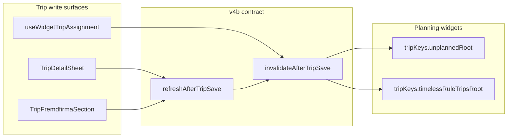

# v4b: Invalidation Contract Completion

## Current state (from file read)

Step 1 conditions are **already satisfied** on disk — no code changes expected unless verification fails:

| Check | Status | Evidence |
|-------|--------|----------|
| Helper busts both widget roots | OK | [`invalidate-after-trip-save.ts`](src/features/trips/lib/invalidate-after-trip-save.ts) L73–77; `scheduled_at` in `PLANNING_WIDGET_PATCH_KEYS` L10 |
| Mutation `onSettled` uses helper | OK | [`use-update-trip-mutation.ts`](src/features/trips/hooks/use-update-trip-mutation.ts) L43–51 |
| Detail sheet passes `'auto'` + patch | OK | [`trip-detail-sheet.tsx`](src/features/trips/trip-detail-sheet/trip-detail-sheet.tsx) L630–634 (driver), L866–876 (`applyDetailsPatch`) |
| `refreshAfterTripSave` forwards options | OK | [`use-trip-detail-save-refresh.ts`](src/features/trips/trip-detail-sheet/hooks/use-trip-detail-save-refresh.ts) L33–36 |

**Remaining gaps** (audit §7):

1. [`trip-fremdfirma-section.tsx`](src/features/fremdfirmen/components/trip-fremdfirma-section.tsx) — `persist()` calls `onAfterSave?.()` with no args (L113); `fremdfirma_id` never busts widget roots.
2. [`use-widget-trip-assignment.ts`](src/features/trips/hooks/use-widget-trip-assignment.ts) — `onSuccess` only invalidates `tripKeys.all` (L42).

**Path correction:** Step 2 targets `src/features/fremdfirmen/components/trip-fremdfirma-section.tsx` (not `src/features/trips/components/…`). No change to [`trip-detail-sheet.tsx`](src/features/trips/trip-detail-sheet/trip-detail-sheet.tsx) is required — it already passes `onAfterSave={refreshAfterTripSave}` (L1584).



---

## Step 1 — Verify working-tree fixes (read-only gate)

Read and confirm the four conditions in the spec. **Do not edit** if all pass.

- [`invalidate-after-trip-save.ts`](src/features/trips/lib/invalidate-after-trip-save.ts) — full file
- [`use-update-trip-mutation.ts`](src/features/trips/hooks/use-update-trip-mutation.ts) — full file
- [`trip-detail-sheet.tsx`](src/features/trips/trip-detail-sheet/trip-detail-sheet.tsx) — confirm `handleSaveTripDetails` → `applyDetailsPatch` → `refreshAfterTripSave({ tripIds, patch, includePlanningWidgets: 'auto' })`; leave `applyNotesSave` → `refreshAfterTripSave()` **unchanged**
- [`use-trip-detail-save-refresh.ts`](src/features/trips/trip-detail-sheet/hooks/use-trip-detail-save-refresh.ts) — full file

**Build gate:** `bun run build`

---

## Pre-Step 2 — Grep `onAfterSave` callers (mandatory gate)

Before widening `TripFremdfirmaSectionProps.onAfterSave`, grep the codebase:

```bash
rg 'TripFremdfirmaSection|onAfterSave' src/
```

**Confirmed (2026-06-23 pre-plan review):**

| Location | Role |
|----------|------|
| [`trip-fremdfirma-section.tsx`](src/features/fremdfirmen/components/trip-fremdfirma-section.tsx) | Defines prop + calls `onAfterSave?.()` in `persist()` |
| [`trip-detail-sheet.tsx`](src/features/trips/trip-detail-sheet/trip-detail-sheet.tsx) L1579–1584 | **Only consumer** — `onAfterSave={refreshAfterTripSave}` |

No other `TripFremdfirmaSection` mount sites exist. No caller destructures or strictly types the callback beyond `() => void | Promise<void>`.

**Prop-widen safety:** The sole caller (`refreshAfterTripSave`) already accepts `InvalidateAfterTripSaveOptions?`. Widening to `(options?: InvalidateAfterTripSaveOptions) => void | Promise<void>` is backward-compatible — extra args are ignored by zero-arg callbacks, but there are none today.

Re-run the grep at implementation time; if a new caller appears, verify it accepts optional options before proceeding.

---

## Step 2 — Fix TripFremdfirmaSection (gap 1)

**File:** [`src/features/fremdfirmen/components/trip-fremdfirma-section.tsx`](src/features/fremdfirmen/components/trip-fremdfirma-section.tsx)

**Changes in `persist()` (L107–119):**

1. Import `InvalidateAfterTripSaveOptions` from `@/features/trips/lib/invalidate-after-trip-save`.
2. Widen prop type:
   ```ts
   onAfterSave?: (options?: InvalidateAfterTripSaveOptions) => void | Promise<void>;
   ```
3. Replace `await onAfterSave?.()` with:
   ```ts
   await onAfterSave?.({
     tripIds: [trip.id],
     patch,
     // WHY: fremdfirma_id is a planning assignee — Offene Touren server filter
     // requires both driver_id and fremdfirma_id null; 'auto' busts widget roots.
     includePlanningWidgets: 'auto'
   });
   ```
   Use the actual `patch` object already passed into `persist()` (from `buildAssignmentPatch` at each call site — includes `fremdfirma_id` and related fields).

4. **Optional cleanup:** Remove redundant `void qc.invalidateQueries({ queryKey: tripKeys.detail(trip.id) })` — `refreshAfterTripSave` + helper already invalidate detail when `tripIds` is set. Only remove if it does not change observable behaviour.

**Invariants:** Save path (`tripsService.updateTrip`) unchanged; Fremdfirma assign/remove clears trip from Offene Touren on next refetch.

**Build gate:** `bun run build`

---

## Step 3 — Fix use-widget-trip-assignment (gap 2)

**File:** [`src/features/trips/hooks/use-widget-trip-assignment.ts`](src/features/trips/hooks/use-widget-trip-assignment.ts)

**Changes:**

1. Import `invalidateAfterTripSave` from `@/features/trips/lib/invalidate-after-trip-save`.
2. Replace `onSuccess` invalidation block (L41–42) with **`onSettled`** (async) so invalidation can be awaited:
   ```ts
   onSettled: async (_data, _err, { trip, newDriverId }) => {
     const patch = buildAssignmentPatch(trip, { driver_id: newDriverId });
     await invalidateAfterTripSave(queryClient, {
       tripIds: [trip.id],
       patch,
       // WHY: driver_id assignee change removes row from Offene Touren; 'auto' busts roots.
       includePlanningWidgets: 'auto'
     });
   },
   ```
3. Keep toast in `onSuccess` (unchanged UX); move invalidation out of `onSuccess`.

**Group assignment note:** When `trip.group_id` is set, Supabase updates all legs in the group (L28–36), but invalidating `tripKeys.unplannedRoot` / `timelessRuleTripsRoot` refetches the full widget queries — sufficient without enumerating every group leg id.

**Invariants:** `mutationFn` unchanged; `tripKeys.all` still invalidated on settle.

**`includeTripList` default — confirmed:** In [`invalidate-after-trip-save.ts`](src/features/trips/lib/invalidate-after-trip-save.ts) L49, the destructuring default is `includeTripList = true`. Step 3 does **not** need to pass `includeTripList: true` explicitly — omitting it preserves the old `tripKeys.all` bust. (`useUpdateTripMutation` passes it explicitly for clarity; widget assignment may omit it.)

**Build gate:** `bun run build`

---

## Step 4 — Docs and WHY comments (mandatory)

### a) WHY comments
Verify WHY comments exist at every **changed** invalidation call site (Step 2 `persist`, Step 3 `onSettled`). Existing WHY comments on verified files (mutation, detail sheet) should remain.

### b) [`docs/plans/v4b-time-setting-audit.md`](docs/plans/v4b-time-setting-audit.md)
Append section:

```markdown
## v4b Resolution
Date: 2026-06-23

Primary bug (detail sheet + mutation hook)
  Working-tree fix verified and committed.
  refreshAfterTripSave now called with options on detail sheet save paths.
  useUpdateTripMutation.onSettled now uses invalidateAfterTripSave with 'auto' + patch.

Gap 1 — TripFremdfirmaSection
  Fixed: persist() passes { tripIds, patch, includePlanningWidgets: 'auto' } to onAfterSave.

Gap 2 — use-widget-trip-assignment
  Fixed: migrated to invalidateAfterTripSave with 'auto' + patch.

Overall status: CLOSED
All scheduled_at and assignee write paths now use the invalidateAfterTripSave contract correctly.
```

Update audit §7 “Callers still missing widget invalidation” list to reflect closure.

### c) [`docs/recurring-trip-generator.md`](docs/recurring-trip-generator.md)
Add a **Widget cache contract** section (file has section-style contracts, not a table today):

| Concern | Contract |
|---------|----------|
| Widget cache | `invalidateAfterTripSave` is the single invalidation contract for all trip write surfaces. Every save path must pass `includePlanningWidgets` and `patch` so `tripKeys.unplannedRoot` and `tripKeys.timelessRuleTripsRoot` are busted correctly. |

Place after existing contracts (before Deployment order) with a cross-link to [`docs/trips/invalidation-contract.md`](docs/trips/invalidation-contract.md) if helpful.

**Build gate:** `bun run build` (final)

---

## Hard rules checklist

- No new hooks (`useSaveTripPlanningPatch` forbidden)
- Do not touch [`recurring-trip-generator.ts`](src/lib/recurring-trip-generator.ts)
- Do not change `applyNotesSave`
- Do not edit files outside: helper, mutation, detail sheet (+ refresh hook verify-only), fremdfirma section, widget assignment, plus Step 4 docs

---

## Manual test plan (post-implementation)

1. **Dashboard overview** — open a timeless rule trip in detail sheet, set time, save → row disappears from Wiederkehrende Trips without page refresh.
2. **Detail sheet Fremdfirma** — assign Fremdfirma on an unplanned trip → row leaves Offene Touren.
3. **Overview DnD widget** — assign driver via [`trips-overview-widget-dialog.tsx`](src/features/trips/components/trips-overview-widget/trips-overview-widget-dialog.tsx) → trip leaves Offene Touren.
4. **Notes-only save** — edit notes, save → widgets unchanged (no spurious refetch flash).

---

## Deferred (out of scope)

- 416 broken historical links (§R1d SQL)
- v5a display TZ / v5b constants / v5c `linkTripPairBidirectional()`
