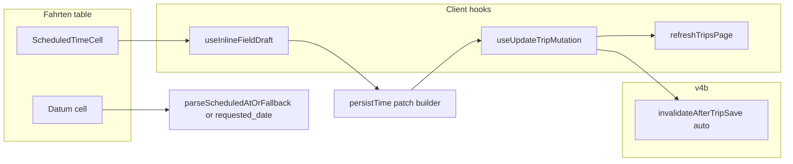

# v4c: Fahrten Table Datum + Zeit Columns

## Scope correction vs brief

The brief lists **4 code files**, but Steps 2 and 6 also touch:

| File | Step |
|------|------|
| [`kts-cells.tsx`](src/features/trips/components/trips-tables/inline-cells/kts-cells.tsx) | Step 2 — migrate to shared hook |
| [`docs/plans/v4c-implementation.md`](docs/plans/v4c-implementation.md) | Step 6 — new |
| [`docs/plans/v4c-fahrten-table-audit.md`](docs/plans/v4c-fahrten-table-audit.md) | Step 6 — append Resolution |

**Authoritative touch set (7 files):** 2 new hooks/cells, 3 modified TS, 2 docs. Mobile cards, detail sheet, cron — out of scope.



---

## Step 1 — Create `useInlineFieldDraft`

**New file:** [`src/features/trips/components/trips-tables/inline-cells/use-inline-field-draft.ts`](src/features/trips/components/trips-tables/inline-cells/use-inline-field-draft.ts)

Implement per spec with one addition the brief omits but **KtsFehlerTextCell requires today**:

```typescript
// Sync draft when server row refreshes (RSC / realtime)
useEffect(() => {
  setDraft(initialValue);
}, [initialValue]); // or keyed deps from caller
```

**API (mutation-agnostic — no `isPending` on this hook):**

```typescript
function useInlineFieldDraft<T extends string>(opts: {
  initialValue: T;
  debounceMs?: number; // default 1500
  onPersist: (value: T) => void;
}): {
  draft: T;
  setDraft: (v: T) => void;
  flush: () => void;
};
```

**Do not add `isPending` to this hook.** Loading state belongs to the mutation layer (`useUpdateTripMutation`, `useTripFieldUpdate`). Consumers destructure `isPending` separately.

**Behaviour:**

- Maintain **`draftRef = useRef(initialValue)`** — mandatory, not optional.
- Every `setDraft(v)` updates **both** `setState(v)` and `draftRef.current = v` synchronously.
- `setDraft` also schedules debounced `onPersist` via own `setTimeout` ref — **not** `useDebouncedCallback` (no `flush` support).
- **`flush` must:**
  1. `clearTimeout(debounceTimerRef.current)` — cancel any pending debounced save (prevents double-save on blur-after-type).
  2. Call `onPersist(draftRef.current)` — **never** the closure-captured `draft` state value (avoids stale value if user types and blurs before React re-renders).
- Sync from server: when `initialValue` changes, update both state and `draftRef.current` in `useEffect`.
- No Supabase / QueryClient / mutations.

**Implementation sketch:**

```typescript
const draftRef = useRef(initialValue);
const [draft, setDraftState] = useState(initialValue);
const debounceTimerRef = useRef(0);

useEffect(() => {
  draftRef.current = initialValue;
  setDraftState(initialValue);
}, [initialValue]);

const setDraft = (v: T) => {
  draftRef.current = v;
  setDraftState(v);
  clearTimeout(debounceTimerRef.current);
  debounceTimerRef.current = window.setTimeout(
    () => onPersistRef.current(draftRef.current),
    debounceMs
  );
};

const flush = () => {
  clearTimeout(debounceTimerRef.current);
  onPersistRef.current(draftRef.current);
};
```

**WHY comment:** mutation-agnostic draft + debounce shared across inline cells; ref ensures flush/blur reads latest typed value.

**Build gate:** `bun run build`

---

## Step 2 — Migrate `KtsFehlerTextCell`

**File:** [`kts-cells.tsx`](src/features/trips/components/trips-tables/inline-cells/kts-cells.tsx) L255–323

Replace `useState` + `useDebouncedCallback` with `useInlineFieldDraft`:

```typescript
const { draft, setDraft } = useInlineFieldDraft({
  initialValue: trip.kts_fehler_beschreibung ?? '',
  debounceMs: 1500,
  onPersist: (raw) => {
    const { kts_fehler_beschreibung } = normalizeKtsPatch({
      kts_fehler_beschreibung: raw.trim() || null
    });
    updateField(trip.id, 'kts_fehler_beschreibung', kts_fehler_beschreibung);
  }
});
```

- Remove the separate `useEffect` that synced draft — hook owns sync via `initialValue`.
- Keep gating (KTS off / Fehler off), tooltip read-only branch, input className, **`isPending` from `useTripFieldUpdate()`** (unchanged — not from `useInlineFieldDraft`), `onChange` → `setDraft` only (debounce inside hook).
- Remove `useDebouncedCallback` import if unused elsewhere in file.

**Invariant:** Identical UX to today.

**Build gate:** `bun run build`

### Step 2 regression checkpoint (mandatory — do not skip)

Step 2 is the **highest regression risk** in v4c: it changes existing working KTS inline-edit behaviour. **Stop here after the build gate.** Do **not** start Step 3 until this checkpoint passes.

**Run manual test 6 immediately** (see [Manual test plan](#manual-test-plan) — test 6):

- Open Fahrten table on a row with KTS + Fehler enabled.
- Edit **KTS-Fehler** text inline; wait for debounced save (~1.5s) or blur if applicable.
- Confirm value persists, no double-save, `isPending` disables input during save, read-only gating unchanged.

If test 6 fails → fix `useInlineFieldDraft` / KTS migration before any new files.

**Once test 6 passes:** Steps 3–5 are **additive only** (new cell + column wiring + exports) and carry no further regression risk to existing inline cells.

---

## Step 3 — Create `ScheduledTimeCell`

**New file:** [`src/features/trips/components/trips-tables/inline-cells/scheduled-time-cell.tsx`](src/features/trips/components/trips-tables/inline-cells/scheduled-time-cell.tsx)

### Imports

- `useInlineFieldDraft`, `TripRow`, `UpdateTrip`
- `useUpdateTripMutation` (direct — multi-field patch `{ scheduled_at, requested_date? }`)
- `useTripsRscRefresh` from [`trips-rsc-refresh-provider.tsx`](src/features/trips/providers/trips-rsc-refresh-provider.tsx)
- `buildScheduledAt`, `parseScheduledAtOrFallback`, `TripTimeError` from [`trip-time.ts`](src/features/trips/lib/trip-time.ts)
- `toast` from `sonner`
- **`UrgencyIndicator`** + **`RepeatIcon`** — preserve current Zeit column affordances (user confirmed)

### Layout (matches old Zeit column L145–158)

```tsx
<div className='flex items-center'>
  <div className='flex w-4 shrink-0 items-center justify-center'>
    <UrgencyIndicator scheduledAt={trip.scheduled_at} status={trip.status} variant='dot' />
  </div>
  <input type='time' ... />
  {trip.rule_id && <RepeatIcon className='ml-2 h-3 w-3 text-blue-500 dark:text-blue-400' />}
</div>
```

### Mutation + loading state

**Explicit wiring — do not fold `isPending` into `useInlineFieldDraft`:**

```typescript
const { mutateAsync, isPending } = useUpdateTripMutation();
const { refreshTripsPage } = useTripsRscRefresh();
```

`isPending` disables the time input. It comes **only** from `useUpdateTripMutation`, not from the draft hook.

### Draft wiring

```typescript
const hm = parseScheduledAtOrFallback(trip.scheduled_at)?.hm ?? '';
const { draft, setDraft, flush } = useInlineFieldDraft({
  initialValue: hm,
  debounceMs: 1500,
  onPersist: (value) => void persistTime(value)
});
```

### `persistTime(hm: string)` — mirror [`build-trip-details-patch.ts`](src/features/trips/trip-detail-sheet/lib/build-trip-details-patch.ts) L221–278

**Case A — non-empty `hm`:**

1. `ymd = parseScheduledAtOrFallback(trip.scheduled_at)?.ymd ?? trip.requested_date ?? null` — if null → `toast.error(...)`, return.
2. `buildScheduledAt(ymd, hm)` in try/catch → `TripTimeError` → toast, return.
3. Patch:
   ```typescript
   const patch: UpdateTrip = { scheduled_at: newScheduledAt };
   if (!trip.scheduled_at && trip.requested_date) {
     patch.requested_date = null; // first-time assignment — detail sheet contract
   }
   ```
4. Save: `await mutateAsync({ id: trip.id, patch })` then `await refreshTripsPage()`.

**Case B — empty `hm` (clear time):**

1. `preservedYmd = parseScheduledAtOrFallback(trip.scheduled_at)?.ymd ?? trip.requested_date ?? null`
2. Patch: `{ scheduled_at: null, ...(preservedYmd ? { requested_date: preservedYmd } : {}) }`
3. Same mutate + refresh.

**Mutation shape fix:** Use `mutateAsync({ id: trip.id, patch })` — **not** spread patch onto `{ id }`.

**Invalidation:** Do **not** call `invalidateAfterTripSave` manually — [`use-update-trip-mutation.ts`](src/features/trips/hooks/use-update-trip-mutation.ts) `onSettled` already runs `'auto'` + patch (widgets busted when `scheduled_at` / `requested_date` present).

**RSC refresh WHY:** Query invalidation alone does not update RSC table props; `refreshTripsPage()` matches [`DriverSelectCell`](src/features/trips/components/trips-tables/driver-select-cell.tsx) pattern.

### Input UX

```tsx
<input
  type='time'
  value={draft}
  disabled={isPending}
  onChange={(e) => setDraft(e.target.value)}
  onBlur={flush}
  onKeyDown={(e) => { if (e.key === 'Enter') flush(); }}
/>
```

Optional muted placeholder styling when `draft === ''` (e.g. `className` with `text-muted-foreground` when empty) — no separate read-only mode; input always shown per spec.

**Build gate:** `bun run build` (cell not wired yet — no visible change)

---

## Step 4 — Wire `columns.tsx`

**File:** [`columns.tsx`](src/features/trips/components/trips-tables/columns.tsx)

### Change A — Datum (L87–114)

Replace cell renderer:

1. `scheduled_at = cell.getValue<string | null>()`
2. `requested_date = row.original.requested_date`
3. `ymd = parseScheduledAtOrFallback(scheduled_at)?.ymd ?? requested_date ?? null`
4. If `!ymd` → `—` (unchanged styling)
5. Else format civil YMD:

**Prefer existing Berlin helper over `new Date(y, m-1, d)`:**

```typescript
import { ymdToPickerDate } from '@/features/trips/lib/trip-business-date';
import { parseScheduledAtOrFallback } from '@/features/trips/lib/trip-time';

format(ymdToPickerDate(ymd), 'dd.MM.yyyy', { locale: de });
```

WHY: `ymdToPickerDate` interprets YMD in business TZ ([`trip-business-date.ts`](src/features/trips/lib/trip-business-date.ts) L55–58); avoids `new Date('YYYY-MM-DD')` UTC shift **and** browser-local `(y,m,d)` drift.

Add `row` to cell destructuring (`cell, row`).

### Change B — Zeit (L121–166)

Replace entire `cell` body with:

```tsx
<ScheduledTimeCell trip={row.original} />
```

Import from `./inline-cells`. Remove inline `format(new Date(...), 'HH:mm')` null guards — cell owns display.

Column `id`, `accessorKey`, `header`, `meta`, sorting — unchanged.

**Build gate:** `bun run build`

---

## Step 5 — Barrel export

**File:** [`inline-cells/index.ts`](src/features/trips/components/trips-tables/inline-cells/index.ts)

Add:

```typescript
export { ScheduledTimeCell } from './scheduled-time-cell';
export { useInlineFieldDraft } from './use-inline-field-draft';
```

Existing `export * from './kts-cells'` unchanged.

**Build gate:** `bun run build`

---

## Step 6 — Docs (mandatory)

### a) WHY comments audit

Verify at: `use-inline-field-draft.ts`, `persistTime` in `scheduled-time-cell.tsx`, Datum renderer in `columns.tsx`, KTS migration comment in `kts-cells.tsx`.

### b) Create [`docs/plans/v4c-implementation.md`](docs/plans/v4c-implementation.md)

Per brief template: Datum fallback, Zeit cell, shared hook, v4b compatibility — status DONE.

### c) Append to [`docs/plans/v4c-fahrten-table-audit.md`](docs/plans/v4c-fahrten-table-audit.md)

```markdown
## v4c Resolution
Date: 2026-06-24
Status: CLOSED
All audit findings addressed. See v4c-implementation.md.
```

**Final build gate:** `bun run build`

---

## Manual test plan

**Execution order:** Test **6 runs at the Step 2 checkpoint** (after KTS migration build, before Step 3). Tests 1–5 and 7 run after Step 4 wiring (full feature).

1. **Date-only row** (`scheduled_at` null, `requested_date` set) — Datum shows `dd.MM.yyyy`, Zeit shows empty time input + urgency dot.

2. **Set time on date-only row** — saves, Datum unchanged, Zeit shows HH:mm, row leaves timeless widget if applicable. **Verify DB:** open trip detail sheet or Supabase `trips` row — `requested_date` must be **`NULL`** after first-time assignment (catches silent bug if patch omits `requested_date: null`).

3. **Clear time on timed row** — `scheduled_at` null, `requested_date` preserved, Datum still shows date.

4. **Timed row** — edit time via blur/Enter; table updates without full page reload.

5. **Recurring `rule_id` row** — RepeatIcon still visible; edit allowed.

6. **KTS-Fehler text** *(Step 2 checkpoint — run before Step 3)* — regression: debounced save still works after hook migration. On a KTS+Fehler row, type new text, wait ~1.5s (or blur); confirm single save, value persists, gating/tooltip/read-only branches unchanged.

7. **Debounce + blur race (double-save guard)** — on a timed row, type a new HH:mm value and **immediately Tab away** (blur → `flush`). Verify **exactly one** network save / one toast / one row update — not two (debounced timer + flush). Implementation requirement: `flush` clears pending timeout before calling `onPersist`. Re-test with DevTools Network tab filtered to trip update if needed.

---

## Hard rules checklist

- **Step 2 checkpoint:** manual test 6 must pass before Step 3
- No cron / detail sheet / mobile / DriverSelectCell changes
- Writes via `useUpdateTripMutation` only; widget invalidation via mutation `onSettled`
- **`isPending` from `useUpdateTripMutation` only — never add to `useInlineFieldDraft`**
- **`flush` in `useInlineFieldDraft` must use `draftRef.current`, cancel debounce first**
- Display time via `parseScheduledAtOrFallback`, not `format(new Date(scheduled_at))`
- Datum civil YMD via `ymdToPickerDate`, not `new Date(ymdString)`
- All rows editable including `rule_id`

---

## Deferred

- Mobile card parity, DriverSelectCell invalidation (v4d?), v5a display TZ cleanup
