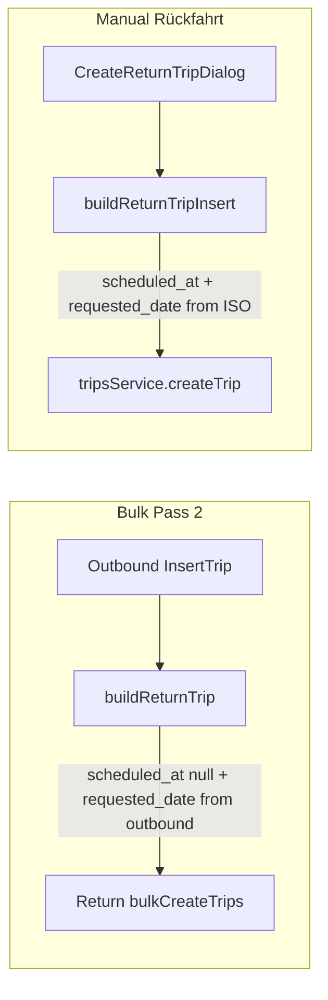

# v4d Phase 1: Return Leg Schedule Anchor Fix

## Path correction

The bulk upload file lives at [`src/features/trips/components/bulk-upload-dialog.tsx`](src/features/trips/components/bulk-upload-dialog.tsx) (not under a `bulk-upload/` subfolder). All other paths match the brief.

## Scope (5 files only)

| File | Change |
|------|--------|
| [`bulk-upload-dialog.tsx`](src/features/trips/components/bulk-upload-dialog.tsx) | Gap 1 — `buildReturnTrip` |
| [`build-return-trip-insert.ts`](src/features/trips/lib/build-return-trip-insert.ts) | Gap 2 — add `requested_date` |
| `supabase/migrations/[timestamp]_repair_anchorless_return_legs.sql` | Repair 9 rows |
| [`docs/plans/v4d-implementation.md`](docs/plans/v4d-implementation.md) | New |
| [`docs/plans/v4d-requested-date-audit.md`](docs/plans/v4d-requested-date-audit.md) | Append Phase 1 Resolution |

**Out of scope:** `recurring-trip-generator.ts`, reschedule dialog, CHECK constraint, 268 timed-row backfill, invalidation/widget changes.



---

## Step 1 — Gap 1: `buildReturnTrip` in bulk upload

**File:** [`bulk-upload-dialog.tsx`](src/features/trips/components/bulk-upload-dialog.tsx) L534–574

**Current state:** After `...outbound`, L539–540 explicitly override both schedule fields to null. Call site unchanged at L1346.

**Change:** Replace only the `requested_date: null` line. Keep `scheduled_at: null`.

```typescript
scheduled_at: null,
// WHY: Return time is TBD — no clock time on auto-return.
// requested_date must carry the outbound's Berlin calendar day …
requested_date:
  outbound.requested_date ??
  (outbound.scheduled_at
    ? instantToYmdInBusinessTz(new Date(outbound.scheduled_at).getTime())
    : null),
```

**Import:** Extend existing import at L62 — file already imports `isYmdString` from `@/features/trips/lib/trip-business-date`; add `instantToYmdInBusinessTz` to that same import (no duplicate).

**Invariants:** Pass 1/3/4 untouched; address swap, metrics nulling, grouping nulls unchanged. Valid CSV outbounds always have `requested_date` or `scheduled_at` from `parseDateAndTime` (L912–929), so auto-return legs get a non-null anchor.

**Build gate:** `bun run build`

---

## Step 2 — Gap 2: `buildReturnTripInsert`

**File:** [`build-return-trip-insert.ts`](src/features/trips/lib/build-return-trip-insert.ts) L127

**Current state:** `requested_date` absent from return object. `params.scheduledAtIso` is required string (L7–8); caller [`create-return-trip-dialog.tsx`](src/features/trips/components/return-trip/create-return-trip-dialog.tsx) L98–134 always supplies ISO from `buildScheduledAt`.

**Change:** After `scheduled_at: params.scheduledAtIso,` add `requested_date` with a **defensive guard** (same pattern as `buildReturnTrip`'s `outbound.scheduled_at ?` check):

```typescript
// WHY: Dialog always supplies scheduledAtIso today; guard avoids silent
// '1970-01-01' if a future caller passes null/undefined (new Date(null) → epoch).
requested_date: params.scheduledAtIso
  ? instantToYmdInBusinessTz(new Date(params.scheduledAtIso).getTime())
  : null,
```

New import from `@/features/trips/lib/trip-business-date`.

**Invariants:** No dialog/mutation changes; all other insert fields unchanged. Type remains `scheduledAtIso: string` on `BuildReturnTripInsertParams` — guard is runtime defense only.

**Build gate:** `bun run build`

---

## Step 3 — Data repair migration

**Create:** `supabase/migrations/20260624120000_repair_anchorless_return_legs.sql` (use current UTC timestamp at implementation time).

**Migration file must include** preview SELECT, UPDATE, **and post-apply verify query as SQL comments** (stays with codebase; plan doc may drift):

```sql
-- Preview (run before applying — expect 9 rows):
-- SELECT r.id AS return_id, o.id AS outbound_id,
--   o.requested_date, o.scheduled_at
-- FROM trips r
-- JOIN trips o ON o.id = r.linked_trip_id
-- WHERE r.requested_date IS NULL AND r.scheduled_at IS NULL
--   AND r.link_type = 'return';

-- WHY: 9 bulk-upload auto-return stubs (2026-03-20 → 2026-03-27) have both
-- schedule fields NULL. Copy outbound Berlin calendar day; scheduled_at stays NULL.

UPDATE trips AS r
SET requested_date = COALESCE(
  o.requested_date,
  to_char(
    (o.scheduled_at AT TIME ZONE 'UTC' AT TIME ZONE 'Europe/Berlin')::date,
    'YYYY-MM-DD'
  )
)
FROM trips AS o
WHERE o.id = r.linked_trip_id
  AND r.requested_date IS NULL
  AND r.scheduled_at IS NULL
  AND r.link_type = 'return';

-- Run this after applying to verify repair:
-- SELECT COUNT(*) FROM trips
-- WHERE requested_date IS NULL AND scheduled_at IS NULL;
-- Expected: 0
```

**Pre-apply (Supabase SQL editor):** Run preview SELECT; confirm **exactly 9 rows**.

**Post-apply verify:** Run the trailing comment query; expect **0**.

**Notes:**
- `requested_date` is stored as YMD text in app code; `to_char` output matches.
- Hardcoded `Europe/Berlin` aligns with [`trip-business-date.ts`](src/features/trips/lib/trip-business-date.ts) default; matches existing migration patterns.
- No CHECK constraint in this migration (Phase 2).

**Apply:** `supabase db push` (or project workflow). Confirm 9 rows updated.

**Build gate:** `bun run build` (unchanged by SQL, but run before Step 4 per brief)

---

## Step 4 — Docs (mandatory)

**a) WHY comments** at Step 1, Step 2, and migration header.

**b) Create [`docs/plans/v4d-implementation.md`](docs/plans/v4d-implementation.md)** per brief template: Gap 1/2 root cause + fix, data repair, Phase 2 deferred items, compatibility note (no v4b/cron/widget changes).

**c) Append to [`docs/plans/v4d-requested-date-audit.md`](docs/plans/v4d-requested-date-audit.md):**

```markdown
## v4d Phase 1 Resolution
Date: 2026-06-24
Status: CLOSED (Phase 1)
Gap 1 (bulk buildReturnTrip): FIXED
Gap 2 (buildReturnTripInsert): FIXED
Data repair (9 rows): APPLIED
Ongoing leak: STOPPED
Phase 2 deferred: reschedule guard + CHECK constraint.
```

**Final build gate:** `bun run build`

---

## Hard rules checklist

- Only 5 files touched
- `scheduled_at` stays null on bulk auto-return legs
- Use `instantToYmdInBusinessTz` in TS — no custom TZ math
- `buildReturnTripInsert`: guard `requested_date` with `params.scheduledAtIso ?` (no epoch corruption)
- Migration file includes post-apply verify query as SQL comment
- No backfill of 268 timed rows
- Preview SELECT before migration; confirm 9 rows
- Build gate between each step

---

## Manual test plan

1. **Bulk auto-return** — CSV with billing type `returnPolicy` `time_tbd` or `exact`: return row has `requested_date` = outbound Berlin day, `scheduled_at` null; Fahrten Datum shows date (v4c fallback).
2. **Manual Rückfahrt** — dialog save: return row has both `scheduled_at` and `requested_date`.
3. **Post-migration** — anchorless count query returns 0.
4. **Regression** — outbound rows unchanged by migration WHERE clause.
5. **Regression** — existing timed trips + v4c Zeit edit on return legs still work.

---

## Deferred (Phase 2)

- Reschedule empty-submit guard in `trip-reschedule-dialog.tsx`
- CHECK constraint `(scheduled_at IS NOT NULL OR requested_date IS NOT NULL)`
- 268 timed rows with `requested_date = null` — intentional, no action
